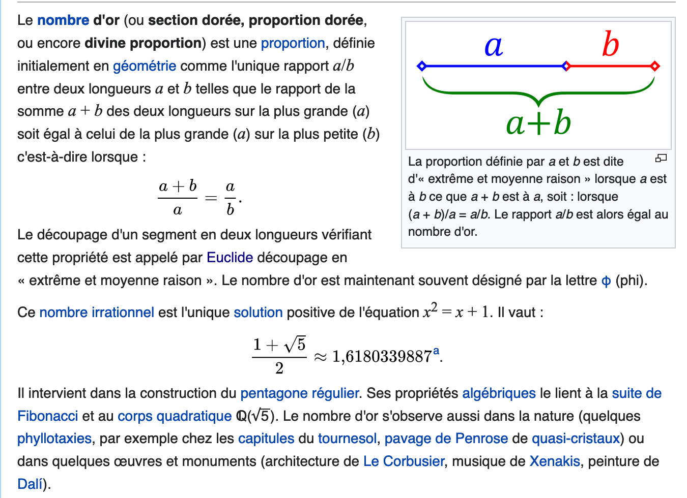

## Exercices de programmation

Il est demandé d'écrire les docstring pour toutes les fonctions en utilisant les résultats escomptés en sortie

```Python
if __name__ == '__main__':
  import doctest
  doctest.testmod(verbose=True)
```

### Exercice 1

Une entreprise fournit des ramettes de papier à prix dégressif en fonction du nombre de lots achetés : les 50 premiers lots sont vendus 3,68€, au-delà chaque lot est vendu 3,22€. Écrire une fonction `prix(n)` qui lorsqu'on saisit le nombre `n` de lots achetés retourne (avec un return) le prix à payer puis procéder à l'affichage (avec un print) du résultat.

```Python
>>> %Run exercices_programmation_snt.py
nombre de lots de ramettes de papier achetés ? 100
Il vous en reviendra 345.0€
```

### Exercice 2

Un cinéma propose un pass mensuel à 15€ permettant d'obtenir une réduction sur le prix des séances : sans réduction la séance est à 8,70€, alors qu'avec le pass la séance est à 5,50€. 
Sans résoudre mathématiquement le problème, écrire une première fonction `abo1(n)` qui renvoie (avec un return) une chaîne de caractères et qui permet d'afficher (avec dans un deuxième temps un print) s'il est avantageux de prendre le pass ou non en fonction du nombre ` n` de séances dans le mois ; la fonction affiche également sur la même ligne le prix total à payer et l'avantage que représente ce choix.

```Python
>>> %Run exercices_programmation_snt.py
combien de séances de cinéma allez-vous prendre ? 2
Ne prenez pas le pass, il est désavantageux ; vous payez 17.4€ sans le pass au lieu de 26.0€ avec le pass
>>> %Run exercices_programmation_snt.py
combien de séances de cinéma allez-vous prendre ? 8
Prenez le pass, il est avantageux ; vous payez 59.0€ avec le pass au lieu de 69.6€ sans le pass
```
Écrire maintenant une deuxième fonction `abo2(n)` qui renvoie cette fois deux informations numériques sous la forme d'un tuple, la première information étant le prix sans abonnement, la seconde le prix avec abonnement.

```Python
>>> abo2(2)
(17.4, 26.0)
>>> abo2(8)
(69.6, 59.0)
```

### Exercice 3

On suppose que l'on dispose de la fonction `abo2(n)` précédente ; écrire une fonction `avantage()` qui utilise cette fonction et qui renvoie le nombre de séances à partir duquel le pass devient avantageux.

```Python
>>> %Run correction_exercices_programmation_snt.py
Prendre le pass devient avantageux à partir de 5 séances.![](data:image/jpeg;base64,IyMgRXhlcmNpY2VzIGRlIHByb2dyYW1tYXRpb24gKHLDqXZpc2lvbnMgMmRlIFNOVCkKCklsIGVzdCBkZW1hbmTDqSBkJ8OpY3JpcmUgbGVzIGRvY3N0cmluZyBwb3VyIHRvdXRlcyBsZXMgZm9uY3Rpb25zIGVuIHV0aWxpc2FudCBsZXMgcsOpc3VsdGF0cyBlc2NvbXB0w6lzIGVuIHNvcnRpZQoKYGBgUHl0aG9uCmlmIF9fbmFtZV9fID09ICdfX21haW5fXyc6CiAgaW1wb3J0IGRvY3Rlc3QKICBkb2N0ZXN0LnRlc3Rtb2QodmVyYm9zZT1UcnVlKQpgYGAKCiMjIyBFeGVyY2ljZSAxCgpVbmUgZW50cmVwcmlzZSBmb3Vybml0IGRlcyByYW1ldHRlcyBkZSBwYXBpZXIgw6AgcHJpeCBkw6lncmVzc2lmIGVuIGZvbmN0aW9uIGR1IG5vbWJyZSBkZSBsb3RzIGFjaGV0w6lzIDogbGVzIDUwIHByZW1pZXJzIGxvdHMgc29udCB2ZW5kdXMgMyw2OOKCrCwgYXUtZGVsw6AgY2hhcXVlIGxvdCBlc3QgdmVuZHUgMywyMuKCrC4gw4ljcmlyZSB1bmUgZm9uY3Rpb24gYHByaXgobilgIHF1aSBsb3JzcXUnb24gc2Fpc2l0IGxlIG5vbWJyZSBgbmAgZGUgbG90cyBhY2hldMOpcyByZXRvdXJuZSAoYXZlYyB1biByZXR1cm4pIGxlIHByaXggw6AgcGF5ZXIgcHVpcyBwcm9jw6lkZXIgw6AgbCdhZmZpY2hhZ2UgKGF2ZWMgdW4gcHJpbnQpIGR1IHLDqXN1bHRhdC4KCmBgYFB5dGhvbgo+Pj4gJVJ1biBleGVyY2ljZXNfcHJvZ3JhbW1hdGlvbl9zbnQucHkKbm9tYnJlIGRlIGxvdHMgZGUgcmFtZXR0ZXMgZGUgcGFwaWVyIGFjaGV0w6lzID8gMTAwCklsIHZvdXMgZW4gcmV2aWVuZHJhIDM0NS4w4oKsCmBgYAoKIyMjIEV4ZXJjaWNlIDIKClVuIGNpbsOpbWEgcHJvcG9zZSB1biBwYXNzIG1lbnN1ZWwgw6AgMTXigqwgcGVybWV0dGFudCBkJ29idGVuaXIgdW5lIHLDqWR1Y3Rpb24gc3VyIGxlIHByaXggZGVzIHPDqWFuY2VzIDogc2FucyByw6lkdWN0aW9uIGxhIHPDqWFuY2UgZXN0IMOgIDgsNzDigqwsIGFsb3JzIHF1J2F2ZWMgbGUgcGFzcyBsYSBzw6lhbmNlIGVzdCDDoCA1LDUw4oKsLiAKU2FucyByw6lzb3VkcmUgbWF0aMOpbWF0aXF1ZW1lbnQgbGUgcHJvYmzDqG1lLCDDqWNyaXJlIHVuZSBwcmVtacOocmUgZm9uY3Rpb24gYGFibzEobilgIHF1aSByZW52b2llIChhdmVjIHVuIHJldHVybikgdW5lIGNoYcOubmUgZGUgY2FyYWN0w6hyZXMgZXQgcXVpIHBlcm1ldCBkJ2FmZmljaGVyIChhdmVjIGRhbnMgdW4gZGV1eGnDqG1lIHRlbXBzIHVuIHByaW50KSBzJ2lsIGVzdCBhdmFudGFnZXV4IGRlIHByZW5kcmUgbGUgcGFzcyBvdSBub24gZW4gZm9uY3Rpb24gZHUgbm9tYnJlIGAgbmAgZGUgc8OpYW5jZXMgZGFucyBsZSBtb2lzIDsgbGEgZm9uY3Rpb24gYWZmaWNoZSDDqWdhbGVtZW50IHN1ciBsYSBtw6ptZSBsaWduZSBsZSBwcml4IHRvdGFsIMOgIHBheWVyIGV0IGwnYXZhbnRhZ2UgcXVlIHJlcHLDqXNlbnRlIGNlIGNob2l4LgoKYGBgUHl0aG9uCj4+PiAlUnVuIGV4ZXJjaWNlc19wcm9ncmFtbWF0aW9uX3NudC5weQpjb21iaWVuIGRlIHPDqWFuY2VzIGRlIGNpbsOpbWEgYWxsZXotdm91cyBwcmVuZHJlID8gMgpOZSBwcmVuZXogcGFzIGxlIHBhc3MsIGlsIGVzdCBkw6lzYXZhbnRhZ2V1eCA7IHZvdXMgcGF5ZXogMTcuNOKCrCBzYW5zIGxlIHBhc3MgYXUgbGlldSBkZSAyNi4w4oKsIGF2ZWMgbGUgcGFzcwo+Pj4gJVJ1biBleGVyY2ljZXNfcHJvZ3JhbW1hdGlvbl9zbnQucHkKY29tYmllbiBkZSBzw6lhbmNlcyBkZSBjaW7DqW1hIGFsbGV6LXZvdXMgcHJlbmRyZSA/IDgKUHJlbmV6IGxlIHBhc3MsIGlsIGVzdCBhdmFudGFnZXV4IDsgdm91cyBwYXlleiA1OS4w4oKsIGF2ZWMgbGUgcGFzcyBhdSBsaWV1IGRlIDY5Ljbigqwgc2FucyBsZSBwYXNzCmBgYArDiWNyaXJlIG1haW50ZW5hbnQgdW5lIGRldXhpw6htZSBmb25jdGlvbiBgYWJvMihuKWAgcXVpIHJlbnZvaWUgY2V0dGUgZm9pcyBkZXV4IGluZm9ybWF0aW9ucyBudW3DqXJpcXVlcyBzb3VzIGxhIGZvcm1lIGQndW4gdHVwbGUsIGxhIHByZW1pw6hyZSBpbmZvcm1hdGlvbiDDqXRhbnQgbGUgcHJpeCBzYW5zIGFib25uZW1lbnQsIGxhIHNlY29uZGUgbGUgcHJpeCBhdmVjIGFib25uZW1lbnQuCgpgYGBQeXRob24KPj4+IGFibzIoMikKKDE3LjQsIDI2LjApCj4+PiBhYm8yKDgpCig2OS42LCA1OS4wKQpgYGAKCiMjIyBFeGVyY2ljZSAzCgpPbiBzdXBwb3NlIHF1ZSBsJ29uIGRpc3Bvc2UgZGUgbGEgZm9uY3Rpb24gYGFibzIobilgIHByw6ljw6lkZW50ZSA7IMOpY3JpcmUgdW5lIGZvbmN0aW9uIGBhdmFudGFnZSgpYCBxdWkgdXRpbGlzZSBjZXR0ZSBmb25jdGlvbiBldCBxdWkgcmVudm9pZSBsZSBub21icmUgZGUgc8OpYW5jZXMgw6AgcGFydGlyIGR1cXVlbCBsZSBwYXNzIGRldmllbnQgYXZhbnRhZ2V1eC4KCmBgYFB5dGhvbgo+Pj4gJVJ1biBjb3JyZWN0aW9uX2V4ZXJjaWNlc19wcm9ncmFtbWF0aW9uX3NudC5weQpQcmVuZHJlIGxlIHBhc3MgZGV2aWVudCBhdmFudGFnZXV4IMOgIHBhcnRpciBkZSA1IHPDqWFuY2VzLgpgYGAKCiMjIyBFeGVyY2ljZSA0CgpTb2l0IGwnYWxnb3JpdGhtZSBjaS1kZXNzb3VzIMOpY3JpdCBlbiBsYW5nYWdlIG5hdHVyZWwgOgoKCWEg4oaQIC0xCgliIOKGkCAyCglQb3VyIGkgYWxsYW50IGRlIDEgw6AgNAoJYSDihpAgYi1hK2kKCWIg4oaQIDJhKzEKCUZpbiBQb3VyCgpQcsOpdm9pciAiw6AgbGEgbWFpbiIgbGVzIHZhbGV1cnMgZGUgYSBldCBkZSBiIDsgcmV0cm91dmVyIGxlIHLDqXN1bHRhdCBlbiBwcm9ncmFtbWFudCBsJ2FsZ29yaXRobWUuCgojIyMgRXhlcmNpY2UgNQoKUXVlIGZhaXQgbGEgZm9uY3Rpb24gYGNoZXJjaGVgIGTDqWZpbmllIGNpLWRlc3NvdXMgPwoKYGBgUHl0aG9uCmRlZiBjaGVyY2hlKEwpOgogICAgbG9uZ3VldXI9bGVuKEwpCiAgICBtPUxbMF0KICAgIGZvciBpIGluIHJhbmdlKDEsbG9uZ3VldXIpOgogICAgICAgIGlmIExbaV0+bToKICAgICAgICAgICAgbT1MW2ldCiAgICByZXR1cm4gbQpgYGAKCiMjIyBFeGVyY2ljZSA2CgpNb2RpZmllciBsZSBwcm9ncmFtbWUgcHLDqWPDqWRlbnQgYWZpbiBxdWUgbGEgdmFsZXVyIHJlbnZvecOpZSBzb2l0IHVuIGNvdXBsZSBjb250ZW5hbnQgbGUgcGx1cyBwZXRpdCBldCBsZSBwbHVzIGdyYW5kIMOpbMOpbWVudCBkJ3VuZSBsaXN0ZSBub24gdmlkZS4KCmBgYFB5dGhvbgo+Pj4gJVJ1biBleGVyY2ljZXNfcHJvZ3JhbW1hdGlvbl9zbnQucHkKPj4+IHJlY2hlcmNoZV9taW5fbWF4KFsyLDgsMTksNCwxXSkKKDEsIDE5KQpgYGAKCiMjIyBFeGVyY2ljZSA3CgpRdWUgZmFpdCBsYSBmb25jdGlvbiBkaXYgZMOpZmluaWUgY2ktZGVzc291cyA/IFF1ZSByZW52b2llIGRpdigyOCkgPwpEYW5zIHVuIHByZW1pZXIgdGVtcHMsIHLDqXBvbmRyZSBzYW5zIGV4w6ljdXRlciBsZSBwcm9ncmFtbWUuCgpgYGBQeXRob24KZGVmIGRpdihuKToKICAgIEw9W10KICAgIGZvciBpIGluIHJhbmdlKDEsbisxKToKICAgICAgICBpZiBuJWk9PTA6CiAgICAgICAgICAgIEwuYXBwZW5kKGkpCiAgICByZXR1cm4gTApgYGAKCiMjIyBFeGVyY2ljZSA4CgpRdWUgZmFpdCBsYSBmb25jdGlvbiBJbmNvbm51ZSBkw6lmaW5pZSBjaS1kZXNzb3VzID8KRGFucyB1biBwcmVtaWVyIHRlbXBzLCByw6lwb25kcmUgc2FucyBleMOpY3V0ZXIgbGUgcHJvZ3JhbW1lLgoKYGBgUHl0aG9uCmRlZiBJbmNvbm51ZShjaGFyLGNoYWluZSk6CiAgICBjPTAKICAgIGZvciBjYXJhY3RlcmUgaW4gY2hhaW5lOgogICAgICAgIGlmIGNhcmFjdGVyZT09Y2hhcjoKICAgICAgICAgICAgYz1jKzEKICAgIHJldHVybiBjCmBgYAoKIyMjIEV4ZXJjaWNlIDkKCsOJY3JpcmUgdW5lIGZvbmN0aW9uIGBjb25jYXRgIHRlbGxlIHF1ZSBgY29uY2F0KEwxLEwyKWAgY29uY2F0w6huZSBsZXMgbGlzdGVzIEwxIGV0IEwyLCBjJ2VzdC3DoC1kaXJlIHJlbnZvaWUgdW5lIGxpc3RlIGRlcyDDqWzDqW1lbnRzIEwxIGV0IEwyIG1pcyBib3V0IMOgIGJvdXQuCgpPbiBwcm9wb3NlcmEgZGV1eCBmYcOnb25zIGRlIHByb2PDqWRlciBjZXJ0ZXMgbW9pbnMgZWZmaWNhY2VzIHF1ZSBsYSBmb25jdGlvbiBjaS1kZXNzb3VzIDoKCmBgYFB5dGhvbgpkZWYgY29uY2F0KEwxLEwyKToKICAgIHJldHVybiBMMStMMgo+Pj4gY29uY2F0KFsyLDgsNF0sWzMsOV0pClsyLCA4LCA0LCAzLCA5XQpgYGAKbWFpcyBwcsOpc2VudGFudCB1biBpbnTDqXLDqnQgcMOpZGFnb2dpcXVlLgoKCiMjIyBFeGVyY2ljZSAxMAoKTGEgc3VpdGUgZGUgRmlib25hY2NpIHNlIGNvbnN0cnVpdCBjb21tZSBjZWNpIDogbGVzIGRldXggcHJlbWllcnMgdGVybWVzIHZhbGVudCAxLCBwdWlzIGNoYXF1ZSB0ZXJtZSBlc3QgbGEgc29tbWUgZGVzIGRldXggcHLDqWPDqWRlbnRzLgpGKDEpPTEKRigyKT0xCkYoMyk9MgpGKDQpPTMKRig1KT01CkYoNik9OC4uLi4KClByb3Bvc2VyIHVuIGZvbmN0aW9uIGBGaWJvKG4pYCBwZXJtZXR0YW50IGRlIGTDqXRlcm1pbmVyIGxlIG4tacOobWUgdGVybWUgZGUgbGEgc3VpdGUgZGUgRmlib25hY2NpLgoKYGBgUHl0aG9uCj4+PiBGaWJvKDM4KQozOTA4ODE2OQpgYGAKCiMjIyBFeGVyY2ljZSAxMQoKPGltZyBzcmM9IkFzc2V0cy9ub21icmVfb3IucG5nIj4gCgpDb21tZSBsJ2FmZmlybWUgY2V0IGV4dHJhaXQgZGUgd2lraXDDqWRpYSDDoCBwcm9wb3MgZHUgbm9tYnJlIGQnb3IsIGlsIGV4aXN0ZSB1bmUgcmVsYXRpb24gZW50cmUgbGUgbm9tYnJlIGQnb3IgZXQgbGEgc3VpdGUgZGUgRmlib25hY2NpIMOpdHVkacOpZSBwcsOpY8OpZGVtbWVudC4gQ2Ugbm9tYnJlIGVzdCBlbiBlZmZldCBsYSB2YWxldXIgZHUgcmFwcG9ydCBGKG4rMSkvRihuKSBxdWFuZCBuIGVzdCB0csOocyBncmFuZCAob3UgZW5jb3JlIGxhIGxpbWl0ZSBkdSBxdW90aWVudCBkZXMgdGVybWVzIGNvbnPDqWN1dGlmcyBkZSBsYSBzdWl0ZSBkZSBGaWJvbmFjY2kpLiBQcm9wb3NlciB1bmUgZm9uY3Rpb24gcXVpIHBlcm1ldCBkJ2FwcHJvY2hlciBsYSB2YWxldXIgZHUgbm9tYnJlIGQnb3IgZG9ubsOpZSBkYW5zIGxlIGRvY3VtZW50IMOgIDEwPHN1cD4tMTA8L3N1cD4gcHLDqHMuCgpgYGBQeXRob24KPj4+IG5vbWJyZV9vcigpCigyNSwgMS42MTgwMzM5ODg2NzA0NDMxKQpgYGAKCk9uIHNlcmEgYW1lbsOpIMOgIHV0aWxpc2VyIGxhIGZvbmN0aW9uIGBhYnMoKWAgcXVpIGRvbm5lIGxhIHZhbGV1ciBhYnNvbHVlIGQndW4gbm9tYnJlLgpgYGBQeXRob24KPj4+IGFicygtMTApCjEwCj4+PiBhYnMoMTApCjEwCmBgYAoKIyMjIEV4ZXJjaWNlIDEyCgrDiWNyaXJlIHVuZSBmb25jdGlvbiAgYGxhbmNlcnMgYCB0ZWxsZSBxdWUgYGxhbmNlcihuKWAgc2ltdWxlIG4gbGFuY2VycyBkJ3VuIGTDqSDDqXF1aWxpYnLDqSDDoCA2IGZhY2VzIGV0IHJlbnZvaWUgbGUgcsOpc3VsdGF0IHNvdXMgZm9ybWUgZGUgbGlzdGUuCgpgYGBQeXRob24KPj4+IGxhbmNlcnMoNCkKWzIsIDEsIDQsIDVdCj4+PiBsYW5jZXJzKDQpCls2LCAxLCAxLCAxXQo+Pj4gbGFuY2Vycyg0KQpbNCwgNCwgNiwgMl0KPj4+IGxhbmNlcnMoNCkKWzIsIDUsIDYsIDFdCmBgYAoKIyMjIEV4ZXJjaWNlIDEzCgrDiWNyaXJlIHVuZSBmb25jdGlvbiBgcGllY2VgIHRlbGxlIHF1ZSBgcGllY2UobilgIHNpbXVsZSBuIGxhbmNlcnMgZCd1bmUgcGnDqGNlIMOpcXVpbGlicsOpZSBldCByZW52b2llIGxhIGZyw6lxdWVuY2UgZGVzICJwaWxlcyIgb2JzZXJ2w6lzLgoKYGBgUHl0aG9uCj4+PiBwaWVjZXMoNDAwKQowLjQ3Cj4+PiBwaWVjZXMoNDAwMCkKMC40OTk3NQpgYGAKIyMjIEV4ZXJjaWNlIDE0CgrDiWNyaXJlIHVuZSBmb25jdGlvbiBgdHJ1cXVlZWAgdGVsbGUgcXVlIGB0cnVxdWVlKG4scClgIHNpbXVsZSBuIGxhbmNlcnMgZCd1bmUgcGnDqGNlIHRydXF1w6llLCBkb250IGxhIHByb2JhYmlsaXTDqSBkZSBmYWlyZSAicGlsZXMiIHZhdXQgcCwgZXQgcmVudm9pZSBsYSBmcsOpcXVlbmNlIGRlcyAicGlsZXMiIG9ic2VydsOpZXMuCgpJbmRpY2F0aW9uIDogcmFuZG9tKCkgZ8OpbsOocmUgdW4gbm9tYnJlIGNvbXByaXMgZW50cmUgWzAsMVsgOyByYW5kb20oKSswLjYgZ8OpbsOocmUgdW4gbm9tYnJlIGNvbXByaXMgZW50cmUgWzAuNiwxLjZbIDsgaW50KHJhbmRvbSgpKzAuNikgZ8OpbsOocmUgdW4gbm9tYnJlIHF1aSB2YXV0IDAgcG91ciB0b3VzIGxlcyBub21icmVzIGNvbXByaXMgZGFucyBsJ2ludGVydmFsbGUgWzAuNiwxWyBkJ8OpdGVuZHVlIDAuNCBldCAxIHBvdXIgdG91cyBsZXMgbm9tYnJlcyBjb21wcmlzIGVudHJlIFsxLDEuNlsgZCfDqXRlbmR1ZSAwLjYgOyBvbiBhIGRvbmMgNjAlIGRlIGNoYW5jZSBkJ2F2b2lyIDEgZXQgNDAlIGRlIGNoYW5jZSBkJ2F2b2lyIDAuCkxhIGZvbmN0aW9uIGludCgpIGRvbm5lIGVuIGVmZmV0IGxhIHBhcnRpZSBlbnRpw6hyZSBkdSBub21icmUuCgpgYGBQeXRob24KPj4+IGludCgwLjgpCjAKPj4+IGludCgxLjUpCjEKPj4+IHRydXF1ZWUoMTAwLDAuNikKMC42NQo+Pj4gdHJ1cXVlZSgxMDAwLDAuNikKMC41ODcKPj4+IHRydXF1ZWUoMTAwMDAsMC42KQowLjYwNjcKPj4+IHRydXF1ZWUoMTAwMDAwLDAuNikKMC42MDA2OQpgYGAKCiMjIyBFeGVyY2ljZSAxNQoKUXVlIGZhaXQgbGEgZm9uY3Rpb24gYHRyYWNlYCBkw6lmaW5pZSBjaS1kZXNzb3VzID8KRGFucyB1biBwcmVtaWVyIHRlbXBzLCByw6lwb25kcmUgc2FucyBleMOpY3V0ZXIgbGUgcHJvZ3JhbW1lLgoKYGBgUHl0aG9uCmZyb20gdHVydGxlIGltcG9ydCAqCmRlZiB0cmFjZShuLGxhcmcpOgogICAgcmVzZXQoKQogICAgZm9yIGkgaW4gcmFuZ2UoMSxuKzEpOgogICAgICAgIGxlZnQoOTApCiAgICAgICAgZm9yd2FyZChsYXJnKmkpCiAgICAgICAgbGVmdCg5MCkKICAgICAgICBmb3J3YXJkKGxhcmcqaSkKYGBgCgojIyMgRXhlcmNpY2UgMTYKCsOJY3JpcmUgdW4gcHJvZ3JhbW1lIHF1aSBwZXJtZXQgZGUgdHJhY2VyIGRlcyB0cmlhbmdsZXMgZW4gc3BpcmFsZXMuCgoKPGltZyBzcmM9IkFzc2V0cy9zcGlyYWxlc190cmlhbmdsZXMucG5nIiB3aWR0aD0iMjAwIiBoZWlnaHQ9IjIwMCI+IAo=)
```

### Exercice 4

Soit l'algorithme ci-dessous écrit en langage naturel :

	a ← -1
	b ← 2
	Pour i allant de 1 à 4
	a ← b-a+i
	b ← 2a+1
	Fin Pour

Prévoir "à la main" les valeurs de a et de b ; retrouver le résultat en programmant l'algorithme.

### Exercice 5

Que fait la fonction `cherche` définie ci-dessous ?

```Python
def cherche(L):
    longueur=len(L)
    m=L[0]
    for i in range(1,longueur):
        if L[i]>m:
            m=L[i]
    return m
```

### Exercice 6

Modifier le programme précédent afin que la valeur renvoyée soit un couple contenant le plus petit et le plus grand élément d'une liste non vide.

```Python
>>> %Run exercices_programmation_snt.py
>>> recherche_min_max([2,8,19,4,1])
(1, 19)
```

### Exercice 7

Que fait la fonction div définie ci-dessous ? Que renvoie div(28) ?
Dans un premier temps, répondre sans exécuter le programme.

```Python
def div(n):
    L=[]
    for i in range(1,n+1):
        if n%i==0:
            L.append(i)
    return L
```

### Exercice 8

Que fait la fonction Inconnue définie ci-dessous ?
Dans un premier temps, répondre sans exécuter le programme.

```Python
def Inconnue(char,chaine):
    c=0
    for caractere in chaine:
        if caractere==char:
            c=c+1
    return c
```

### Exercice 9

Écrire une fonction `concat` telle que `concat(L1,L2)` concatène les listes L1 et L2, c'est-à-dire renvoie une liste des éléments L1 et L2 mis bout à bout.

On proposera deux façons de procéder certes moins efficaces que la fonction ci-dessous :

```Python
def concat(L1,L2):
    return L1+L2
>>> concat([2,8,4],[3,9])
[2, 8, 4, 3, 9]
```
mais présentant un intérêt pédagogique.


### Exercice 10

La suite de Fibonacci se construit comme ceci : les deux premiers termes valent 1, puis chaque terme est la somme des deux précédents.
F(1)=1
F(2)=1
F(3)=2
F(4)=3
F(5)=5
F(6)=8....

Proposer un fonction `Fibo(n)` permettant de déterminer le n-ième terme de la suite de Fibonacci.

```Python
>>> Fibo(38)
39088169
```

### Exercice 11

 

Comme l'affirme cet extrait de wikipédia à propos du nombre d'or, il existe une relation entre le nombre d'or et la suite de Fibonacci étudiée précédemment. Ce nombre est en effet la valeur du rapport F(n+1)/F(n) quand n est très grand (ou encore la limite du quotient des termes consécutifs de la suite de Fibonacci). Proposer une fonction qui permet d'approcher la valeur du nombre d'or donnée dans le document à 10<sup>-10</sup> près.

```Python
>>> nombre_or()
(25, 1.6180339886704431)
```

On sera amené à utiliser la fonction `abs()` qui donne la valeur absolue d'un nombre.
```Python
>>> abs(-10)
10
>>> abs(10)
10
```

### Exercice 12

Écrire une fonction  `lancers ` telle que `lancer(n)` simule n lancers d'un dé équilibré à 6 faces et renvoie le résultat sous forme de liste.

```Python
>>> lancers(4)
[2, 1, 4, 5]
>>> lancers(4)
[6, 1, 1, 1]
>>> lancers(4)
[4, 4, 6, 2]
>>> lancers(4)
[2, 5, 6, 1]
```

### Exercice 13

Écrire une fonction `piece` telle que `piece(n)` simule n lancers d'une pièce équilibrée et renvoie la fréquence des "piles" observés.

```Python
>>> pieces(400)
0.47
>>> pieces(4000)
0.49975
```
### Exercice 14

Écrire une fonction `truquee` telle que `truquee(n,p)` simule n lancers d'une pièce truquée, dont la probabilité de faire "piles" vaut p, et renvoie la fréquence des "piles" observées.

Indication : random() génère un nombre compris entre [0,1[ ; random()+0.6 génère un nombre compris entre [0.6,1.6[ ; int(random()+0.6) génère un nombre qui vaut 0 pour tous les nombres compris dans l'intervalle [0.6,1[ d'étendue 0.4 et 1 pour tous les nombres compris entre [1,1.6[ d'étendue 0.6 ; on a donc 60% de chance d'avoir 1 et 40% de chance d'avoir 0.
La fonction int() donne en effet la partie entière du nombre.

```Python
>>> int(0.8)
0
>>> int(1.5)
1
>>> truquee(100,0.6)
0.65
>>> truquee(1000,0.6)
0.587
>>> truquee(10000,0.6)
0.6067
>>> truquee(100000,0.6)
0.60069
```

### Exercice 15

Que fait la fonction `trace` définie ci-dessous ?
Dans un premier temps, répondre sans exécuter le programme.

```Python
from turtle import *
def trace(n,larg):
    reset()
    for i in range(1,n+1):
        left(90)
        forward(larg*i)
        left(90)
        forward(larg*i)
```

### Exercice 16

Écrire un programme qui permet de tracer des triangles en spirales.


 
