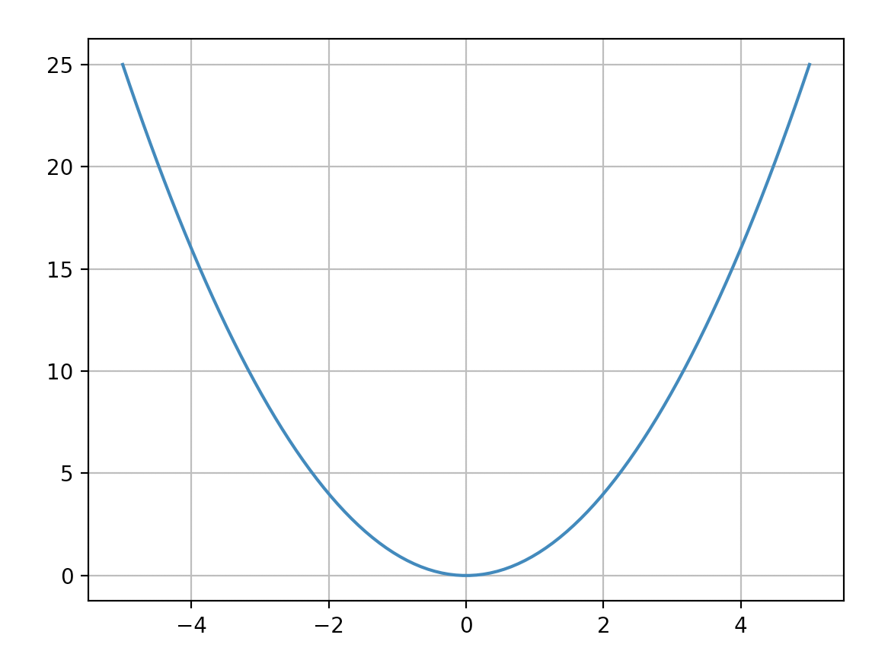

# Exercices de programmation en Python

Il est demandé d'écrire les docstrings pour toutes les fonctions en utilisant les résultats escomptés en sortie lorsque ceux-ci sont donnés (à partir de l'exercice 3).   

**Voici le bloc de code à placer à la fin de votre programme pour tester sa validité sur un ou plusieurs exemples.**

```Python
if __name__ == '__main__':
  import doctest
  doctest.testmod(verbose=True)
```

## Exercice 1

Soit le code suivant. Déterminer la valeur finale de x. Utiliser au départ un papier et un stylo. 

```Python
x=1
n=5
while n>1:
    x=x*n
    n=n-1
```
Vérifier avec Thonny en ajoutant à la fin du programme l'instruction :

```Python
print("La valeur de n est : ",n,", et la valeur de x est : ",x,".")
```
ou, en réalisant une f-string, où f désigne le formatage de la chaîne de caractères :    

```Python
print(f"La valeur de n est : {n}, et la valeur de x est : {x}.")
```

## Exercice 2

Soit le code suivant. Déterminer la valeur finale de x. Utiliser au départ un papier et un stylo.

```Python
x=0
for i in range(2):
    x=x+i
    for j in range(3):
        x=x+j
```
Vérifier avec Thonny en ajoutant l'instruction  ```print(x)``` pour afficher la valeur de x.  
Utilisez le **debugger** de Thonny pour exécuter le programme pas-à-pas (cela sera vu en cours).

## Exercice 3

Écrire une fonction `somme_premiers_carre` qui prend en paramètre un entier strictement positif k et renvoie la somme des k premiers carrés non nuls : `1+2**2+3**3+.....k*k`.   
Exemple à vérifier et à introduire dans la docstring.

```Python
>>> somme_premiers_carre(3)
14
```

## Exercice 4

1. Écrire une fonction `somme_diviseurs` qui prend en paramètre un entier naturel `n` non nul et renvoie la somme de ses diviseurs. Un diviseur d'un entier n est un entier dont n est un multiple. Par exemple les diviseurs de 9 sont : 1, 3, 9.

```Python
>>> somme_diviseurs(9)
13
```

2. Un entier naturel n est parfait si la somme de ses diviseurs est égale à son double 2*n. Écrire une fonction _est_parfait_ qui prend en argument un entier naturel `n` non nul et renvoie `True` s'il est parfait et `False` sinon.

```Python
>>> est_parfait(6)
True
```

3. Proposer une fonction `liste_nombres_parfaits` qui admet pour paramètre un entier `q`, et renvoie la liste des nombres parfaits inférieurs ou égaux à ce nombre q.

Indication : on crée une liste vide à laquelle on ajoute des valeurs avec la **méthode** `append` associée aux listes :

```Python
>>> liste=[]
>>> liste.append(5)
>>> liste
[5]
>>> liste.append(3)
>>> liste
[5, 3]
```

## Exercice 5

1. Écrire une fonction _est_premier_ qui prend en paramètre un nombre entier et renvoie `True` si ce nombre est premier et `False` sinon. Un nombre premier est un nombre qui ne peut être divisé que par 1 et par lui-même. 

Tests à vérifier dans la docstring :

```Python
>>> est_premier(13)
True
>>> est_premier(6)
False
```

2. Écrire une fonction `liste_premiers` qui prend en paramètre un nombre entier et renvoie la liste de tous les nombres premiers inférieurs à ce nombre. Attention, 1 n'est pas considéré comme un nombre premier.

```Python
>>> liste_premiers(10)
[2, 3, 5, 7]
```

## Exercice 6

Écrire un fonction `pourcentage_lancer` qui détermine le pourcentage de 6 obtenus après n lancers de dés à 6 faces. 

Utiliser la fonction `randint` du module `random` (utiliser les deux manières d'importer la fonction, cf cours) après avoir recherché sa documentation en utilisant `help`.

```Python
>>> import random
>>> help(random.randint)
```


## Exercice 7

Écrire une fonction _double_ qui prend en argument un mot (une chaîne de caractères) et renvoie le mot obtenu en doublant les unes après les autres chaque lettre du mot. 

```Python
>>> double('bon')
'bboonn'
```

On envisagera deux écritures possibles pour la fonction ; soit en parcourant les lettres constitutives du mot, soit en repérant les lettres par leur indice de position dans le mot. 

Dans les deux cas on fait une boucle `for`.

*On peut en effet parcourir une liste ou un tuple de deux manières différentes.*

`len(liste)` désigne la longueur (length) de la liste.

#### Première méthode
```Python
>>> liste=[3,5,9]
>>> for i in range(len(liste)):#utilisation de l'indice de position des éléments dans la liste
    print(liste[i])
    
3
5
9
```
Dans cette première méthode, `i` joue le rôle d'un indice qui commence à 0 et va jusque len(liste)-1 parcourant ainsi les n valeurs que prend l'indice des éléments de la liste (ou des lettres du mot vu comme une liste de lettres).

#### Deuxième méthode
```Python
>>> for element in liste:#parcours des éléments d'une liste dans l'ordre d'écriture des éléments
    print(element)
    
3
5
9
```

Dans la seconde méthode, la variable `element` joue le rôle d'un élément constitutif de la liste. On pourrait choisir tout autre nom comme variable (la variable `item` serait un bon choix) mais le nom choisi doit avoir du sens pour nous.

En pratique :

```Python
>>> mot="hello"
>>> for i in range(len(mot)):
    print(mot[i])
    
h
e
l
l
o
>>> for lettre in mot:
    print(lettre)
    
h
e
l
l
o
```

**Remarque** : une chaîne de caractère est plus exactement un tuple car elle est non mutable (non modifiable) à la différence d'une liste.  
On s'en aperçoit sur cet exemple où on ne peut pas changer la valeur d'une lettre d'une chaîne de caractères tandis que l'on peut modifier la valeur d'un élément d'une liste connaissant son indice de position.

```Python
>>> mot="objet"
>>> mot[1]='c'
Traceback (most recent call last):
  File "<pyshell>", line 1, in <module>
TypeError: 'str' object does not support item assignment
```
```Python
>>> liste=[4,8,3]
>>> liste[1]=5
>>> liste
[4, 5, 3]
```

## Exercice 8

1. Écrire une fonction qui prend en argument un mot et renvoie `True` si le mot commence et se termine par la même lettre et `False` sinon.

Exemple à tester dans la docstring:

```Python
>>> a_meme_debut_et_fin("tout")
True
```

**Remarque** : les indices de position dans une liste, un tuple, ou une chaîne de caractères se lisent de gauche à droite en croissant à partir de 0, mais ils peuvent aussi se lire de droite à gauche à partir de -1 en décroissant.

Exemple :

```Python
>>> mot="saucisson"
>>> mot[7]
'o'
>>> mot[-2]
'o'
```

2. Écrire une fonction qui prend en argument deux mots et renvoie `True` si les deux mots commencent par la même lettre et se terminent également par la même lettre, et `False` sinon.

Si deux conditions doivent être satisfaistes simultanément, utiliser l'opérateur logique : `and`.

```Python
>>> for i in range(10):
    if i%2==0 and i%3==0:
        print(i)
        
0
6
```

Exemples à tester dans la docstring:

```Python
>>> meme_debut_et_fin("tomba","tonna")
True
>>> meme_debut_et_fin("tombai","tonna")
False
```


## Exercice 9

On utilise le module `turtle` que l'on importera dans sa totalité, on utilise les fonctions `forward`, `left` après avoir lu leur documentation.

1. Construire vingt carrés de côté variant de 10 à 200 pixels par pas de 10. Les carrés sont inclus les uns dans les autres et ont un sommet commun. On définira une fonction _carre_ admettant le paramètre _n_ chargée de représenter un carré de côté _n_.


2. Construire vingt carrés de côté variant de 10 à 200 pixels par pas de 10. Chaque carré est incliné de 18 degrés par rapport au précédent et les carrés ont un sommet commun.


## Exercice 10

Écrire une fonction `trace` qui trace, à l'aide de la bibliothèque Matplotlib, la courbe représentative de la fonction f(x) sur un intervalle [a;b] en utilisant n points.  
On importe au préalable le module pyplot de Matplotlib.
La fonction prend en arguments deux nombres a et b, une fonction f et un entier n.
L'appel _trace(a,b,f,n)_ permet d'obtenir le tracé de la courbe. (cf.cours)

```Python
import matplotlib.pyplot as plt
def f(x):
    return x**2

def trace(a,b,f,n):
	................à compléter ..................
	plt.plot(x,y)#représente y en fonction de x
	plt.grid()
	plt.show()
 
trace(-5,5,f,100)
```




