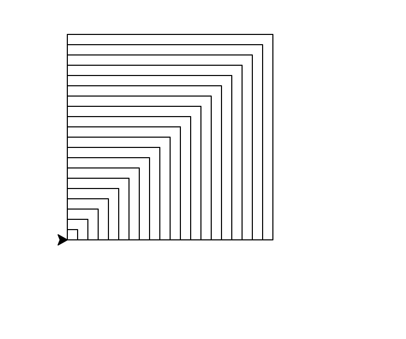
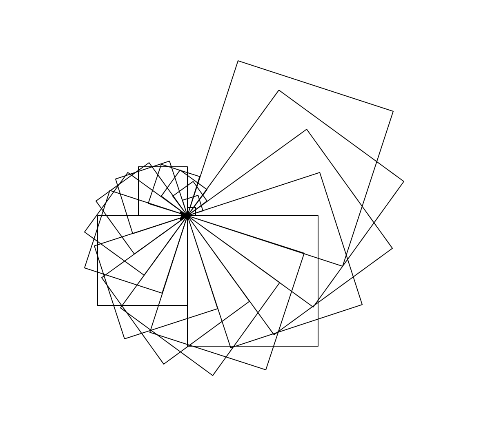
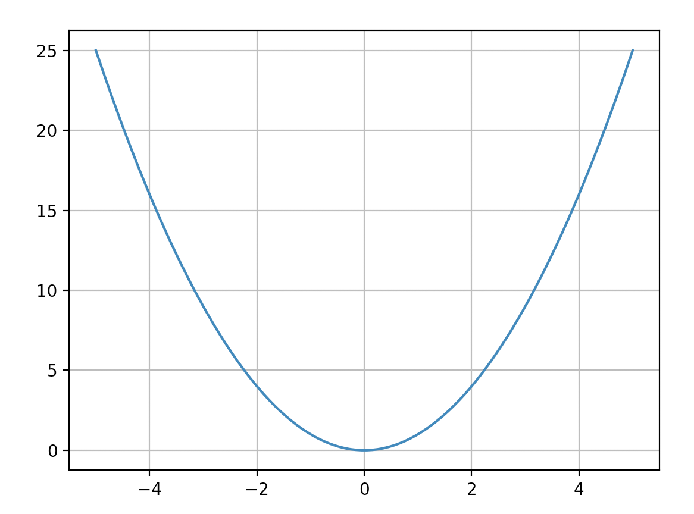

# Exercices de programmation en Python

Pour chaque fonction, écrire une docstring précisant son rôle, ses paramètres et la valeur renvoyée.

Lorsque des exemples de résultats sont fournis, les intégrer à la docstring sous forme de doctests.  

**Voici le bloc de code à placer à la fin de votre programme pour tester sa validité sur un ou plusieurs exemples.**

```Python
if __name__ == '__main__':
  import doctest
  doctest.testmod(verbose=True)
```

## Exercice 1 : lire et tracer un programme

Soit le code suivant. Déterminer la valeur finale de x. Utiliser au départ un papier et un stylo.

Faire un tableau de trace pour suivre l'évolution des variables étape après étape.


```Python
x=1 # affectation de la valeur 1 à la variable x
n=5 # affectation de la valeur 5 à la variable n
while n>1:#une boucle conditionnelle, aussi longtemps que la condition est vraie
    x=x*n
    n=n-1
```

Utilisez le **debugger** de Thonny pour exécuter le programme pas-à-pas.

Vérifier avec Thonny en ajoutant à la fin du programme l'instruction :

```Python
print("La valeur de n est : ",n,", et la valeur de x est : ",x,".")
```
ou, en réalisant une **f-string**, où f désigne le formatage de la chaîne de caractères :    

```Python
print(f"La valeur de n est : {n}, et la valeur de x est : {x}.")
```


## Exercice 2 : lire et tracer un programme

Soit le code suivant. Déterminer la valeur finale de x. Utiliser au départ un papier et un stylo.

Faire un tableau de trace pour suivre l'évolution des variables étape après étape.

```Python
x=0
for i in range(2):#une boucle bornée
    x=x+i
    for j in range(3):#une boucle bornée imbriquée
        x=x+j
```
Vérifier avec Thonny en ajoutant l'instruction  ```print(x)``` pour afficher la valeur de x.
 
Utilisez le **debugger** de Thonny pour exécuter le programme pas-à-pas.

## Exercice 3 : écrire une fonction simple

Écrire une fonction `somme_premiers_carres` qui prend en paramètre un entier k et renvoie la somme des k premiers carrés non nuls.

**Précondition** : k est un entier strictement positif.

`1**2 + 2**2 + 3**2 + ...+ k**2`.

Écrire la **documentation de la fonction**.
Exemple à vérifier et à introduire dans la docstring.

```Python
>>> somme_premiers_carres(3)
14
```

## Exercice 4 : des fonctions qui s’appellent entre elles

1. Écrire une fonction `somme_diviseurs` qui prend en paramètre un entier naturel `n` non nul et renvoie la somme de ses diviseurs. Un entier d est un diviseur de n lorsque le reste de la division euclidienne de n par d est nul. Par exemple les diviseurs de 9 sont : 1, 3, 9.

Regarder dans la console :

5/2
5//2
5%2

Test à valider :

```Python
>>> somme_diviseurs(9)
13
```

Ajoutez au moins un test de votre choix dans la docstring.

2. Un entier naturel n est parfait si la somme de ses diviseurs est égale à son double 2*n.

Écrire une fonction `est_parfait` qui prend en argument un entier naturel `n` non nul et renvoie `True` s'il est parfait et `False` sinon.


Pour écrire la fonction `est_parfait`, on cherchera à réutiliser la fonction `somme_diviseurs`.


Test à valider :

```Python
>>> est_parfait(6)
True
```

Ajoutez au moins un test de votre choix dans la docstring.

3. Proposer une fonction `liste_nombres_parfaits` qui admet pour paramètre un entier `q`, et renvoie la liste des nombres parfaits inférieurs ou égaux à ce nombre q.

Indication : on crée une liste vide à laquelle on ajoute des valeurs avec la **méthode associée aux listes** `append`.

Pour écrire `liste_nombres_parfaits`, on réutilisera `est_parfait`.

Test à valider :
```Python
>>> liste_nombres_parfaits(30)
[6, 28]
```

Exemple d'utilisation de la méthode append : 
```Python
>>> liste=[]
>>> liste.append(5)
>>> liste
[5]
>>> liste.append(3)
>>> liste
[5, 3]
```

## Exercice 5 : des fonctions qui s’appellent entre elles

1. ★ Écrire une fonction `est_premier` qui prend en paramètre un entier  naturel n et renvoie `True` si ce nombre est premier et `False` sinon. 

Un nombre premier est un entier naturel supérieur ou égal à 2 qui possède exactement deux diviseurs positifs : 1 et lui-même.

Tests à valider :

```Python
>>> est_premier(13)
True
>>> est_premier(1)
False
```

Ajoutez au moins un test de votre choix dans la docstring.

2. ★ ★ Écrire une fonction `liste_premiers` qui prend en paramètre un nombre entier et renvoie la liste de tous les nombres premiers strictement inférieurs à ce nombre.

```Python
>>> liste_premiers(10)
[2, 3, 5, 7]
```

3. ★★★ Améliorer `est_premier` afin de ne pas tester tous les entiers jusqu’à n - 1. Jusqu’à quelle valeur suffit-il de chercher un diviseur ?

## Exercice 6 : simulation aléatoire

1. ★ Écrire une fonction `pourcentage_lancer` qui détermine le pourcentage de 6 obtenus après n lancers d'un dé à 6 faces.
La fonction renvoie un pourcentage compris entre 0 et 100.

Utiliser la fonction `randint` du module `random` (utiliser pour cela deux manières différentes d'importer le module) après avoir recherché sa documentation en utilisant `help`.

```Python
>>> import random
>>> help(random.randint)
```

2. ★ ★ Peut-on proposer un test pour valider la fonction ? 

Tester successivement la fonction pour 10, 100, 1 000 et 100 000 lancers. Que constate-t-on ?
Quelle valeur théorique devrait approcher le pourcentage obtenu lorsque n devient très grand ?

3. ★ ★ ★ Modifier la fonction afin qu’elle puisse déterminer le pourcentage d’apparition de n’importe quelle face choisie par l’utilisateur.

## Exercice 7 : chaînes et parcours

Écrire une fonction `double` qui prend en argument un mot (une chaîne de caractères) et renvoie le mot obtenu en doublant les unes après les autres chaque lettre du mot. 

Test à valider :

```Python
>>> double('bon')
'bboonn'
```

Ajoutez au moins un test de votre choix dans la docstring.

**On peut parcourir une séquence, comme une liste, un tuple ou une chaîne de caractères, de deux manières différentes.**

On envisagera ainsi deux écritures possibles pour la fonction.

- soit en parcourant les lettres constitutives du mot

- soit en repérant les lettres par leur indice de position dans le mot. 

Dans les deux cas on fera une boucle `for`.


`len(liste)` désigne la longueur (length) de la liste.

#### Première méthode

```Python
>>> liste=[3,5,9]
>>> for i in range(len(liste)):#utilisation de l'indice de position des éléments dans la liste
    print(liste[i])
    
3
5
9
```

Dans cette première méthode, la variable `i` (qui pourrait porter un autre nom) joue le rôle d'un indice qui commence à 0 et va jusque len(liste)-1 parcourant ainsi les n valeurs que prend l'indice des éléments de la liste.

#### Deuxième méthode

```Python
>>> for element in liste:#parcours des éléments d'une liste dans l'ordre des éléments
    print(element)
    
3
5
9
```

Dans la seconde méthode, la variable `element` joue le rôle d'un élément constitutif de la liste. On pourrait choisir tout autre nom comme variable (la variable `item` serait également un bon choix) mais dans tous les cas le nom choisi doit avoir du sens pour nous.

En pratique :

```Python
>>> mot="hello"
>>> for i in range(len(mot)):
    print(mot[i])
    
h
e
l
l
o

>>> for lettre in mot:
    print(lettre)
    
h
e
l
l
o
```

**Remarque** : une chaîne de caractères est une séquence non mutable : on peut accéder à ses caractères par leur indice, mais on ne peut pas modifier directement l’un de ses caractères.
  
On s'en aperçoit sur l'exemple ci-dessous où on ne peut pas changer la valeur d'une lettre d'une chaîne de caractères, tandis que l'on peut modifier la valeur d'un élément d'une liste connaissant son indice de position.

```Python
>>> mot="objet"
>>> mot[1]='c'
Traceback (most recent call last):
  File "<pyshell>", line 1, in <module>
TypeError: 'str' object does not support item assignment
```
```Python
>>> liste=[4,8,3]
>>> liste[1]=5
>>> liste
[4, 5, 3]
```


Comparer les deux solutions. Laquelle vous paraît la plus lisible ? Dans laquelle a-t-on réellement besoin de connaître l’indice des caractères ?


## Exercice 8 : chaînes et parcours

1. Écrire une fonction qui prend en argument un mot, une chaîne de caractères supposée non vide, et renvoie `True` si le mot commence et se termine par la même lettre et `False` sinon.

Test à valider :

```Python
>>> a_meme_debut_et_fin("tout")
True
```

**Remarque** : les indices de position dans une liste, un tuple, ou une chaîne de caractères se lisent de gauche à droite en croissant à partir de 0, mais ils peuvent aussi se lire de droite à gauche à partir de -1 en décroissant.

Exemple :

```Python
>>> mot="saucisson"
>>> mot[7]
'o'
>>> mot[-2]
'o'
```

2. Écrire une fonction qui prend en argument deux mots, supposés non vides, et renvoie `True` si les deux mots commencent par la même lettre et se terminent également par la même lettre, et `False` sinon.

Si deux conditions doivent être satisfaites simultanément, utiliser l'**opérateur logique** : `and`.

```Python
>>> for i in range(10):
    if i%2==0 and i%3==0:
        print(i)
        
0
6
```

Tests à valider :

```Python
>>> meme_debut_et_fin("tomba","tonna")
True
>>> meme_debut_et_fin("tombai","tonna")
False
```


## Exercice 9 : Turtle : programmation graphique

On utilise le module `turtle` que l'on importera dans sa totalité, on utilise les fonctions `forward`, `left` après avoir lu leur documentation.

1. ★ Construire vingt carrés de côté variant de 10 à 200 pixels par pas de 10 

Les carrés sont inclus les uns dans les autres et ont un sommet commun.

On définira une fonction `carre` admettant le paramètre `n` chargée de représenter un carré de côté n.



2. ★ ★ Construire vingt carrés de côté variant de 10 à 200 pixels par pas de 10. Chaque carré est incliné de 18 degrés par rapport au précédent et les carrés ont un sommet commun.



3. ★★★ Modifier le programme afin que le nombre de carrés, l’écart entre leurs tailles et l’angle de rotation puissent être choisis par l’utilisateur. 


## Exercice 10 : Matplotlib : listes de valeurs et représentation graphique.

Écrire une fonction `trace` qui trace, à l'aide de la bibliothèque Matplotlib, la courbe représentative de la fonction f(x) sur un intervalle [a;b] en utilisant n points.

On importe au préalable le module pyplot de Matplotlib.

La fonction prend en arguments deux nombres a et b, une fonction f et un entier n.

L'appel _trace(a,b,f,n)_ permettra d'obtenir le tracé de la courbe.

Quelle doit être la distance entre deux abscisses consécutives si l’on souhaite obtenir n points régulièrement répartis entre a et b ? On souhaite que a soit la première abscisse et b la dernière.


```Python
import matplotlib.pyplot as plt
def f(x):
    return x**2

def trace(a,b,f,n):

	................à compléter ..................

	plt.plot(x,y)#représente y en fonction de x
	plt.grid()
	plt.show()
 
trace(-5,5,f,100)
```




