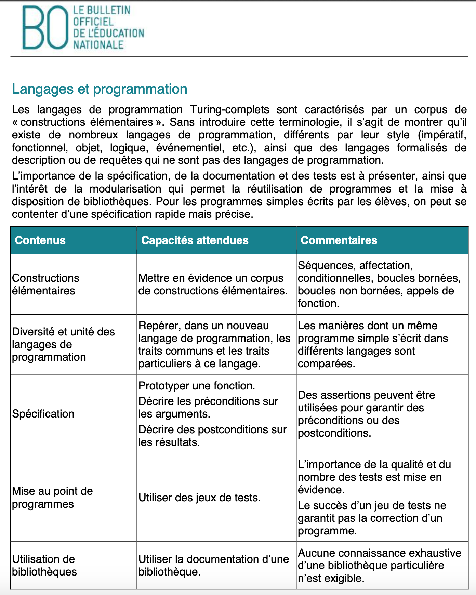

# Thème F : langages et programmation

## Introduction

Quelques éléments d'histoire : le langage Python a été créé en 1989 par le développeur néerlandais Guido van Rossum né en 1956 à Haarlem près d'Amsterdam. Il a fait ses études de mathématiques à l’université d'Amsterdam, obtenant son master en 1982. Il fit partie des développeurs du langage ABC (successeur du BASIC). En 1989, profitant d’une semaine de vacances durant les fêtes de Noël, il utilise son ordinateur personnel pour écrire la première version du langage. Fan de la série télévisée _Monty Python's Flying Circus_ créée par la BBC, il décide avec humour de baptiser ce projet Python. En **1991** sort la première version publique du langage. En 2002, il a reçu le prix pour le développement du logiciel libre décerné par la FSF (Free Sofware Foundation) pour récompenser son travail. Fin 2005, il a été engagé par Google pour travailler sur Python. En décembre 2012, il quitte Google pour rejoindre Dropbox. Le 12 juillet 2018, il annonce son retrait en tant que Benevolent Dictator for Life du projet Python.   

Un programme est composé de **séquences** : des **instructions** exécutées les unes après les autres dans l'ordre où elles sont écrites, de définitions de **variables** et de **fonctions**, d'**instructions conditionnelles**, de **bloucles conditionnelles**  ou **non conditionnelles**, utilisant des **expressions**, en particulier des **appels de fonctions**.   
Une instruction est une commande que doit exécuter la machine tandis qu'une expression est un valeur renvoyée généralement par une fonction suite à une combinaison d'opérations.

HTML, CSS ne sont pas des langages de programmation mais de description à la différence de C++.


## Les attendus du programme




## I. Variables ; affectation

Les **données** utilisées par les programmes sont stockées dans des **variables**, ce qui se fait en réalisant une **affectation** en utilisant l'**opérateur d'affectation** `=` . 

Exemple :

```Python
# On affecte aux variables x, y et z des valeurs de données
>>> x=3
>>> y=4
>>> z=x+y
# x+y est ici une expression, sa valeur est le fruit d'une combinaison des variables x et y. 
>>> z
7
```

On peut aussi réaliser des **affectations multiples** pour remplacer une **séquence d'instructions** par une instruction unique.

```Python
>>> x,y,z=3,4,x+y
# Une instruction unique en remplace trois
>>> z
7
```

En fait chaque variable possède un nom ou identificateur et possède une **adresse en mémoire** donnée ici en décimal que l'on peut obtenir grâce à `id(object)`.

```Python
>>> id(x)
4460309648
>>> id(y)
4460309680
>>> id(z)
4460309776
```

> Exemple : Soit le script suivant :

```Python
>>> def f(x,y):
    x = x + y
    y = x - y
    x = x - y
    return (x,y)
f(2019,2020)

(2020, 2019)
```

On suit l'évolution des variables. Initialement les variables passées dans les paramètres de la fonction ont pour valeur : x=2019 et y=2020. Après chaque affectation, les variables prennent de nouvelles valeurs. On affecte à x la valeur (2019+2020) puis à y la valeur (2019+2020)-2020 soit 2019 puis à x la valeur (2019+2020)-2019 soit 2020. Au final le tuple (x,y) qui est renvoyé par la fonction est (2020,2019).


## II. Instructions conditionnelles

On prendra soin de respecter l'**indentation**, élément important de la **syntaxe** de Python, qui consiste en un décalage vers la droite dans le but d'identifier des **blocs** d'instructions. On utilise l'instruction conditionnelle `if`.

Exemples :

```Python
#Une seule alternative

if n%2==0:##ici la notation double égal représente une expression booléenne qui renvoie True ou False
    print("n est pair")
else:
    print("n est impair")

#Plusieurs alternatives

if age<10:
    print("enfant")
elif age>=10 and age<=18:
    print("adolescent")
elif age>19 and age<=70:
    print("adulte")
else:#else est toujours suivi immédiatement de deux points
    print("personne agée")
```

## III. Boucles conditionnelles et boucles non conditionnelles

1) Une **bloucle conditionnelle** et **non bornée** se fait avec l'instruction `while`:

```Python
i=0
while i<3:
    print("valeur de i :",i)
    i+=1
>>> 
valeur de i : 0
valeur de i : 1
valeur de i : 2
```

> Exemple : Soit le script suivant :

```Python
>>> n = 6
s = 0
while n >= 0:
    s = s + n
    n = n -1
>>> s
21
```
À chaque tour de boucle, la valeur de s augmente de la valeur de n tandis que n décroît d'une unité, et cela aussi longtemps que n reste supérieur ou égal à 0.
On suit l'évolution des variables s et n en réalisant un tableau : 

<table>
<tr>
<td>s</td>
<td>n</td>
</tr>
<tr>
<td>0</td>
<td>6</td>
</tr>
<tr>
<td>6</td>
<td>5</td>
</tr>
<tr>
<td>11</td>
<td>4</td>
</tr>
<tr>
<td>15</td>
<td>3</td>
</tr>
<tr>
<td>18</td>
<td>2</td>
</tr>
<tr>
<td>20</td>
<td>1</td>
</tr>
<tr>
<td>21</td>
<td>0</td>
</tr>
</table>


2) Une  **bloucle non conditionnelle**  mais **bornée** se fait avec `for i in range(n)` qui produit **n** tours de boucle,  :

```Python
for i in range(3):#i prend 3 valeurs entières successives à partir de 0 jusque 2, 3 étant exclu
    print("valeur de i :",i)
>>> 
valeur de i : 0
valeur de i : 1
valeur de i : 2

for i in range(2,15,2):# i commence à 2 inclus jusque 15 exclu (attention !!) par pas de 2
    print("valeur de i :",i)
>>> 
valeur de i : 2
valeur de i : 4
valeur de i : 6
valeur de i : 8
valeur de i : 10
valeur de i : 12
valeur de i : 14
```

## IV. Fonctions 

### 1) Écriture d'une fonction : 

```Python
def tranche_age(age):
    """
    cette fonction associe un qualificatif à une personne connaissant son âge
    : param age : int
    : return : string
    : CU: age est un nombre
    : Exemples :
    >>> tranche_age(13.5)
    'adolescent'
    >>> tranche_age(48)
    'adulte'
    """
    qualificatif=''
    if age<10:
        qualificatif='enfant'
    elif age>=10 and age<=18:
        qualificatif='adolescent'
    elif age>19 and age<=70:
        qualificatif='adulte'
    else:
        qualificatif='personne agée'
    return qualificatif
```
La partie entre les triples guillements est la **documentation** de la fonction ; elle permet d'avoir des informations sur une fonction que l'on peut retrouver dans le shell avec la fonction help. On y placera la **spécification** de la fonction, c'est-à-dire le contrat entre celui qui implémente la fonction et celui qui l'utilise, en précisant la nature des paramètres, ce que retourne la fonction, les conditions d'utilisation, on fournira également un ou plusieurs exemples.

```Python
>>> help(tranche_age)
Help on function tranche_age in module __main__:

tranche_age(age)
    cette fonction associe un qualificatif à une personne connaissant son âge
    : param age : int
    : return : string
    : CU: age est un nombre
    : Exemples :
    >>> tranche_age(13.5)
    'adolescent'
    >>> tranche_age(48)
    'adulte'
```

### 2) Utilisation d'une _**docstring**_ et tester une fonction avec _**doctest**_ : 

[Pour en savoir plus, consultez la documentation en ligne de Python](https://docs.python.org/3/library/doctest.html) ou [cette page de l'université de Lille](http://www.fil.univ-lille1.fr/~L1S2API/CoursTP/tp_doctest.html)

Réaliser une telle chaîne de documentation permet:   
- à l’utilisateur de la fonction de savoir   
		-	à quoi peut servir la fonction ;    
		-	comment il peut l’utiliser ;    
		-	quelles conditions il doit respecter pour l’utiliser (CU).    
- au programmeur de la fonction de préciser   
		- le nombre et la nature de ses paramètres ;    
		- la relation entre la valeur renvoyée et celle du ou des paramètres ;    
		- ses idées avec quelques exemples.   

 (Tout cela bien entendu à condition que cette documentation soit rédigée avant la réalisation du programme et non le contraire)

```python
def fonction_boucle(nombre_de_tours):
    """
    :param nombre_de_tours: (int) représente le nombre de répétition de la boucle
    :return: (list)  une liste de "a" de longueur égale au nombre de tours
    :CU : nombre_de_tours entier strictement positif
    :Exemples:

     >>> fonction_boucle(5)
     ['a', 'a', 'a', 'a', 'a']

    """    
    liste=[]
    for i in range(nombre_de_tours):
        liste.append("a")
    return liste

fonction_boucle(5)

if __name__ == "__main__":
    import doctest
    doctest.testmod(verbose = True)  

```

Remarque : pour que les tests soient validés, séparer dans vos exemples de résultat attendu, les items d'un tableau ou d'un tuple par une virgule suivie d'une espace. Par exemple écrire (1, 2, 0) au lieu de (1,2,0).

```python
Trying:
    fonction_boucle(5)
Expecting:
    ['a', 'a', 'a', 'a', 'a']
ok
1 items had no tests:
    __main__
1 items passed all tests:
   1 tests in __main__.fonction_boucle
1 tests in 2 items.
1 passed and 0 failed.
Test passed.
```
La fonction testmod du _**module**_ doctest est allée chercher dans la docstring de la fonction l'exemple (reconnaissable à la présence des triples chevrons >>>), et a vérifié que la fonction documentée satisfaisait bien cet exemple. Il n’y a eu aucun échec (failed=0).

### 3) Réaliser un jeu de tests sur une fonction

Pour s'assurer qu'une fonction réalise bien ce qu'elle doit faire, on peut lui appliquer un **jeu de tests** . Par exemple, on veut tester la fonction choice du module random dont la documentation est la suivante :

```python
>>> help(random.choice)
Help on method choice in module random:

choice(seq) method of random.Random instance
    Choose a random element from a non-empty sequence.
```

Pour cela, on réalise une liste de 4 éléments ; on fait tirer au sort 100 fois de suite un élément de la liste et on s'assure qu'à chaque fois, l'élément tiré au sort est bien dans un élément de la liste.   
Remarque : `return` fait sortir de la boucle dès qu'il y a une erreur.

```python
def test():
    liste=['a','b','c','d']
    for i in range(100):#on réalise une batterie de 100 tests
        choix=choice(liste)
        if choix not in liste:
            return False
    return True
```

### 4) Remarques sur les fonctions

1. Une fonction peut renvoyer plusieurs valeurs en même temps en renvoyant un tuple

```python
def division(a,b):
    """
    renvoie le quotient et le reste de la division euclidienne de a par b
    : param a : (int)
    : param b : (int)
    : CU : b non nul
    : Exemples :
    >>> division(12,4)
    (3, 0)
    """
    r=a
    q=0
    while r>=b:
        r=r-b
        q=q+1
    return q,r

>>> x,y=division(14,5)
>>> x
2
>>> y
4
```

2. Une fonction peut être utilisée pour construire une **liste par compréhension**

```python
def f(x):
    return x**2-3*x+2

liste1=list(range(-6,10))
liste2=[f(u) for u in liste1]
>>> liste2
[56, 42, 30, 20, 12, 6, 2, 0, 0, 2, 6, 12, 20, 30, 42, 56]
```

### 5) Gestion des erreurs

Un mécanisme d'**assertion** proposé par Python permet de vérifier les préconditions d'une fonction.  
Une telle instruction se compose d'une condition (une expression booléenne) éventuellement suivie d'une virgule et d'une phrase en langue naturelle, sous forme d'une chaine de caractères. L'instruction `assert` teste si sa condition est satisfaite. Si c'est le cas, elle ne fait rien, sinon elle arrête immédiatement l'exécution du programme en affichant éventuellement la phrase qui lui est associée.

```python
>>> def percentage(score, total):
    assert total > 0, 'total doit être strictement positif'
    assert score>=0, 'score doit être positif'
    assert score <= total, 'score doit être inférieur à total'
    return score / total * 100

print(percentage(15, 20), '%')
print(percentage(22, 20), '%')

75.0 %
Traceback (most recent call last):
  File "<pyshell>", line 8, in <module>
  File "<pyshell>", line 4, in percentage
AssertionError: score doit être inférieur à total
```

> Exemple : Soit le script suivant:

```python
>>> def f(a,b):
    assert b!=0,'le deuxième argument est nul'
    result = a/b
    return result
r = f(4,0)

Traceback (most recent call last):
  File "<pyshell>", line 5, in <module>
  File "<pyshell>", line 2, in f
AssertionError: le deuxième argument est nul

```

On observe une erreur AssertionError: le deuxième argument est nul et l'arrêt de l'exécution.

### 6) Modules et bibliothèques

Exemple : On réalise un programme appelé max_deux_nombres.py dans lequel on a défini une fonction maximum_deux_nombres.

```Python
def maximum_deux_nombres(a,b):
    if a>b:
        return a
    else:
        return b
```

On réalise un deuxième programme max_trois_nombres.py qui importe le programme précédent comme module.  
On observe que pour utiliser la fonction définie dans le module, on l'appelle de la façon suivante : module.fonction

```Python
import max_deux_nombres

def maximum_trois_nombres(a,b,c):
    if max_deux_nombres.maximum_deux_nombres(a,b)<c:
        return c
    else:
        return max_deux_nombres.maximum_deux_nombres(a,b)
```
Une autre façon de procéder est la suivante ; on peut importer uniquement la fonction du module qui nous intéresse en écrivant `from module import fonction` :

```Python
from max_deux_nombres import maximum_deux_nombres 

def maximum_trois_nombres(a,b,c):
    if maximum_deux_nombres(a,b)<c:
        return c
    else:
        return maximum_deux_nombres(a,b)
```
Les modules `math`, `random`, `turtle` sont des modules communément utilisés présents dans la bibliothèque standard de Python.  

Pour connaître le contenu du module math par exemple, utiliser `dir`(module) puis `help`(fonction) après avoir importé le module avec `import`(module) :

```Python
>>> import math
>>> dir(math)
['__doc__', '__file__', '__loader__', '__name__', '__package__', '__spec__', 'acos', 'acosh', 'asin', 'asinh', 'atan', 'atan2', 'atanh', 'ceil', 'copysign', 'cos', 'cosh', 'degrees', 'e', 'erf', 'erfc', 'exp', 'expm1', 'fabs', 'factorial', 'floor', 'fmod', 'frexp', 'fsum', 'gamma', 'gcd', 'hypot', 'inf', 'isclose', 'isfinite', 'isinf', 'isnan', 'ldexp', 'lgamma', 'log', 'log10', 'log1p', 'log2', 'modf', 'nan', 'pi', 'pow', 'radians', 'remainder', 'sin', 'sinh', 'sqrt', 'tan', 'tanh', 'tau', 'trunc']

>>> help(math.floor)
Help on built-in function floor in module math:

floor(x, /)
    Return the floor of x as an Integral.
    
    This is the largest integer <= x. #L'expression math.floor(x) renvoie ainsi la partie entière de x
```
```Python
>>> import random
>>> dir(random)
['BPF', 'LOG4', 'NV_MAGICCONST', 'RECIP_BPF', 'Random', 'SG_MAGICCONST', 'SystemRandom', 'TWOPI', '_BuiltinMethodType', '_MethodType', '_Sequence', '_Set', '__all__', '__builtins__', '__cached__', '__doc__', '__file__', '__loader__', '__name__', '__package__', '__spec__', '_acos', '_bisect', '_ceil', '_cos', '_e', '_exp', '_inst', '_itertools', '_log', '_os', '_pi', '_random', '_sha512', '_sin', '_sqrt', '_test', '_test_generator', '_urandom', '_warn', 'betavariate', 'choice', 'choices', 'expovariate', 'gammavariate', 'gauss', 'getrandbits', 'getstate', 'lognormvariate', 'normalvariate', 'paretovariate', 'randint', 'random', 'randrange', 'sample', 'seed', 'setstate', 'shuffle', 'triangular', 'uniform', 'vonmisesvariate', 'weibullvariate']

>>> help(random.randint)
Help on method randint in module random:

randint(a, b) method of random.Random instance
    Return random integer in range [a, b], including both end points.
```

```Python
>>> import turtle
>>> dir(turtle)
['Canvas', 'Pen', 'RawPen', 'RawTurtle', 'Screen', 'ScrolledCanvas', 'Shape', 'TK', 'TNavigator', 'TPen', 'Tbuffer', 'Terminator', 'Turtle', 'TurtleGraphicsError', 'TurtleScreen', 'TurtleScreenBase', 'Vec2D', '_CFG', '_LANGUAGE', '_Root', '_Screen', '_TurtleImage', '__all__', '__builtins__', '__cached__', '__doc__', '__file__', '__forwardmethods', '__func_body', '__loader__', '__methodDict', '__methods', '__name__', '__package__', '__spec__', '__stringBody', '_alias_list', '_make_global_funcs', '_screen_docrevise', '_tg_classes', '_tg_screen_functions', '_tg_turtle_functions', '_tg_utilities', '_turtle_docrevise', '_ver', 'addshape', 'back', 'backward', 'begin_fill', 'begin_poly', 'bgcolor', 'bgpic', 'bk', 'bye', 'circle', 'clear', 'clearscreen', 'clearstamp', 'clearstamps', 'clone', 'color', 'colormode', 'config_dict', 'deepcopy', 'degrees', 'delay', 'distance', 'done', 'dot', 'down', 'end_fill', 'end_poly', 'exitonclick', 'fd', 'fillcolor', 'filling', 'forward', 'get_poly', 'get_shapepoly', 'getcanvas', 'getmethparlist', 'getpen', 'getscreen', 'getshapes', 'getturtle', 'goto', 'heading', 'hideturtle', 'home', 'ht', 'inspect', 'isdown', 'isfile', 'isvisible', 'join', 'left', 'listen', 'lt', 'mainloop', 'math', 'mode', 'numinput', 'onclick', 'ondrag', 'onkey', 'onkeypress', 'onkeyrelease', 'onrelease', 'onscreenclick', 'ontimer', 'pd', 'pen', 'pencolor', 'pendown', 'pensize', 'penup', 'pos', 'position', 'pu', 'radians', 'read_docstrings', 'readconfig', 'register_shape', 'reset', 'resetscreen', 'resizemode', 'right', 'rt', 'screensize', 'seth', 'setheading', 'setpos', 'setposition', 'settiltangle', 'setundobuffer', 'setup', 'setworldcoordinates', 'setx', 'sety', 'shape', 'shapesize', 'shapetransform', 'shearfactor', 'showturtle', 'simpledialog', 'speed', 'split', 'st', 'stamp', 'sys', 'textinput', 'tilt', 'tiltangle', 'time', 'title', 'towards', 'tracer', 'turtles', 'turtlesize', 'types', 'undo', 'undobufferentries', 'up', 'update', 'width', 'window_height', 'window_width', 'write', 'write_docstringdict', 'xcor', 'ycor']
```
Pour importer toute la bibliothèque, on écrit : `from turtle import *`


La bibliothèque Matplotlib est utilisée pour dessiner des courbes à partir de deux listes, les abscisses et les ordonnées. Elle contient le module pyplot à cet effet.

```Python
import matplotlib.pyplot as plt

def f(x):
    return x**2

x=[i*0.01 for i in range(101)]#écriture de la liste des abscisses en compréhension
y=[f(u) for u in x]#écriture de la liste des ordonnées en compréhension
plt.plot(x,y)
plt.grid()
plt.show()
```

> Exemple : La documentation de la bibliothèque random de Python précise que random.randint(a,b) renvoie un entier aléatoire N tel que a ≤ N ≤ b. On souhaite obtenir un entier choisi aléatoirement dans l'ensemble {-4 ; -2 ; 0 ; 2 ; 4}.

Il nous faut 4 entiers choisis au hasard ; random.randint(0,4) donne  {0 ; 1 ; 2 ; 3 ; 4} ; la multiplication par 2 donne {0 ; 2 ; 4 ; 6 ; 8} ; il faut maintenant retrancher 4 à ces valeurs pour obtenir l'ensemble souhaité.

```Python
>>> import random
>>> random.randint(0,4)*2-4
2
# ce qui peut aussi s'écrire :
>>> (random.randint(0,4)-2)*2
-2
```

# V. Analogies avec la programmation en JavaScript

Consultez : [Une première approche de la programmation en JavaScript](http://isnangellier.alwaysdata.net/php/Prerequis.html)


