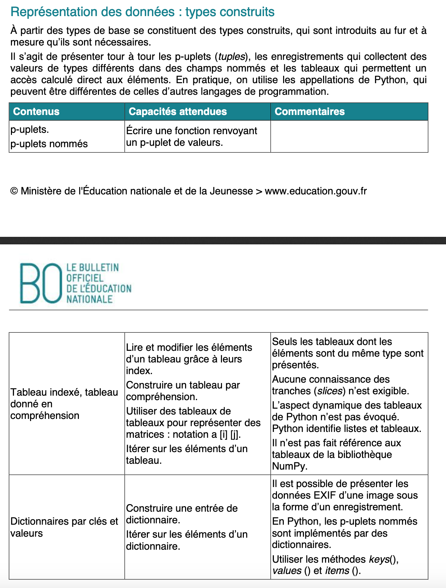

# Thème B : types construits




Le type d'une variable est l'ensemble des valeurs qui peuvent être affectées à cette variable.

On distingue :   
- les **types simples** : `int` (les nombres entiers), `bool` (les valeurs booléennes True ou False), `float` (nombres réels), `str` (abréviation de string ou chaîne de caractères écrite entre des guillemets " " ou des apostrophes ' '), `None` qui n'a pas de valeur


Opérations sur les types simples

```Python
>>> 1+2#addition
3
>>> 1-2#soustraction
-1
>>> 1*2#multiplication
2
>>> 1/2#division
0.5
>>> 1//2#division entière : renvoie le quotient entier de la division, ou quotient de la division euclidienne
0
>>> 5%2#renvoie le reste de la division
1#c'est le cas des entiers impairs
>>> 4%2
0#c'est le cas des entiers pairs

#existence de raccourcis d'écriture
>>> x=5
>>> x+=1
>>> x
6
>>> x*=2#multiplie x par 2
>>> x
12
>>> x**=2#élève x à la puissance 2
>>> x
144

#opérations sur les chaînes de caractères
>>> chaine="poisson"
>>> chaine[1]#une chaîne est indicée à partir de 0 de gauche à droite
'o'
>>> chaine[-2]#on peut indicer de droite à gauche avec des indices négatifs
'o'
>>> chaine[2:4]#on réalise une découpe la chaîne (slice) entre 2 inclus et 4 non inclus
'is'
>>> chaine+" plat"#ajout de chaînes à la suite l'une de l'autre : concaténation à l'aide de l'opérateur +
#l'opérateur - ne s'applique pas sur les chaînes de caractères
'poisson plat'
>>> len(chaine)#longueur de la chaîne de caractères
7
>>> chaine*2
'poissonpoisson'
>>> float('100.5')
100.5#convertit une chaîne de caractères (str) contenant un flottant en flottant (float)
>>> int('100')
100#convertit une chaîne de caractères contenant un entier en entier int
```


- les **types composés ou types construits** : 

1) `tuple` : p-uplet

```Python
>>> p_uplet=(1,"a") # les tuples sont des éléments séparés par des virgules à l'intérieur de parenthèses
ou >>> p_uplet=1,"a" # les parenthèses ne sont pas obligatoires mais elles sont préférées
>>> len(p_uplet)#pour obtenir la longueur du tuple
2
>>> p_uplet[0]#les tuples sont indicés, le premier indice est 0
1
>>> p_uplet[1]
'a'
>>> p_uplet[1]='b'
Traceback (most recent call last):
  File "<pyshell>", line 1, in <module>
TypeError: 'tuple' object does not support item assignment   
# !!!!!!!! les tuples ne sont pas des objets mutables, on ne peut pas les modifier par affectation, contrairement aux listes
>>> p_uplet[2]='c'
Traceback (most recent call last):
  File "<pyshell>", line 1, in <module>
TypeError: 'tuple' object does not support item assignment     
# !!!!!!!!! les tuples ne sont pas des objets mutables, on ne peut donc pas leur ajouter d'élément
t=((1,2,3),('bonjour','auto'),4)#un tuple peut être constitué lui-même de tuples
>>> t[1][0]
'bonjour'# on va chercher l'élément d'indice 0 dans le tuple d'indice 1
>>> 4 in t
True #condition d'appartenance de 4 au tuple t, 4 est effectivement présent à l'indice 2
>>> (2,4)*3 
(2, 4, 2, 4, 2, 4)#et non (6,12)
Remarque : l'affectation multiple résulte de l'égalité des tuples : x,y,z=3,4,x+y
>>> t=((1,2,3),('bonjour','auto'),4)
>>> for i in t:#on parcourt ainsi les éléments de la liste, i représente un élément constitutif de t
    print(i)  
(1, 2, 3)
('bonjour', 'auto')
4
```

> Exemple 1: On considère le n-uplet t=(3,5,1). Qu'obtient-on après l'instruction t[1]=4 ?

> Exemple 2: Une fonction peut retourner un tuple. Proposer une fonction qui renvoie le tuple constitué de la racine carré d'un nombre (positif) et de son carré.

2) `list` : liste ou tableau

```Python
>>> liste=[1,"a"]# les listes sont des éléments séparés par des virgules entre des crochets
>>> len(liste)#la longueur de la liste
2
>>> liste[0]#accès à l'élément d'indice 0
1
>>> liste[1]#accès à l'élément d'indice 1
'a'
>>> liste[1]="b"#modification de l'élément d'indice 1
>>> liste
[1, 'b']#les listes sont mutables
>>> liste[2]="c"
Traceback (most recent call last):
  File "<pyshell>", line 1, in <module>
IndexError: list assignment index out of range
#une erreur de dépassement d'index signifie qu'on ne peut pas accéder à un élément en dehors de la taille de la liste
>>> liste.append("c")#on utilise la méthode append pour ajouter un élément à la liste
>>> liste
[1, 'b', 'c']
>>> liste[-1]#on compte négativement les indices de droite à gauche en commençant par - 1
'c'
>>> nouvelle_liste=[liste,'d']#une liste peut contenir une liste
>>> nouvelle_liste
[[1, 'b', 'c'], 'd']
>>> nouvelle_liste[0][1]#pour accéder à l'élément d'indice 1 de l'élément d'indice 0 de nouvelle_liste
'b'
>>> nouvelle_liste.pop()#renvoie le dernier élément de la liste et le supprime 
'd'
>>> nouvelle_liste
[[1, 'b', 'c']]
>>> 'b' in nouvelle_liste#condition d'appartenance de 'b' à la liste
False
>>> 'b' in nouvelle_liste[0]
True
>>> nouvelle_liste[0].index('b')#renvoie l'indice de position d'un élément dans une liste
1
>>> nouvelle_liste.insert(1,'e')#insère un élément dans une liste à un index donné
>>> nouvelle_liste
[[1, 'b', 'c'], 'e']
>>> liste=[1,5,3,2]
>>> liste.sort()#ordonne la liste
>>> liste
[1, 2, 3, 5]
>>> liste.reverse()#renverse la liste
>>> liste
[5, 3, 2, 1]
>>> liste1=[3,4,5]
>>> liste2=[6,7,8]
>>> liste=liste1+liste2#l'opération + n'a pas d'effet de bord et ne modifie pas les listes 1 et 2
>>> liste
[3, 4, 5, 6, 7, 8]
>>> liste1=[1,5,7]
>>> liste2=liste1
>>> liste2[2]=10
>>> liste1
[1, 5, 10]#les deux listes qui contiennent une référence vers le même objet sont modifiées simultanément
>>> liste1=[1,5,7]
>>> liste2=list(liste1)#création d'un nouvel objet distinct de l'objet initial
>>> liste2[2]=10
>>> liste1
[1, 5, 7]
>>> liste2
[1, 5, 10]
>>> list(('a','b',5))
['a', 'b', 5]#un tuple peut être transformé en liste
>>> liste="1;a;5".split(";")
>>> liste
['1', 'a', '5']#une liste peut être créée à partir d'une chaîne de caractère en appliquant la méthode split() 
#en précisant comme paramètre de la méthode la nature du séparateur écrit entre guillemets
>>> tuple(['a', 'b', 5])
('a', 'b', 5)#une liste peut être transformée en tuple en utilisant la fonction tuple()
>>> x=[i*2 for i in range(10)]####***construction d'une liste par compréhension####
>>> x
[0, 2, 4, 6, 8, 10, 12, 14, 16, 18]
>>> verbes_premiere_personne=["mange","parle","marche"]
>>> verbes_infinitif=[i+"r" for i in verbes_premiere_personne]
>>> verbes_infinitif
['manger', 'parler', 'marcher']
>>> liste=[[x,y] for x in range(3) for y in range(3)]# méthode de création d'une matrice ou listes emboîtées
>>> liste
[[0, 0], [0, 1], [0, 2], [1, 0], [1, 1], [1, 2], [2, 0], [2, 1], [2, 2]]
>>> matrice=[]
>>> for n in range(4):
    	ligne=[4*n+i for i in range(1,5)]
    	matrice.append(ligne)
>>> matrice
[[1, 2, 3, 4], [5, 6, 7, 8], [9, 10, 11, 12], [13, 14, 15, 16]]#autre méthode de création d'une matrice
>>> matrice2=matrice#les deux matrices pointent sur le même objet
>>> matrice2[0][2]=5
>>> matrice2
[[1, 2, 5, 4], [5, 6, 7, 8], [9, 10, 11, 12], [13, 14, 15, 16]]
>>> matrice
[[1, 2, 5, 4], [5, 6, 7, 8], [9, 10, 11, 12], [13, 14, 15, 16]]
>>> from copy import deepcopy
>>> matrice3=deepcopy(matrice)#matrice3 est une copie profonde de matrice2 distincte de celle-ci
>>> matrice3[0][2]=8
>>> matrice3
[[1, 2, 8, 4], [5, 6, 7, 8], [9, 10, 11, 12], [13, 14, 15, 16]]
>>> matrice
[[1, 2, 5, 4], [5, 6, 7, 8], [9, 10, 11, 12], [13, 14, 15, 16]]
```

> Exemple 1 : Soit la liste L=[[1,2,3],[4,5,6],[7,8,9]], quelle est la valeur de L[1][2]?    

> Exemple 2 : Soit l'instruction L=[[i,i+1] for i in range(2)]. Quelle est la valeur de L?

> Exemple 3 : On cherche à obtenir la liste [0,1,4,9,16] par compréhension. Proposer un code.

> Exemple 4 : On considère la suite  
t = [1,2,3,4,5,6,7,8,9] et on se demande ce que vaut la variable v ainsi définie :  
v = [c for c in t if c%3 == 0].

> Exemple 5 : On construit une matrice avec le code ci-dessous ; quelle est la valeur de cette matrice ?

```Python
m=[3*[0] for i in range(3)]
for i in range(3):
    m[i][i]=i+1
    m[0][i]=m[0][i]+i+1
    m[i][2]=m[i][2]+i+1
```

**Remarque importante** : 
```Python
m = [3*[0] for i in range(3)]
```

Ici, 3*[0] est évalué à [0, 0, 0], et chaque itération de la compréhension de liste crée une nouvelle liste indépendante.

```Python
[
    [0, 0, 0],  # une nouvelle liste
    [0, 0, 0],  # une autre nouvelle liste
    [0, 0, 0]   # encore une autre
]
```
Quand on fait :

```Python
m[0][0] = 1
```
Seule la première sous-liste est modifiée, d’où :
```Python
[[1, 0, 0], [0, 0, 0], [0, 0, 0]]
```

Par contre, si on écrit: 
```Python
p = [3*[0]] * 3
```

Ici, 3*[0] est calculé une seule fois → [0, 0, 0].
Ensuite, *3 répète la même référence à cette liste 3 fois.
Donc p n’est pas 3 listes indépendantes, mais 3 pointeurs vers la même liste :

```Python
[
    ref -> [0, 0, 0],
    ref -> [0, 0, 0],
    ref -> [0, 0, 0]
]
```
Quand on fait :

```Python
m[0][0] = 1
```
On modifie cette unique liste partagée → ce qui se reflète dans toutes les “lignes” :
```Python
[[0, 1, 0], [0, 1, 0], [0, 1, 0]]

```

Conclusion: pour créer une matrice avec des lignes indépendantes → utiliser la compréhension de liste :
```Python
m = [[0]*3 for _ in range(3)]
```

En Python, l’underscore _ est souvent utilisé comme variable jetable : une convention qui signifie « je n’ai pas besoin de la valeur de cette variable ».

> Exemple 6 : Cherchons le code utilisant la méthode par compréhension permettant d'obtenir la liste : [[0,1,2], [3,4,5], [6,7,8], [9,10,11], [12,13,14]].


> Exemple 7 : Supposons que l'on dispose des informations ci-dessous concernant les températures mensuelles moyennes d'une région française.    
annee2019 = [('janvier',6), ('février',6), ('mars',12), ('avril',20), ('mai',23), ('juin',25), ('juillet',29), ('août',25), ('septembre',22), ('octobre',15), ('novembre',11), ('décembre',7)].  
On cherche à accéder à la température la plus élevée. Proposer un code.

> Exemple 8 : Écrire une fonction construitTable(L,C) capable de construire un tableau de L lignes et C colonnes, contenant les entiers consécutifs de 0 à n-1 où n représente le produit L*C.
Ainsi construitTable(2,3) renvoie [ [0, 1, 2],[3, 4, 5] ].
Compléter.

```Python
def construitTable(L,C):
    """
    Renvoie un tableau de L lignes et C colonnes
    contenant les entiers compris entre 0 et L*C-1
    param : L, C : int
    return : list
    >>> construitTable(2,3)
    [[0, 1, 2], [3, 4, 5]]
    >>> construitTable(3,4)
    [[0, 1, 2, 3], [4, 5, 6, 7], [8, 9, 10, 11]]
    """
	pass

if __name__ == '__main__':
  import doctest
  doctest.testmod(verbose=True)
```

Proposer une version boucle plus longue et une version compréhension.

3) `dict` : dictionnaire

```Python
>>> frequences={"do4":523.25,"la3":440}#dictionnaire clé-valeur : clé=nom de la note, valeur=fréquence en Hz
#à l'intérieur d'une accolade
>>> frequences=[["do4",523.25],["la3",440]]
>>> dico=dict(frequences)
>>> dico
{'do4': 523.25, 'la3': 440}#un dictionnaire peut être créé à partir d'une liste, ce qui est pratique.
>>> frequences["do4"]#c'est ainsi que l'on obtient la valeur associée à une clé 
523.25
>>> frequences["la3"]=660
>>> frequences
{'do4': 523.25, 'la3': 660}#un dictionnaire est mutable comme une liste
>>> frequences["la3"]=440
>>> frequences["mi4"]=659.26#ajout d'un nouveau couple clé-valeur au dictionnaire
>>> frequences
{'do4': 523.25, 'la3': 440, 'mi4': 659.26}
>>> frequences["mi5"]
Traceback (most recent call last):
  File "<pyshell>", line 1, in <module>
KeyError: 'mi5'#Erreur de clé KeyError car la clé 'mi5' demandée n'existe pas
>>> frequences.get('mi5')
>>> #pas de réponse mais ne provoque pas de signalement d'erreur KeyError en l'absence de la clé
>>> frequences.get('mi5',2)
2
#On peut même demander à get de renvoyer une valeur par défaut si la clé est absente
>>> len(frequences)#longueur du dictionnaire
3
>>> frequences.keys()#la méthode keys renvoie les clés du dictionnaire, ne pas oublier () ;
#la méthode keys() est une fonction associée à l'objet fréquences d'où le point qui les connecte.
dict_keys(['do4', 'la3', 'mi4'])
>>> for j in frequences.keys():#on peut parcourir les clés du dictionnaire
    print("les notes sont",j)    
les notes sont do4
les notes sont la3
>>> frequences.values()#la méthode values renvoie les valeurs des clés du dictionnaire
dict_values([523.25, 440, 659.26])
>>> for j in frequences.values():#on peut parcourir les valeurs du dictionnaire
    print("les fréquences sont",j)    
les fréquences sont 523.25
les fréquences sont 440
>>> frequences.items()
dict_items([('do4', 523.25), ('la3', 440), ('mi4', 659.26)])
>>> for j in frequences.items():#on peut parcourir les items qui constituent le dictionnaire
    print("item",j)   
item ('do4', 523.25)
item ('la3', 440)
>>> 'do4' in frequences#on interroge pour savoir si une clé est présente dans le dictionnaire : très utile
True
>>> for cle,val in frequences.items():#on peut parcourir les items en dissociant clé et valeur
    print(cle,val)    
do4 523.25
la3 440
mi4 659.26
>>> del(frequences['la3'])#supprime une clé du dictionnaire
>>> frequences
{'do4': 523.25, 'mi4': 659.26}
>>> frequences2=frequences#les deux dictionnaires pointent vers le même objet
>>> frequences2["mi4"]=600
>>> frequences2
{'do4': 523.25, 'mi4': 600}
>>> frequences#le dictionnaire original a été modifié, ce qui peut être problématique
{'do4': 523.25, 'mi4': 600}
>>> from copy import deepcopy
>>> frequences3=deepcopy(frequences)#frequences3 est une copie profonde de frequences2 distincte de celle-ci
>>> frequences3["mi4"]=659.26
>>> frequences#le dictionnaire original demeure inchangé
{'do4': 523.25, 'mi4': 600}
>>> frequences3
{'do4': 523.25, 'mi4': 659.26}
>>> d={x:x**2 for x in  range(1,5)}#construction d'un dictionnaire par compréhension associant clé et valeur
>>> d
{1: 1, 2: 4, 3: 9, 4: 16}
>>> pays={'France':{'capitale':'Paris','superficie':643800},'Portugal':{'capitale':'Lisbonne','superficie':92300}}
#création de dictionnaire de dictionnaire
>>> pays["France"]["superficie"]#recherche d'une valeur dans un dictionnaire de dictionnaire
643800
Remarques:
>>> dictionnaire={"DK":1300}
>>> dictionnaire[(2,6)]=23
>>> dictionnaire
{'DK': 1300, (2, 6): 23}#une clé de dictionnaire peut aussi être un tuple
>>> dictionnaire[[3,6]]=12
Traceback (most recent call last):
  File "<pyshell>", line 1, in <module>
TypeError: unhashable type: 'list'#mais une clé de dictionnaire ne peut pas être une liste !
```
> Exemple 1 : Qu'obtient-on avec le code ci-dessous ?

```Python
>>> d={"if":"si","yes":"oui","no":"non"} 
for c in d:
    print(d[c])
```

> Exemple 2 : On définit un dictionnaire :  
d = { 'couleur': 'vert', 'taille': 42, 'marque': 'le coq sportif' }.  
 Quelle est la valeur de l'expression d.keys() ?

> Exemple 3 : Soit le dictionnaire d = {'a': 1, 'b': 2, 'c': 3, 'z': 26}. Quelle expression permet de récupérer la valeur de la clé 'z' ? 

> Exemple 4 : On dispose du dictionnaire ci-dessous.
regions = { 'Mayotte': 376, 'Pays de la Loire': 32082,
'La Réunion': 2504, 'Grand Est': 57441,
'Martinique': 1128, 'Corse': 8680,
'Bretagne': 27208, 'Nouvelle-Aquitaine': 84036 } ; on se demande ce qu'il faut utiliser comme code pour ajouter la valeur 31806 pour 'Hauts de France'.

> Exemple 5 : On dispose du dictionnaire ci-suivant :  dico = { 'a': (1,2,3), 'b': (4,5,6) }. On se demande comment atteindre la valeur 2 placée dans le tuple associé à la clé 'a'.

> Exemple 6 : On dispose du dictionnaire ci-suivant :  dico = { 'a': (1,2,3), 'b': (4,5,6) }. On se demande comment réaliser le dictionnaire par compréhension : {'ar': (2, 4, 6), 'br': (8, 10, 12)}


## 📌 Les compréhensions en Python

| Syntaxe                  | Type obtenu    | Exemple                          | Résultat                   |
|---------------------------|----------------|----------------------------------|-----------------------------|
| `[x*2 for x in iterable]` | **liste**      | `[x*2 for x in range(4)]`        | `[0, 2, 4, 6]`              |
| `{k:v for ...}`           | **dictionnaire** | `{x: x*2 for x in range(3)}`     | `{0: 0, 1: 2, 2: 4}`        |
| `(x*2 for x in iterable)` | **générateur** | `(x*2 for x in range(4))`        | `<generator object ...>`    |
| `tuple(x*2 for x in ...)` | **tuple**      | `tuple(x*2 for x in range(4))`   | `(0, 2, 4, 6)`              |

---

💡 **À retenir :**  
- Les crochets `[]` créent une **liste par compréhension**.  
- Les accolades `{}` avec `:` créent un **dictionnaire par compréhension**.  
- Les parenthèses `()` créent un **générateur** (suite calculée à la demande).  
- Pour un **tuple**, il faut appeler explicitement `tuple(...)` autour de l’expression.