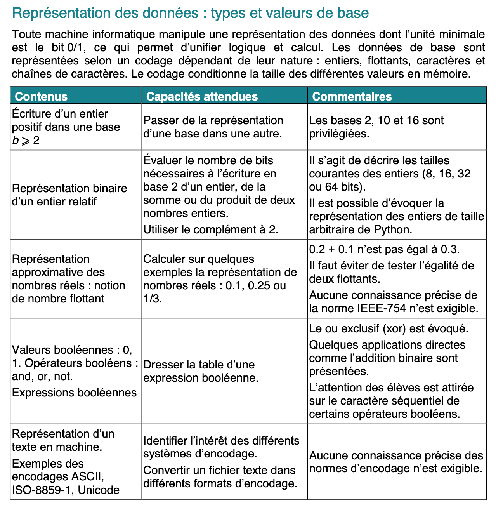

# Thème A : types de base

## Un peu d'histoire

Pour représenter l'information dans la machine, on utilise le code binaire formé des bits (binary digit) 0 et 1. Ces codes correspondent aux états ouvert ou fermé des interrupteurs utilisés dans les circuits électroniques. 
Une variable qui a deux états 0 ou 1, ou, False ou True, est également appelée **booléenne** en hommage au britannique **George Boole** qui a créé au XIX<sup>e</sup> siècle l'algèbre, fondement de la logique booléenne utilisée en mathématique, philosophie et informatique.  
. 

À la fin des années 1930, **Djon Atanasov**, physicien, mathématicien et ingénieur américain d'origine Bulgare, travaillait avec son étudiant Clifford Berry sur la construction d'un calculateur électronique (sans programme enregistré). Atanasov avait compris que la solution du fonctionnement était le binaire. L'**ABC** (Atanasov Berry Computer) entra en service à la fin **1939**, il pouvait effectuer une opération toutes les 15 secondes et pesait plus de 300 kilos.   
Pendant ce temps, la construction de l'**ENIAC** avait commencé ; Eckert et Mauchly, concepteurs et constructeurs, vont breveté leur invention d'un ordinateur en **1945**. Un procès aura lieu dans les années 1970, Atanasov affirmant que l'ENIAC avait été construit sur la base de ses idées. Une cour des États-Unis finira par invalider le brevet d'Eckert et Mauchly, tombé alors dans le domaine public, et attribuera ainsi l'invention du premier ordinateur électronique à Atanasov.

## Les attendus du programme



## 1] Écriture d'un entier positif en base b≥2 (binaire b=2, décimal b=10, hexadécimal b=16)


> Attendu : passer d'une base à une autre; les bases 2, 10 et 16 sont privilégiées.

Il faut toujours indiquer la base dans laquelle un nombre est exprimé (sauf,
par usage et commodité, en base 10) :   
1010<sub>2</sub> = 10 = A<sub>16</sub>

**Note** : la base par défaut dans du code Python est la base 10. Mais, avec certaines notations, il est
possible d'utiliser d'autres bases.

```python 	
>>> 10 == 0b1010 == 0xA 
True
```

Toutes ces représentations correspondent au même nombre dix.   
Mais peu importe la représentation donnée en entrée, en interne toutes les données sont en
binaire.

> Écrire en base cinq le nombre qui s'écrit 175 en base dix

Algorithme de conversion d'un entier en base b≥2 :

```python
Entrée : b la base de numération, n est un entier naturel.
Sortie : x0 , x1 ,. . . xp−1 les différents chiffres de l’écriture de n en base b.

m := n
i := 0
tant que m ≥ b faire
 r := m (mod b)
 m := m ÷ b
 xi := chiffre correspondant à r
 i := i + 1
fin tant que
xi := chiffre correspondant à m
renvoyer x0 , x1, . . . , xi.

```
[Voir les algorithmes de conversions](assets/Conversions_Thonny.md)


[Conversion binaire-décimal en JavaScript](http://isnangellier.alwaysdata.net/php/binaire_decimal.html)

> Exemple 1 : Donnons la représentation binaire de 64.

64=4x16=2^6
donc il s'agit de 0100 0000.

```python 
>>> 0b01000000
64
```

> Exemple 2 : Comment parmi les quatre propositions suivantes de code binaire 11 1100 1101 ; 11 1110 0101 ; 10 0111 1001; 10 1111 1001 retenir rapidement celle qui correspond à 761 ?

On voit que le bit de poids le plus fort est commun aux quatre propositions : 1 qui représente la puissance de 9 car 2<sup>9</sup>=2x2<sup>8</sup>==2x256=512.
Ainsi 761=512+249. Puis 249=1x128+121=1x2<sup>7</sup>+1x2<sup>6</sup>+..
On attend donc le début 1011... seule la dermière proposition est donc cohérente et peut être retenue sans avoir à poursuivre le travail de décomposition.

```python
>>> bin(761)
'0b1011111001'
```

> Exemple 3 : Calculons le résultat de l'addition en écriture binaire 1101 1001 + 11 0110.

Le résultat s'obtient en additionnant bit à bit avec les retenues comme avec les nombres décimaux.

```python
>>> bin(0b11011001 + 0b110110)
0b100001111
```

> Exemple 4 : Calculons le résultat de la soustraction en binaire 101001 - 101.


L'addition se faisant simplement avec des retenues comme en base 10, on peut chercher ce qu'il faut ajouter à 101 pour obtenir 101001.

```python
>>> bin(0b101001-0b101)
'0b100100'
```

> Exemple 5 : Soit n l'entier positif dont l'écriture binaire est 10001. Recherchons l'écriture binaire de l'entier 2n.

Multiplier par 2 un nombre binaire résulte en un décalage vers la gauche de tous les bits. Il s'agit donc de : 100010.


> Exemple 6 : Cherchons le nombre de bits minimum nécessaire pour coder le nombre décimal 4085.

On cherche la puissance de 2 la plus proche, dans le cas présent ce n'est pas évident, mais on connait évidemment 2<sup>8</sup>=256 et à partir de là 2<sup>9</sup>=512 ; 2<sup>10</sup>=1024; 2<sup>11</sup>=2048 et 2<sup>12</sup>=4096; ainsi 4085 possédera 2<sup>11</sup> dans sa décomposition et par conséquent nécessite un minimum de 12 bits puisque le bit de plus petit poids correspond à 2<sup>0</sup>=1.   
(Une autre méthode hors-programme utilise l'outil mathématique logarithme, logx, fonction réciproque de 10<sup>x</sup>. Ainsi log(10<sup>x</sup>)=x. Sachant que 10<sup>a+b</sup>=10<sup>a</sup>x10<sup>b</sup>, on observe que log(10<sup>a+b</sup>)=log(10<sup>a</sup>x10<sup>b</sup>)=a+b=log(10<sup>a</sup>)+log(10<sup>b</sup>). Ainsi la fonction log(x) possède la propriété intéressante de transformer une somme en produit : log(axb)=log(a)+log(b) et à partir de là on déduit également log(a<sup>n</sup>)=log(axa...xa)=nxlog(a).  
Nous cherchons ici la puissance de 2 telle que 2<sup>n</sup>=4085. En prenant le logarithme de chaque membre de cette équation, on obtient : log(2<sup>n</sup>)=nxlog(2)=log(4085) d'où n=log(4085)/log(2)=11.996.. avec la calculatrice. C'est plus rapide mais la fonction log s'étudie en terminale).


### Passage du binaire (base 2) à l'hexadécimacal (base 16), et inversement

[Voir conversion hexadecimal-décimal en JavaScript](http://isnangellier.alwaysdata.net/php/hexa_dec.html)

La base 16 est fréquemment utilisée. Pourquoi ?   
16 a le bon goût d'être une puissance de 2 (2<sup>4</sup>) et ainsi **deux chiffres hexadécimaux suffisent pour décrire un octet de 8 bits**.   

Abordons le passage de la base 2 à la base 16 (et inversement).  
Quatre bits (2<sup>4</sup>=16 possibilités) correspondent à un caractère hexadécimal (0 à 9 puis A à F soit 16 possibilités). 
On peut donc convertir un nombre de la base 2 à la base 16, sans passer par l'écriture décimale, en procédant par la formation de paquets de 4 bits. Si le nombre de bits n'est pas un multiple de 4, on peut toujours « ajouter » des 0 non significatifs avant le bit de poids fort.

> Exemple 1 : Recherchons l'écriture hexadécimale du nombre entier 157.

Une première méthode peut consister à réaliser la décomposition de l'entier en base 16.
Sachant que 16<sup>2</sup>=2<sup>8</sup>=256, et que 10x16=160, on cherche une décomposition en 9x16=144 ; ainsi 157=9x16<sup>1</sup>+13 et l'écriture hexadécimale de 157 est : 9D.

Une autre méthode peut consister à donner l'écriture binaire de 157 en réalisant des divisions successives par 2 jusqu'à ce que le quotient soit nul et en remontant de bas en haut pour obtenir : 10011101 puis on fait des regroupements de 4 : 1001 qui correspond à 9 et 1101 qui correspond à 13 soit D.

```python
>>> hex(157)
'0x9d'
```

> Exemple 2 : Recherchons la valeur décimale de l'entier positif dont l'écriture hexadécimale est 3F.

Il s'agit de 3x16+15=63.

```python
>>> 0x3F
63
```

> Exemple 3 : Recherchons la représentation en base 2 du nombre représenté dans la base 16 par A6B.

On place à la suite les uns des autres les représentations binaires sur 4 bits de chacun des codes hexadécimaux  :
A : 1010 ; 6 : 0110 ; B : 1011. 
Soit 101001101011

```python
>>> bin(0xA6B)
'0b101001101011'
```


> Exemple 4 : Recherchons l'écriture hexadécimale de l'entier dont la représentation en binaire non signé est 1100 0011.

Il faut penser à réaliser des regroupements de 4 bits : 1100 a pour valeur décimale 12 soit C en hexadécimal, et 0011 a pour valeur décimale 3 ; ainsi le code hexadecimal est C3.

```python
>>> hex(0b11000011)
'0xc3'
```

Application à voir : [le codage des couleurs](http://isnangellier.alwaysdata.net/php/colours.html) ; les couleurs sont codées en code RGB (Red Green Blue) avec chaque niveau de couleur codé sur 1 octet : soit 256 niveaux de 0 à 255 pour chaque couleur et un total de 256x256x256 couleurs soit 2<sup>24</sup>=16 777 216 couleurs possibles sur un écran.

> Exemple 5 : La couleur "vert impérial" est codée en écriture décimale par (0,86,27). Recherchons son codage hexadécimal.

86=5x16+6 est codé 56 en hexadécimal et 
27=1x16+11 est codé 1B en hexadécimal. 
Le codage hexadécimal de cette couleur est donc : (0,56,1B).

```python
>>> hex(0),hex(86),hex(27)
('0x0', '0x56', '0x1b')
```

> Exemple 6 : Exprimons la différence CBD-BAC en base 16.
  
On sait que la valeur décimale de A est 10, que la valeur décimale de B est 11, que la valeur décimale de C est 12 et que la valeur décimale de D est 13 ; ainsi la valeur décimale de CBD est 12×16<sup>2</sup>+11×16<sup>1</sup>+13×16<sup>0</sup> tandis que la valeur décimale de BAC est 11×16<sup>2</sup>+10×16<sup>1</sup>+12×16<sup>0</sup> ; la différence recherchée est donc égale à 1×16<sup>2</sup>+1×16<sup>1</sup>+1×16<sup>0</sup>, ce qui s'écrit 111 en base 16.  
La vérification en Python peut se faire ainsi : 
 
```python
>>> hex(0xCBD-0xBAC)
'0x111'
```

> Exemple 7 : Exprimons en base 16 la valeur de la somme des deux entiers positifs A7 et 84 écrits en base 16.

La valeur décimale de A7 est 10×16<sup>1</sup>+7×16<sup>0</sup> tandis que celle de 84 est 8×16<sup>1</sup>+4×16<sup>0</sup> ainsi la valeur décimale de la somme est 18×16<sup>1</sup>+11×16<sup>0</sup> or 18=1×16+2 donc la valeur décimale de la somme s'écrit 1×16<sup>2</sup>+2×16<sup>1</sup>+11×16<sup>0</sup> soit 12B en hexadécimal.  
La vérification en Python peut se faire ainsi : 
 
```python
>>> hex(0xA7+0x84)
'0x12b'
```

> Exemple 8 : Calculons la valeur décimale de la somme de deux entiers écrits en hexadécimal : 2A + 2.


2A correspond à 2x16+10=42
donc 2A + 2 vaut 44.


```python
>>> 0x2A + 0x2
44
```


### Taille des données

**À noter** : 1ko c'est 1 000 octets, pas 1 024. Le préfixe kilo correspond
toujours à 1000, l'informatique ne fait pas exception (de même pour méga,
giga, téra, etc.). Il existe cependant les préfixes kibi (2<sup>10</sup>=1024), mébi
(2<sup>20</sup>), gibi (2<sup>30</sup>), tébi (2<sup>40</sup>), etc. qui sont respectivement abbréviés en
ki, Mi, Gi, Ti, etc.

# 2] Représentation binaire (en base 2) d'un entier relatif

> Attendu : Évaluer le nombre de bits nécessaires à l’écriture en base 2 d’un
> entier, de la somme ou du produit de deux nombres entiers.  Utiliser le
> complément à 2.
>
> Commentaires : Il s’agit de décrire les tailles courantes des entiers (8,
> 16, 32 ou 64 bits).  Il est possible d’évoquer la représentation des entiers
> de taille arbitraire de Python.

## Taille d'un entier dans l'écriture en base 2

Le fait que l'entier soit relatif ne change finalement pas grand chose. Il
faut uniquement prendre en compte un bit en plus afin de stocker le signe.

En utilisant exactement *`n`* bits (avec un nième bit non nul) on peut représenter les entiers naturels de
*`2^{n-1}`* (1 suivie de 0) à *`2^n-1`* (que des 1).  Si on veut connaître le nombre de bits pour
représenter un entier donné, il faut utiliser la fonction inverse de 2^n soit *`log_2`*
(mais qui n'est pas présentée en 1è).
De ce fait un entier naturel *`n`* s'écrit sur *`log_2(n)+ 1`* bits.

D'un point de vue plus pratique les entiers naturels représentables sur 8, 16,
32 ou 64 bits sont donc ceux strictement inférieurs à 2<sup>8</sup>=256, 2<sup>16</sup> = 65 536, 2<sup>32</sup> =
4 294 967 296, 2<sup>64</sup> = 18 446 744 073 709 551 616.

> Exemple 1 : Recherchons le plus grand entier positif (non signé) représentable en binaire sur 2 octets (c'est-à-dire sur 16 bits).  

Écrit sur 16 bits, le plus grand entier s'écrit comme une succession du bit 1, sa valeur correspond au nombre de combinaisons possibles soit 2<sup>16</sup> auquel on retire le cas de 0 soit 2<sup>16</sup>-1. Une autre façon de procéder, que l'on donne pour son intérêt mathématique, est de calculer la somme des termes d'une suite géométrique de raison 2.  
S=1+2<sup>1</sup>+2<sup>2</sup>+...+2<sup>15</sup>.   
2×S=2+2<sup>2</sup>+2<sup>3</sup>+...+2<sup>16</sup>.  
En retranchant membre à membre la deuxième équation à la première, on obtient :  S=2<sup>16</sup>-1.

> Exemple 2 : Recherchons le nombre maximal de bits du produit de deux entiers positifs codés sur 8 bits. 

Pour répondre à cette question, commençons par le cas simple de la multiplication entre eux de deux entiers de deux bits 11×11 qui s'effectue comme à l'accoutumée (avec le même système de retenue) et on obtient : 1001 c'est à dire un nombre entier de 4 bits. On prédit ainsi que le nombre maximal de bits du produit de deux entiers positifs codés sur 8 bits est 2×8=16.

```python
>>> bin(255*255)
'0b1111111000000001'
```


> Exemple 3 : On ajoute trois chiffres 0 à droite de l'écriture binaire d'un entier N strictement positif ; montrons que cela revient à donner l'écriture binaire de 8×N.

En effet, pour un entier N qui s'écrit sur n bits :

N=a<sub>0</sub>×2<sup>0</sup>+.........+a<sub>n-1</sub>×2<sup>n-1</sup>.   
2×N=0×2<sup>0</sup>+a<sub>0</sub>×2<sup>1</sup>+.........+a<sub>n-1</sub>×2<sup>n</sup>. 

La multiplication par 2 a pour effet de placer un 0 à droite et de décaler tous les bits vers la gauche. Ajouter 3 chiffres 0 à droite consiste à faire 3 fois la multiplication par 2, c'est-à-dire la multiplication par 8. 
Par exemple : 

```python
>>> 0b1010
10
>>> 0b1010000
80
```


## Écriture en complément à 2 d'un entier négatif

Pour représenter un **nombre signé** on pense intuitivement qu'il suffit d'ajouter
un bit de signe. Mais cette représentation (appelée *signe-valeur absolue*) ne
permet pas d'additionner directement deux nombres.

Par exemple si le bit de poids fort est le bit de signe et qu'on représente
les entiers relatifs sur 3 bits et qu'on fait 2 + (-1). Cela donne, en
représentation signe-valeur absolue : 010 + 101 = 111. Or 111 en
représentation signe-valeur absolue correspond à -3, ce qui est incorrect.

À la place la représentation en complément à 2 est généralement préférée.
Soit *`n`* l'entier relatif à représenter sur *`p`* bits (avec *`|n| < 2^{p-1}`*):
- si *`n > 0`* : *`n`* est représenté en binaire sur *`p`* bits.
- sinon : le complément à 2 de *`-n`* est représenté sur *`p`* bits.

**Attention** C'est le bit de poids fort qui sert de bit de signe. Il est donc très
important de préciser le nombre de bits dans la représentation afin de savoir
quel bit est le bits de poids fort.

Le complément à 2 d'un entier positif *`N`* sur *`p`* bits est tel que la
somme de *`N`* et de son complément à 2 soit nulle sur *`p`* bits.
Il peut se calculer de deux méthodes :     


- **Première méthode** : On prend le complément de la représentation binaire de *`N`* et on lui ajoute 1    

- **Deuxième méthode** :  *`2^p-N`* qu'on représente en binaire sur *`p`* bits.

**Attention** *complément à 2* désigne à la fois l'opération mathématique de
conversion et une méthode de représentation des entiers relatifs (qui
n'implique pas forcément de calculer un complément à 2 !)

**Avec la représentation en complément à 2 sur *`p`* bits il est possible de
représenter tous les entiers compris entre *`-2^{p-1}`* jusqu'à *`2^{p-1}-1`*
(représentés respectivement par 10...0 et 01...1, la valeur -1 étant codée par une suite de 1).**

### Exemples

> Exemple 1 : On souhaite représenter -13 sur 5 bits dans la représentation en complément
à 2. 

On a 13 = 1101<sub>2</sub>. Donc dans la représentation en complément à 2 sur 5 bits
13 s'écrit : 01101.      


On souhaite maintenant représenter -13 sur 5 bits dans la représentation en complément
à 2.  On a tout d'abord 13 = 1101<sub>2</sub>. Nous devons calculer le complément
à 2. Voyons avec les deux méthodes données précédemment :    


**Première méthode** : Le complément de 01101<sub>2</sub> est 10010<sub>2</sub>, auquel on ajoute 1. On obtient donc 10011<sub>2</sub>. La représentation en complément à 2 sur 5 bits de -13 est donc 10011.     

 
**Deuxième méthode** : *`2^5 - 13 = 32 - 13 = 19`* or 19 = 10011<sub>2</sub>. Donc la représentation de -13 en
   complément à 2 est 10011.

> Exemple 2 : Quel est le nombre entier relatif qui correspond à la représentation en
complément à 2 sur 5 bits suivante : 11001 ?

Il s'agit d'un nombre négatif puisque le bit de poids fort est à 1.     
**Première méthode** :  On prend le complément et on lui ajoute 1 : 00111<sub>2</sub>, ce qui correspond à
   l'entier 7. L'entier représenté était donc -7    
**Deuxième méthode** : En binaire 11001<sub>2</sub> = 25 puis *`2^5-25 = 7`* donc l'entier représenté était -7.

Remarque : Si la représentation en complément à 2 est par exemple 01001, alors le nombre entier est
positif car le bit de poids fort est 0. Il suffit dans ce cas de convertir le nombre en
décimal pour connaître la valeur de l'entier, ici 9.

> Exemple 3 : Recherchons l'écriture binaire, en complément à deux sur 8 bits, de l'entier négatif -7.

La représentation binaire de 7 sur 8 bits est 00000111 ; le complément est 11111000 puis on ajoute 1 ainsi 11111001 est l'écriture en complément à deux sur 8 bits de l'entier négatif -7. On peut aussi, mais c'est plus long, calculer 2<sup>8</sup>-7 soit 256-7=249 puis écrire son écriture binaire et on retrouve 11111001.


> Exemple 4 : Recherchons l'écriture binaire, en complément à deux sur 8 bits, de l'entier négatif -108.

On calcule 2<sup>8</sup>-108=256-108=148.
Avec 148=128+20=128+16+4=2<sup>7</sup>+2<sup>4</sup>+2<sup>2</sup> donc la représentation binaire de cet entier négatif sur 8 bits est : 10010100.


> Exemple 5 : Recherchons l'entier relatif codé en complément à 2 sur un octet par 1111 1111. 

Il s'agit d'un entier négatif puisque le premier bit est 1. Prenons le complément du code binaire puis ajoutons 1. On obtient : 0000 0001. L'entier relatif en question est -1.
Une autre méthode consiste à calculer 2<sup>8</sup>-255 car 255 est la valeur decimale de 1111 1111, pour en prendre ensuite l'opposé.

> Exemple 6 : Recherchons la représentation binaire en complément à deux de l'opposé du nombre dont le code binaire sur 8 bits est 0110 1110.

On prend le complément : 1001 0001 puis on lui ajoute 1 : 1001 0010


### Représentation des entiers de taille arbitraire en Python

Dans un langage où les entiers sont de taille fixe, par exemple sur 32 bits,
ajouter 1 à *`2^{31}-1`* donnera un nombre négatif, et cela donnera
*`-2^{31}`* si les nombres sont représentés en complément à 2 sur 32 bits.

Il n'est pas possible d'illustrer cela sous Python, ou alors de manière très
détournée, car les entiers peuvent être arbitrairement grand (l'unique limite
étant la mémoire disponible sur la machine).

Pour information les nombres entiers en Python sont représentés comme une
suite de chiffres en base 2<sup>30</sup>. Plus [d'informations ici](https://rushter.com/blog/python-integer-implementation/).

# 3] Représentation approximative des nombres réels : notion de nombre flottant 

> Attendu : Calculer sur quelques exemples la représentation de nombres
> réels : 0.1, 0.25 ou 1/3.
>
> Commentaire : 0.2 + 0.1 n’est pas égal à 0.3.  Il faut éviter de tester
> l’égalité de deux flottants.  Aucune connaissance précise de la norme
> IEEE-754 n’est exigible.


Un nombre flottant n de type `float` s'écrit sous la forme `n = (-1)^s × b^p × m`, où s vaut soit 0 soit 1 (le signe), b vaut soit 2 soit 10 (la base) et m, appelée la mantisse, dont on peut considérer qu'il s'agit d'un nombre entier.
Ce n'est pas tout à fait vrai dans la norme IEEE-754 mais, dans le cadre de cette norme, on peut néanmoins se ramener à ce cas-là.

L'intérêt d'une telle notation est qu'elle permet de représenter avec une même
précision aussi bien des très petits nombres que de très grands nombres.
Cependant on ne peut représenter que des nombres rationnels, mais pas tous.

Par exemple, en faisant le choix de la base 10,  *`b=10`* :
* *`0,1 = (-1)^0× 10^(-1)× 1`*
* *`0,25 = (-1)^0× 10^(-2)× 25`*
* *`1/3 = (-1)^0× 10^(-beaucoup)× 33333.....`*
* *`0,0000421 = (-1)^0× 10^(-7)× 421`*
* *`-421000 = (-1)^1× 10^(3)× 421`*

Mais lorsque la représentation se fait sur ordinateur, il est plus aisé d'avoir une base *`b=2`*.
En base 2 le nombre 1,110001<sub>2</sub> est *`1+1/2+1/4+1/64`*.
Voici quelques valeurs pour les puissances de 2 négatives :

| *`x`* | *`2^(-x)`*   |
|-------|--------------|
| 1     | 0.5          |
| 2     | 0.25         |
| 3     | 0.125        |
| 4     | 0.0625       |
| 5     | 0.03125      |
| 6     | 0.015625     |
| 7     | 0.0078125    |
| 8     | 0.00390625   |
| 9     | 0.001953125  |
| 10    | 0.0009765625 |

Dans ce cas, on a :

* *`0,25 = (-1)^0× 2^{-2}× 1`*    

* *`0,1 = (-1)^0× 2^{-4}× 1,6`*. Or `1,6 = 1+1/2+1/16+1/32+1/256+1/512+....`.     
  Ainsi, de la même manière qu'il n'est pas possible de représenter 1/3 de manière exacte avec `b=10`, **on ne peut pas
  représenter `0,1` de manière exacte avec `b=2`**


**Attention :** Les calculs sur les nombres flottants ne sont donc pas
exacts. Il est parfois nécessaire d'approximer la valeur à représenter.  Il ne
faut **jamais** tester une égalité entre deux nombre flottants mais utiliser
une marge d'erreur relative.

**Attention :** Il ne faut pas se fier à l'affichage de Python (ou d'un autre
langage) qui n'affiche pas toutes les décimales stockées du nombre flottant.
On peut cependant accéder à plus de décimales en utilisant par exemple les
options de formattage de `format`. Attention aux yeux !
```python
>>> .1
0.1
>>> .25
0.25
>>> '{:.40f}'.format(.1)
'0.1000000000000000055511151231257827021182'
>>> '{:.40f}'.format(.2)
'0.2000000000000000111022302462515654042363'
>>> '{:.40f}'.format(.25)
'0.2500000000000000000000000000000000000000'
>>> '{:.40f}'.format(.3)
'0.2999999999999999888977697537484345957637'
>>> '{:.40f}'.format(.05)
'0.0500000000000000027755575615628913510591'
>>> .1 + .2 == .3
False
>>> .1 + .1 + .1 == .3
False
>>> .25 + .05 == .3
True
```

```python
>>> 0.2+0.1
0.30000000000000004
```

La **norme IEEE754** (notion présentée mais non exigible) définit précisément le codage des "nombres en virgule flottante". On représente un nombre par un signe s, une mantisse m et un exposant p dans la base b selon : 
`n = (-1)^s × b^p × m` avec m=1,... c'est-à-dire 1< m <=2.

Sur 64 bits, la règle est la suivante :
- un bit est réservé pour le signe, 0 pour le signe + et 1 pour le signe -
- 11 bits (2<sup>11</sup>=2048) pour l'exposant décalé e qui vaut p+1023 avec la condition -1022≤p≤1023, donc 1≤e≤2046 (les valeurs 0 et 2047 sont réservées pour coder par exemple -∞ ou +∞)
- 52 bits pour la mantisse tronquée qui vaut m'=m-1 avec la condition 1≤m<2.
Ces trois parties sont codées en binaire et concaténées pour former un nombre de 64 bits (1+11+52).

Par exemple, codons le réel - 0,375.
On note que 0,375=1,5×2<sup>-2</sup> ce qui permet d'avoir une mantisse comprise entre 1 et 2. On réalise donc la concaténation de '1' pour le signe, du code de -2 + 1023 = 1021 soit '011 1111 1101' sur 11 bits (on le trouve en faisant `bin(1021)`), la mantisse 1,5 s'écrit 1,1 en binaire et on ne garde que la partie décimale 1 et on complète avec cinquante et un 0.
Au final, le codage de - 0,375 est 1 011 1111 1101 1000.......0

Codons maintenant le réel 20. Il nous faut une mantisse comprise entre 1 et 2 et une puissance de 2.   
20=16×1,25=2<sup>4</sup>×1,25. On réalise donc la concaténantion de '0' pour le signe, du code de 4 + 1023 = 1027 soit '10000000011' sur 11 bits (on le trouve en faisant `bin(1027)`), la mantisse 1,25 s'écrit 1,01 en binaire et on ne garde que la partie décimale 01 et on complète avec cinquante 0.
Au final, le codage de 20 est 0100000000110100.....0

> Exemple 1 : Recherchons l'écriture décimale du nombre qui s'écrit 11,0101 en binaire.

Les bits après la virgule sont représentatifs des puissances négatives de 2 dans la décomposition en base 2. Nous avons donc le nombre décimal :  
2<sup>1</sup>+2<sup>0</sup>+2<sup>-2</sup>+2<sup>-4</sup>=2+1+0,25+0,0625=3,3125.


# 4] Valeurs, opérateurs et expressions booléennes

> Attendu : Dresser la table d’une expression booléenne.
>
> Commentaires : Le ou exclusif (xor) est évoqué.  Quelques applications
> directes comme l’addition binaire sont présentées.  L’attention des élèves est
> attirée sur le caractère séquentiel de certains opérateurs booléens.

Table de vérité de NON (NOT)

```python
>>> not True
False
>>> not False
True
```

Table de vérité de ET (AND)

```python
>>> True and True
True
>>> True and False
False
>>> False and False
False
```

Table de vérité de OU (OR)

```python
>>> True or True
True
>>> True or False
True
>>> False or False
False
```


> Exemple 1 : 

```python
>>> True or (True and False)
True
```


Table d'une expression booléenne avec *`n`* variables : *`2^n`* cas à évaluer.

> Exemple 2 : recherchons la table de vérité de  *`(a ∨ b) ∧ c`* (∨ : OU ; ∧ : ET)


| a | b | c | *`(a ∨ b)`* | *`(a ∨ b) ∧ c`* |
|---|---|---|---------------|-------------------------|
| 0 | 0 | 0 | 0             | 0                       |
| 0 | 0 | 1 | 0             | 0                       |
| 0 | 1 | 0 | 1             | 0                       |
| 0 | 1 | 1 | 1             | 1                       |
| 1 | 0 | 0 | 1             | 0                       |
| 1 | 0 | 1 | 1             | 1                       |
| 1 | 1 | 0 | 1             | 0                       |
| 1 | 1 | 1 | 1             | 1                       |

> Exemple 3 : Si a vaut False et b vaut True, calculons ce que vaut l'expression booléenne NOT(a AND b).

a AND b vaut False et donc NOT(a AND b)=True

```python
>>> not(False and True)
True
```

> Exemple 4 : Recherchons l'affectation equivalente à la suite d'instructions suivantes où a et b sont des valeurs entières et c une valeur booléenne.


```python
if a==b:
	c = True
elif a > b+10:
	c = True
else:
	c = False
```
Ceci est équivalent à la table de vérité:

| (a==b) | a > b+10 | c |
|---|---|---|----------|
|True | True | True |
| True | False | True |
| False |True | True |
| False | False | False |


c = (a==b) or (a > b+10)


### Exemples d'application

#### 1) L'opérateur ET 
Il permet par exemple de créer des masques afin de ne conserver que certains
bits d'une valeur.

#### 2) Parité d'un nombre

Un entier naturel pair *`n`* a son bit de poids faible à 0. Il suffit donc de
consulter ce bit pour connaître la parité du nombre.

`n ∧ 1` permet de ne conserver que le bit de poids faible (tous les autres bits sont mis à 0).
Si le résultat est 1 alors le nombre est impair, sinon le nombre est pair.

### 3) Signe d'un nombre représenté en complément à 2

On a vu que dans la représentation en complément à 2, le bit de poids fort
désigne le bit de signe.  Si on suppose un nombre entier *`n`* représenté sur
*`p`* bits, on peut isoler le bit de poids fort avec un ET également :`n
∧ (2^{p-1})`. Si le résultat est 0, le nombre est positif sinon il est
négatif.

### 4) Caractère séquentiel des expressions booléennes

Les expressions booléennes sont évaluées de manière paresseuses : dès que le résultat est connu l'évaluation est stoppée.

Par exemple avec `a ET b ET c`. Si `a` est faux, `b` et `c` ne sont même pas
évaluées puisque le résultat sera nécessairement faux.

L'ordre dans lequel les expressions sont écrites est donc important. Par
exemple il faut d'abord vérifier qu'une clé existe dans un dictionnaire pour
ensuite vérifier sa valeur.

Si `d` est un dictionnaire, on peut faire :
```python
if 'cle' in d and d['cle'] == 2:
```
Mais on **ne doit pas** faire (une exception sera levée dès que la clé n'existe pas) :
```python
if d['cle'] == 2 and 'cle' in d:
```

### 5) XOR

Le ou-exclusif ne pose généralement pas de problème car son interprétation
correspond à l'interprétation intuitive du OU en français « *resto chinois ou
italien* ? ».  Le résultat d'un ou-exclusif entre deux valeurs n'est vrai que
si exactement une des deux valeurs est vraie.

> Exemple 5 : Quand on ajoute deux bits a et b, on obtient un bit de somme s et un bit de retenue r. On peut chercher à exprimer r et s à l'aide de formules logiques.

On peut envisager les différentes cas :

a=0 b=0 s=0 r=0.  
a=1 b=0 s=1 r=0.   
a=0 b=1 s=1 r=0.  
a=1 b=1 s=0 r=1.  

On voit que s apparaît comme 𝑎 𝑂𝑈 𝐸𝑋𝐶𝐿𝑈𝑆𝐼𝐹 𝑏  tandis que r apparaît comme 𝑟=𝑎 𝐸𝑇 𝑏.

### 6) Et les opérateurs bit-à-bit ?

Les opérateurs bit-à-bit incluent les opérateurs booléens déjà mentionnés mais
également les décalages de bits.

- *Décalage à droite* : le décalage à droite de *`k`* positions d'un entier
*`n`*, noté *`n >> k`*, est l'entier dont l'écriture binaire est obtenue en
supprimant les *`k`* bits de poids faibles de l'écriture binaire de *`n`*.

Exemple :

```python
>>> 11 >> 2
2
```
En effet, 11 s'écrit en binaire 1011, le décalage vers la droite deux fois de suite donne 10 dont la valeur décimale vaut 2.

- *Décalage à gauche* : le décalage à gauche de *`k`* positions d'un entier
*`n`*, noté *`n\ll k`*, est l'entier dont l'écriture binaire est obtenue en
ajoutant *`k`* bits nuls à droite de l'écriture binaire de *`n`*.

Exemple :

```python
>>> 1<<2
4
```
En effet, 1 s'écrit en binaire 1, le décalage vers la gauche deux fois de suite donne 100 dont la valeur décimale vaut 4 ; la valeur décimale de départ a été multipliée par 2<sup>2</sup>.


En Python, décaler un nombre entier positif d'un bit vers la gauche revient à
le multiplier par 2, et ainsi le décaler de *`k`* bits, revient à le multiplier par
*`2^k`*.  
Si le nombre entier est représenté sur un nombre fixe de bits (ce
qui n'est pas le cas de Python), décaler de *`k`* bits vers la gauche va
également faire perdre les *`k`* bits qui étaient originellement de poids
fort.


Le décalage de bit aurait été utile dans l'exemple 3 de
détermination du bit de signe pour un entier n qui s'écrit sur p bits. Avec le
décalage à droite on peut faire *`n >> (p-1)`* et dans ce cas le
résultat est soit 0 soit 1 pour nous indiquer le signe.

# 6] Représentation d'un texte en machine

> Attendu : Identifier l’intérêt des différents systèmes d’encodage.
> Convertir un fichier texte dans différents formats d’encodage.
>
> Commentaires : Aucune connaissance précise des normes d’encodage n’est
> exigible.

## Pourquoi différents encodages de caractères ?

Remarque : distinguer ce que l'on entend par **encodage de caractère** (ASCII, UTF-16..) et **polices de caractères** (Arial, Times New Roman..).

### CODAGE ASCII
Le code ASCII (*American Standard Code for Information Interchange*) est la première
norme largement utilisée pour encoder des caractères.  Comme son nom l'indique
cette norme est américaine et elle sert pour l'échange d'information dans cette langue ;  elle n'**inclue donc pas les lettres  
accentuées** mais comme le tableau ci-dessous l'indique, des chiffres, opérateurs mathématiques, caractères de
ponctuation ou de délimitation et certains caractères spéciaux.

Voici les caractères de la table ASCII (les 33 premiers, et le dernier, ne sont pas imprimables) :

|     | `0`     | `1`   | `2`   | `3`   | `4`   | `5`   | `6`   | `7`   | `8`   | `9`  | `A`   | `B`   | `C`  | `D`  | `E`  | `F`  |
|-----|---------|-------|-------|-------|-------|-------|-------|-------|-------|------|-------|-------|------|------|------|------|
| `0` | `NUL`   | `SOH` | `STX` | `ETX` | `EOT` | `ENQ` | `ACK` | `BEL` | `BS`  | `HT` | `LF`  | `VT`  | `FF` | `CR` | `SO` | `SI` |
| `1` | `DLE`   | `DC1` | `DC2` | `DC3` | `DC4` | `NAK` | `SYN` | `ETB` | `CAN` | `EM` | `SUB` | `ESC` | `FS` | `GS` | `RS` | `US` |
| `2` | `ESP`   | `!`   | `"`   | `#`   | `*`   | `%`   | `&`   | `'`   | `(`   | `)`  | `*`   | `+`   | `,`  | `-`  | `.`  | `/`  |
| `3` | `0`     | `1`   | `2`   | `3`   | `4`   | `5`   | `6`   | `7`   | `8`   | `9`  | `:`   | `;`   | `<`  | `=`  | `>`  | `?`  |
| `4` | `@`     | `A`   | `B`   | `C`   | `D`   | `E`   | `F`   | `G`   | `H`   | `I`  | `J`   | `K`   | `L`  | `M`  | `N`  | `O`  |
| `5` | `P`     | `Q`   | `R`   | `S`   | `T`   | `U`   | `V`   | `W`   | `X`   | `Y`  | `Z`   | `[`   | `\`  | `]`  | `^`  | `_`  |
| `6` | `accent grave ` | `a`   | `b`   | `c`   | `d`   | `e`   | `f`   | `g`   | `h`   | `i`  | `j`   | `k`   | `l`  | `m`  | `n`  | `o`  |
| `7` | `p`     | `q`   | `r`   | `s`   | `t`   | `u`   | `v`   | `w`   | `x`   | `y`  | `z`   | `{`   | `|`  | `}`  | `~`  | `DEL`|

128 caractères composent la table ASCII, ce qui permet de les représenter sur
7 bits (en pratique ils sont donnés sur 8 bits afin d'occuper un octet complet).

Pour obtenir le code ASCII d'un caractère et inversement : 

```python
>>> ord("k")
107
>>> chr(52)
'4'
```

> Exemple : Le code ASCII de la lettre A est 0x41, celui de la lettre B est 0x42, celui de la lettre C est 0x43, etc.
Quel est le code ASCII, en hexadécimal, de la lettre X, qui est la 24e lettre de l'alphabet usuel ?

Voyons l'écriture du code ASCII en hexadécimal pour les lettres qui suivent : on aura donc  0x43 pour 3e lettre .. puis  0x49 pour 9e lettre, 0x4A pour la 10e lettre..0x4F pour la 15e lettre, puis  0x50 pour la 16e lettre et donc  0x58 pour la 24e lettre.

```python
>>> hex(ord("A"))
'0x41'
>>> hex(ord("X"))
'0x58'
```

### CODAGE ISO-8859-1

Par la suite d'autres encodages ont vu le jour afin de pallier les limites de
l'ASCII.  L'ISO-8859-1 (aussi appelé *Latin-1*), pour l'Europe occidentale, a
vu le jour en 1986.  Celui-ci comble les manques pour la plupart des langues
d'Europe occidentale.  Pour le français il manque cependant le œ, le Œ et le Ÿ
et, bien entendu, le symbole €.  L'encodage en ISO-8859-1 utilise 8 bits, les
128 premières valeurs de l'ISO-8859-1 sont identiques à l'ASCII, ce qui assure
une compatibilité avec cet encodage.

Voici la table des caractères ISO-8859-1 :


### CODAGE UTF-8

À nouveau le codage ISO-8859-1 (et les autres codages de la famille ISO-8859)
présentent des limites.  Dans les années 1990, le projet Unicode de codage
unifié de tous les alphabets est né. Différents codages sont utilisés pour
représenter des caractères Unicode (UTF-8, UTF-16, UTF-32\dots). Ici nous nous
concentrons sur l'UTF-8.


UTF-8 (abréviation de l’anglais Universal Character Set Transformation Format1 - 8 bits) est un codage de caractères informatiques conçu pour **coder l’ensemble des caractères** du « répertoire universel de caractères codés », initialement développé par l’ISO dans la norme internationale ISO/CEI 10646, aujourd’hui totalement compatible avec le standard Unicode, en restant compatible avec la norme ASCII limitée à l’anglais de base, mais très largement répandue depuis des décennies. 

L'encodage le plus pratique pour échanger des textes constitués de **caractères Unicode** est UTF-8. Il associe à tout numéro Unicode une suite d'un ou plusieurs octets (jusqu'à quatre octets pour un seul caractère). Cet encodage est décrit dans la RFC 2279. Une des propriétés importantes de cet encodage est que les caractères dont les numéros sont compris entre 32 et 126 possèdent la même représentation en UTF-8 et dans l'encodage ASCII. L'encodage UTF-8 est donc compatible avec ASCII, dans la mesure où il n'y a rien à faire pour convertir un fichier encodé en ASCII vers UTF-8. Réciproquement, si un octet représentant un nombre compris entre 32 et 126 apparaît dans un fichier encodé en UTF-8, alors c'est forcément pour encoder le caractère ASCII du même numéro.  


Le codage UTF-8 est un **codage de longueur variable qui se fait sur 1 à 4 octets.**  Certains caractères sont
codés sur un seul octet, ce sont les 128 caractères du codage ASCII.  Les
autres caractères peuvent être codés sur 2, 3 ou 4 octets.  Ainsi l'UTF-8
permet en théorie de représenter *`2^21 = 2 097 152`* caractères
différents, en réalité un peu moins. Il y a actuellement environ une centaine
de milliers de caractères Unicode (incluant les [caractères des langues
vivantes ou
mortes](https://unicode.org/cldr/charts/latest/supplemental/languages_and_scripts.html)
et également de [nombreux emojis
indispensables](https://unicode.org/emoji/charts-12.0/full-emoji-list.html)
😇)

Les caractères en UTF-8 doivent avoir une forme particulière décrite dans la
table ci-dessous, il faut en effet être capable de distinguer dans un texte les caractères qui se codent sur 1, 2, 3 ou 4 octets :

| Nbre octets codant | Format de la représentation binaire   |
|--------------------|---------------------------------------|
| 1                  | `0xxxxxxx`                            |
| 2                  | `110xxxxx 10xxxxxx`                   |
| 3                  | `1110xxxx 10xxxxxx 10xxxxxx`          |
| 4                  | `11110xxx 10xxxxxx 10xxxxxx 10xxxxxx` |

L'encodage UTF-8 est lui aussi compatible avec l'ASCII. En revanche ISO-8859-1
et UTF-8 sont incompatibles entre eux pouvant conduire à ce genre de problèmes :


Aller plus loin : Plus d'informations sur ces différents aspects sont disponibles [dans chapitre 1 du polycopié du cours de Codage de l'information donné en L2 informatique](assets/poly.pdf).

Application : dans le bloc `<head>` d'un fichier HTML (c'est-à-dire entre les balises `<head>` et `</head>`), on insère la ligne `<meta http-equiv="Content -Type" content="text/html; charset=UTF-8">` pour permettre un affichage correct des caractères spéciaux sur tout système d'exploitation.
![](data:image/jpeg;base64,IyBUaG9ubnkKCgpUaG9ubnkgZXN0IHVuICplbnZpcm9ubmVtZW50IGRlIGTDqXZlbG9wcGVtZW50IGludMOpZ3LDqSogKEVESSBvdSBJREUgZW4gYW5nbGFpcyBwb3VyIAoqSW50ZWdyYXRlZCBEZXZlbG9wbWVudCBFbnZpcm9ubWVudCopIHF1aSBhIMOpdMOpIHBhcnRpY3VsacOocmVtZW50IGJpZW4gY29uw6d1IHBvdXIgbGVzIHByb2dyYW1tZXVycyBkw6lidXRhbnQgZW4gUHl0aG9uLgoKCkxhIGRlcm5pw6hyZSB2ZXJzaW9uIGRpc3BvbmlibGUgw6AgY2Ugam91ciAoc2VwdGVtYnJlIDIwMjApIGVzdCBsYSAzLjcuCgpTaXRlcyBvZmZpY2llbHMgOgoKKiBbVGhvbm55XShodHRwczovL3Rob25ueS5vcmcpCiogV2lraSBbV2lraV0oaHR0cHM6Ly9naXRodWIuY29tL3Rob25ueS90aG9ubnkvd2lraSkKCioqUmVtYXJxdWUqKiA6IGRpc3Rpbmd1ZXIgUHl0aG9uIHF1aSBlc3QgdW4gbGFuZ2FnZSBldCBUaG9ubnkgcXVpIGVzdCB1biBlbnZpcm9ubmVtZW50IGludMOpZ3LDqSBkZSBwcm9ncmFtbWF0aW9uIGVuIFB5dGhvbi4KCgojIyBVdGlsaXNhdGlvbiBkZSBiYXNlCkxvcnNxdSdvbiBsYW5jZSBUaG9ubnkgbGEgcHJlbWnDqHJlIGZvaXMsIG9uIGTDqWNvdXZyZSB1bmUgZmVuw6p0cmUgYXZlYyBzYSBiYXJyZSBkZSBtZW51cyB1c3VlbHMsIHVuZSByYW5nw6llIGRlIGJvdXRvbnMsIGV0IGRldXggcGFubmVhdXggY29ycmVzcG9uZGFudCDDoAoKKiBsJ8OpZGl0ZXVyIChvbmdsZXQgbm9tbcOpIGluaXRpYWxlbWVudCBgPHVudGl0bGVkPmApCiogbCdpbnRlcnByw6l0ZXVyIChvbmdsZXQgbm9tbcOpIGBTaGVsbGApCgohW3Z1ZSBzdXIgVGhvbm55XShhc3NldHMvdGhvbm55LnBuZykKCiMjIExlIHNoZWxsCkxlICpzaGVsbCogZXN0IGxhIHpvbmUgZGFucyBsYXF1ZWxsZSBsJ3V0aWxpc2F0ZXVyIGludMOpcmFnaXQvZGlhbG9ndWUgYXZlYyBsJ2ludGVycHLDqXRldXIgUHl0aG9uLgoKIyMjIERpYWxvZ3VlIGF2ZWMgbCdpbnRlcnByw6l0ZXVyCgpMJyppbnZpdGUgZGUgY29tbWFuZGUqIChvdSBwcm9tcHQpIGA+Pj5gIGF0dGVuZCB1bmUgaW5zdHJ1Y3Rpb24uIFVuZSBpbnN0dWN0aW9uIGRvaXQgw6p0cmUgw6ljcml0ZSBzdXIgdW5lIHNldWxlIGxpZ25lIHNhdWYgc2kgCiogZWxsZSBlc3QgcGFyZW50aMOpc8OpZSAobGlzdGUgOiBbXSwgdHVwbGVzIDogKCksIGRpY3Rpb25uYWlyZXMgOiB7fSwgY2hhw65uZXMgZGUgY2FyYWN0w6hyZXMgYXZlYyB0cmlwbGUgZMOpbGltaXRldXIgOiAnJycgJycnKQoqIGVsbGUgZXN0IGNvbXBvc8OpZSA6IGluc3RydWN0aW9ucyBjb25kaXRpb25uZWxsZXMgKGlmIC4uLikgLCBpdMOpcmF0aW9ucyAoZm9yIC4uLikKCiMjIyBMJ2V4cGxvcmF0ZXVyIGRlIHZhcmlhYmxlcwoKKiBmYWlyZSBhcHBhcmHDrnRyZSB1bmUgdnVlIHN1ciBsZXMgdmFyaWFibGVzIGTDqWZpbmllcyBwYXIgbGUgcHJvZ3JhbW1ldXIgZGFucyBsYSBzZXNzaW9uIGNvdXJhbnRlIDogbWVudSBWaWV3L1ZhcmlhYmxlcwoqIHVuIG5vdXZlYXUgcGFubmVhdSAob25nbGV0IGBWYXJpYWJsZXNgKSBhcHBhcmHDrnQgc3VyIGxhIGRyb2l0ZSBxdWkgcHLDqXNlbnRlIGxlcyB2YXJpYWJsZXMgZW4gZG9ubmFudCBsZXVyIG5vbSBldCBsZXVyIHZhbGV1cgoqIGRhbnMgbGUgc2hlbGwgYWpvdXRlciB1bmUgZMOpZmluaXRpb24gZCd1bmUgbm91dmVsbGUgdmFyaWFibGUsIHB1aXMgbW9kaWZpZXIgc2EgdmFsZXVyLiBvYnNlcnZlciBkYW5zIGxhIHZ1ZSBzdXIgbGVzIHZhcmlhYmxlcwoKIVtUaG9ubnkgOiB1dGlsaXNhdGlvbiBkdSBTaGVsbF0oYXNzZXRzL3Rob25ueV9zaGVsbC5wbmcpCgojIyMgRmFjaWxpdMOpcyBkZSBkaWFsb2d1ZSAKCiogdXRpbGlzYXRpb24gaGlzdG9yaXF1ZSB2aWEgbGEgZmzDqGNoZSBoYXV0IGR1IGNsYXZpZXIKKiBjb21wbMOpdGlvbiBhdXRvbWF0aXF1ZSB2aWEgbGEgdG91Y2hlIFRBQiBkdSBjbGF2aWVyIChzZXJhIHJldnVlIGF2ZWMgbCfDqWRpdGV1cikKKiBwb3NzaWJpbGl0w6kgZGUgwqtuZXR0b3llcsK7IGxlIHNoZWxsIHZpYSBjbGlrIGRyb2l0IG9wdGlvbiBgY2xlYXJgCgojIyBMJ8OpZGl0ZXVyCkwnw6lkaXRldXIgcGVybWV0IGxhIHLDqWRhY3Rpb24gZGUgKnNjcmlwdHMqIChmaWNoaWVycyBjb250ZW5hbnQgZHUgY29kZSBQeXRob24pLiBDZXMgc2NyaXB0cyBwZXV2ZW50IMOqdHJlIGV4w6ljdXTDqXMgZXQgdXRpbGlzw6lzIGRhbnMgbGUgc2hlbGwKCiMjIyBBdmFudGFnZXMgZGUgbCfDqWRpdGV1cgoKKiBlZmZlY3R1ZSB1bmUgc2F1dmVnYXJkZSDDoCBjaGFxdWUgZXjDqWN1dGlvbiAoZGVtYW5kZSB1biBub20gZGUgZmljaGllciBzaSAxw6hyZSBleMOpY3V0aW9uKSA9PiB0b3V0ZSBtb2RpZmljYXRpb24gZXN0IHNhdXZlZ2FyZMOpZQoqIGNvbG9yYXRpb24gc3ludGF4aXF1ZSBwZXJtZXR0YW50IGRlIHZpc3VhbGlzZXIgZGVzIGVycmV1cnMgOgogICogZGVzIG1vdHMgY2zDqXMgZHUgbGFuZ2FnZSAoYGRlZmAsIGBpZmAsIGBmb3JgLCBgd2hpbGVgLCBgVHJ1ZWAsIGBGYWxzZWAgLi4uKQogICogZGVzIGNvbnN0YW50ZXMgbGl0w6lyYWxlcyAoY291bGV1cnMgZGlzdGluY3RlcyBwb3VyIG5vbWJyZXMgZXQgY2hhw65uZXMgZGUgY2FyYWN0w6hyZXMpCiAgKiBjb2xvcmF0aW9uIGRlcyByw6lnaW9ucyBtYXJxdcOpcyBwYXIgdW4gZMOpbGltaXRldXIgb3V2ZXJ0IG1haXMgbm9uIGZlcm3DqSAoY2hhaW5lcyBkZSBjYXJhY3TDqHJlcywgbGlzdGVzLCB0dXBsZXMsIGRpY3Rpb25uYWlyZXMsIC4uLikKKiBpbmRlbnRhdGlvbiBhdXRvbWF0aXF1ZSBsb3JzcXVlIG7DqWNlc3NhaXJlCiogY29tcGzDqXRpb24gYXV0b21hdGlxdWUgYXZlYyBsYSB0b3VjaGUgVEFCID0+IGZhdm9yaXNlIGwndXRpbGlzYXRpb24gZGUgbm9tcyBsb25ncyBwb3VyIGxlcyBwYXJlc3NldXgKKiB2aXN1YWxpc2F0aW9uIGRlIGxhIHBvcnTDqWUgZGVzIHZhcmlhYmxlcwoKIyMjIEV4w6ljdXRpb24gZCd1biBzY3JpcHQsIHBsdXNpZXVycyBwb3NzaWJpbGl0w6lzCgoqIHZpYSBsZSBtZW51IGBSdW4vUnVuIGN1cnJlbnQgc2NyaXB0YAoqIHZpYSBsZSBib3V0b24gZmzDqGNoZSB2ZXJ0ZQoqIHZpYSBsYSB0b3VjaGUgRjUKClNpIGxlIHNjcmlwdCB2aWVudCBkJ8OqdHJlIGNyw6nDqSAob25nbGV0IG5vbW3DqSBgPHVudGl0bGVkPmApLCBib8OudGUgZGUgZGlhbG9ndWUgcG91ciBkZW1hbmRlciB1biBub20gZGUgc2NyaXB0LiBTaSBsZSBub20gZG9ubsOpIG5lIGNvbnRpZW50IHBhcyBsJ2V4dGVuc2lvbiBgLnB5YCBUaG9ubnkgbGEgcmFqb3V0ZS4KCioqTkIqKiA6IGxvcnMgZGUgbCfDqXjDqWN1dGlvbiBkJ3VuIHNjcmlwdCwgbGUgcsOpcGVydG9pcmUgZGUgdHJhdmFpbCBlc3QgY2VsdWkgZGFucyBsZXF1ZWwgZXN0IHNhdXZlZ2FyZMOpIGxlIHNjcmlwdC4gKEltcG9ydGFudCBzaSBiZXNvaW4gZCdhY2PDqWRlciDDoCBkZXMgZmljaGllcnMpCgoqKlJlbWFycXVlIDoqKiBzaSB1biBzY3JpcHQgbmUgY29udGllbnQgYXVjdW5lIGluc3RydWN0aW9uIGQnYWZmaWNoYWdlIChgcHJpbnRgKSwgYWxvcnMgc29uIGV4w6ljdXRpb24gbmUgc2UgdHJhZHVpdCBxdWUgcGFyIGxhIG1lbnRpb24gYCVSdW4gbm9tX3NjcmlwdC5weWAgZGFucyBsZSBzaGVsbCBldCByaWVuIGQnYXV0cmUuCgo9PiB1biBzY3JpcHQgcGV1dCAKCiogbmUgY29udGVuaXIgcXVlIGRlcyBkw6lmaW5pdGlvbnMgZGUgdmFyaWFibGVzLCBmb25jdGlvbnMsIC4uLiBldCBvbiB1dGlsaXNlIGNlcyBkw6lmaW5pdGlvbnMgZGFucyBsZSBzaGVsbAoqIGNvbnRlbmlyIGRlcyBpbnN0cnVjdGlvbnMgZCdhZmZpY2hhZ2UgKG91IGQnYGlucHV0YCkgcXVpIHNlcm9udCBpbW3DqWRpYXRlbWVudCBleMOpY3V0w6llcyBldCBsYWlzc2Vyb250IGRlcyB0cmFjZXMgZGFucyBsZSBzaGVsbCAow6l2aXRlciBsZXVyIGFidXMgZW4gcGhhc2UgZGUgZMOpdmVsb3BwZW1lbnQgZGUgZm9uY3Rpb25zKQoKIyMjIElsbHVzdHJhdGlvbiBkZSBjZXMgcG9pbnRzIGF2ZWMgc3VpdGUgU3lyYWN1c2UKY2YgZmljaGllciBbZGVtb19zeXJhY3VzZS5weV0oZGVtb19zeXJhY3VzZS5weSkKCkNldCBleGVtcGxlIHNlcmEgw6l0dWRpw6kgZGFucyBsZSBkw6l0YWlsIDsgcG91ciBsZSBtb21lbnQgaWwgZmF1dCBqdXN0ZSBzYXZvaXIgcXUnaWwgcydhZ2l0IGQndW5lIHN1aXRlIGRlIHZhbGV1cnMgY29uc3RydWl0ZSDDoCBwYXJ0aXIgZCd1bmUgdmFsZXVyIGluaXRpYWxlIDsgcG91ciBvYnRlbmlyIGxhIHZhbGV1ciBzdWl2YW50ZSBvbiBkaXZpc2UgbGEgdmFsZXVyIGluaXRpYWxlIHBhciAyIHNpIGNlbGxlLWNpIGVzdCBwYWlyZSwgZXQgb24gbGEgbXVsdGlwbGllIHBhciAzIGVuIGx1aSBham91dGFudCAxIHNpIGxhIHZhbGV1ciBpbml0aWFsZSBlc3QgaW1wYWlyZSA7IGlsIHMnYXbDqHJlIHF1J2F1IGJvdXQgZCd1biBjZXJ0YWluIHRlbXBzIGxhIHN1aXRlIGF0dGVpbnQgdG91am91cnMgbGEgdmFsZXVyIDEgcHVpcyBmaW5pdCBwYXIgc2UgcsOpcMOodGVyIGluZMOpZmluaW1lbnQgKDEsNCwyLDEsNCwy4oCmKS4KCiogY29tbWVuY2VyIHBhciDDqWNyaXJlIGxhIHByZW1pw6hyZSBmb25jdGlvbiBgc3lyYWN1c2VgIHNhbnMgZG9jc3RyaW5nLiBQcm9maXRlciBkZSAKICBsJ291dmVydHVyZSBkZSBsYSBwYXJlbnRow6hzZSBkZXMgcGFyYW3DqHRyZXMgcG91ciBzb3VsaWduZXIgbGEgY29sb3JhdGlvbiBzeW50YXhpcXVlIChlbiBncmlzKS4KICAKKiBleMOpY3V0ZXIgPT4gaWwgZmF1dCBkb25uZXIgdW4gbm9tIGF1IHNjcmlwdCAocXVpIGNoYW5nZSBsJ2ludGl0dWzDqSBkZSBsJ29uZ2xldCkgPT4gaWwgbmUgc2UgcGFzc2UgcmllbiBkYW5zIGxlIHNoZWxsLiAKICAKICBBVFRFTlRJT04gcG91ciBsYSBzdWl0ZSAoZG9jc3RyaW5nKSBpbCBuZSBmYXV0IGphbWFpcyBub21tZXIgbGUgc2NyaXB0IGR1IG3Dqm1lIG5vbSBxdSd1bmUgZGVzIGZvbmN0aW9ucy4KICAKICBOb3RlciBxdWUgZGFucyBsYSB2dWUgc3VyIGxlcyB2YXJpYWJsZXMsIGxlcyB2YXJpYWJsZXMgcHLDqWPDqWRlbW1lbnQgZMOpZmluaWVzIG9udCBkaXNwYXJ1ZXMsIGV0IHVuIHNldWwgIG5vbSBlc3QgZMOpZmluaSA6IGBzeXJhY3VzZWAgZGUgdmFsZXVyIGA8ZnVuY3Rpb24gc3lyYWN1c2UgYXQgLi4uPmAKICAKICA9PiBvbiB0cmF2YWlsbGUgdG91am91cnMgZGFucyB1biBlbnZpcm9ubmVtZW50IGRlIHZhcmlhYmxlcyDCq3Byb3ByZcK7IDogY2VsdWkgZGVzIGTDqWZpbml0aW9ucyBkdSBzY3JpcHQgcGx1cyDDqXZlbnR1ZWxsZW1lbnQgcXVlbHF1ZXMgdmFyaWFibGVzIGTDqWZpbmllcyBkYW5zIGxhIHNlc3Npb24gZW4gY291cnMgIAogIAoqIGRhbnMgbGUgU2hlbGwgdXRpbGlzZXIgbGEgZm9uY3Rpb24gYHN5cmFjdXNlYCAgZW4gZmFpc2FudCBwYXIgZXhlbXBsZSBzeXJhY3VzZSgzKSAKCiogZGFucyBsZSBTaGVsbCB1dGlsaXNlciBsYSBjb21wbMOpdGlvbiBhdXRvbWF0aXF1ZSBwb3VyIGFwcGVsZXIgbGEgZm9uY3Rpb24gYHRlcm1lX3N5cmFjdXNlYCA7IGNvbnRydWlyZSBsYSBsaXN0ZSBkZXMgdmFsZXVycyBwYXJ0YW50IGRlIDkgZW4gw6ljcml2YW50IGRhbnMgbGUgU2hlbGwgOgoKICBgW3Rlcm1lX3N5cmFjdXNlKDksaSkgZm9yIGkgaW4gcmFuZ2UoMSwzMCldYAoKKiDDqWNyaXJlIGxhIHRyb2lzacOobWUgZm9uY3Rpb24gYGF0dGVycmlzc2FnZV9zeXJhY3VzZWAgc2FucyBkb2NzdHJpbmcuCgoqIGV4w6ljdXRlciBkYW5zIGxlIFNoZWxsIGBhdHRlcnJpc3NhZ2Vfc3lyYWN1c2UoOSlgIAoKKiBleMOpY3V0ZXIgZGFucyBsZSBTaGVsbCAgOgoKICBgW2F0dGVycmlzc2FnZV9zeXJhY3VzZShhKSBmb3IgYSBpbiByYW5nZSgxLDEwKV1gCgogICDDgCBxdW9pIGNlbGEgY29ycmVzcG9uZCA/CgoqIGVzc2F5ZXIgYXZlYyAwID0+IGNhbGN1bCBpbmZpbmkgOiBwb3VycXVvaSA/ID0+IG7DqWNlc3NpdMOpIGQnaW50ZXJyb21wcmUgbGUgY2FsY3VsID0+IGRldXggc29sdXRpb25zIAogIC0gdXNhZ2UgZHUgYm91dG9uIHBhbm5lYXUgIHN0b3AgKGVuIGhhdXQgZW4gcm91Z2UpCiAgLSB1c2FnZSBkZSBsYSBjb21iaW5haXNvbiBDdHJsK0MgYXUgY2xhdmllcgogIGxlcyBpc3N1ZXMgbmUgc29udCBwYXMgaWRlbnRpcXVlcyA6IAogIC0gbGUgcHJlbWllciByZWTDqW1hcnJlIHVuIG5vdXZlbCBpbnRlcnByw6l0ZXVyIChldCBkb25jIGxlcyB2YXJpYWJsZXMgc29udCBwZXJkdWVzKQogIC0gbGUgc2Vjb25kIGludGVycm9tcHQgbCdleMOpY3V0aW9uIGRlIGxhIGNvbW1hbmRlIGVuIGNvdXJzLCBldCBsYWlzc2UgaW50YWN0IGwnZW52aXJvbm5lbWVudCB0ZWwgcXUnaWwgw6l0YWl0IGF1IG1vbWVudCBkZSBsJ2ludGVycnVwdGlvbi4KCiFbVGhvbm55IDogdW5lIHNlc3Npb24gYXZlYyBkZXMgZm9uY3Rpb25zIGTDqWZpbmllcyBkYW5zIGwnw6lkaXRldXJdKGFzc2V0cy90aG9ubnlfZWRpdGV1cl9ldF9zaGVsbC5wbmcpCgojIyBOYXZpZ3VlciBkJ3VuZSBmb25jdGlvbiDDoCBsJ2F1dHJlCgoqIGFsbGVyIGRhbnMgbGUgbWVudSBWaWV3L091dGxpbmUgOiB1biBub3V2ZWwgb25nbGV0IGBPdXRsaW5lYCBhcHBhcmFpdCBkYW5zIGxlIHBhbm5lYXUgw6AgY8O0dMOpIGRlcyB2YXJpYWJsZXMKKiBjbGlxdWVyIHN1ciBsJ3VuIG91IGwnYXV0cmUgZGVzIGl0ZW1zIHF1aSB5IGZpZ3VyZW50IHBlcm1ldCBkZSBuYXZpZ3VlciBkYW5zIGwnw6lkaXRldXIKCgojIyBMb2NhbGlzZXIgdW5lIGVycmV1ciAKCiogZGFucyBsZSBzaGVsbCB0YXBlciBsYSBjb21tYW5kZSBgc3lyYWN1c2UoJzMnKWAgPT4gY2VsYSBzZSBwYXNzZSBtYWwsIHBvdXJxdW9pID8gOiBwbHVzaWV1cnMgbGlnbmVzIHJvdWdlcyBzb250IMOpY3JpdGVzICEgRWxsZXMgc2UgbGlzZW50IGRlIGJhcyBlbiBoYXV0LgoqIGRlcm5pw6hyZSBsaWduZSA6IHVuZSBleGNlcHRpb24gZXN0IGTDqWNsZW5jaMOpZSBwb3J0YW50IGxlIG5vbSBkZSBgVHlwZUVycm9yYAoqIGxpZ25lIGR1IGRlc3N1cyBsYSBsaWduZSBkZSBjb2RlIGF5YW50IGTDqWNsZW5jaMOpIGwnZXhjZXB0aW9uCiogbGlnbmUgZHUgZGVzc3VzIGxpZW4gdmVycyBsZSBmaWNoaWVyIGV0IGxhIGxpZ25lIGRlIGNlIGZpY2hpZXIgY29udGVuYW50IGNlIGNvZGUKKiBjbGlxdWVyIHN1ciBsZSBsaWVuIGFtw6huZSDDoCBsYSBsaWduZSBkZSBjb2RlIHJlc3BvbnNhYmxlIHN1cmxpZ27DqWUgCiogZXQgZGFucyBsYSB2dWUgc3VyIGxlcyB2YXJpYWJsZXMsIG9uIHZpc3VhbGlzZSBsZXMgdmFyaWFibGVzIGxvY2FsZXMgZXQgZ2xvYmFsZXMgYXUgbW9tZW50IGR1IGTDqWNsZW5jaGVtZW50IGRlIGwnZXhjZXB0aW9uLgoKIVtUaG9ubnkgc3VpdmkgZCd1biBsaWVuIGFwcsOocyBkw6ljbGVuY2hlbWVudCBkJ2V4Y2VwdGlvbl0oYXNzZXRzL3Rob25ueV9leGNlcHRpb24ucG5nKQoKIyMgRG9jc3RyaW5nCgoqIHBhcnRpciBkZSBsYSBmb25jdGlvbiBgaGVscGAgZGFucyBsZSBzaGVsbCBzdXIgcXVlbHF1ZXMgZmN0cyBwcsOpZMOpZmluaWVzIChgYWJzYCwgYGxlbmAsIGBwcmludGApCiogZXNzYXllciBgaGVscGAgYXZlYyBsZXMgZmN0cyBkdSBzY3JpcHQgYHN5cmFjdXNlYCA9PiBwYXMgZ3JhbmQgY2hvc2UKKiBvbiBham91dGUgdW5lIGRvY3N0cmluZyBkYW5zIGBzeXJhY3VzZWAKICBgYGBweXRob24KICBkZWYgc3lyYWN1c2UodSk6CiAgICAgICcnJwogICAgICByZW52b2llIGxlIHRlcm1lIHN1aXZhbnQgdSBkJ3VuZSBzdWl0ZSBkZSBTeXJhY3VzZQoJICAnJycKICBgYGAKICB1bmUgKmRvY3N0cmluZyogZGUgZm9uY3Rpb24gZXN0IHVuZSBjaGHDrm5lIGRlIGNhcmFjdMOocmVzIHBsYWPDqWUgaW1tw6lkaWF0ZW1lbnQgYXByw6hzIGwnZW4tdMOqdGUsIHF1aSBzJ8OpdGVuZCBnw6luw6lyYWxlbWVudCBzdXIgcGx1c2lldXJzIGxpZ25lcyBldCBkb25jIHF1aSBlc3QgZMOpbGltaXTDqSBwYXIgdW4gdHJpcGxlIGAnYCBvdSB1biB0cmlwbGUgYCJgLgoqIGV4w6ljdXRlciBldCB1dGlsaXNlciBsYSBmb25jdGlvbiBgaGVscGAgc3VyIGBzeXJhY3VzZWAKKiBvbiBjb21wbMOodGUgbGEgZG9jdHJpbmcgYXZlYyBkZXMgaW5mb3JtYXRpb25zIGRlIHR5cGUgZGVzIHBhcmFtw6h0cmVzIGV0IGRlIHZhbGV1ciByZW52b3nDqWUsIGVuIG1lbnRpb25uYW50IGxlcyBjb250cmFpbnRlcyAob3UgY29uZGl0aW9ucykgZCd1dGlsaXNhdGlvbiAoaWNpIGF1Y3VuZSkgZXQgZW4gZG9ubmFudCBxdWVscXVlcyBleGVtcGxlcyAocHLDqXBhcmF0aW9uIGF1eCBkb2N0ZXN0cyB2dXMgw6AgbGEgc2Vzc2lvbiBwcm9jaGFpbmUpCiAgYGBgcHl0aG9uCiAgZGVmIHN5cmFjdXNlKHUpOgogICAgICAnJycKICAgICAgcmVudm9pZSBsZSB0ZXJtZSBzdWl2YW50IHUgZCd1bmUgc3VpdGUgZGUgU3lyYWN1c2UKICAgIAogICAgICA6cGFyYW0gdTogKGludCkgZW50aWVyIHF1ZWxjb25xdWUKICAgICAgOnJldHVybjogKGludCkKICAgICAgOkNVOiBhdWN1bmUKICAgIAogICAgICA+Pj4gc3lyYWN1c2UoMCkKICAgICAgMAogICAgICA+Pj4gc3lyYWN1c2UoMykKICAgICAgMTAKICAgICAgPj4+IHN5cmFjdXNlKDUwKQogICAgICAyNQogICAgJycnCiAgYGBgCiogZmFpcmUgZGUgbcOqbWUgcG91ciBsZXMgZGV1eCBhdXRyZXMgZm9uY3Rpb25zCgohW0RvY3N0cmluZyBldCBmb25jdGlvbiBoZWxwXShhc3NldHMvdGhvbm55X2RvY3N0cmluZy5wbmcpCgpMZSBtb2R1bGUgIGBkb2N0ZXN0ICBgIGNpLWRlc3NvdXMgw6AgcGxhY2VyIGVuIGZpbiBkZSBmaWNoaWVyIHBlcm1ldCBkZSB2YWxpZGVyIGRlcyB0ZXN0IHBsYWPDqXMgZGFucyBsYSBkb2NzdHJpbmcgOgoKICBgYGBweXRob24KICBpZiBfX25hbWVfXyA9PSAnX19tYWluX18nOgogICAgaW1wb3J0IGRvY3Rlc3QKICAgIGRvY3Rlc3QudGVzdG1vZCh2ZXJib3NlPVRydWUpCiAgYGBgCk9uIG9idGllbnQgYXByw6hzIGV4w6ljdXRpb24gOgoKICBgYGBweXRob24KPj4+ICVSdW4gZXhlbXBsZV9zeXJhY3VzZS5weQpUcnlpbmc6CiAgICBzeXJhY3VzZSgwKQpFeHBlY3Rpbmc6CiAgICAwCm9rClRyeWluZzoKICAgIHN5cmFjdXNlKDMpCkV4cGVjdGluZzoKICAgIDEwCm9rClRyeWluZzoKICAgIHN5cmFjdXNlKDEwKQpFeHBlY3Rpbmc6CiAgICA1Cm9rCjMgaXRlbXMgaGFkIG5vIHRlc3RzOgogICAgX19tYWluX18KICAgIF9fbWFpbl9fLmF0dGVycmlzc2FnZV9zeXJhY3VzZQogICAgX19tYWluX18udGVybWVfc3lyYWN1c2UKMSBpdGVtcyBwYXNzZWQgYWxsIHRlc3RzOgogICAzIHRlc3RzIGluIF9fbWFpbl9fLnN5cmFjdXNlCjMgdGVzdHMgaW4gNCBpdGVtcy4KMyBwYXNzZWQgYW5kIDAgZmFpbGVkLgpUZXN0IHBhc3NlZC4KICBgYGAKU2kgbWFpbnRlbmFudCBvbiBwbGFjZSBkYW5zIGxhIGRvY3N0cmluZyBkZSBsYSBmb25jdGlvbiBzeXJhY3VzZSAgICAKCiAgYGBgcHl0aG9uCiA+Pj4gc3lyYWN1c2UoMykKICAgIDEzCiAgYGBgCk9uIG9idGllbnQgOgoKICBgYGBweXRob24KPj4+ICVSdW4gZXhlbXBsZV9zeXJhY3VzZS5weQpUcnlpbmc6CiAgICBzeXJhY3VzZSgwKQpFeHBlY3Rpbmc6CiAgICAwCm9rClRyeWluZzoKICAgIHN5cmFjdXNlKDMpCkV4cGVjdGluZzoKICAgIDEzCioqKioqKioqKioqKioqKioqKioqKioqKioqKioqKioqKioqKioqKioqKioqKioqKioqKioqKioqKioqKioqKioqKioqKioKRmlsZSAiX19tYWluX18iLCBsaW5lIDgsIGluIF9fbWFpbl9fLnN5cmFjdXNlCkZhaWxlZCBleGFtcGxlOgogICAgc3lyYWN1c2UoMykKRXhwZWN0ZWQ6CiAgICAxMwpHb3Q6CiAgICAxMApUcnlpbmc6CiAgICBzeXJhY3VzZSgxMCkKRXhwZWN0aW5nOgogICAgNQpvawozIGl0ZW1zIGhhZCBubyB0ZXN0czoKICAgIF9fbWFpbl9fCiAgICBfX21haW5fXy5hdHRlcnJpc3NhZ2Vfc3lyYWN1c2UKICAgIF9fbWFpbl9fLnRlcm1lX3N5cmFjdXNlCioqKioqKioqKioqKioqKioqKioqKioqKioqKioqKioqKioqKioqKioqKioqKioqKioqKioqKioqKioqKioqKioqKioqKioKMSBpdGVtcyBoYWQgZmFpbHVyZXM6CiAgIDEgb2YgICAzIGluIF9fbWFpbl9fLnN5cmFjdXNlCjMgdGVzdHMgaW4gNCBpdGVtcy4KMiBwYXNzZWQgYW5kIDEgZmFpbGVkLgoqKipUZXN0IEZhaWxlZCoqKiAxIGZhaWx1cmVzLgogIGBgYAoKTGUgbW9kdWxlICBgZG9jdGVzdCAgYCBwZXJtZXQgZG9uYyBkZSByw6l2w6lsZXIgZGVzIGVycmV1cnMgZGFucyBub3RyZSBjb2RlIHBhciByYXBwb3J0IMOgIG5vcyBhdHRlbnRlcyBldCBzJ2F2w6hyZSB1biBvdXRpbCBpbmRpc3BlbnNhYmxlIHBvdXIgbGUgcHJvZ3JhbW1ldXIu)