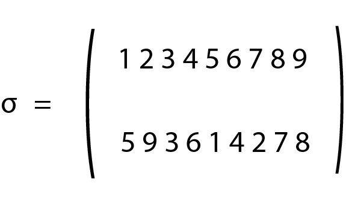
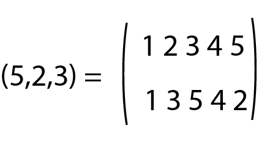

## Exercices Cours3_Types construits : Vers la terminale

### Exercice 1

Soit un ensemble de points :

A : (-2,4) ; B : (1,-2) ; C : (3,7) ; D : (5,-3)

Écrire un programme qui permet de calculer la longueur totale : AB + BC + CD et qui peut s'appliquer à n'importe quelle série de points.


### Exercice 2

Un fabricant décide de créer des tee-shirts dont la taille peut être : XS, S, M, L, XL, XXL.
À chaque taille son prix : il adopte le principe suivant : 8 € pour la taille XS et il ajoute 2 € en passant à la taille supérieure, jusqu'au XXL.

1. Implémenter en Python ces informations dans la structure de données la mieux adaptée.
2. Ce même fabricant décide de changer sa façon de fixer les prix de vente des tee-shirts. Ceux dont la taille est XS sont toujours à 8 €, mais cette fois-ci, pour passer d'une taille à la suivante, il ajoute au prix de la taille inférieure la moitié de sa racine carrée.
Par exemple, pour obtenir le prix des tailles S, il fait : 8 + 0.5*8**0.5 = 9.41.
Proposer un programme Python qui automatise ces calculs et les enregistre dans une structure de données adaptée.

Remarque : pour arrondir à deux décimales

```Python
>>> round(9.414213562373096,2)
9.41
```

```Python
>>> %Run Cours3_vers_la_terminale.py
{'XS': '8 €', 'S': '10 €', 'M': '12 €', 'L': '14 €', 'XL': '16 €', 'XXL': '18 €'}
{'XS': '8 €', 'S': '9.41 €', 'M': '10.94 €', 'L': '12.59 €', 'XL': '14.36 €', 'XXL': '16.25 €'}
```

### Exercice 3

On considère une expression arithmétique E contenant des nombres et les opérations élémentaires (+,-,* et /).
Écrire une fonction Python `separe(E)` qui renvoie deux listes : la première, notée `nombres`, contenant les nombres de E et la seconde, nommée `opérations`, contenant les opérations de E.

Remarque : pour transformer un string en integer

```Python
>>> int("5")
5
```

```Python
>>> separe("3+5*7-2")
([3, 5, 7, 2], ['+', '*', '-'])
```

### Exercice 4

On considère une expression arithmétique E qui peut contenir des parenthèses.

Écrire une fonction `est_correcte(E)` retournant `True` ou `False` permettant de vérifier que l'expression E ne comporte pas d'erreur de parenthésage (autant de parenthèses ouvrantes que de parenthèses fermantes).

```Python
>>> est_correcte("(2*(5+3)-3)")
True
>>> est_correcte("(2*(5+3)-3")
False
```
### Exercice 5

Une expression algébrique ou arithmétique est correctement parenthésée si d'une part le nombre de parenthèses et crochets ouvrants et fermants est le même, et si d'autre part les correspondances ne se croisent pas.

Par exemple l'expression "[3+(5-7]*3)" n'est pas correctement parenthésée car la parenthèse fermante ne peut pas venir après le crochet fermant.

1. Écrire un algorithme qui s'aide d'une pile <sup>*</sup> pour contrôler le bon parenthésage d'une expression.
2. Écrire une fonction `est_correctement_parenthesee(E)` retournant `True` ou `False` permettant de vérifier que l'expression E ne comporte pas d'erreur de parenthésage.


<sup>*</sup> Une pile est une structure comparable à une pile d'assiettes où la dernière ajoutée est la première à partir ; cette structure est réalisable avec une liste. 

On se posera les questions suivantes : 

- comment voir le dernier élément ajouté à la pile ? 
- comment retirer le dernier élément ajouté à la pile ?

Indications : on empile les caractères "(","[",")","]" ; si on empile le caractère ")", on désempile le caractère "(", si on empile le caractère "]", on désempile le caractère "[”, au final la pile doit être vide.

```Python
>>> est_correctement_parenthesee("[3+(5-7)*3]")
True
>>> est_correctement_parenthesee("[3+(5-7]*3)")
False
```

### Exercice 6

Écrire une fonction `list_to_dico(liste)` qui admet en argument une liste de la forme [clé1,valeur1,clé2,valeur2,...] et qui retourne le dictionnaire correspondant de la forme {cle1:valeur1,clé2:valeur2,...}

```Python
>>> list_to_dico(["clé1",2,"clé2",6,"clé3",8])
{'clé1': 2, 'clé2': 6, 'clé3': 8}
```

Indication : pour parcourir une liste en réalisant des sauts de 2

```Python
for i in range(0,8,2):
    print(i)
>>> %Run Cours3_vers_la_terminale.py
0
2
4
6
```

### Exercice 7

On considère une ensemble E de 9 éléments : E={e<sub>1</sub>,e<sub>2</sub>,e<sub>3</sub>,...,e<sub>8</sub>,e<sub>9</sub>}.
On définit une application σ qui transforme E en l'ensemble : 
E<sub>1</sub>={e<sub>5</sub>,e<sub>9</sub>,e<sub>3</sub>,e<sub>6</sub>,e<sub>1</sub>,e<sub>4</sub>e<sub>2</sub>,e<sub>7</sub>,e<sub>8</sub>}.
σ est une permutation et on peut noter E<sub>1</sub>=σ(E).
Une notation matricielle de σ est alors : 

car e<sub>1</sub> est transformé en e<sub>5</sub>, e<sub>2</sub> en e<sub>9</sub>, etc.
Pour tout entier naturel n, on note E<sub>n</sub> l'ensemble E<sub>n</sub>=σ<sup>n</sup>=σ(σ(...σ(E)...)) où σ a été appliquée n fois.

1. Écrire une fonction `sigma(E,n)` retournant la liste des éléments de E<sub>n</sub>.
```Python
>>> sigma([1,2,3,4,5,6,7,8,9],0)
[1, 2, 3, 4, 5, 6, 7, 8, 9]
>>> sigma([1,2,3,4,5,6,7,8,9],1)
[5, 9, 3, 6, 1, 4, 2, 7, 8]
>>> sigma([1,2,3,4,5,6,7,8,9],4)
[1, 2, 3, 4, 5, 6, 7, 8, 9]#on retrouve la même liste au bout de 4 permutations
```
2. Un théorème mathématique nous permet de dire qu'il existe un entier n tel que E<sub>n</sub>=E<sub>0</sub>.
Écrire une fonction `determination_n(E)` qui permet de trouver le plus petit entier n tel que E<sub>n</sub>=E<sub>0</sub>.
```Python
>>> determination_n([1,2,3,4,5,6,7,8,9])
4
```
3. Un cycle est un objet mathématique qui s'écrit par exemple (5,2,3) et qui signifie que l'élément 5 d'un ensemble devient l'élément 2 de cet ensemble, puis que l'élément 2 devient l'élément 3, et enfin que l'élément 3 devient l'élément 5, tout en conservant les autres éléments.

Ainsi sur un ensemble à 5 éléments :



Si σ et τ sont deux cycles, on note σ∘τ le cycle correspondant au fait que l'on ait appliqué le cycle τ puis le cycle σ à un ensemble.

a) Vérifier que sur un ensemble à 8 éléments :
(4,8)∘(8,5)∘(5,1)=(1,4,8,5)

Indications :

Écrire une fonction `transformation(matrice,cycle)` telle que :
```Python
>>> matrice_0=[1,2,3,4,5]
>>> cycle=(5,2,3)
>>> matrice_1=transformation(matrice_0,cycle)
>>> matrice_1
[1, 3, 5, 4, 2]
```
Puis vérifier :

```Python
>>> matrice_0=[1,2,3,4,5,6,7,8]
>>> cycle1=(4,8)
>>> cycle2=(8,5)
>>> cycle3=(5,1)
>>> matrice_1=transformation(matrice_0,cycle3)
>>> matrice_2=transformation(matrice_1,cycle2)
>>> matrice_3=transformation(matrice_2,cycle1)
>>> cycle4=(1,4,8,5)
>>> matrice_4=transformation(matrice_0,cycle4)
>>> matrice_4==matrice_3
True
```
b) Écrire une fonction image(sigma,tau,n) qui admet deux cycles en argument et un entier correspondant au nombre d'éléments de l'ensemble et qui renvoie sous forme de liste la permutation correspondant à σ∘τ.

```Python
>>> image((1,3,4,5,8,6),(2,7),8)
[3, 7, 4, 5, 8, 1, 2, 6]
```


