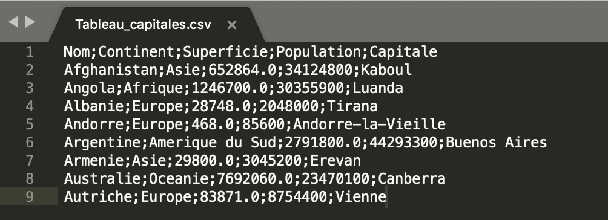
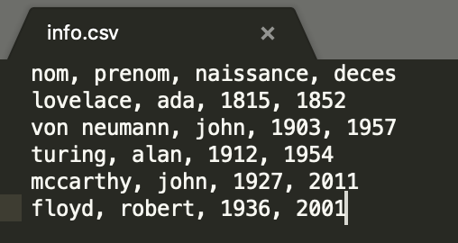

# Thème C : traitement de données en tables


### 1) Création d'une table de données

- La table de données peut se présenter sous la forme d'un tableau à deux dimensions ou liste de liste.

>Exemple 1: on souhaite construire une table de 4 lignes de 3 éléments que l'on va remplir de 0.

On crée une table par compréhension.

```python
>>> table=[[0 for j in range(3)] for i in range(4)]
>>> table
[[0, 0, 0], [0, 0, 0], [0, 0, 0], [0, 0, 0]]
```
ou plus simplement :

```python
>>> table=[[0] * 3 for i in range(4)]
>>> table
[[0, 0, 0], [0, 0, 0], [0, 0, 0], [0, 0, 0]]
```

**Remarque importante** :

```python
table1=[[0] * 3 for i in range(4)]
table2=table1
table2[0][0]=1
print(table2)
print(table1)
################### pour éviter ce problème ###################
import copy
table3=[[0] * 3 for i in range(4)]
table4=copy.deepcopy(table3)
table3[0][0]=1
print(table3)
print(table4)
```

>Exemple 2 : on considère le tableau suivant : tableau = [[1,3,4],[2,7,8],[9,10,6],[12,11,5]]. 
On souhaite accéder à la valeur 12, première valeur de la sous-quatrième liste qui constitue la liste `tableau`.

```python
>>> tableau = [[1,3,4],[2,7,8],[9,10,6],[12,11,5]]
>>> tableau[3][0]
12
```

>Exemple 3 : Soit la liste a = [5, 4, 3, 4, 7]. Que devient-elle après l'instruction a.append(4) ?

```python
>>> a = [5, 4, 3, 4, 7]
>>> a.append(4)
>>> a
[5, 4, 3, 4, 7, 4]
```

- La table de données peut également se présenter sous la forme d'un dictionnaire.

> Exemple 4 : On définit le dictionnaire de contacts suivants : 
contacts = {'Toto': 'toto@nsi.fr', 'Chloé': 'chloe@nsi.com', 'Paul': 'paul@nsi.net', 'Clémence': 'clemence@nsi.org' }. 

On rappelle que 'Chloé' constitue une **clé** du dictionnaire et que 'chloe@nsi.com' représente la **valeur** associée à cette clé.

```python
>>> contacts = {'Toto': 'toto@nsi.fr', 'Chloé': 'chloe@nsi.com','Paul': 'paul@nsi.net', 'Clémence': 'clemence@nsi.org' }
>>> contacts['Chloé']#permet d'obtenir la valeur associée à la clé
'chloe@nsi.com'
```


### 2) Extraction des données à partir d'un fichier csv

On a créé un fichier Excel [à télécharger](assets/Tableau_capitales.xlsx)		

	

On l'a enregistré également avec l'**extension** .csv pour avoir un fichier au format texte [à télécharger](assets/Tableau_capitales.csv) ; ici on a un format de fichier où les données sont séparés par un point-virgule mais elles pourraient être séparées par un autre caractère tel qu'une virgule.



L'objectif est d'extraire les données et de les enregistrer dans une liste composée de p-uplets afin de pouvoir les manipuler.
Avec ce premier code ci-dessous, on obtient une liste de listes.

On utilise pour cela deux **méthodes** associées aux chaînes de caractères ou strings :

- str.rstrip() supprime le caractère `espace` en fin de ligne, on peut aussi supprimer tout autre caractère si on le précise ; la fonction rstrip() est une fonction associée à l'objet str au moyen du **.** ; on appelle cela une méthode associée à l'objet str

Par exemple : 

```python
>>> """ceci est un texte présentant quatre espaces en fin de ligne    """.rstrip()
'ceci est un texte présentant quatre espaces en fin de ligne'
>>> """ceci est un texte présentant quatre * en fin de ligne****""".rstrip("*")
'ceci est un texte présentant quatre * en fin de ligne'
```

[Remarque : définition de `strip` : to remove something that covers something

Examples : We spent the weekend stripping wallpaper.
The wind had stripped the leaves from the trees.]

- str.split(';') qui renvoie une liste en utilisant ';' comme séparateur

Par exemple : 

```python
>>> "Autriche;Europe;83871.0;8754400;Vienne".split(";")
['Autriche', 'Europe', '83871.0', '8754400', 'Vienne']
```

[Remarque : définition de `split` : to divide into smaller groups, or to divide people into smaller groups

Examples : Let’s split into groups and work separately.

Many American families are split by large geographical distances.]

En utilisant un `.` pour les séparer, les deux méthodes peuvent s'appliquer à la suite sur chaque ligne qui compose le document.

```python
f=open("Tableau_capitales.csv","r",encoding="utf-8")#la fonction open renvoie une valeur affectée à la variable f ; "r" signifie read lecture ; on peut préciser l'encodage pour éviter les problèmes d'accent
table=[ligne.rstrip().split(';') for ligne in f]#construction d'une liste par compréhension ; l'écriture condensée ligne.rstrip().split(';') permet de faire agir les deux méthodes successivement d'abord rstrip() puis split(';')
f.close()
print(table)
>>>
[['Nom', 'Continent', 'Superficie', 'Population', 'Capitale'], ['Afghanistan', 'Asie', '652864.0', '34124800', 'Kaboul'], ['Angola', 'Afrique', '1246700.0', '30355900', 'Luanda'], ['Albanie', 'Europe', '28748.0', '2048000', 'Tirana'], ['Andorre', 'Europe', '468.0', '85600', 'Andorre-la-Vieille'], ['Argentine', 'Amerique du Sud', '2791800.0', '44293300', 'Buenos Aires'], ['Armenie', 'Asie', '29800.0', '3045200', 'Erevan'], ['Australie', 'Oceanie', '7692060.0', '23470100', 'Canberra'], ['Autriche', 'Europe', '83871.0', '8754400', 'Vienne']]
```

Avec le code ci-dessous, on obtient un liste de tuples ; on utilise pour cela la fonction tuple(liste) capable de transformer une liste en tuple.

Par exemple : 

```python
>>> tuple(['Autriche', 'Europe', '83871.0', '8754400', 'Vienne'])
('Autriche', 'Europe', '83871.0', '8754400', 'Vienne')
```

```python
f=open("Tableau_capitales.csv","r")
table=[tuple(ligne.rstrip().split(';')) for ligne in f]
f.close()
print(table)
>>>
[('Nom', 'Continent', 'Superficie', 'Population', 'Capitale'), ('Afghanistan', 'Asie', '652864.0', '34124800', 'Kaboul'), ('Angola', 'Afrique', '1246700.0', '30355900', 'Luanda'), ('Albanie', 'Europe', '28748.0', '2048000', 'Tirana'), ('Andorre', 'Europe', '468.0', '85600', 'Andorre-la-Vieille'), ('Argentine', 'Amerique du Sud', '2791800.0', '44293300', 'Buenos Aires'), ('Armenie', 'Asie', '29800.0', '3045200', 'Erevan'), ('Australie', 'Oceanie', '7692060.0', '23470100', 'Canberra'), ('Autriche', 'Europe', '83871.0', '8754400', 'Vienne')]
```
Il s'agit maintenant de distinguer la première ligne qui contient **les descripteurs des champs de la table de données** des autres lignes qui contiennent les données correspondantes.
De plus, il s'agit maintenant de convertir les données décimales sur la superficie de type string en float et les données entières sur la population de type string en int. On disposera ainsi de données numériques et non plus de chaînes de caractères.

Par exemple :

```python
>>> float("12.34")
12.34
>>> int("128")
128
```

```python
f=open("Tableau_capitales.csv","r")
champs=f.readline().rstrip().split(";")
#lecture et transformation en liste de la première ligne ; on observe l'utilisation du singulier line
#champs correspond à la liste des descripteurs : ['Nom', 'Continent', 'Superficie', 'Population', 'Capitale']
lignes=f.readlines()#on observe l'utilisation du pluriel lines
table=[]
for ligne in lignes:
    liste=ligne.rstrip().split(';')
    liste[2]=float(liste[2])
    liste[3]=int(liste[3])
    table.append(tuple(liste))
f.close()
print(table)
>>>
[('Afghanistan', 'Asie', 652864.0, 34124800, 'Kaboul'), ('Angola', 'Afrique', 1246700.0, 30355900, 'Luanda'), ('Albanie', 'Europe', 28748.0, 2048000, 'Tirana'), ('Andorre', 'Europe', 468.0, 85600, 'Andorre-la-Vieille'), ('Argentine', 'Amerique du Sud', 2791800.0, 44293300, 'Buenos Aires'), ('Armenie', 'Asie', 29800.0, 3045200, 'Erevan'), ('Australie', 'Oceanie', 7692060.0, 23470100, 'Canberra'), ('Autriche', 'Europe', 83871.0, 8754400, 'Vienne')]
```

> Exemple : Supposons que l'on dispose du fichier « info.csv » reprenté ci-dessous. On se demande ce que l'on obtient suite au traitement précédent.



 ```python 
>>> file = open("info.csv", "r")
>>> firstLine = file.readline()
>>> tableau = [line.split(',') for line in file]
>>> file.close()
>>> print(tableau)
[['lovelace', ' ada', ' 1815', ' 1852  \n'], ['von neumann', ' john', ' 1903', ' 1957\n'], ['turing', ' alan', ' 1912', ' 1954\n'], ['mccarthy', ' john', ' 1927', ' 2011\n'], ['floyd', ' robert', ' 1936', ' 2001']]
 ```
On voit qu'on a pu ainsi retirer la ligne des descripteurs des champs.  
On voit qu'il est nécessaire avec la méthode rstrip() de supprimer les passages à la ligne.

 ```python 
>>> file = open("info.csv", "r")
>>> firstLine = file.readline()
>>> tableau = [line.rstrip().split(',') for line in file]
>>> file.close()
>>> print(tableau)
[['lovelace', ' ada', ' 1815', ' 1852'], ['von neumann', ' john', ' 1903', ' 1957'], ['turing', ' alan', ' 1912', ' 1954'], ['mccarthy', ' john', ' 1927', ' 2011'], ['floyd', ' robert', ' 1936', ' 2001']]
 ```
 
### 3) Recherche dans une table de données

Poursuivons le code précédent pour rechercher dans notre tableau les pays d'Europe contenant plus de 5 millions d'habitants.   
La recherche fait intervenir les paramètres Continent, Population et doit nous retourner un Nom. 

On commence par créer une liste appelée indices contenant les indices de position des champs : Nom, Continent, Population. Dans notre cas simple, les indices sont assez évidents mais on pourrait disposer d'une table comportant un très grand nombre de champs, auquel cas il est utile de repérer les indices des champs qui sont vraiment utiles pour notre recherche.

On utilise pour cela la méthode `index` associée au liste pour obtenir l'indice de position d'un élément de la liste.

La méthode consiste à créer une liste initialement vide appelée `rep` et d'ajouter au fur et à mesure du parcours des lignes du tableau les éléments qui satisfont les conditions de la recherche.

```python
indices=[champs.index('Nom'),champs.index('Continent'),champs.index('Population')]         
#indices=[0, 1, 3]
rep=[]
for ligne in table:
    if ligne[indices[2]]>5000000 and ligne[indices[1]]=="Europe":
        rep.append(ligne[indices[0]])
print(rep)
>>>
['Autriche']
```
> Autre exemple : 
> On se donne la liste de p-uplets suivantes : 
> Table = [('Grace','Hopper','F',1906),('Tim', 'Berners-Lee', 'H', 1955), ('Ada', 'Lovelace', 'F', 1815), ('Alan', 'Turing', 'H', 1912) ] ; pour chaque p-uplet on trouve le prénom, le nom, le sexe, l'année de naissance d'un informaticien ou informaticienne célèbre.
On souhaite écrire une fonction capable de renvoyer sous forme de liste uniquement les noms des informaticiennes célèbres.

```python
>>> def recherche(table):
    res=[]
    for ligne in table:
        if ligne[2]=="F":
            res.append(ligne[1])
    return res

>>> recherche([('Grace','Hopper','F',1906),('Tim', 'Berners-Lee', 'H', 1955), ('Ada', 'Lovelace', 'F', 1815), ('Alan', 'Turing', 'H', 1912) ])
['Hopper', 'Lovelace']
```


### 4) Élimination de doublons dans une table de données

Cherchons à éliminer les **doublons** qui auraient par exemple tous les deux le même nom de pays.   

Premier cas : supposons que la table est déjà triée suivant les noms.  
Dans ce cas, il suffit de comparer les lignes de la table avec la dernière ligne enregistrée dans la nouvelle table. L'indice -1 correspond en effet au dernier élément placé dans la liste.

```python
    rep=[table[0]]
    for ligne in table:
        if ligne[indice] != rep[-1][indice]:
            rep.append(ligne)
    return rep
```

Deuxième cas : supposons que la table n'est pas déjà triée suivant les noms.     
Le principe est le suivant : pour chaque nouvelle ligne ajoutée, il faut vérifier son absence dans la nouvelle table.

```python
def sans_doublons(table,indice):
    rep=[table[0]]
    for i in range(1,len(table)):
        test=True
        ligne=table[i]
        valeur=ligne[indice]
        for j in range(len(rep)):
            if rep[j][indice]==valeur:
                test=False
                break
        if test:
            rep.append(ligne)
    return rep
```

Exemple :

```python

table=[('Afghanistan', 'Asie', 652864.0, 34124800, 'Kaboul'), ('Angola', 'Afrique', 1246700.0, 30355900, 'Luanda'),('Angola', 'Afrique', 1246700.0, 30355900, 'Luanda')]

#on observe dans la liste la présence du doublon 'Angola'

def sans_doublons(table,indice):
    rep=[table[0]]
    for i in range(1,len(table)):
        test=True
        ligne=table[i]
        valeur=ligne[indice]
        for j in range(len(rep)):#pour chaque ligne, on vérifie que la valeur n'est pas déjà présente
            if rep[j][indice]==valeur:
                test=False#la valeur ne sera pas ajoutée car elle est déjà existante
                break# il suffit de rencontrer une seule valeur identique pour arrêter le parcours
        if test:
            rep.append(ligne)#test étant resté à true, la nouvelle valeur peut être ajoutée
    return rep

>>> sans_doublons(table,0)
[('Afghanistan', 'Asie', 652864.0, 34124800, 'Kaboul'), ('Angola', 'Afrique', 1246700.0, 30355900, 'Luanda')]
```

Remarque : On peut s'interroger sur le coût d'un tel algorithme et se demander s'il ne vaudrait pas mieux trier la table dans un premier temps pour lui appliquer ensuite la première version qui est plus simple.


### 5) Tri d'une table de données

On sait déjà trier une liste :

```python
>>> sorted([16,1,8,20])
[1, 8, 16, 20]
```

On peut faire un tri sur des objets complexes en utilisant les indices des objets en tant que **clé** ou **key**. On utilise pour cela une fonction **`lambda` dite fonction anonyme** limitée à une seule expression et dont le résultat est la valeur renvoyée.

Exemple :

```python
>>> sorted(["-1","-5","2","3"])
['-1', '-5', '2', '3']#Le tri ne fonctionne pas car -5<-1
>>> sorted(["-1","-5","2","3"], key=lambda element:int(element))
['-5', '-1', '2', '3']#Le tri a fonctionné car il porte maintenant sur les entiers relatifs grâce à la fonction int() qui convertit une chaîne de caractère en entier
>>> sorted(["-1","-5","2","3"], key=lambda element:int(element),reverse=True)
['3', '2', '-1', '-5']#On peut également décider d'un tri dans l'ordre décroissant en ajoutant le critère reverse=True
```

Par exemple, on cherche à trier des fiches d'identité, données sous la forme de tuples, par âge croissant, qui représente la valeur en position 2 du tuple :

```python
>>> student_tuples = [('john', 'A', 15),('jane', 'B', 12),('dave', 'B', 10)]
>>> sorted(student_tuples, key=lambda fiche: fiche[2])
[('dave', 'B', 10), ('jane', 'B', 12), ('john', 'A', 15)]
```

En l'appliquant à notre table des pays, on se propose de trier la table par ordre de population décroissante ; il s'agit du quatrième champ c'est-à-dire celui d'indice de position 3.

```python
f=open("Tableau_capitales.csv","r")
champs=f.readline().rstrip().split(";")#lecture et transformation en liste de la première ligne
#['Nom', 'Continent', 'Superficie', 'Population', 'Capitale']
lignes=f.readlines()
table=[]
for ligne in lignes:
    liste=ligne.rstrip().split(';')
    liste[2]=float(liste[2])
    liste[3]=int(liste[3])
    table.append(tuple(liste))
f.close()

indices=[champs.index('Nom'),champs.index('Population')]         
tri=sorted(table,key=lambda ligne:ligne[indices[1]], reverse=True)
print(tri)

>>>
[('Argentine', 'Amerique du Sud', 2791800.0, 44293300, 'Buenos Aires'), ('Afghanistan', 'Asie', 652864.0, 34124800, 'Kaboul'), ('Angola', 'Afrique', 1246700.0, 30355900, 'Luanda'), ('Australie', 'Oceanie', 7692060.0, 23470100, 'Canberra'), ('Autriche', 'Europe', 83871.0, 8754400, 'Vienne'), ('Armenie', 'Asie', 29800.0, 3045200, 'Erevan'), ('Albanie', 'Europe', 28748.0, 2048000, 'Tirana'), ('Andorre', 'Europe', 468.0, 85600, 'Andorre-la-Vieille')]

#on obtient bien la liste des pays ordonnés par ordre de population décroissante.
```
### 6) Fusion de tables de données

Deux situations : soit l'ajout d'enregistrements en faisant la **concaténation de tables**, soit l'ajout de champs, on parle alors de **jointure** entre tables.

1. **Concaténation** de tables

On suppose que les tables vérifient les conditions : mêmes champs dans le même ordre avec les mêmes domaines de valeurs.

```python
def ajout(table1,table2,indice):
    rep=table1+table2
    return sans_doublons(rep,indice)
>>> t1=[['France',67,643]]
>>> t2=[['Espagne',127,242]]
>>> ajout(t1,t2,0)
[['France', 67, 643], ['Espagne', 127, 242]]

>>> t1=[['France',67,643]]
>>> t2=[['Espagne',127,242],['France',62,167]]
>>> ajout(t1,t2,0)
[['France', 67, 643], ['Espagne', 127, 242]]

```

2. **Jointure** entre tables

Supposons que nous disposions d'une deuxième table avec le nom de pays en commun et d'autres champs non communs comme le PIB, la langue officielle, etc... Nous allons construire une nouvelle table contenant toutes les informations des deux tables sans que le nom de pays figure deux fois. Si un pays est présent dans une table et pas dans l'autre, on donne la valeur *None* aux différents champs vides. On suppose de plus que les deux tables sont sans doublon.   
Les paramètres `i1` et `i2` désignent les indices du champ 'Nom' dans chacune des deux tables.
Techniquement, comme `table1` figure comme paramètre de la fonction, il est nécessaire de faire une copie profonde de table 1 afin d'ajouter sur ses lignes les valeurs de table2, nous verrons l'intérêt de cela dans un deuxième temps.

```python
from copy import deepcopy#importation de deepcopy de la bibliothèque copy
def fusion(table1,i1,table2,i2):
    rep=deepcopy(table1)#on fait une copie profonde de table1 pour travailler sur cette copie et ne pas altérer cette dernière
    for ligne1 in rep:
        for ligne2 in table2:#on fait une double boucle
            if ligne1[i1]==ligne2[i2]:#identité du champ pour les deux listes
                for i in range(len(ligne2)):#parcours des champs de table2
                    if i !=i2:#car i=i2 correspond au champ commun aux tables
                        ligne1.append(ligne2[i])
    return rep
>>> t1=[['France',67,643],['Espagne',127,242]]
>>> t2=[['français','France'],['espagnol','Espagne']]
>>> fusion(t1,0,t2,1)#le champ commun est le nom du pays placé en positions 0 et 1 dans les tables respectivement 1 et 2.
[['France', 67, 643, 'français'], ['Espagne', 127, 242, 'espagnol']]
>>> t1
[['France', 67, 643], ['Espagne', 127, 242]]
#on a bien réussi à créer une nouvelle version étendue de table1 avec les champs supplémentaires apportés par table2
#on observe que la copie profonde n'a pas modifié la version première de table1, ce qui peut être intéressant.```

On peut également construire une nouvelle liste de champs.

```python
champs=deepcopy(champs1)
for i in range(len(champs2)):
    if i!=i2:#i2 est l'indice du champ 'Nom' dans champs2
        champs.append(champs2[i])
```

