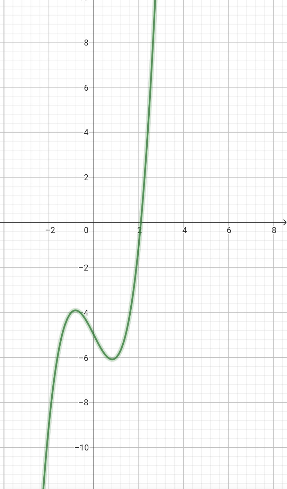

On donne le code pour valider les tests :

```python
if __name__ == '__main__':
    import doctest
    doctest.testmod(verbose=True)
```


## Première application : recherche d’une racine en mathématiques


La recherche par dichotomie permet en mathématiques la recherche d'une solution non évidente de l'équation f(x)=0

Dans le cas présent, la fonction considérée est :

f(x)=x**3−2x−5





On admet pour cela le théorème mathématique selon lequel si f(a)*f(b)<0 alors il existe un réel x entre a et b tel que f(x)=0


Proposer une recherche par dichotomie qui permet de déterminer cette solution avec la précision requise en validant le test de la documentation.


```python
def f(x):
    """
    Renvoie l'image de x par la fonction
    param : x : float
    return : float
    >>> f(2)
    -1
    """
    pass


def recherche_solution_dichotomie(fonction, a, b, precision):
    """
    Renvoie la valeur approchée de l'équation f(x)=0 avec x entre a et b
    avec la précision demandée, et le nombre d'opérations effectuées
    param : f : function
    param : a : float
    param : b : float
    param : precision : float
    return : tuple
    >>> recherche_solution_dichotomie(f, 1, 3, 0.001)
    (2.0947265625, 11)
    """
    pass
```

##Deuxième application : augmenter le temps d’exécution du tri par insertion

```python
def tri_insertion(tab):
    """
    Renvoie une liste triée par insertion
    param : tab
    return : tab
    >>> tri_insertion([3, 5, 10, 11, 20, 7, 12])
    [3, 5, 7, 10, 11, 12, 20]
    """
    for i in range(1, len(tab)):
        key = tab[i]
        # décale vers la droite pour faire de la place à key aussi longtemps que...
        ..............................................
        ..............................................
        # positionne la clé au bon endroit
        ...............................
    return tab

```

## Recherche de l’indice d’insertion par dichotomie

On réalise d’abord la fonction suivante 

```python
def recherche_indice_position_insertion_par_dichotomie(tab, x):
    """
    Renvoie par dichotomie l'indice de position où insérer une valeur
    dans une liste supposée ordonnée
    param : tab : list
    param : x : int
    return : int
    >>> recherche_indice_position_insertion_par_dichotomie([3, 5, 10, 11, 20], 7)
    2
    """
    gauche = 0
    droite = len(tab) - 1
    while gauche <= droite:
        milieu = (gauche + droite) // 2
        if tab[milieu] > x:
            ..........................................
        else:
            ..........................................
    return gauche
```

## Tri par insertion avec dichotomie

Utiliser maintenant cette fonction pour proposer une autre écriture du tri par insertion utilisant l’algorithme de la dichotomie.

```python
def tri_insertion_dicho(tab):
    """
    Renvoie une liste triée par insertion en utilisant la dichotomie
    param : tab : list
    return : list
    >>> tri_insertion_dicho([3, 5, 10, 11, 20, 7, 12])
    [3, 5, 7, 10, 11, 12, 20]
    """
    for i in range(1, len(tab)):
        key = tab[i]
        # Trouver par dichotomie l'indice d'insertion pour la clé
        # dans la liste supposée ordonnée jusque i-1 (tab[:i])
        ..........................................
        # Décaler les éléments vers la droite pour faire de la place à key
        ..........................................
        ..........................................
        # Insérer key à la bonne position
        ..........
    return tab
```

## Comparaison des temps d’exécution

Afin de vérifier le gain de temps dans l’exécution, on utilisera le code ci-dessous :


```python
import random
import time

liste = [i for i in range(1000)]
random.shuffle(liste)

temps_debut = time.time()
tri_insertion(liste)
temps_fin = time.time()
print("Temps écoulé tri_insertion :", temps_fin - temps_debut, "secondes")

temps_debut = time.time()
tri_insertion_dicho(liste)
temps_fin = time.time()
print("Temps écoulé tri_insertion_dicho :", temps_fin - temps_debut, "secondes")
```