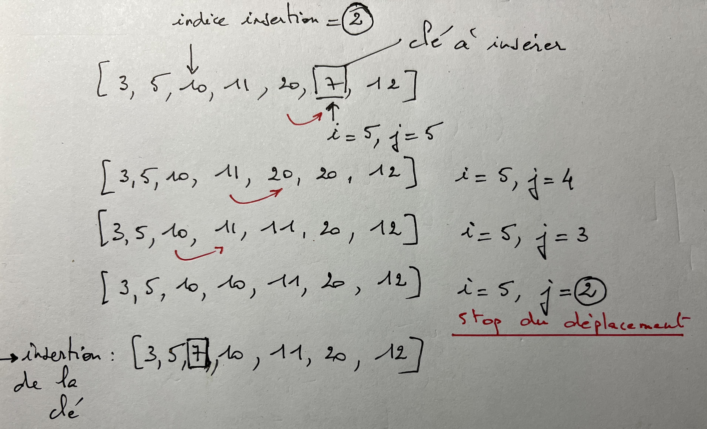

On donne le code pour valider les tests :

```python
if __name__ == '__main__':
    import doctest
    doctest.testmod(verbose=True)
```


## première application : recherche d’une racine en mathématiques


La recherche par dichotomie permet en mathématiques la recherche d'une solution non évidente de l'équation f(x)=0

Dans le cas présent, la fonction considérée est :

f(x)=x**3−2x−5


## On admet pour cela le théorème mathématique selon lequel si f(a)*f(b)<0 alors il existe un réel x entre a et b tel que f(x)=0


Proposer une recherche par dichotomie qui permet de déterminer cette solution avec la précision requise en validant le test de la documentation.


```python
def f(x):
    """
    Renvoie l'image de x par la fonction
    param : x : float
    return : float
    >>> f(2)
    -1
    """
    pass


def recherche_solution_dichotomie(fonction, a, b, precision):
    """
    Renvoie la valeur approchée de l'équation f(x)=0 avec x entre a et b
    avec la précision demandée, et le nombre d'opérations effectuées
    param : f : function
    param : a : float
    param : b : float
    param : precision : float
    return : tuple
    >>> recherche_solution_dichotomie(f, 1, 3, 0.001)
    (2.0947265625, 11)
    """
    pass
```

## deuxième application : augmenter le temps d’exécution du tri par insertion

```python
def tri_insertion(T):
    """
    Renvoie une liste triée par insertion
    param : T : list
    return : list
    >>> tri_insertion([3, 5, 10, 11, 20, 7, 12])
    [3, 5, 7, 10, 11, 12, 20]
    """
	pass

```

## recherche de l’indice d’insertion par dichotomie

On réalise d’abord la fonction suivante :

```python
def indice_position_insertion_par_dichotomie(T, valeur):
    """
    Renvoie par dichotomie l'indice de position où insérer une valeur
    dans une liste supposée ordonnée
    param : T : list
    param : valeur : int
    return : int
    >>> indice_position_insertion_par_dichotomie([3, 5, 10, 11, 20], 7)
    2
    """
	pass
```

## tri par insertion en utilisant la dichotomie

Utiliser maintenant cette fonction pour proposer une autre écriture du tri par insertion utilisant l’algorithme de la dichotomie.

On réduit largement le nombre de comparaisons en déterminant l'indice de position par dichotomie, cela s'avère d'autant plus efficace que la liste est longue.



```python
def tri_insertion_dichotomie(T):
    """
    Renvoie une liste triée par insertion en utilisant la dichotomie
    param : T : list
    return : list
    >>> tri_insertion_dichotomie([3, 5, 10, 11, 20, 7, 12])
    [3, 5, 7, 10, 11, 12, 20]
    """
    for i in range(1, len(T)):
        cle = tab[i]
        # Trouver par dichotomie l'indice d'insertion pour la clé dans la liste supposée ordonnée jusque i-1 (T[:i])
        ..........................................
        # Décaler les éléments pas à pas (voir schéma) avec une variable j qui décide de l'arrêt du décalage.
        ..........................................
        ..........................................
        # insérer la cle à la bonne position
        ..........
    return T
```

## Comparaison des temps d’exécution

Afin de vérifier le gain de temps d’exécution, on utilisera le code ci-dessous avec une liste aléatoire obtenue en mélangeant la liste des 1000 premiers nombres :


```python
import random
import time

liste = [i for i in range(1000)]#liste formée par compréhension des 1000 premiers entiers.
random.shuffle(liste)##mélange de la liste

temps_debut = time.time()#déclanche le chrono
tri_insertion(liste)
temps_fin = time.time()#relève le chrono pour la durée du tri_insertion classique
duree=temps_fin - temps_debut
print("Temps écoulé tri_insertion :",duree , "secondes")

temps_debut = time.time()#relève le chrono pour la durée du tri_insertion par dichotomie
tri_insertion_dichotomie(liste)
temps_fin = time.time()
duree=temps_fin - temps_debut
print("Temps écoulé tri_insertion_dicho :", duree, "secondes")
```