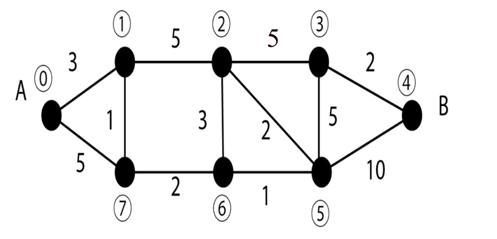

1) Déterminer "au jugé" le ou les plus courts chemin de A (sommet 0) à B (somme 4) dans le graphe suivant. Chaque arête possède une longueur qui pourrait être exprimée en km dans le cas d'un réseau routier. Donner également la longueur de ce plus court chemin.



2) Utiliser l'**algorithme de Dijkstra** explicité sur un exemple dans ce document Word : [Tableau.doc](assets/Tableau.doc) pour retrouver le résultat précédent.
    
On peut résumer ainsi la construction du tableau : pour passer d'une ligne à l'autre, on détermine le sommet à marquer en retenant le sommet pour lequel on a la plus petite distance (False représente une distance infinie), puis pour chacune des colonnes des sommets non marqués, on écrit la distance (si elle existe, sinon False) entre le sommet marqué et le sommet non marqué si, après addition de la retenue, celle-ci est **strictement inférieure** à la valeur inscrite dans la ligne précédente ; on précise également la provenance correspondant au sommet marqué.
Pour obtenir le résultat final, on part du sommet d'arrivée et on remonte en passant par les provenances.

3) L'implémentation en Python de cet algorithme est donnée ci-dessous.

**Remarque** : on utilise ici un set (programme de terminale) et non une liste pour les sommets visités : `visited = set()`

**Avantage** : Avec une liste, Python doit parcourir toute la liste pour vérifier si l’élément est présent. Complexité : O(n)

Avec un ensemble set(), Python utilise une table de hachage. Complexité : O(1) (quasi instantané)
Donc pour les graphes avec beaucoup de sommets, set() est beaucoup plus rapide.

On évite aussi d'avoir des doublons : 

`visited.append("3")
visited.append("3")

['3','3']

Avec un set : 

visited.add("3")
visited.add("3")

{'3'}


Pour marquer un sommet visité : visited.add(u).

un set s’écrit avec des accolades {} comme un dictionnaire, mais sans les paires clé:valeur, seulement des éléments séparés par des virgules.

⚠️ {} n’est pas un set, c’est un dictionnaire vide. Pour créer un set vide il faut écrire :
`visited = set()`

```Python
#  Implémentation  de  l’algorithme  de  Dijkstra

Graphe={    
    "0" : [("1",3),("7",5)],
    "1" : [("0",3),("7",1),("2",5)],
    "2" : [("1",5),("6",3),("5",2),("3",5)],
    "3" : [("2",5),("5",5),("4",2)],
    "4" : [("3",2),("5",10)],
    "5" : [("6",1),("2",2),("3",5),("4",10)],
    "6" : [("7",2),("2",3),("5",1)],
    "7" : [("0",5),("1",1),("6",2)],    
    }


from math import inf

dictionnaire_distance_sommet = {}
visited = set()
pred = {}  # <-- pour reconstruire le chemin

def plus_proche(dictionnaire_distance_sommet, visited):
    """
    renvoie le sommet le plus proche et non encore visité
    >>> dictionnaire_distance_sommet_test = {"0": 0, "1": 3, "2": 5, "3": 2}
    >>> visited_test = {"0"}
    >>> plus_proche(dictionnaire_distance_sommet_test, visited_test)
    '3'
    """
    pass
    

def chemin_plus_court(depart, arrivee, graphe):
    """
    renvoie le chemin le plus court en utilisant l'algorithm de Dijkstra
    >>> chemin_plus_court("0","4",Graphe)
    ['0', '1', '7', '6', '5', '3', '4']
    """
    visited.clear()
    pred.clear()
	dictionnaire_distance_sommet.clear()

    for sommet in graphe:
        dictionnaire_distance_sommet[sommet] = inf
        pred[sommet] = None

    dictionnaire_distance_sommet[depart] = 0

    while len(visited) < len(graphe):
        u = plus_proche(dictionnaire_distance_sommet, visited)
#on choisit parmi tous les sommets celui qui n'a pas déjà été visité  
#et qui est à la plus petite distance du sommet marqué


        if u is None:
            break

        visited.add(u)
#on ajoute ce sommet aux sommets visités

        if u == arrivee:
            break

        for (voisin, poids) in graphe[u]:
# on fait le tour des voisins de u
            if dictionnaire_distance_sommet[u] + poids < dictionnaire_distance_sommet[voisin]:
                dictionnaire_distance_sommet[voisin] = dictionnaire_distance_sommet[u] + poids
# c'est le principe de la retenue
                pred[voisin] = u 
# on mémorise le meilleur prédécesseur

# reconstruction du chemin
    chemin = []
    if dictionnaire_distance_sommet[arrivee] == inf:
        return []  # pas de chemin

    sommet_courant = arrivee
    while sommet_courant is not None:
        chemin.append(sommet_courant)
        sommet_courant = pred[sommet_courant]
    chemin.reverse()

    return chemin

def distance_deux_points(graphe,sommeti,sommetj):
    """
    Renvoie la distance entre deux sommets i et j
    param : Graphe : list
    param : sommeti : str
    param : sommetj : str
    return : int
    >>> distance_deux_points(Graphe,"0","1")
    3
    """
    pass
        
def distance_totale(graphe,depart,arrivee):
    """
    Renvoie la distance correspondant au chemin le plus court du sommet i au sommet j
    param : Graphe : list
    param : depart : str
    param : arrivee : str
    return : int
    >>> distance_totale(Graphe,"0","4")
    14
    """
    pass
    
    
if __name__ == '__main__':
    import doctest
    doctest.testmod(optionflags=doctest.NORMALIZE_WHITESPACE | doctest.ELLIPSIS, verbose=True)


```

Compléter les codes des fonctions `plus_proche(dictionnaire_distance_sommet, visited)`,`distance_deux_points(graphe,sommeti,sommetj)` et `distance_totale(graphe,depart,arrivee)`.
 

