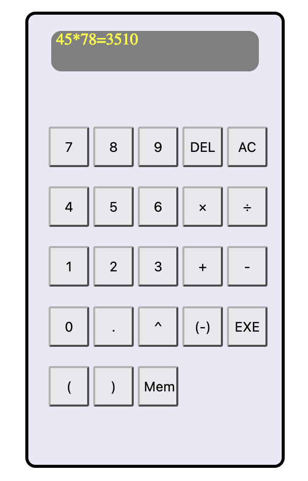

## Exercices Thème D : interactions entre l'homme et la machine sur le Web

## Exercice 1

Écrire un programme dans une page HTML qui demande successivement de saisir un montant en euro puis le taux de change d'une monnaie ; le résultat de la conversion est affiché après avoir cliqué sur un bouton.

 


## Exercice 2

Écrire un programme dans une page HTML qui consiste à trouver un nombre choisi au hasard entre 1 et 100 par exemple. À chaque proposition du joueur, le programme répond " trop petit " ou " trop grand " ou " gagné ". Le nombre de coup est limité à 10.

 
 
 
 

Indication : 

On obtient un nombre au hasard entre 0 compris et 1 non compris en utilisant Math.random().

```js
Math.random()
0.40961663444922125
```
Pour prendre la partie entière d'un nombre, utiliser Math.floor()

```js
Math.floor(0.40961663444922125)
0
```

Pour avoir un nombre compris entre 1 et 100 compris, on peut utiliser : Math.floor(Math.random()*100+1ex) 

## Exercice 3

Réaliser une calculatrice sur une page HTML.

 

Indication : pour transformer une chaîne de caractère en une expression calculable, utiliser eval.

```js
eval("3*8+7")
31
```

## Exercice 4

S'approprier le code expliqué de ce [quiz anglais](http://isnangellier.alwaysdata.net/php/Creation_quizz.html) et réaliser un quiz sur le thème de votre choix.

