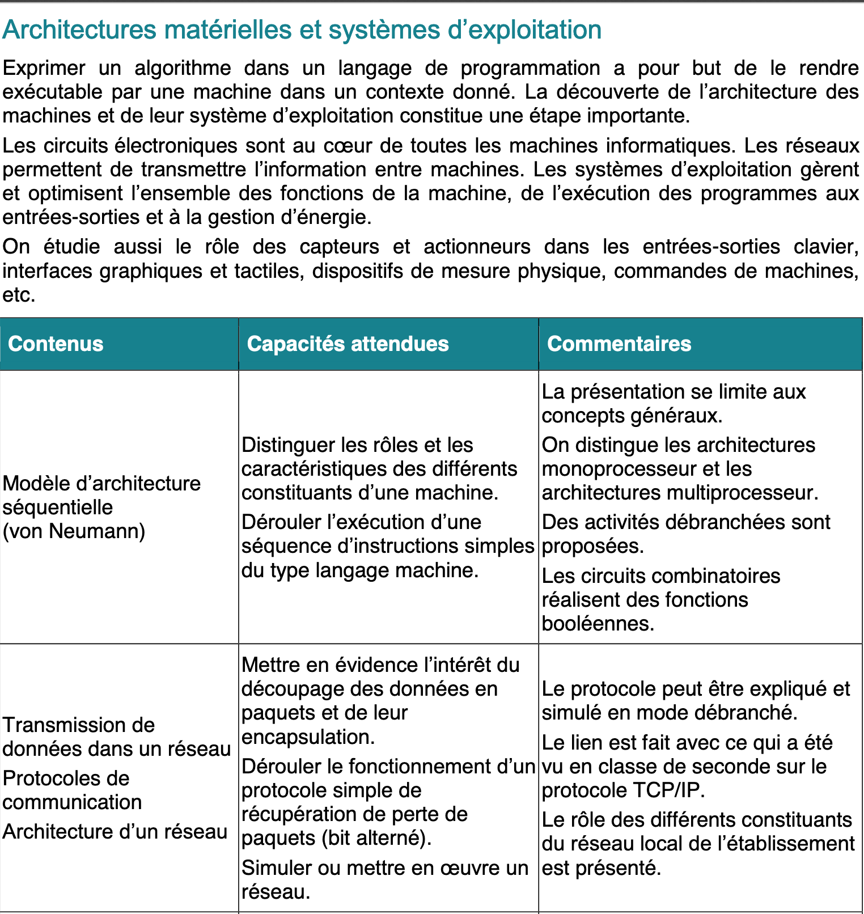

# Quelques éléments d'histoire de l'informatique

À voir : [Le modèle Turing](https://interstices.info/le-modele-turing/)            

À étudier : [Comment fonctionne une machine de Turing ?](https://interstices.info/comment-fonctionne-une-machine-de-turing/)

Les travaux du mathématicien britannique **Alan Turing** à la fin des années 1930 sur le modèle de machine universelle, précédés par ceux du mathématicien **Alonzo Church**, ont été fondateurs de l'informatique.
Alan Turing est connu pour son rôle pendant la Seconde Guerre Mondiale au sein d'un groupe dont faisait partie la cryptologue **Joan Murray Clarke**, travaillant à déchiffrer les messages de la machine Enigma de l’armée allemande. Il travailla en particulier sur les concepts de programmation et d’intelligence artificielle. Ces travaux vont inspirer **John Von Neumann**, mathématicien et physicien américain d’origine hongroise. Avec des collaborateurs comme John Presper Eckert et John William Mauchly, il énonce en 1945 les principes d’architecture d’un ordinateur. Parallèlement, **Djon Atanasov** construit son calculateur ABC avec Clifford Berry.        
Les notions de langage et d’algorithme étaient déjà anciennes. **Claude Shannon** apporta dans la même période, les années 1940, une théorie mathématique de l’information. Il s’agit d’une théorie probabiliste destinée à quantifier un contenu en information dans un message. Shannon, ingénieur et mathématicien, travaillait particulièrement sur une théorie mathématique de la communication entre machines. Il utilisait régulièrement le mot bit pour le codage de deux états, 0 et 1. Une théorie algorithmique de l’information, plus proche des travaux de Church et de Turing, sera proposée dans les années 1960 par le mathématicien russe **Kolmogorov**.
L’informatique est née et tous les ingrédients sont présents pour la construction d’un ordinateur.     
La composition d’un ordinateur a grandement évolué avec le temps. On peut distinguer plusieurs générations d’ordinateur, chaque génération étant caractérisée par des critères de volume, de poids, de coût, de langage, liés aux progrès de la technologie.         
Dans les années 1940, les premiers ordinateurs sont lourds, volumineux et ils dégagent beaucoup de chaleur. Seuls les militaires ont les moyens d’en construire et de les utiliser. Ce sont par exemple l’E.N.I.A.C (Electronic Numeric Integrator Analyser and Computer) aux États-Unis et la série Z1, Z2, Z3 en Allemagne. Le Z3, conçu par l’ingénieur allemand Konrad Suze et achevé en 1941, est programmable et utilise des **tubes électroniques**. Les programmes à base de rubans perforés ou de câbles et commutateurs sont en langage de bas niveau.
Le premier **compilateur** est conçu en 1951 par **Grace Hooper**, informaticienne dans l’armée américaine, qui est aussi à l’origine du langage COBOL en 1959. C’est à cette période que les tubes électroniques sont remplacés par des **transistors**. La puissance de calcul augmente, le coût et la taille diminuent, les grandes universités commencent à s’équiper d’ordinateurs.
L’invention du **circuit intégré** est un nouveau tournant dans les années 1960. On parle de puce en français, de chip en anglais. Ces circuits beaucoup plus petits contiennent des millions de transistors gravés dans du silicium. Des ordinateurs peuvent être embarqués dans les missions Apollo de la NASA. L’AGC (Apollo Guidance Computer), qui pèse une trentaine de kilos, avec clavier, écran et interface utilisateur, gère la navigation et le pilotage de la fusée et du module lunaire. Son **processeur** contient plus de 5000 **portes logiques** NOR.
En 1971, un ensemble de circuits intégrés constituent le processeur, le cœur de l’ordinateur. En 1972, c’est la naissance du **langage C**, langage de haut niveau. La démocratisation va commencer et les premiers ordinateurs pour le grand public apparaissent vers la fin des années 1970. C’est aussi à cette période qu’apparaissent les premiers appareils photographiques numériques (APN). Mais il faut attendre 2007 pour voir arriver les premiers smartphones fonctionnant avec un **système d’exploitation** et des applications. Ils permettent de prendre des photos numériques de qualité à partir des années 2010. Grâce à des **algorithmes** de plus en plus performants, l’image reçue par les capteurs formés de photosites est transformée en une image formée de pixels, avec une résolution de l’ordre des mégapixels, enregistrée sur une carte mémoire.

# Architecture matérielle

À lire : [Le modèle d'architecture séquentielle de von Neumann](https://interstices.info/le-modele-darchitecture-de-von-neumann/)

L’architecture des ordinateurs actuels repose sur le **modèle de Von Neumann** qui travaillait comme consultant dans le projet ENIAC. L’architecture qui a gardé son nom est basée sur l’idée de programme enregistré. La mémoire de l’ordinateur, dans laquelle étaient stockées des données, devait également servir à stocker les programmes.
Une machine doit s’organiser avec :
-	Une **mémoire**
-	Une **unité de calcul**
-	Une **unité de contrôle**
-	Des **systèmes entrées/sorties**
-	Une **horloge** pour synchroniser le fonctionnement
Les différents éléments échangent des éléments à l’aide de **bus**.
Physiquement, un système informatique est constitué de plusieurs éléments :
-	Une machine, c’est-à-dire un boîtier contenant une **carte mère** avec un **microprocesseur**, des barrettes de mémoire, une carte graphique, une carte réseau, des ports de communication en contact direct, et des périphériques éloignés comme un disque dur
-	Des **périphériques externes** comme un moniteur, un clavier, une souris, des enceintes ou des écouteurs, une imprimante, qui se connectent par des ports ou par des systèmes sans fil comme le wifi ou le Bluetooth   

La carte mère est un circuit imprimé, l’élément central d’un ordinateur, PC ou portable, d’une tablette ou d’un smartphone. Le chipset gère le flux des données entre le processeur, la mémoire et les périphériques. Il détermine la vitesse des bus de communication permettant d’échanger des informations.
On parle de mémoires au pluriel car elles sont plusieurs et de différents types.
Les **« mémoires de masse »** sont des mémoires de grandes capacités, comme un disque dur ou une clé USB. Les données y sont conservées de manière persistante. L’accès à ces données en lecture et écriture n’est pas très rapide.
La **RAM** pour Random Access Memory ou « mémoire vive » est une mémoire volatile. Ceci signifie que son contenu est perdu dès que l’alimentation est coupée. Elle est accessible en lecture et en écriture. Elle stocke des données et les programmes exécutés par le processeur. On peut l’imaginer comme un ensemble de cellules où chaque cellule a sa propre adresse et la capacité de stocker un octet.
La **ROM** ou mémoire morte n’est accessible qu’en lecture. Elle contient juste le nécessaire permettant de faire démarrer l’ordinateur. C’est une mémoire non volatile.
On trouve également des **registres** qui sont situés au niveau du processeur (CPU pour Central Processing Unit, c’est là que sont gérés les calculs et les instructions). Ce sont les éléments de mémoire les plus rapides et ils servent au stockage de nombres et de résultats intermédiaires. Proche du processeur se trouve la mémoire cache. De faible capacité mais rapide, elle permet de stocker les données les plus souvent utilisées.
En résumé, pour les éléments de mémoire, plus on s’éloigne du processeur et plus leur capacité grandit et leur temps d’accès s’allonge.
Le temps d’exécution est crucial, et la vitesse de calcul des machines n’a cessé d’augmenter. Pour cela, le principal levier était la **fréquence d’horloge**. Mais il fallait en même temps refroidir le processeur dont la température augmente avec la vitesse de calcul. Depuis une quinzaine d’années, le choix a été fait par les constructeurs d’augmenter le nombre d’unités de calcul et de contrôle, et le nombre de registres. Autrement dit, on augmente le nombre de processeurs, ou de cœurs. On parle actuellement de **processeurs multi-cœurs** (ou multi-core en anglais) qui équipent la plupart des nouveaux ordinateurs et smartphones. Évidemment, cela ne résout pas toutes les questions de rapidité. En effet les différents cœurs doivent se partager les mémoires cache et la RAM. Il faut de plus que les programmes soient écrits pour ce type d’architecture.

# Fonctionnement

Il s'agit de faire le lien entre circuits, calcul logique et calcul binaire.

À lire : [Du transistor aux fonctions logiques ](Du_transistor_aux_fonctions_logiques.pdf)

# Langage machine

Les instructions d'un programme écrit dans un langage de haut niveau sont traduites pour être comprises par la machine. Avec le module `dis`, nous pouvons avoir une idée des instructions passées à la machine lorsque nous écrivons du code en Python.

```python
import dis
dis.dis('x=1;x=x+2')
>>> 
  1           0 LOAD_CONST               0 (1)
              2 STORE_NAME               0 (x)
              4 LOAD_NAME                0 (x)
              6 LOAD_CONST               1 (2)
              8 BINARY_ADD
             10 STORE_NAME               0 (x)
             12 LOAD_CONST               2 (None)
             14 RETURN_VALUE
```
Nous suivons ces instructions dans l'ordre :

- La constante 1 est copiée dans un registre : LOAD_CONST = charge en mémoire
- Le contenu du registre est copié dans la mémoire à la case adressée par x : STORE_NAME = conserve en mémoire
- La valeur de x est copiée dans un registre : LOAD_NAME
- Le nombre 2 est copié dans un registre : LOAD_CONST
- L'addition des deux est exécutée  BINARY_ADD
- Le résultat est copiée dans la mémoire à la case adressée par x
- La valeur None est copiée dans un registre
- Elle est renvoyée

Chaque instruction binaire est composée d'un nombre binaire codant l'opération à réaliser, suivi des opérandes, c'est-à-dire les données sur lesquelles l'opération est effectuée, codées également en binaire. Les instructions LOAD et STORE permettent de copier et d'échanger des données entre le processeur et la mémoire.
Par exemple, pour l'instruction LOAD_CONST, le code qui correspond à ce que la machine doit exécuter est le nombre 100 en décimal. Ce code s'écrit en binaire sur un octet : 01100100. Vérifions le code de cette instruction.

```python
>>> dis.opmap['LOAD_CONST']
100
>>> dis.opname[100]
'LOAD_CONST'
```

En langage assembleur, on aurait : 

```
MOV R0, #1
STR R0, x
LDR R0, x
MOV R1, #2
ADD R0, R0, R1
STR R0, x
```

Dans le code précédent, les instructions sont exécutées dans l'ordre d'écriture, l'une après l'autre. Il est possible de rompre cette séquence, par exemple dans le calcul d'une expression logique ou dans un programme avec un branchement.

Considérons l'expression logique True and False.
```python
>>> True and False
False
>>> dis.dis('True and False')
  1           0 LOAD_CONST               0 (True)
              2 JUMP_IF_FALSE_OR_POP     6
              4 LOAD_CONST               1 (False)
        >>    6 RETURN_VALUE
```
L'opérateur `and` fait un saut à la dernier ligne `JUMP_IF_FALSE_OR_POP  6` si la valeur est False.

Autre exemple :

```python
code="""
x=3
if x<0:
    y=-x
else:
    y=x
"""
dis.dis(code)
>>> 
  2           0 LOAD_CONST               0 (3)
              2 STORE_NAME               0 (x)

  3           4 LOAD_NAME                0 (x)
              6 LOAD_CONST               1 (0)
              8 COMPARE_OP               0 (<)
             10 POP_JUMP_IF_FALSE       20

  4          12 LOAD_NAME                0 (x)
             14 UNARY_NEGATIVE
             16 STORE_NAME               1 (y)
             18 JUMP_FORWARD             4 (to 24)

  6     >>   20 LOAD_NAME                0 (x)
             22 STORE_NAME               1 (y)
        >>   24 LOAD_CONST               2 (None)
             26 RETURN_VALUE
```
L'instruction `POP_JUMP_IF_FALSE 20` signifie que si le test est faux, le programme saute à l'instruction 20 LOAD_NAME pour charger la valeur de x et la stocker dans y. Sinon le programme se poursuit avec 12 LOAD_NAME pour charge la valeur de x, puis avec 14 UNARY_NEGATIVE prendre son opposée et la stocker dans y avec 16 STORE_NAME et finalement sauter à la fin du programme ligne 24 avec JUMP_FORWARD.

Le module `dis` de Python nous propose d'autres fonctionnalités :

```python
def f():
    x=2
    x=x+3
code=f.__code__.co_code
for octet in code:
    print(octet,end="")
>>> 
100112501240100223012501000830
```

Il s'agit en fait des codes des instructions :
100 1 125 0 124 0 100 2 23 0 125 0 100 0 83 0

```python
>>> dis.opname[125]
'STORE_FAST'
>>> dis.opname[124]
'LOAD_FAST'
>>> dis.opname[83]
'RETURN_VALUE'
```

# Système d'exploitation

Un système d'exploitation, OS pour Operating System, est un programme exécuté au démarrage d'une machine. Il permet de gérer les fichiers, les répertoires, les processus, les périphériques, en proposant des outils pour cela. Ces outils sont des gestionnaires de fichiers, d'applications, de périphériques. Les OS les plus répandus sont Windows, MacOs, GNU/Linux avec différentes distributions comme Ubuntu, Debian, Fedora, pour ordinateurs et Android, iOsS pour mobile.   
Un fichier avec sa gestion est un concept abstrait. Pour le mettre en œuvre physiquement, chaque OS utilise un format d’enregistrement avec un système d’adresses, comme NTFS pour Windows qui met à la disposition de l’utilisateur l’outil « Explorateur de fichiers » pour copier, déplacer, supprimer un fichier ou un répertoire.
Le système d’exploitation permet aussi de gérer l’authentification de chaque utilisateur ainsi que les différents droits d’accès sur les fichiers (lecture, écriture et suppression). On distingue en particulier des comptes administrateurs et différents types de comptes utilisateurs.
Les OS sont des systèmes libres ou propriétaires. Les différences sont notables : outre la gratuité, un système libre comme GNU/Linux favorise la possibilité d’installer ou de réinstaller le système avec différentes partitions et plus généralement de gérer la machine comme on l’entend. Il facilite aussi l’installation de plusieurs OS distincts sur une même machine. On parle de « dual boot ». Mais la plupart des appareils vendus sur le marché sont équipés d’un système d’exploitation propriétaire qui nous est vendu avec.

# Organisation du disque dur

À la sortie d'usine, le disque dur est formaté. Il s'agit d'un formatage de bas niveau qui organise le disque en différentes parties appelées pistes, cylindres, secteurs. Ces parties vont permettre de localiser les informations inscrites sur le disque. Ensuite, lorsqu'un système d'exploitation est installé sur le disque, un partitionnement de celui-ci peut être effectué afin par exemple d'installer d'autres systèmes d'exploitations ou plus simplement de séparer les programmes et les données. Un formatage de haut niveau est effectué qui consiste à regrouper les secteurs du disque en blocs appelés clusters. Le résultat est un système de fichiers particulier au système d'exploitation. La liste des clusters est inscrite dans une table, la FAT (File Allocation Table). On ne peut pas avoir deux fichiers enregistrés sur le même cluster.
Le premier secteur d'un disque dur est le secteur de démarrage appelé MBR (Master Boot Record). C'est là qu'est inscrit le code qui fait démarrer le système ainsi que des informations relatives au disque dur comme le fabricant, le numéro de série, les tailles et nombres des différentes parties (secteurs, clusters, pistes, cylindres).

# Fonctions d'un système d'exploitation

Un système d'exploitation propose un environnement graphique convivial afin que l'utilisateur puisse sélectionner les actions qu'il souhaite faire accomplir par la machine. Les fonctions d'un système d'exploitation sont nombreuses. Elles sont accessibles à l'aide d'outils comme le panneau de configuration, le gestionnaire de périphériques, le gestionnaire de tâches, pour Windows. Elles permettent de gérer le fonctionnement de tous les éléments constituant le système informatique.
En général, nous agissons sur un ordinateur à l'aide de menus dans lesquels nous pouvons choisir nos demandes. Auparavant la seule manière était d'écrire des instructions avec un clavier et la machine répondait en affichant du texte à l'écran. Cette possibilité existe encore avec l'invite de commandes sous Windows ou avec un terminal sous Linux.

Activité : [Initiation au Shell et gestion des droits de permission ](initiation_shell.md)

