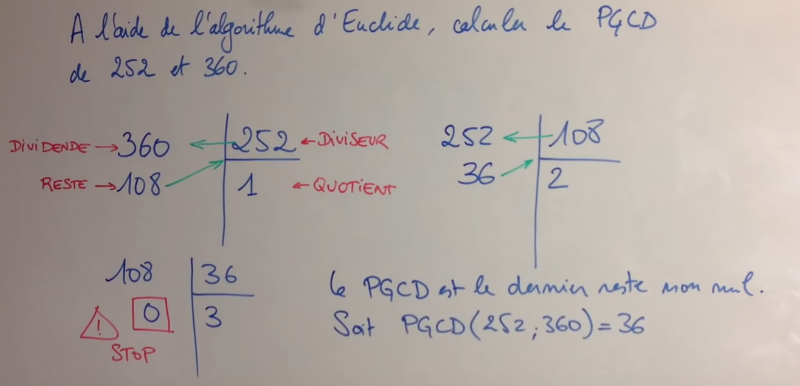

# I. Un exemple classique d'algorithme: l'algorithme d'Euclide pour la recherche du pgcd

Euclide est un mathématicien de la Grèce antique, auteur du livre <i>les éléments de mathématiques</i>, qui constituent l'un des textes fondateurs de cette discipline en Occident. 

En arithmétique élémentaire, le plus grand commun diviseur ou PGCD de deux nombres entiers non nuls est le plus grand entier qui les divise simultanément. Par exemple, le PGCD de 20 et de 30 est 10, puisque leurs diviseurs communs sont 1, 2, 5 et 10.


```python
def pgcd(m,n):
    r=m%n
    while r!=0:
        m,n=n,r
        r=m%n
    return n

>>> pgcd(252,360)
36
```

Étape 1 : on divise m par n et on note r le reste de la division    
Étape 2 : si le reste est nul, c'est terminé, le pgcd est n     
Étape 3 : sinon, on remplace m par n et n par r et on recommence l'étape 1




# II. Les outils utilisés pour la construction des algorithmes

## 1. Compteurs et accumulateurs

Un **compteur** est une valeur généralement initialisée à 0 qui est incrémentée d'une unité à chaque passage dans une boucle, éventuellement suite à un test.

1) Écrire une fonction `taille_binaire(n)` qui renvoie le nombre de chiffres dans l'écriture binaire de l'entier n (c'est-à-dire le nombre de divisions euclidiennes successives de n par 2 jusqu'à arriver à un quotient nul).

```python
>>> taille_binaire(9)
4
```

2) Écrire une fonction `nombre_de_1(n)` qui renvoie le nombre de 1 dans l'écriture binaire du nombre.

```python
>>> nombre_de_1(9)
2
```

3) Écrire une fonction `diviseurs(n)` qui renvoie le nombre de diviseurs de n.

```python
>>> diviseurs(15)
4
```

Un **accumulateur** est semblable à un compteur mais il est en général incrémenté d'une valeur différente de 1 ; il peut aussi être décrémenté.

4) Écrire une fonction `somme(liste)` qui renvoie la somme des termes d'une liste de nombres.

```python
>>> somme([1,4,6])
11
```

5) Écrire une fonction `somme_paire(liste)` qui renvoie la somme des termes paires d'une liste de nombres.

```python
>>> somme_pairs([1,4,6])
10
```

## 2. La permutation des valeurs

La permutation des valeurs nécessite de prendre soin à la manière de procéder.  

Exemple :
```python
var1=17
var2=23
var1=var2
var2=var1
print(var1,var2)
```

La permutation est-elle effectuée ? Pourquoi ? Sinon comment procéder ?

On peut passer par une variable temporaire chargée de stocker la valeur d'une variable. Écrire cette méthode.    
Une autre méthode immédiate, basée sur l'identité des tuples (en l'occurence des couples), consiste à écrire :  

```python
var1=17
var2=23
var1,var2=var2,var1
print(var1,var2)   
```

## 3. Les tests  

On fera attention à bien distinguer if de elif.   
Expliquer la différence de résultat obtenu avec ces deux codes.

Code 1 :
```python
x=5
if x>0:
    x=x-3
elif x<0:
    x=x+5
else:
    x=x+2
print(x)
```

Code 2 :
```python
x=5
if x>0:
    x=x-3
if x<0:
    x=x+5
else:
    x=x+2
print(x)
```

## 4. Les boucles 

Il faut s'accoutumer à rencontrer des boucles imbriquées en particulier quand on manipule des listes de listes.

Prévoir le nombre d'affichage puis le faire afficher :

```python
for i in range(4):
    for j in range(3):
        print(i+j)
```

# III. Les propriétés des algorithmes


## 1. Validité d'un algorithme


Lorsqu'on écrit un algorithme, il est impératif de vérifier que cet algorithme va produire un résultat en un temps fini et que ce résultat sera correct dans le sens où il sera conforme à une spécification précise. Nous dirons alors que l'algorithme est **valide**.

Un algorithme itératif est construit avec des boucles. Pour prouver qu'il est **correct**, nous disposons de la notion d'**invariant** de boucle.  
Un invariant d'une boucle est une propriété qui est vérifiée avant l'entrée dans une boucle, à chaque passage dans cette boucle et à la sortie de cette boucle. On peut faire le lien avec les suites définies par récurrence du programme de mathématiques.
Pour vérifier qu'une propriété est un invariant d'une boucle, on commence donc par vérifier que la propriété est vraie avant la boucle : cette étape s'appelle l'**initialisation**, on prouve ensuite que si la propriété est vraie avant un passage dans la boucle, elle reste vraie après ce passage. Cette étape s'appelle l'**hérédité**. On peut alors conclure que la propriété reste vraie à la sortie de la boucle. 

Exemple :
```python
def multiplie(a,b):
    m=0
    p=0
    while m<a:
        m=m+1
        p=p+b
    return p

>>> multiplie(4,3)
12
```
Cet algorithme simple a pour but de renvoyer le produit a×b.  

On se propose de montrer que la propriété "p=m×b" est un invariant de boucle.

La propriété est vraie à la phase d'initialisation.  
Supposons la propriété vraie à l'entrée de la boucle, vérifions qu'elle reste vraie à la sortie de la boucle, lorsque m et p prennent les nouvelles valeurs m' et p'.  
On a bien : p'=p+b=m×b+b=(m+1)×b=m'×b.
Enfin, puisqu'à la sortie de la boucle, on a m=a, on peut bien affirmer que la fonction renvoie le produit a×b.

Un algorithme ne doit comporter qu'un nombre fini d'étapes. Afin de prouver la **terminaison** d'un algorithme itératif, nous utilisons la notion de **variant**. On parle ici de boucles conditionnelles (utilisant while) car dans les boucles inconditionnelles (utilisant for) le nombre d'étapes est déterminé.
On choisit un variant, c'est-à-dire une expression, la plus simple étant une variable, <u>telle que la suite formée par les valeurs de cette expression au cours des itérations converge en un nombre fini d'étapes vers une valeur satisfaisant la condition d'arrêt</u>. Dans notre exemple, si nous choisissons m comme variant, celui-ci prend les valeurs 0,1,...a et donc il y a exactement a passages dans la boucle, ce qui prouve sa terminaison.

## 2. Coût d'un algorithme

Supposons q'un programme ait à traiter une liste de 10<sup>7</sup> éléments puis une liste de 10<sup>8</sup> éléments ; le **temps d'exécution du programme** sera-t-il multiplié par 10 ? Les réponses sont variées et dépendent de l'algorithme et de la liste. Pour une liste donnée, un programme peut être plus rapide qu'un autre, mais avec une autre liste, ce peut être le contraire. Le même programme peut être plus rapide avec une liste plus longue. L'étude n'est pas simple et pour comparer deux algorithmes nous allons nous concentrer sur le nombre d'opérations à effectuer en essayant d'évaluer un ordre de grandeur de ce nombre en fonction de la taille des données. Nous nous placerons dans le pire des cas, celui où le coût est le plus important.

Dans l'exemple précédent, les passages dans la boucle ont lieu pour les valeurs m=0,1,..a-1 soit a passages dans la boucle. À chaque passage nous effectuons deux additions et deux affectations, soit 4 opérations, donc nous effectuons au total 4a opérations. Nous dirons que le coût est proportionnel à a ou qu'il est **linéaire**, on dit aussi que l'algorithme a une **complexité linéaire** car si n désigne la taille d'une donnée, le nombre d'opérations s'écrit α×n+β. Le cas d'une **complexité quadratique** correspond au cas où le nombre d'opérations s'écrit α×n<sup>2</sup>+β×n+γ.

Dans le cas de deux boucles imbriquées, on peut avoir selon les cas une complexité linéaire ou quadratique.

<u>Premier cas</u> :

```python
for i in range(n):
    ... (on suppose q opérations)
    for j in range(k):
        ... (on suppose r opérations) 
```

Nous avons n passages dans la boucle externe et à chaque passage, nous avons le nombre fixe de q opérations puis k passages dans la boucle interne où nous avons le nombre fixe de r opérations. Soit au total : n×(q+k×r) soit α×n et le coût est linéaire.

<u>Deuxième cas</u> :

```python
for i in range(n):
    ... (on suppose q opérations)
    for j in range(n):
        ... (on suppose r opérations) 
```
Nous avons n passages dans la boucle externe et à chaque passage, nous avons le nombre fixe de q opérations puis n passages dans la boucle interne où nous avons le nombre fixe de r opérations. Soit au total : n×(q+n×r)=r×n<sup>2</sup>+q×n soit α×n<sup>2</sup>+β×n+γ et le coût est quadratique.


<u>Troisième cas</u> :

```python
for i in range(n):
    ... (on suppose q opérations)
    for j in range(i):
        ... (on suppose r opérations) 
```

Nous avons n passages dans la boucle externe et à chaque passage, nous avons le nombre fixe de q opérations puis i passages dans la boucle interne où nous avons le nombre fixe de r opérations. Ainsi pour chaque valeur de i allant de 0 à (n-1), nous avons q+r×i opérations, soit q+(q+r)+(q+r×2)+.......(q+r×(n-1)), soit q×n+r×(1+2+...(n-1))=q×n+r×n×(n-1)/2=(r/2)×n<sup>2</sup>+(q-r/2)×n, ce qui est de la forme α×n<sup>2</sup>+β×n donc le coût est quadratique.


# IV. Les algorithmes à connaître

## 1. Les parcours séquentiels

Un parcours séquentiel signifie que la liste ou le tuple sont parcourus élément après élément suivant l'ordre des éléments.

### a. Calcul d'une moyenne

Proposer l'écriture de la fonction `moyenne(liste)` qui renvoie la moyenne d'une liste de nombre.
Déterminer, en justifiant, le coût de l'algorithme en fonction de la taille n de la liste.

### b. Recherche d'une occurence

On recherche de manière séquentielle la présence d'une valeur dans un tableau ; ce tableau peut être une liste, un p-uplet ou une chaîne de caractères.

Proposer l'écriture de la fonction `recherche(x,t)` qui recherche l'élément x dans le tableau t de longueur n et renvoie la position de cet élément dans la liste.  
On utilisera une boucle conditionnelle puis une boucle inconditionnelle.

```python
>>> recherche("o","algorithme")
3
```

Déterminer, en justifiant, le coût de l'algorithme en fonction de la taille n de la liste.

### c. Recherche d'un extremum

On recherche l'extremum, minimum ou maximum, d'une liste de nombres.    
Recherche du maximum : l'idée est la suivante : on suppose que le premier élément est le maximum, puis on parcourt la liste et chaque fois que l'on rencontre un élément plus grand que le maximum provisoire, on dit que c'est le nouveau maximum provisoire.

Proposer l'écriture des fonctions `maximum(liste)` puis `minimum(liste)`.

```python
>>> maximum([12,2,38,14])
38
>>> minimum([12,2,38,14])
2
```

## 2. Recherche dichotomique

La recherche dichotomique s'effectue sur une tableau préalablement trié.  
Avec Python, nous disposons de la fonction `sorted(liste)` qui prend en argument la liste et renvoie la liste triée sans modification de la liste initiale. Nous disposons également de la méthode list() qui trie la liste à laquelle elle s'applique.

```python
liste=[4,1,3,2]
liste2=sorted(liste)
print(liste2)
print(liste)
liste.sort()
print(liste)
```

Le principe de la dichotomie (binary search en anglais) repose sur le principe <i>diviser pour mieux régner</i> (en anglais divide-and-conquer) : à chaque étape, on coupe le tableau en deux et on effectue un test pour savoir dans quelle partie se trouve l'élément cherché.


```python
def dichotomie(x,liste):
    g=0
    d=len(liste)
    while d-g>1:
        k=(g+d)//2
        if x<liste[k]:
            d=k
        else:
            g=k
    if x==liste[g]:
        return g
    else:
        return False

>>> dichotomie(16,[5,16,35,78])
1
```

Faisons la preuve de la **terminaison** de l'algorithme avec le **variant** de la boucle d-g. Si la taille du tableau est inférieur à 2<sup>n</sup>, après k itérations, d-g≤2<sup>n</sup>/2<sup>k</sup>=2<sup>n-k</sup>, après n étapes : d-g≤1, donc la boucle s'arrête car le variant converge en un nombre fini d'étapes vers la valeur qui statisfait la condition d'arrêt.   
Par exemple, il faut sept étapes pour une taille de tableau égale à 100 (2<sup>7</sup>=128) et 10 étapes pour une taille de tableau égale à 1000 (2<sup>10</sup>=1024). Cela prouve que le nombre d'étape est de l'ordre du nombre de chiffres dans l'écriture binaire de la taille du tableau, donc nettement inférieur au nombre d'étapes d'une recherche linéaire.

Faisons maintenant la preuve de la **correction** de l'algorithme en montrant que la propriété suivante : `liste[g]≤x<liste[d]` est un **invariant** de la boucle.
Il faut que cela soit vrai avant l'entrée dans la boucle, d'où la possibilité d'ajouter une assertion dans le programme avant de commencer la recherche et ainsi ne pas effectuer la boucle pour rien. Une telle instruction se compose d'une condition (une expression booléenne) éventuellement suivie d'une virgule et d'une phrase en langue naturelle, sous forme d'une chaine de caractères. L'instruction assert teste si sa condition est satisfaite. Si c'est le cas, elle ne fait rien et sinon elle arrête immédiatement l'exécution du programme en affichant éventuellement la phrase qui lui est associée.


```python
def dichotomie(x,liste):
    g=0
    d=len(liste)
    assert liste[g]<= x and x < liste[d],"la valeur dépasse les bornes de la liste"
    while d-g>1:
        k=(g+d)//2
        if x<liste[k]:
            d=k
        else:
            g=k
    if x==liste[g]:
        return g
    else:
        return False

>>> dichotomie(190,[5,16,35,78])
Traceback (most recent call last):
  File "<pyshell>", line 1, in <module>
  File "/Users/vincentlesieux/Library/Mobile Documents/com~apple~CloudDocs/DIU-EIL/algorithmes.py", line 128, in dichotomie
    assert liste[g]<= x and x <= liste[d-1],"la valeur dépasse les bornes de la liste"
AssertionError: la valeur dépasse les bornes de la liste
```

Si l'assertion est vérifiée, alors la propriété est vraie avant l'entrée dans la boucle.    
Supposons la propriété vraie avant le passage dans la boucle : `liste[g]≤x<liste[d]`.   
D'après le choix de k, k=(g+d)//2 ,liste[g]≤liste[k]≤liste[d] puisque la liste est triée.  
Si `x<liste[k]`, on obtient `liste[g]≤x<liste[k]`, dans ce cas la nouvelle valeur de d est k, et donc la propriété `liste[g]≤x<liste[d]` est vraie en sortant de la boucle.   
Sinon si `x≥liste[k]`, on obtient `liste[k]≤x<liste[d]`, dans ce cas la nouvelle valeur de g est k, et donc la propriété `liste[g]≤x<liste[d]` est encore vraie en sortant de la boucle.


