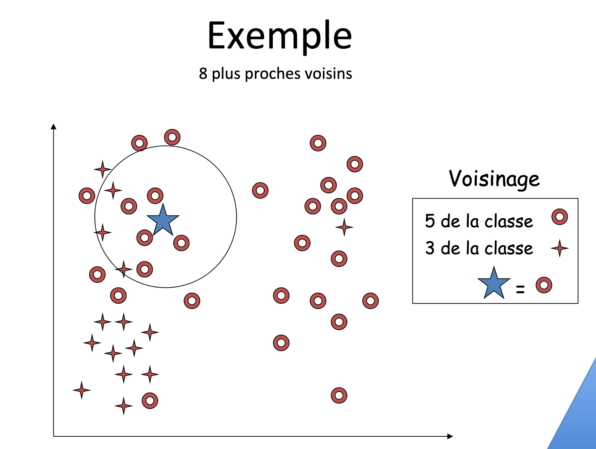

# I. Les algorithmes de tri

## 1. Tri par sélection

<u>Principe</u> : On dispose de n données. On cherche la plus petite donnée et on la place en première position, puis on cherche la plus petite donnée parmi les données restantes et on la place en deuxième position et ainsi de suite.  
Si les données sont les éléments d'une liste `liste`, l'algorithme consiste donc à faire varier un indice i de 0 à n-2.   
Pour chaque valeur de i, on cherche dans la tranche `liste[i:n]` le plus petit élément et on l'échange avec `liste[i]`.  
On connaît déjà l'algorithme de recherche du minimum.  

```python
def minimum(liste):
    minimum=liste[0]
    for i in liste:
        if i<minimum:
            minimum=i
    return minimum
```

Pour obtenir l'algorithme du tri selection, il ne reste qu'à insérer cette partie dans une boucle où i varie de 0 à n-2 et pour chaque valeur de i faire l'échange de liste[i] avec minimum.

<u>Exemple</u> : 

Soit la liste [7,4,3,2,9,5] de longueur 6.   

Pour i égal 0, [2,4,3,7,9,5] ; permutation de 2 avec 7    
Pour i égal 1, [2,3,4,7,9,5] ; permutation de 4 avec 3   
Pour i égal 2, [2,3,4,7,9,5] ; pas de permutation   
Pour i égal 3, [2,3,4,5,9,7] ; permutation de 5 avec 7   
Pour i égal 4=6-2, [2,3,4,5,7,9] ; permutation de 9 avec 7   

Montrer que l'écriture de la fonction `tri_selection(liste)` répond à cet objectif.

```python
def tri_selection(liste):
    n=len(liste)
    for i in range(n-1):
        minimum=liste[i]
        for j in range(i+1,n):
            if liste[j]<minimum:
                minimum=liste[j]
                i_minimum=j#on repère l'indice j pour la permutation
        liste[i],liste[i_minimum]=minimum,liste[i]
    return liste
```

<u>Terminaison</u> : dans la mesure où les boucles utilisées sont deux boucles inconditionnelles imbriquées, il n'y a pas de problème de terminaison.

<u>Correction</u>  : L'invariant est le suivant : "pour chaque i, la liste est une permutation de la liste initiale, la liste `liste[0:i+1]` est triée et tous les éléments de la liste `liste[i+1:n]` sont supérieurs à tous les éléments de la liste `liste[0:i+1]`."

Après le premier passage dans la boucle, pour i égal à 0, la liste `liste[0:1]` ne contient qu'un élément qui est le minimum de la liste, inférieur à tous les éléments de la liste. La propriété est donc vraie pour i=0.

Supposons la propriété vraie pour i=k,  on a donc la liste `liste[0:k+1]` triée et tous les éléments de la liste `liste[k+1:n]` sont supérieurs à tous les éléments de la liste `liste[0:k+1]`. Au passage suivant, le minimum de la liste `liste[k+1:n]` est placé en position k+1, cette valeur est supérieure à toutes les valeurs de la liste `liste[0:k+1]` et inférieure à toutes les valeurs de la liste `liste[k+2:n]` ; la propriété est donc bien vraie à l'ordre k+1.

La propriété est vraie au dernier passage pour i égal à n-2. À ce moment-là, la liste `liste[0:n-1]` est triée et l'élément n-1, dernier de la liste, est supérieur à tous les éléments de la liste `liste[0:n-1]` donc la liste `liste[0:n]` est triée.

<u>Coût</u> : Nous sommes dans le cas de deux boucles imbriquées. 
```python
    for i in range(n-1):
            .....................
        for j in range(i+1,n):
                ....................
```
Pour chaque valeur de i, j prend des valeurs de i+1 à n-1 soit n-i-1 valeurs. Et pour chaque valeur de j, une unique comparaison est effectuée. Donc pour chaque valeur de i, nous avons n-i-1 comparaisons. Au total, nous avons donc : (n-1)+(n-2)+....+2+1=n×(n+1)/2 comparaisons, donc un <u>coût quadratique</u> de l'ordre de n<sup>2</sup> comparaisons quelque soit la liste de longueur n, même si celle-ci est triée ! Le tri par sélection a l'avantage d'être facile à programmer mais il n'est pas recommandé si la liste contient plus de 10000 éléments.

## 2. Tri par insertion

<u>Principe</u> : On dispose de n données et on procède par étapes. À chaque étape, on suppose que les k premières données sont triées, et on insère une donnée supplémentaires à la bonne place parmi ces k données déjà triées.   
Si les données sont les éléments d'une liste, l'algorithme consiste donc à faire varier un indice i de 0 à n-2. Pour chaque valeur de i, on cherche dans la liste `liste[0:i+1]` à quelle place doit être inséré l'élément liste[i+1] qu'on appelle clé. Pour cela, on compare la clé successivement aux données précédentes, en commençant par la donnée d'indice i puis en remontant dans la liste jusqu'à trouver la bonne place, c'est-à-dire entre deux données successives, l'une étant plus petite et l'autre étant plus grande que la clé. Si la clé est plus petite que toutes les données précédentes, elle se place en premier. Pour ce faire, on décale d'une place vers la droite les données plus grandes que la clé après chaque comparaison.


```python
def tri_insertion(liste):
    for i in range(len(liste)-1):
        k=i+1#l'indice de la clé
        cle=liste[k]
        while k>0 and cle<liste[k-1]:
            liste[k]=liste[k-1]#décalage d'une place vers la droite
            k=k-1#on remonte dans la liste 
        liste[k]=cle
```

<u>Terminaison</u> : La boucle externe est une boucle for dont le nombre de passages est fini. La boucle interne est une boucle while conditionnée par les valeurs de k qui constituent une suite décroissante de i+1 à 1, soit au plus i+1 passages.

<u>Correction</u>  : Nous utilisons l'invariant de boucle : "pour chaque i, la liste est une permutation de la liste initiale et la liste `liste[0:i+2]` est triée."  
Après le premier passage dans la boucle, pour i égal à 0, l'élément `liste[0]` et la clé d'indice 1 sont rangés dans l'ordre. Donc la liste `liste[0:2]` est triée.  
Si après un passage pour i égal à un k quelconque, la liste `liste[0:k+2]` est triée, alors au passage suivant l'élément `liste[k+2]` est inséré à la bonne place parmi les éléments de la liste `liste[0:k+2]` ou reste à sa place. Donc la liste `liste[0:k+3]` est triée. La propriété est donc vraie pour i égal à k+1. La propriété est encore vraie après le dernier passage, pour i égal à n-2. À ce moment, la liste `liste[0:n]`, c'est-à-dire la liste, est triée.

<u>Coût</u> : Si la liste est déjà triée dans l'ordre croissant, pour chaque valeur de i, k prend la valeur de i+1 et il n'y a qu'une seule comparaison, le test `cle<liste[k-1]`. La variable i prenant n-1 valeurs, cela fait un total de n-1 comparaisons. Le coût de l'algorithme est donc de n.  
Si dans le pire des cas où les éléments de la liste sont rangés dans l'ordre décroissant, alors pour chaque valeur de i, k prend les valeurs de i+1 à 1 soit i+1 valeurs et donc i+1 comparaisons. Au total nous avons 1+2+...(n-2)+(n-1) comparaisons soit n×(n-1)/2, le coût est de l'ordre de n<sup>2</sup> comparaisons. En conclusion, cet algorithme de tri s'avère efficace sur une liste déjà presque triée. 

## 2. Tri en Python

Avec Python, nous disposons de la fonction `sorted(liste)` qui prend en argument la liste et renvoie la liste triée <u>sans modification de la liste initiale</u>. Nous disposons également de la méthode sort() des objets liste qui trie la liste à laquelle elle s'applique.

```python
liste=[4,1,3,2]
liste2=sorted(liste)
print(liste2)
print(liste)
liste.sort()
print(liste)
```

L'algorithme de tri utilisé par la méthode `sort` et la fonction `sorted` s'appelle `timsort`, du nom de son inventeur Tim Peters en 2002. C'est un tri performant, dérivé d'un tri fusion, qui utilise l'algorithme du tri par insertion sur des parties presque triées.

Remarque : `sorted(liste)` peut s'accompagner des paramètres key (pour préciser le critère de classement) et reverse (pour préciser si le classement se fait dans l'ordre croissant ou décroissant). 

```python
def square(x):
    return x**2

liste1=[-3,-1,2,4]
liste2=sorted(liste1,key=square,reverse=True)
print(liste2)
print(liste1)

>>> %Run algorithmes.py
[4, -3, 2, -1]
[-3, -1, 2, 4]
```

# II. L'algorithme des k plus proches voisins

<u>Intérêt</u> : En vue d'attribuer une classe ou une valeur numérique à un élément appartenant à un ensemble d'éléments, l'idée est de lui attribuer la classe la plus présente ou la valeur numérique moyenne parmi ses k plus proches voisins ; comme dit l'adage : " Dis-moi qui sont tes amis, je te dirai qui tu es." Quand on parle de proximité, ce n'est pas nécessairement dans le sens d'une distance euclidienne mais la distance peut être calculée selon différents critères.
<br>
  
<br>
<u>Principe</u> : Étant donné n nombres x0, x1, .... xn-1 décrivant un ensemble X, l'algorithme des k plus proches voisins consiste à trouver les k valeurs de X les plus proches d'un nombre x donné. Le mot 'proche' sous-entend une notion de distance. Cela peut être une distance euclidienne entre des points sur une droite, un plan ou dans l'espace. Cela peut être aussi une distance sur les couleurs, par exemple sur la quantité de rouge dans le système RGB ou sur le niveau de gris. Dans la reconnaissance de caractères, cela peut être une distance sur les formes ; ainsi des caractères d'imprimerie comme les lettres b et h peuvent être considérés comme proches.  

La première idée qui vient à l'esprit est d'effectuer un parcours séquentiel de l'ensemble. Le coût en fonction de n est alors linéaire si k est "très petit " devant n.

Voici un exemple d'algorithme où on construit une liste appelés `voisins` qui contient les k plus proches voisins d'un point x parmi les éléments d'un ensemble E représenté par une liste :

1) Pour i allant de 0 à k-1, placer les points E[i] dans la liste `voisins`.  
2) Pour i allant de k à n-1, si la distance entre E[i] et x est inférieure à la distance entre x et un point de la liste `voisins`, supprimer de la liste `voisins` ce point et le remplacer par la point E[i].

Voici la concrétisation de l'algorithme en Python où d désigne dans le cas présent une fonction chargée de déterminer la distance euclidienne entre deux points.

```python
def proches_voisins(E,x,k,d):
    voisins=[]
    for i in range(k):
        voisins.append(E[i])# on crée la liste des k voisins
    for i in range(k,len(E)):# on parcourt le reste de l'ensemble E
        distance=d(x,E[i])
        u=i
        for j in range(k):# on parcourt les valeurs de la liste voisins
            if distance<d(voisins[j],x):
                distance=d(voisins[j],x)
                u=j
        if u!=i:
            voisins[u]=E[i]
    return voisins

def d(x,y):
    return abs(x-y)

#Application
E=list(range(1000))
>>> proches_voisins(E,15.2,1,d)
[15]
>>> proches_voisins(E,15.2,4,d)
[16, 17, 14, 15]

```

# III. Les algorithmes gloutons

Exemple : problème du sac à dos : imaginer un voleur dans une maison qui a devant lui n objets. Chaque objet o<sub>i</sub> a une valeur v<sub>i</sub> et un poids p<sub>i</sub>. Il s'agit pour le voleur d'emporter dans son sac à dos un ensemble d'objets qui a la plus grande valeur possible sachant que le sac peut supporter au maximum un poids P. Comment résoudre ce problème ? Quels objets prendre ?  

L'algorithme glouton porte bien son nom ; il consiste dans un premier temps à prendre l'objet O<sub>1</sub> de plus grande valeur et de poids P<sub>1</sub> puis de recommencer parmi les objets de poids P-P<sub>1</sub>, et ainsi de suite.

Prenons un exemple : le sac à dos peut supporter au maximum 15 kg.   
Soit le tableau ci-dessous donnant pour différents objets leur valeur en euro et leur poids en kg.

<table>
<tr>
<td>Objet</td>
<td>Valeur en €</td>
<td>Poids en kg</td>
</tr>
<tr>
<td>Objet 1</td>
<td>126</td>
<td>14</td>
</tr>
<tr>
<td>Objet 2</td>
<td>32</td>
<td>2</td>
</tr>
<tr>
<td>Objet 3</td>
<td>20</td>
<td>5</td>
</tr>
<tr>
<td>Objet 4</td>
<td>5</td>
<td>1</td>
</tr>
<tr>
<td>Objet 5</td>
<td>18</td>
<td>6</td>
</tr>
<tr>
<td>Objet 6</td>
<td>80</td>
<td>8</td>
</tr>
</table>

Chaque objet sera représenté par une liste, par exemple : ['Objet 1',126,14].  

Nous définissons dans un premier temps 3 fonctions chargées de retourner respectivement : la valeur de l'objet, l'inverse du poids de l'objet et le rapport valeur/poids de l'objet.

```python
def valeur(objet):
    return objet[1]

def poids(objet):
    return 1/objet[2]
                
def rapport(objet):
    return objet[1]/objet[2]
```

Nous définissons ensuite une fonction `glouton` qui prend en paramètres une liste d'objets, un poids maximal (celui que peut supporter le sac à dos) et le type de choix utilisé (par valeur, par poids ou par rapport valeur/poids). La première chose à faire est de trier la liste par ordre décroissant. Nous utilisons pour cela la fonction sorted avec ses paramètres de critère de classement et d'ordre choisi. Puis nous parcourons la liste triée et ajoutons dans la liste de sortie les noms des objets un par un tant que le poids total ne dépasse pas le poids maximaml du sac. La valeur totale et le poids du sac sont stockés dans deux variables `valeur` et `poids`.

```python
def glouton(liste, poids_max, choix):
    copie=sorted(liste,key=choix,reverse=True)#on trie les objets par critère dans l'ordre décroissant
    reponse=[]
    valeur=0
    poids=0
    i=0
    while i<len(liste) and poids<=poids_max:
        nom, val, pds = copie[i]
        if poids+pds <= poids_max:
            reponse.append(nom)
            poids += pds
            valeur += val
        i +=1
    return reponse,valeur

print(glouton(objets,15,valeur))
>>>
(['Objet 1', 'Objet 4'], 131)

print(glouton(objets,15,poids))        
>>>
(['Objet 4', 'Objet 2', 'Objet 3', 'Objet 5'], 75)

print(glouton(objets,15,rapport))
>>>
(['Objet 2', 'Objet 6', 'Objet 4'], 117)
```

On obtient ainsi la valeur du butin emporté par le voleur en fonction du critère retenu.  
Le critère valeur est le plus intéressant puisqu'il permet de remporter 131 €. Cependant, cette solution n'est pas optimale et une étude exhaustive montrerait que le choix (['Objet 2', 'Objet 3', 'Objet 6'], 132) est le choix optimal. Le choix glouton est donc un choix localement optimal.


