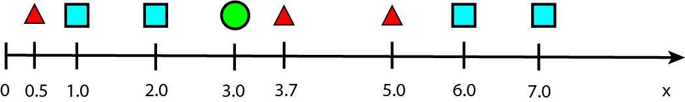
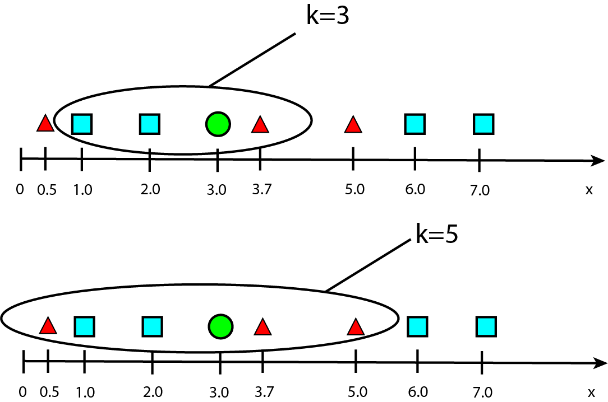

## Exercice sur l'algorithme des k plus proches voisins

Pour les doctests :

```python
if __name__ == '__main__':
    import doctest
    doctest.testmod(optionflags=doctest.NORMALIZE_WHITESPACE | doctest.ELLIPSIS, verbose=True)
```

On se propose d'écrire un algorithme adapté à un espace à une seule dimension.



On dispose d'une liste de positions de divers éléments ainsi qu'une liste de classes associées à ces éléments ('T' pour triangle, 'C' pour carré), le rond vert est l'inconnue dont on connaît la position notée x mais dont on cherche à déterminer la classe.

```python
L=[0.5,1.0,2.0,3.7,5.0,6.0,7.0]
#liste des positions
Classes=['T','C','C','T','T','C','C']
#liste des classes relatives aux éléments situés à ces positions
```

1. Recherche des k plus proches voisins

On cherche les k plus proches voisins de l'élément rond vert, supposé représenté un élément inconnu, de coordonnée x=3.0.

Écrire une fonction `Kvoisins` qui prend en arguments une liste L de coordonnées, un entier k, et la position d'un nouvel élément tel que le rond vert et qui renvoie la liste des indices dans L des k plus proches voisins de x.

On sera amené à créer une fonction intermédaire `distance` pour le calcul des distances en utilisant la fonction `abs` qui renvoie la valeur absolue d'un nombre.

```python
def distance(a,b):
    """
    renvoie la distance qui sépare deux points d'abscisse a et b
    param : a, b : float
    return : float
    >>> distance(2,5)
    3
    """
```

On sera également amené à créer une fonction intermédiaire `critere` qui renvoie la deuxième valeur de la sous-liste.

```python
def critere(a):
    """
    renvoie la deuxième valeur de la liste a
    param : a : list
    return : int
    >>> critere([3,8])
    8
    """
```

Illustration de sorted selon `critere` :

```python 
>>> liste=[[3,5],[1,2],[7,9]]
>>> liste=sorted(liste,key=critere)
>>> liste
[[1, 2], [3, 5], [7, 9]]
```

Algorithme : 

1) Créer, par compréhension, dans la fonction `k_plus_proches_voisins`, une liste appelée `ListeDistanceIndice` qui contient les couples [i,di] des indices i dans la liste L et des distances di par rapport à x.

Rappel : cherchons à créer par compréhension la liste des [i,i**2] pour i de 0 à 4
```python 
>>> [ [i,i**2] for i in range(5)]
[[0, 0], [1, 1], [2, 4], [3, 9], [4, 16]]
```

2) Ordonner cette liste selon le critère de distance (en utilisant `sorted`, `key`, et la fonction `critere` précédente).

3) Ne garder dans cette liste ordonnée que les k premiers éléments qui sont donc les k plus proches voisins, encore une fois en créant une liste par compréhension.


```python
def k_plus_proches_voisins(liste,k,x):
    """
    renvoie la liste des indices des k objets les plus proches de l'élément d'abscisse x
    param : liste : list
    param : k : int
    param : x : float
    return : list
    >>> k_plus_proches_voisins(L,3,3.0)
    [3, 2, 1]
    """
```

2. Attribution de la classe

On attribue à notre inconnue la classe qui est la plus rencontrée parmi les k plus proches voisins obtenus précédemment.

On réalise pour cela une fonction `predire_classe` qui admet comme paramètres la liste des positions, la liste des classes, la valeur de k et la position x de notre inconnue.

On réalisera pour cela un compteur pour compter l'occurence des différentes classes parmi ces k plus proches voisins.

```python
def predire_classe(liste_positions,liste_classes,k,x):
    """
    renvoie la classe correspondant à l'élement x
    param : liste_positions : list
    param : liste_classes : list
    param : k : int
    param : x : float
    return : string
    >>> predire_classe(L,Classes,3,3.0)
    'C'
    >>> predire_classe(L,Classes,5,3.0)
    'T'    
    """
```



Dans le cas où k=3, la classe attribuée est le carré car les plus proches voisins sont deux carrés et un triangle,  tandis que dans le cas où k=5, la classe attribuée est le triangle car les plus proches voisins sont deux carrés et trois triangles.


