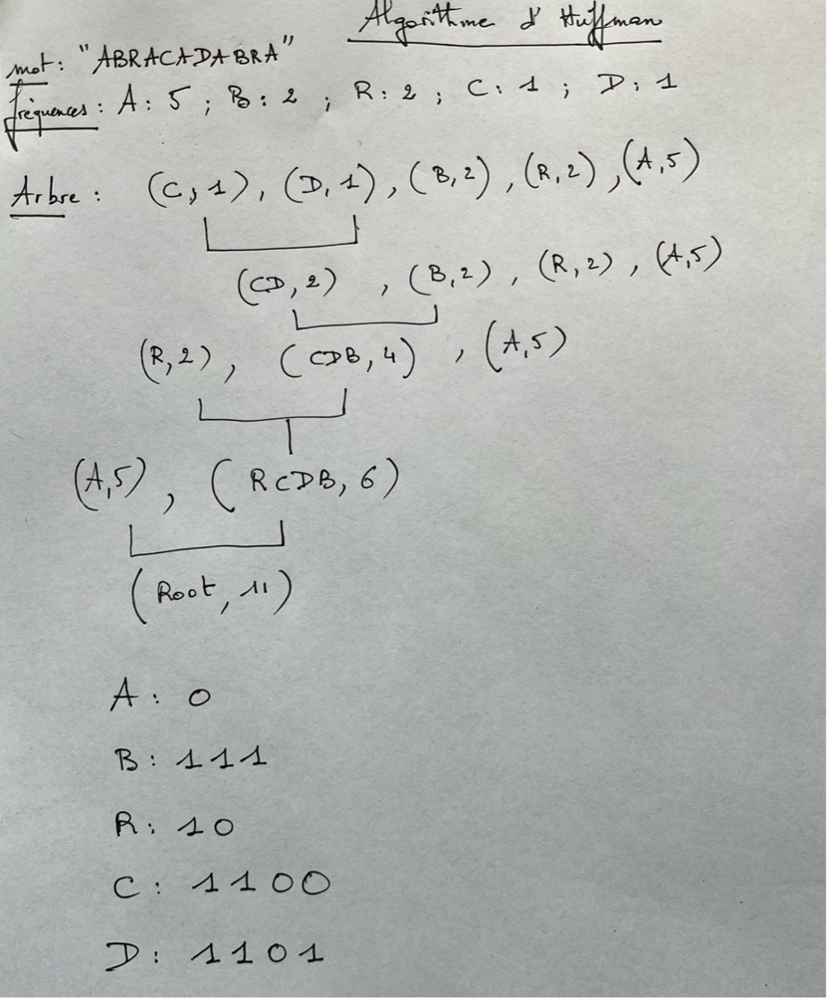

**Algorithme d'Huffman**


Le codage de Huffman est un algorithme de compression de données sans perte. Le codage de Huffman utilise un code à longueur variable pour représenter un symbole de la source (par exemple un caractère dans un fichier). Le code est déterminé à partir d'une estimation des probabilités d'apparition des symboles de source, un code court étant associé aux symboles de source les plus fréquents. 

[Vidéo](https://www.youtube.com/watch?v=JsTptu56GM8&t=346s)

Étapes du Codage de Huffman
1.	Calcul des Fréquences des Symboles :
-	Comptez la fréquence d'apparition de chaque symbole dans le texte à compresser.
2.	Construction de l'Arbre de Huffman :
o	Créez un nœud feuille pour chaque symbole avec sa fréquence associée.
o	Ajoutez tous les nœuds dans une file de priorité (ou un tas), ordonnée par fréquence (les nœuds avec les fréquences les plus basses sont en tête).
o	Répétez les étapes suivantes jusqu'à ce qu'il ne reste plus qu'un seul nœud dans la file :
	Retirez les deux nœuds avec les plus basses fréquences de la file.
	Créez un nouveau nœud interne avec ces deux nœuds comme enfants et une fréquence égale à la somme de leurs fréquences.
	Ajoutez ce nouveau nœud dans la file.
o	Le dernier nœud restant est la racine de l'arbre de Huffman.
3.	Génération des Codes de Huffman :
o	Parcourez l'arbre de Huffman à partir de la racine pour assigner des codes binaires à chaque symbole.
o	À chaque nœud interne, assignez "0" à la branche gauche et "1" à la branche droite (ou vice versa).
o	Les codes binaires pour chaque symbole sont obtenus en suivant les branches de la racine aux feuilles.
4.	Encodage des Données :
o	Remplacez chaque symbole du texte par son code binaire correspondant pour obtenir la séquence compressée.
Exemple Illustratif
Supposons que nous voulons compresser la chaîne "ABRACADABRA".
1.	Calcul des Fréquences :
o	A: 5, B: 2, R: 2, C: 1, D: 1
2.	Construction de l'Arbre :
o	Créez les nœuds pour chaque symbole :
	A: 5, B: 2, R: 2, C: 1, D: 1
o	Insérez-les dans une file de priorité :
	[(C, 1), (D, 1), (B, 2), (R, 2), (A, 5)]
o	Combinez les deux nœuds avec les fréquences les plus basses :
	Combinez (C, 1) et (D, 1) en un nœud interne (CD, 2)
	[(CD, 2), (B, 2), (R, 2), (A, 5)]
o	Répétez ce processus :
	Combinez (CD, 2) et (B, 2) en un nœud (CDB, 4)
	[(R, 2), (CDB, 4), (A, 5)]
	Combinez (R, 2) et (CDB, 4) en un nœud (RCDB, 6)
	[(A, 5), (RCDB, 6)]
	Combinez (A, 5) et (RCDB, 6) en un nœud (Root, 11)
3.	Génération des Codes :
o	Parcourez l'arbre de la racine aux feuilles pour générer les codes :
	A: 0
	R: 10
	C: 1100
	D: 1101
	B: 111
4.	Encodage des Données :
o	Remplacez chaque symbole par son code :
	"ABRACADABRA" devient "0111101011001100011110010"
Conclusion
Le codage de Huffman est efficace car il utilise des codes plus courts pour les symboles les plus fréquents et des codes plus longs pour les symboles moins fréquents, ce qui minimise la longueur totale du texte encodé. Il est largement utilisé dans diverses applications de compression de données, y compris les formats de fichiers tels que JPEG (image) et MP3.
 
Exemple de Décodage Pas à Pas
Partons du texte encodé 011110011000110100111100 et décomposons-le bit par bit.
•	0 : Va à l'enfant gauche → Trouve A → Texte décodé : A
•	111 : Droite, Droite, Droite → Trouve B → Texte décodé : AB
•	10 : Droite, Gauche → Trouve R → Texte décodé : ABR
•	0 : Gauche → Trouve A → Texte décodé : ABRA
•	1100 : Droite, Droite, Gauche, Gauche → Trouve C → Texte décodé : ABRAC
•	0 : Gauche → Trouve A → Texte décodé : ABRACA
•	1101 : Droite, Droite, Gauche, Droite → Trouve D → Texte décodé : ABRACAD
•	0 : Gauche → Trouve A → Texte décodé : ABRACADA
•	111 : Droite, Droite, Droite → Trouve B → Texte décodé : ABRACADAB
•	10 : Droite, Gauche → Trouve R → Texte décodé : ABRACADABR
•	0 : Gauche → Trouve A → Texte décodé : ABRACADABRA





```Python

########################### Classe Node ###########################

class Node:
    def __init__(self, char=None, freq=0):
        # Initialise un nœud avec un caractère et une fréquence
        self.char = char
        self.freq = freq
        self.left = None  # Enfant gauche
        self.right = None  # Enfant droit

    def __lt__(self, other):
        # Définir l'opérateur < pour comparer les nœuds par fréquence
        return self.freq < other.freq

#########################Fonctions pour la construction de l'arbre de Huffman et les codes#######

def calculate_frequencies(data):
    # Calcule les fréquences de chaque caractère dans la chaîne de caractères donnée
    frequencies = {}
    for char in data:
        if char in frequencies:
            frequencies[char] += 1  # Incrémente la fréquence si le caractère est déjà dans le dictionnaire
        else:
            frequencies[char] = 1  # Ajoute le caractère au dictionnaire avec une fréquence de 1
    return frequencies

def build_huffman_tree(frequencies):
    # Construit l'arbre de Huffman à partir des fréquences des caractères
    nodes = [Node(char, freq) for char, freq in frequencies.items()]
    
    while len(nodes) > 1:
        nodes = sorted(nodes, key=lambda x: x.freq)  # Trie les nœuds par fréquence
        left = nodes.pop(0)  # Prend le nœud avec la plus petite fréquence
        right = nodes.pop(0)  # Prend le nœud avec la deuxième plus petite fréquence
        
        merged = Node(freq=left.freq + right.freq)  # Crée un nouveau nœud interne avec la somme des fréquences
        merged.left = left  # Définit le nœud de gauche
        merged.right = right  # Définit le nœud de droite
        
        nodes.append(merged)  # Ajoute le nœud interne à la liste des nœuds
    
    return nodes[0]  # Retourne la racine de l'arbre de Huffman

def build_codes(node, current_code="", codes={}):
    # Génère les codes de Huffman en parcourant l'arbre
    if node is None:
        return

    if node.char is not None:
        codes[node.char] = current_code  # Assigne le code binaire actuel au caractère

    build_codes(node.left, current_code + "0", codes)  # Parcours récursif pour l'enfant gauche
    build_codes(node.right, current_code + "1", codes)  # Parcours récursif pour l'enfant droit

    return codes

###################Fonctions pour l'encodage et le décodage

def huffman_encoding(data):
    # Encode une chaîne de caractères en utilisant les codes de Huffman
    if not data:
        return "", None  # Retourne une chaîne vide et aucun arbre si les données sont vides

    frequencies = calculate_frequencies(data)  # Calcule les fréquences des caractères
    huffman_tree = build_huffman_tree(frequencies)  # Construit l'arbre de Huffman
    huffman_codes = build_codes(huffman_tree)  # Génère les codes de Huffman

    encoded_data = "".join(huffman_codes[char] for char in data)  # Remplace chaque caractère par son code binaire
    return encoded_data, huffman_tree

def huffman_decoding(encoded_data, tree):
    # Décode une chaîne encodée en utilisant l'arbre de Huffman
    if not encoded_data or tree is None:
        return ""  # Retourne une chaîne vide si les données encodées sont vides ou s'il n'y a pas d'arbre

    decoded_data = []  # Liste pour stocker les caractères décodés
    node = tree  # Commence à la racine de l'arbre de Huffman
    for bit in encoded_data:
        if bit == '0':
            node = node.left  # Aller à l'enfant gauche si le bit est 0
        else:
            node = node.right  # Aller à l'enfant droit si le bit est 1

        if node.char is not None:
            decoded_data.append(node.char)  # Ajoute le caractère à la liste si un nœud feuille est atteint
            node = tree  # Retourne à la racine pour décoder le prochain caractère

    return "".join(decoded_data)  # Convertit la liste des caractères en chaîne et la retourne

######Programme principal pour tester l'encodage et le décodage

if __name__ == "__main__":
    data = "ABRACADABRA"
    print(f"Texte original: {data}")

    encoded_data, tree = huffman_encoding(data)
    print(f"Texte encodé: {encoded_data}")

    decoded_data = huffman_decoding(encoded_data, tree)
    print(f"Texte décodé: {decoded_data}")


```

