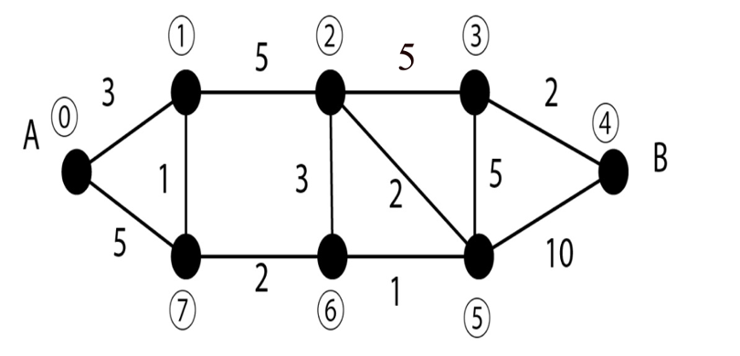

1) Déterminer "au jugé" le ou les plus courts chemin de A (sommet 0) à B (somme 4) dans le graphe suivant. Chaque arête possède une longueur qui pourrait être exprimée en km dans le cas d'un réseau routier. Donner également la longueur de ce plus court chemin.



2) Utiliser l'**algorithme de Dijkstra** explicité sur un exemple dans ce document Word : [Tableau.doc](assets/Tableau.doc) pour retrouver le résultat précédent.
    
On peut résumer ainsi la construction du tableau : pour passer d'une ligne à l'autre, on détermine le sommet à marquer en retenant le sommet pour lequel on a la plus petite distance (False représente une distance infinie), puis pour chacune des colonnes des sommets non marqués, on écrit la distance (si elle existe, sinon False) entre le sommet marqué et le sommet non marqué si, après addition de la retenue, celle-ci est **strictement inférieure** à la valeur inscrite dans la ligne précédente ; on précise également la provenance correspondant au sommet marqué.
Pour obtenir le résultat final, on part du sommet d'arrivée et on remonte en passant par les provenances.

L'implémentation en Python de cet algorithme est donnée ci-dessous : on y retrouvera la construction du tableau dans `ajout_ligne(T,S_marques,Graphe)` puis dans `calcule_tableau(Graphe, depart)`.

```Python
#  Implémentation  de  l’algorithme  de  Dijkstra

#  Graphe 1 est le graphe correspondant à l'exemple du document ; il faudra donc l'adapter à notre exemple

Graphe1 = [
          [0,2,5,False,3,False,False],
          [2,0,2,1,False,False,8],
          [5,2,0,1,4,2,False],
          [False,1,1,0,False,False,5],
          [3,False,4,False,0,False,False],
          [False,False,2,False,False,0,1],
          [False,8,False,5,False,1,False]
          ]

def SommetSuivant(T, S_marques) :
    """
    En  considérant  un  tableau  et  un  ensemble  de  sommets  marqués, détermine  le  prochain  sommet  marqué.
    param : T : list
    param : S_marques : list
    return : int
    >>> T=[[False, [2, 0], [5, 0], False, [3, 0], False, False],[False, False, [4, 1], [3, 1], [3, 0], False, [10, 1]]]
    >>> S_marques=[0,1]
    >>> SommetSuivant(T, S_marques)
    3
    """
    L = T[-1]
    n = len(L)
#  minimum  des  longueurs,  initialisation
    minimum = False
    for i in range(n) :
        if not(i in S_marques) :
#  si  le  sommet  d’indice  i  n’est  pas  marqué
            if L[i]:
                if not(minimum) or L[i][0] < minimum :
#  on  trouve  un  nouveau  minimum
#  ou  si  le  minimum  n’est  pas  défini
                    minimum = L[i][0]
                    marque = i
    return(marque)

def ajout_ligne(T,S_marques,Graphe) :
    """
    Ajoute  une  ligne  supplémentaire  au  tableau
    param : T : list
    param : S_marques : list
    param : Graphe : list
    return : list, list    
    """
    L = T[-1]
    n = len(L)
#  La  prochaine  ligne  est  une  copie  de  la  précédente, #  dont  on  va  modifier  quelques  valeurs.
    Lnew = L.copy()
#  sommet  dont  on  va  étudier  les  voisins
    S = S_marques[-1]
#  la  longueur  du  (plus  court)  chemin  associé
    retenue = L[S][0]
######################## Code à interpréter ###########################
    for j in range(n) :
        if j not in S_marques:
            poids = Graphe[S][j]
            if poids :
                if not(L[j]) :
                    Lnew[j] = [ retenue + poids, S ]
                else :
                    if retenue + poids < L[j][0]:
                        Lnew[j] = [ retenue + poids, S ]
    T.append(Lnew)
#######################################################################
#  Calcul  du  prochain  sommet  marqué
    S_marques.append(SommetSuivant(T, S_marques))
    return T, S_marques

def calcule_tableau(Graphe, depart) :
    """
    Calcule  le  tableau  de  l’algorithme  de  Dijkstra
    param : Graphe : list
    param : depart : int
    return : list
    """
    n = len(Graphe)
#  Initialisation  de  la  première  ligne  du  tableau
#  Avec  ces  valeurs,  le  premier  appel  à  ajout_ligne
#  fera  le  vrai  travail  d’initialisation
    T=[[False] *n]
    T[0][depart] = [depart, 0]
#  liste  de  sommets  marques
    S_marques = [ depart ]
    while len(S_marques) < n :
        T, S_marques = ajout_ligne(T, S_marques, Graphe)
    return T

def plus_court_chemin(Graphe, depart, arrivee) :
    """
    Détermine  le  plus  court  chemin  entre  depart  et  arrivee  dans le  Graphe
    param : Graphe : list
    param : depart : int
    param : arrivee : int
    return : list
    >>> plus_court_chemin(Graphe1,0,6)
    [0, 1, 2, 5, 6]
    """
    n = len(Graphe)
#  calcul  du  tableau  de  Dijkstra
    T = calcule_tableau (Graphe,depart)
#  liste  qui  contiendra  le  chemin  le  plus  court,  on  place  l’arrivée
    C = [ arrivee ]
    while C[-1] != depart :
        C.append( T[-1][C[-1]][1] )
#  Renverse  C,  pour  qu’elle  soit  plus  lisible
    C.reverse()
    return C

def distance_deux_points(Graphe,i,j):
    """
    Renvoie la distance entre deux sommets i et j
    param : Graphe : list
    param : i : int
    param : j : int
    return : int
    >>> distance_deux_points(Graphe1,0,2)
    5
    """
    pass

def distance_totale(Graphe,i,j):
    """
    Renvoie la distance correspondant au chemin le plus court du sommet i au sommet j
    param : Graphe : list
    param : i : int
    param : j : int
    return : list
    >>> distance_totale(Graphe1,0,6)
    7
    """
    pass
    

if __name__ == '__main__':
  import doctest
  doctest.testmod(verbose=True)    
 
```

3) Ajouter deux fonctions à ce programme : `distance_deux_points(graphe,i,j)` et `distance_totale(graphe,liste)` pour que le programme retourne la longueur du chemin le plus court. Le programme sera validé par les tests fournis dans les docstrings.

**Indication:**

```Python
>>> Graphe1 = [
          [0,2,5,False,3,False,False],
          [2,0,2,1,False,False,8],
          [5,2,0,1,4,2,False],
          [False,1,1,0,False,False,5],
          [3,False,4,False,0,False,False],
          [False,False,2,False,False,0,1],
          [False,8,False,5,False,1,False]
          ]
>>> Graphe1[1][6]
8
```
4) Après avoir défini `Graphe2`, retrouvez grâce à votre programme vos résultats de la question 1. Indiquer par écrit les instructions passées dans la console.

5) a) Comment peut-on modifier de façon simple la fonction `SommetSuivant` pour remplacer la ligne `if not(minimum) or L[i][0] < minimum :` par plus simplement `if L[i][0] < minimum :` ?    
	b) Étudier la fonction `ajout_ligne` et interpréter dans le détail le fonctionnement du code placé dans la partie encadrée en proposant un commentaire pour les différentes lignes.

