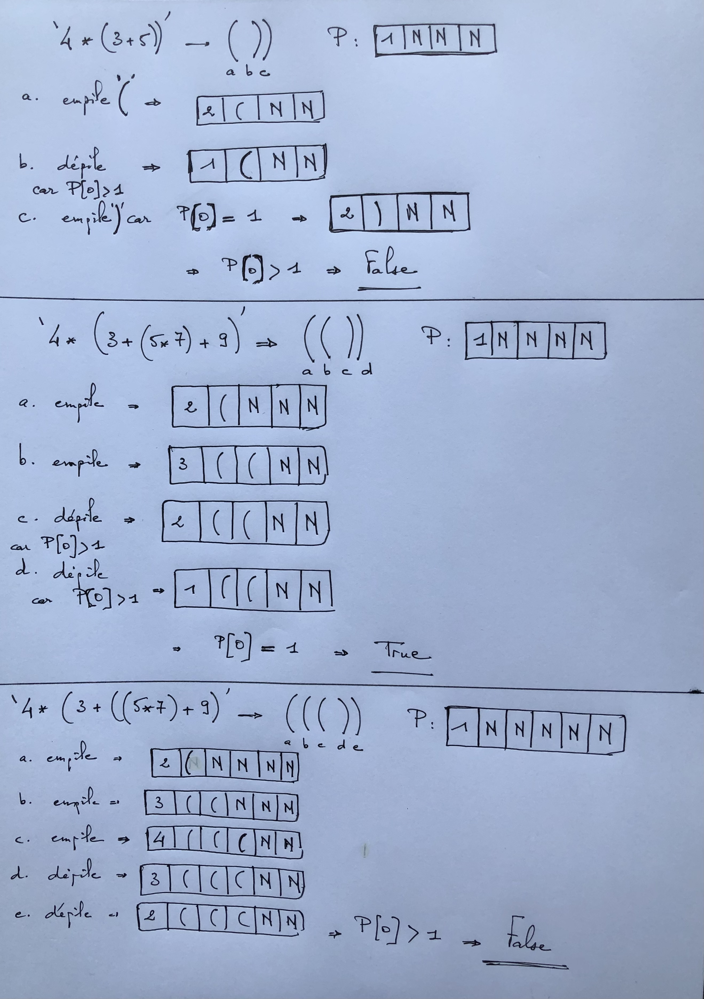

On donne le code pour vérifier les doctest.

```python    
if __name__ == '__main__':
    import doctest
    doctest.testmod(optionflags=doctest.NORMALIZE_WHITESPACE | doctest.ELLIPSIS, verbose=True)
```

**Notion de pile** :

Une pile est une structure de données qui donne accès en priorité aux dernières données ajoutées. Ainsi la dernière information ajoutée sera la première à sortir. Autrement dit, on ne peut accéder qu'à l'objet situé au  sommet de la pile.
Le rangement des assiettes convient à cette description. En effet l'ordre dans lequel les assiettes sont dépilées est l'inverse de celui dans lequel elles ont été empilées, puisque seule l'assiette supérieure est accessible.

Exemples d'applications pratiques : 

    1. La gestion de l'historique de navigation dans un navigateur web. Lorsque vous naviguez sur internet, les pages web que vous visitez sont empilées dans un ordre spécifique, vous permettant de retourner à des pages précédemment visitées en utilisant le bouton "Retour" de votre navigateur.

    2. La résolution d'expressions mathématiques en notation polonaise inversée (RPN). Cette méthode utilise une pile pour stocker les opérandes et effectuer les opérations en utilisant des opérateurs comme des "pop" et des "push" pour manipuler les données sur la pile.

    3. La gestion de la mémoire d'un ordinateur. Les systèmes d'exploitation utilisent des piles pour stocker les adresses de retour des appels de fonction lors de l'exécution de programmes. Cela permet de retourner automatiquement à l'emplacement d'où la fonction a été appelée une fois que celle-ci a été exécutée.

    4. La gestion des appels récursifs : Pour chaque appel récursif on stocke les informations de l'appel en cours dans la pile pour pouvoir y revenir à la fin de l'appel.

    5. La résolution d'algorithme de parcours de graphe : Pour chaque noeud visité on stocke les informations pour pouvoir y revenir si besoin et continuer l'exploration.

Deux opérations élémentaires sont nécessaires pour réaliser cette structure.

EMPILER(P,x) qui correspond à l'insertion de la donnée x au sommet de la pile P si celle-ci n'est pas pleine.   

DEPILER(P) qui retire la dernière donnée de P et la retourne si la pile n'est pas vide.

Afin de représenter une pile capable de contenir n éléments à l'aide d'un tableau de type `list`, on se propose de procéder ainsi : 

- la première case du tableau d'indice 0 contient **l'indice** du prochain élément à insérer dans la pile

- les cases suivantes du tableau (d'indices 1 à n) contiennent les éléments de la pile ou sont vides. La dernière case non vide du tableau est le sommet de la pile.


Le schéma ci-dessus donne la représentation d'une pile capable de contenir n=5 éléments à l'aide d'un tableau.

```python 
def creer_pile(Nombre_de_place):
    """
    créer une pile pouvant accueillir nombre de places
    >>> creer_pile(5)
    [1, None, None, None, None, None]
    """
	pass
```
	
Indication :

```python
>>> [None]*5
[None, None, None, None, None]
```


```python 
def empiler(P,x):
    """
    insère la donnée x au sommet de la pile P
    sinon renvoie 'pile pleine'
    param : P : list
    param : x : int
    return : list
    >>> empiler([1, None, None, None, None, None],8)
    [2, 8, None, None, None, None]
    >>> empiler([2, 8, None, None, None, None],3)
    [3, 8, 3, None, None, None]
    >>> empiler([3, 8, 3, None, None, None],5)
    [4, 8, 3, 5, None, None]
    >>> empiler([4, 8, 3, 5, None, None],9)
    [5, 8, 3, 5, 9, None]
    >>> empiler([5, 8, 3, 5, 9, None],7)
    [5, 8, 3, 5, 9, 7]
    >>> empiler([5, 8, 3, 5, 9, 7],4)#le 4 écrase le 7
    [5, 8, 3, 5, 9, 4]
    >>> empiler([3, 8, 3, 5, None, None],7)
    [4, 8, 3, 7, None, None]
    """
    pass

def depiler(P):
    """
    modifie la valeur dans la case 0 et retourne la pile si elle n'est pas vide
    param : P : list
    return : list ou str
    >>> depiler([4, 8, 3, 5, None, None])
    [3, 8, 3, 5, None, None]
    >>> depiler([1, None, None, None, None, None])
    'pile vide'
    >>> depiler([1, ')', None, None, None, None])
    'pile vide'
    >>> depiler([1, '(', None, None, None, None])
    'pile vide'    
    """
    pass
```    

**Application 1** :

Voici un exemple d'utilisation des fonctions EMPILER et DEPILER dans le contexte de la gestion de l'historique de navigation dans un navigateur web :

```python 
# Initialisation de la pile pour stocker l'historique de navigation
historique = []

# Lorsque l'utilisateur accède à une nouvelle page web
url = "https://www.example.com"
EMPILER(historique, url)

# Lorsque l'utilisateur clique sur le bouton "Retour"
url_precedente = DEPILER(historique)
```   

**Application 2** :

On cherche à réaliser une fonction capable de dire si une expression mathématique est erronée ou non du point de vue du parenthésage en utilisant une pile.

On transforme pour cela à l'aide de `transforme_en_liste(E)` l'équation E en une liste de parenthèses ouvrantes ou fermantes. 

```python 
def transforme_en_liste(E):
    """
    transforme une expression mathématique en liste de parenthèses
    >>> transforme_en_liste('4*(3+5))')
    ['(', ')', ')']
    """
    pass
```   
 
Puis, dans la fonction `verifier(E)`, on forme une pile pouvant accueillir au maximum tous ces caractères.  
On parcourt la liste des parenthèses.  

Lorsqu'on trouve une parenthèse ouvrante, on empile cette parenthèse ouvrante.  
Lorsqu'on trouve une parenthèse fermante, on dépile si P[0]>1, sinon on empile une parenthèse fermante.

À la fin, si P[0]=1, l'équation est correcte du point de vue du parenthésage, sinon elle est incorrecte.



 ```python 
def verifier(E):
    """
    renvoie True si l'expression E est cohérente du point de vue du parenthésage
    sinon False
    >>> verifier('4*(3+5))')
    False
    >>> verifier('4*(3+(5*7)+9)')
    True
    >>> verifier('4*(3+((5*7)+9)')
    False
    """  
    pass
 ```