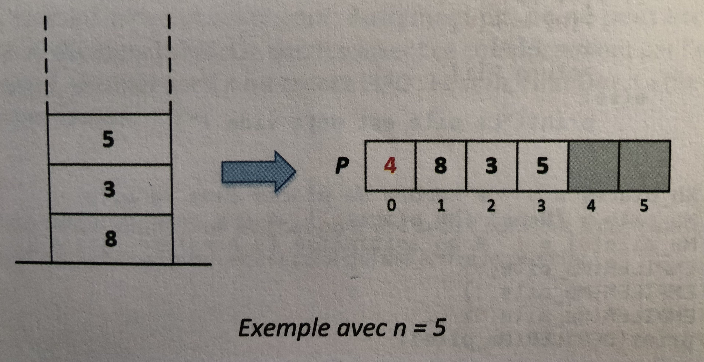

On donne le code pour vérifier les doctest.

```python    
if __name__ == '__main__':
    import doctest
    doctest.testmod(optionflags=doctest.NORMALIZE_WHITESPACE | doctest.ELLIPSIS, verbose=True)
```

**Notion de pile** :
Une pile est une structure de données qui donne accès en priorité aux dernières données ajoutées. Ainsi la dernière information ajoutée sera la première à sortir. Autrement dit, on ne peut accéder qu'à l'objet situé au  sommet de la pile.
Le rangement des assiettes convient à cette description. En effet l'ordre dans lequel les assiettes sont dépilées est l'inverse de celui dans lequel elles ont été empilées, puisque seule l'assiette supérieure est accessible.

Deux opérations élémentaires sont nécessaires pour réaliser cette structure.

EMPILER(P,x) qui correspond à l'insertion de la donnée x au sommet de la pile P si celle-ci n'est pas pleine.
DEPILER(P) qui retire la dernière donnée de P et la retourne si la pile n'est pas vide.

Afin de représenter une pile capable de contenir n éléments à l'aide d'un tableau de type list, on se propose de procéder ainsi : 

- la première case du tableau d'indice 0 contient l'indice du prochain élément à insérer dans la pile

- les cases suivantes du tableau (d'indices 1 à n) contiennent les éléments de la pile ou sont vides. La dernière case non vide du tableau est le sommet de la pile.



Le schéma ci-dessus donne la représentation d'une pile capable de contenir n=5 éléments à l'aide d'un tableau.

```python 
def creer_pile(Nombre_de_place):
    """
    créer une pile pouvant accueillir nombre de places
    >>> creer_pile(5)
    [1, None, None, None, None, None]
    """
    Ma_pile=[None]*(Nombre_de_place+1)#on crée un tableau avec une case de plus
    Ma_pile[0]=1#on initialise la première case à 1
    return Ma_pile

def empiler(P,x):
    """
    insère la donnée x au sommet de la pile P si celle-ci n'est pas pleine
    sinon renvoie 'pile pleine'
    param : P : list
    param : x : int
    return : list
    >>> empiler([1, None, None, None, None, None],8)
    [2, 8, None, None, None, None]
    >>> empiler([2, 8, None, None, None, None],3)
    [3, 8, 3, None, None, None]
    >>> empiler([3, 8, 3, None, None, None],5)
    [4, 8, 3, 5, None, None]
    >>> empiler([4, 8, 3, 5, None, None],9)
    [5, 8, 3, 5, 9, None]
    >>> empiler([5, 8, 3, 5, 9, None],7)
    [5, 8, 3, 5, 9, 7]
    >>> empiler([5, 8, 3, 5, 9, 7],4)
    'pile pleine'
    """
    pass

def depiler(P):
    """
    retire la dernière donnée de P et la retourne si la pile n'est pas vide
    sinon renvoie 'pile vide'
    param : P : list
    >>> depiler([5, 8, 3, 5, 9, None])
    9
    >>> depiler([1, None, None, None, None, None])
    'pile vide'    
    """
    pass

```    

**Application** :

On cherche à réaliser une fonction capable de dire si une expression est erronée ou pas du point de vue du parenthèsage en utilisant une pile.


