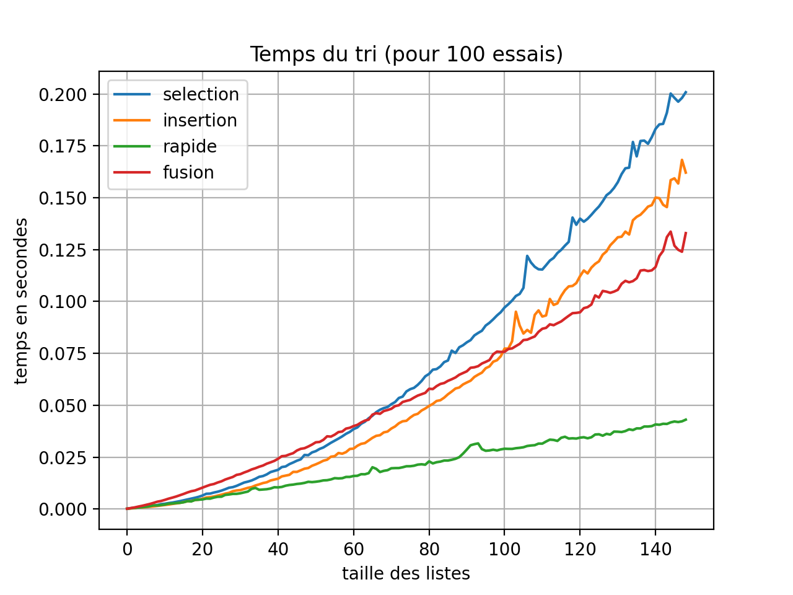

# Thème G : Algorithmique 


# I. Un exemple classique d'algorithme: l'algorithme d'Euclide pour la recherche du pgcd de deux nombres

Euclide est un mathématicien de la Grèce antique, auteur du livre <i>les éléments de mathématiques</i>, qui constituent l'un des textes fondateurs de cette discipline en Occident. 

En arithmétique élémentaire, le plus grand commun diviseur ou PGCD de deux nombres entiers non nuls est le plus grand entier qui les divise simultanément. Par exemple, le PGCD de 20 et de 30 est 10, puisque leurs diviseurs communs sont 1, 2, 5 et 10.

Étape 1 : on divise m par n et on note r le reste de la division euclidienne  
Étape 2 : si le reste est nul, c'est terminé, le pgcd est n     
Étape 3 : sinon, on remplace m par n et n par r et on recommence l'étape 1


Explications :
```python
360=252*1+108
252=108*2+36
108=36*3

360=252*1+108=(108*2+36)*1+108=((36*3)*2+36)*1+(36*3)=36*10
252=108*2+36=(36*3)*2+36=36*7
```

**Implémentation en Python** :

```python
def pgcd(m,n):
    r=m%n
    while r!=0:
        m,n=n,r# permutation du diviseur avec le dividende et permutation du reste avec le diviseur
        r=m%n
    return n

>>> pgcd(252,360)
36
```

# II. Les outils utilisés pour la construction des algorithmes

## 1. Compteurs et accumulateurs

- Un **compteur** est une valeur généralement initialisée à 0 qui est incrémentée d'une unité à chaque passage dans une boucle, éventuellement suite à un test.

Exemple : Soit le script suivant, on cherche à compter combien de fois le mot NSI est affiché.

```python
def ecrire(n):
    compteur=0
    for i in range(n):
        for j in range(i):
            print('NSI')
            compteur+=1
    return compteur
>>> ecrire(5)
NSI
NSI
NSI
NSI
NSI
NSI
NSI
NSI
NSI
NSI
10
```
À chaque fois que i varie de 0 à n-1, c'est-à-dire n fois, on affiche le mot 'NSI' i fois.
Au total le nombre de fois où le mot est affiché est donc : 0+1+2+...(n-1).  
Cette somme se rencontre souvent ; il s'agit de la somme des termes d'une suite arithmétique de raison 1. Une astuce permet de donner rapidement la valeur de cette somme.
 
S=1+2+...(n-1).   
S=(n-1)+(n-2)+.....+1.   
2S=nx(n-1) donc S=nx(n-1)/2 ; pour n=5 : S=10.

Pour les exercices, réaliser les docstrings :

```python
if __name__ == '__main__':
    import doctest
    doctest.testmod(verbose=True)
```

Pour chacun de ces 3 exercices, on réalisera un compteur.

<u>Exercice 1</u>  
Écrire une fonction `taille_binaire(n)` qui renvoie le nombre de chiffres dans l'écriture binaire de l'entier n (c'est-à-dire le nombre de divisions euclidiennes successives de n par 2 jusqu'à arriver à un quotient nul).

```python
def taille_binaire(n):
    """
    Renvoie le nombre de bits dans l'écriture binaire de n
    param : n : int
    return : int
    >>> taille_binaire(9)
    4
    >>> taille_binaire(255)
    8
    """
```

<u>Exercice 2</u>   
Écrire une fonction `nombre_de_1(n)`, indépendante de la fonction précédente, qui renvoie le nombre de 1 dans l'écriture binaire du nombre.

```python
def nombre_de_1(n):
    """
    Renvoie le nombre de bits égaux à 1 dans l'écriture binaire de n
    param : n : int
    return : int
    >>> nombre_de_1(9)
    2
    >>> nombre_de_1(255)
    8
    """
```

<u>Exercice 3</u>   
Écrire une fonction `diviseurs(n)` qui renvoie le nombre de diviseurs de n.

```python
def diviseurs(n):
    """
    Renvoie le nombre de diviseurs de n
    param : n : int
    return : int
    >>> diviseurs(15)
    4
    """
```

- Un **accumulateur** est semblable à un compteur mais il est en général incrémenté d'une valeur différente de 1 ; il peut aussi être décrémenté.

Exemple : Cherchons à écrire une fonction chargée de calculer le produit de tous les éléments d'une liste passée en paramètre.

```python
def produit(tab):
    p=1
    for elt in tab:
        p=p*elt
    return p
>>> produit([3,5,2])
30
```
Ici p joue le rôle d'accumulateur qui est initialisé à 1.


<u>Exercice 4</u>   
Écrire une fonction `somme(liste)` qui renvoie la somme des termes d'une liste de nombres.

```python
def somme(liste):
    """
    Renvoie la somme des termes d'une liste de nombres
    param : liste : list
    return : int
    >>> somme([1,4,6])
    11
    """
```

<u>Exercice 5</u>     
Écrire une fonction `somme_paire(liste)` qui renvoie la somme des termes paires d'une liste de nombres.

```python
def somme_pairs(liste):
    """
    Renvoie la somme des termes paires d'une liste de nombres
    param : liste : list
    return : int
    >>> somme_pairs([1,4,6])
    10
    """
```

## 2. La permutation des valeurs

La permutation des valeurs nécessite de prendre soin de la manière de procéder.  

Exemple :  

```python
var1=17
var2=23
var1=var2
var2=var1
print(var1,var2)
```

La permutation est-elle effectuée ? Pourquoi ? Sinon comment procéder ?

On peut passer par une variable temporaire, généralement notée temp, chargée de stocker la valeur d'une variable. Écrire cette méthode.    
Une autre méthode, immédiate et efficace, utilisée dans Python, basée sur l'identité des tuples (en l'occurence des couples), consiste à écrire :  

```python
var1=17
var2=23
var1,var2=var2,var1
print(var1,var2)   
```


## 3. Les tests  

On fera attention à bien distinguer `if` de `elif`.   
Expliquer la différence de résultat obtenu avec ces deux codes.

Code 1 :   

```python
x=5
if x>0:
    x=x-3
elif x<0:
    x=x+5
else:
    x=x+2
print(x)
2
```

Code 2 :  

```python
x=5
if x>0:
    x=x-3
if x<0:
    x=x+5
else:
    x=x+2
print(x)
4
```

## 4. Les boucles 

Il faut s'accoutumer à rencontrer des boucles imbriquées en particulier quand on manipule des listes de listes.

Prévoir le nombre d'affichage puis le faire afficher :

```python
for i in range(4):
    for j in range(3):
        print(i+j)
```

# III. Les propriétés des algorithmes


## 1. Validité ou correction d'un algorithme


Lorsqu'on écrit un algorithme, il est impératif de vérifier que cet algorithme va produire un résultat en un temps fini et que ce résultat sera correct dans le sens où il sera conforme à une spécification précise. Nous dirons alors que l'algorithme est **valide** ou **correct**.

### a. Correction de l'algorithme

Un algorithme est dit **itératif** s'il est construit avec des boucles. Pour prouver que l'algorithme est **correct** (on dit aussi que l'on prouve la **correction** de l'algorithme), nous disposons de la notion d'**invariant de boucle**.  Un invariant de boucle est une propriété qui est vérifiée avant l'entrée dans la boucle, à chaque passage dans la boucle et à la sortie de la boucle. On peut faire le lien avec les suites définies par récurrence du programme de mathématiques. Pour vérifier qu'une propriété est un invariant d'une boucle, on commence donc par vérifier que la propriété est vraie avant la boucle : cette étape s'appelle l'**initialisation**, on prouve ensuite que **si la propriété est vraie avant un passage dans la boucle, elle restera vraie après le passage dans la boucle.** Cette étape s'appelle l'**hérédité**. On peut alors conclure que la propriété reste vraie à la sortie de la boucle. 

Exemple :

```python
def multiplie(a,b):
    m=0
    p=0
    while m<a:
        m=m+1
        p=p+b
    return p

>>> multiplie(4,3)
12
```
Cet algorithme simple a pour but de renvoyer le produit a×b sans utiliser le signe *.

On se propose de montrer que la propriété "p=m×b" est un invariant de boucle ; c'est-à-dire qu'en tout point de la boucle, on a bien "p=m×b".

La propriété se vérifie aisément à la phase d'initialisation.  
Supposons maintenant que la propriété soit vraie à l'entrée de la boucle, vérifions qu'elle reste vraie à la sortie de la boucle, lorsque m et p prennent les nouvelles valeurs m' et p'. On a bien : p'=p+b=m×b+b=(m+1)×b=m'×b.
Enfin, puisqu'à la sortie de la boucle, on a m=a, on peut bien affirmer que la fonction renvoie le produit a×b.

### b. Terminaison de l'algorithme

Un algorithme ne doit comporter qu'un nombre fini d'étapes. Afin de prouver la **terminaison** d'un algorithme itératif, nous utilisons la notion de **variant**. On ne parle ici que des boucles conditionnelles (utilisant `while`) car dans les boucles inconditionnelles (utilisant `for`) le nombre d'étapes est nécessairement déterminé.

On choisit donc un **variant**, c'est-à-dire une expression, la plus simple étant une variable, telle que la suite formée par les valeurs de cette expression au cours des itérations **converge** en un nombre fini d'étapes vers une valeur satisfaisant la condition d'arrêt. 

Dans notre exemple, si nous choisissons `m` comme variant, celui-ci prend les valeurs 0,1,... jusque `a`, et donc il y a exactement `a` passages dans la boucle, ce qui prouve sa terminaison.

## 2. Coût d'un algorithme ou complexité

Au préalable, on se propose d'avoir une première approche de cette notion en parcourant quelques pages du [dictionnaire des sciences](assets/Dictionnaire_sciences.md) de Michel Serres et Nayla Farouki écrit dans un style de vulgarisation scientifique. 

Supposons q'un programme ait à traiter une liste de 10<sup>7</sup> éléments puis une liste de 10<sup>8</sup> éléments ; le **temps d'exécution du programme** sera-t-il multiplié par 10 ? 

Les réponses sont variées et dépendent de l'algorithme et de la liste. Pour une liste donnée, un programme peut être plus rapide qu'un autre, mais avec une autre liste, cela peut être le contraire. Le même programme peut être plus rapide avec une liste plus longue. L'étude n'est pas simple et pour comparer deux algorithmes nous allons nous concentrer sur le nombre d'opérations à effectuer en essayant d'évaluer un **ordre de grandeur** de ce nombre en fonction de la taille des données. Nous nous placerons toujours dans le pire des cas, celui où le coût en terme d'opérations est le plus important.

Dans l'exemple précédent que nous reprenons ci-dessous :

```python
def multiplie(a,b):
    m=0
    p=0
    while m<a:
        m=m+1
        p=p+b
    return p

>>> multiplie(4,3)
12
```
les passages dans la boucle ont lieu pour les valeurs m=0,1,..a-1 soit a passages dans la boucle. À chaque passage nous effectuons deux additions et deux affectations, soit 4 opérations, donc nous effectuons au total 4×a opérations. Nous dirons que le coût est proportionnel à a, ou qu'il est **linéaire**, on dit aussi que l'algorithme a une **complexité linéaire** car si n désigne la taille des données, le nombre d'opérations s'écrit α×n+β.  
 
On dira ainsi que la complexité est **quadratique** dans le cas où le nombre d'opérations s'écrit α×n<sup>2</sup>+β×n+γ.

Dans le cas de deux boucles imbriquées, on peut avoir, selon les cas, soit une complexité linéaire soit une complexité quadratique.

<u>Premier cas</u> :

```python
for i in range(n):
    ... (on suppose q opérations effectuées ici)
    for j in range(k):
        ... (on suppose r opérations effectuées ici) 
```

Nous avons n passages dans la boucle externe et à chaque passage, on suppose que l'on a le nombre fixe de q opérations, puis k passages dans la boucle interne où nous avons le nombre fixe de r opérations. Soit au total un nombre d'opérations : n×(q+k×r), soit un coût en α×n, c'est-à-dire un coût linéaire.

<u>Deuxième cas</u> :

```python
for i in range(n):
    ... (on suppose q opérations effectuées ici)
    for j in range(n):
        ... (on suppose r opérations effectuées ici) 
```
Nous avons n passages dans la boucle externe et à chaque passage, nous avons le nombre fixe de q opérations, puis n passages dans la boucle interne où nous avons le nombre fixe de r opérations. Soit au total : n×(q+n×r)=r×n<sup>2</sup>+q×n soit α×n<sup>2</sup>+β×n+γ et le coût est ici quadratique.


<u>Troisième cas</u> :

```python
for i in range(n):
    ... (on suppose q opérations effectuées ici)
    for j in range(i):
        ... (on suppose r opérations effectuées ici) 
```

Nous avons n passages dans la boucle externe et à chaque passage, nous avons le nombre fixe de q opérations puis i passages dans la boucle interne où nous avons le nombre fixe de r opérations.
Ainsi pour chaque valeur de i allant de 0 à (n-1), nous avons q+r×i opérations, 
soit q+(q+r)+(q+r×2)+.......(q+r×(n-1)),
soit q×n+r×(1+2+...(n-1))=q×n+r×n×(n-1)/2=(r/2)×n<sup>2</sup>+(q-r/2)×n, ce qui est de la forme α×n<sup>2</sup>+β×n, donc un coût quadratique.

> Exemple : Soit le code ci-dessous, posons-nous la question de savoir si le coût est linéaire ou quadratique.

```python
def fonction(n):
    L = [ i+j for i in range(n) for j in range(n) ]
    for x in L:
    	print('Hello')
```

Comme l'affichage compte pour une opération, on peut calculer le nombre d'opérations en utilisant un compteur.

```python
def fonction(n):
    compteur=0
    L = [ i+j for i in range(n) for j in range(n) ]
    for x in L:
        compteur+=1
    return compteur
>>> fonction(2)
4
>>> fonction(3)
9
```

On voit que le coût du programme de départ est ici quadratique puisque le nombre d'opérations est proportionnel à n<sup>2</sup>.  
En effet dans le cas simple où n=2, on voit que L est une liste de 4 valeurs :


```python
>>> L = [ i+j for i in range(2) for j in range(2) ]
>>> L
[0, 1, 1, 2]
```


# IV. Les algorithmes à connaître

## 1. Les parcours séquentiels

Un parcours séquentiel signifie que la liste ou le tuple sont parcourus élément après élément suivant l'ordre des éléments.

### a. Calcul d'une moyenne

Proposer l'écriture de la fonction `moyenne(liste)` qui renvoie la moyenne d'une liste de nombre.

```python
def moyenne(liste):
    """
    Renvoie la moyenne d'une liste de nombres
    param : liste : list
    return : float
    >>> moyenne([4,10,22])
    12.0
    """
```    
    
Déterminer, en justifiant, le coût de l'algorithme en fonction de la taille n de la liste.


### b. Recherche d'une occurence

On recherche de manière séquentielle la présence d'une valeur dans un tableau ; ce tableau peut être une liste, un p-uplet ou une chaîne de caractères.

Proposer l'écriture de la fonction `recherche(x,t)` qui recherche l'élément x dans le tableau t de longueur n et renvoie la position de cet élément dans la liste.  
On utilisera une boucle conditionnelle puis une boucle inconditionnelle.

```python
def recherche_boucle_conditionnelle(x,t):
    """
    Renvoie la position de la lettre x dans la chaîne de caractères t
    param : x : str
    param : t : str
    >>> recherche_boucle_conditionnelle('o','algorithme')
    3
    """
```
```python
def recherche_boucle_non_conditionnelle(x,t):
    """
    Renvoie la position de la lettre x dans la chaîne de caractères t
    param : x : str
    param : t : str
    >>> recherche_boucle_non_conditionnelle('o','algorithme')
    3
    """
```

Déterminer, en justifiant, le coût de l'algorithme en fonction de la taille n de la liste.


### c. Recherche d'un extremum

On recherche l'extremum, minimum ou maximum, d'une liste de nombres.    
Recherche du maximum : l'idée est la suivante : on suppose que le premier élément est le maximum, puis on parcourt la liste et chaque fois que l'on rencontre un élément plus grand que le maximum provisoire, on dit que c'est le nouveau maximum provisoire.

Proposer l'écriture des fonctions `maximum(liste)` puis `minimum(liste)` de deux manières différentes : parcours des éléments de la liste ou parcours des indices de la liste.

```python
def recherche_maximum_liste_parcours_element(t):
    """
    Renvoie le maximum d'une liste de nombres
    param : t : list
    return : int
    >>> recherche_maximum_liste_parcours_element([3,18,5,21,6])
    21
    """
```
```python
def recherche_maximum_liste_parcours_indice(t):
    """
    Renvoie le maximum d'une liste de nombres
    param : t : list
    return : int
    >>> recherche_maximum_liste_parcours_indice([3,18,5,21,6])
    21
    """
```
```python
def recherche_minimum_liste_parcours_element(t):
    """
    Renvoie le maximum d'une liste de nombres
    param : t : list
    return : int
    >>> recherche_minimum_liste_parcours_element([3,18,2,21,6])
    2
    """
```
```python
def recherche_minimum_liste_parcours_indice(t):
    """
    Renvoie le maximum d'une liste de nombres
    param : t : list
    return : int
    >>> recherche_minimum_liste_parcours_indice([3,18,2,21,6])
    2
    """
```

## 2. Recherche dichotomique

La recherche dichotomique dans une liste doit s'effectuer nécessairement <u>**sur une liste préalablement triée**</u>.  

Avec Python, nous disposons d'outils pour trier :

- de la fonction `sorted(liste)` qui prend en argument la liste et renvoie la liste triée sans modification de la liste initiale. 

```python
>>> liste=[4,1,3,2]
>>> liste2=sorted(liste)
>>> print(liste2)
[1, 2, 3, 4]
>>> print(liste)
[4, 1, 3, 2]
```

- de la méthode sort() de l'objet liste qui trie la liste à laquelle elle s'applique en la modifiant.

```python
>>> liste=[4,1,3,2]
>>> liste.sort()
>>> print(liste)
[1, 2, 3, 4]
```

Le principe de la dichotomie (**binary search** en anglais) repose sur le principe **<i>diviser pour mieux régner</i> (en anglais divide-and-conquer)** : à chaque étape, on coupe le tableau en deux et on effectue un test pour savoir dans quelle partie se trouve l'élément recherché.

Proposer une fonction `recherche_dichotomie`.


```python
def recherche_dichotomie(valeur, liste):
    """
    renvoie l'indice de position de valeur dans la liste triée
    param : valeur : int
    param : liste : list
    return : bool
    >>> recherche_dichotomie(5, [2, 5, 9, 24])
    1
    >>> recherche_dichotomie(9, [2, 5, 9, 24])
    2
    """
```

On appellera `g` et `d` les bornes respectivement de gauche et de droite qui enserre de plus en plus l'indice de position de `valeur` dans `liste`.


- Faisons la preuve de la **terminaison** de l'algorithme en choisissant comme **variant** de la boucle : (`d-g`). 
Supposons que la taille du tableau soit inférieure à 2<sup>n</sup>, après k itérations, l'intervalle `d-g` sera tel que : d-g≤2<sup>n</sup>/2<sup>k</sup>=2<sup>n-k</sup>, donc, après n étapes : d-g≤1, ainsi la boucle s'arrête car le variant converge en un nombre fini d'étapes vers la valeur qui satisfait la condition d'arrêt.
On peut également parler de la complexité de l'algorithme. Par exemple, il faut sept étapes pour un tableau dont la taille est de l'ordre de 100 (2<sup>7</sup>=128) et 10 étapes pour un tableau dont la taille est de l'ordre de 1000 (2<sup>10</sup>=1024). Cela prouve que le nombre d'étape est de l'ordre du nombre de chiffres dans l'écriture binaire de la taille du tableau, donc **nettement inférieur au nombre d'étapes d'une recherche linéaire**, d'où son intérêt pratique !

- Faisons maintenant la preuve de la **correction** de l'algorithme en montrant que la propriété suivante : `liste[g]≤x<liste[d]` est un **invariant** de la boucle.
Il faut évidemment que cela soit vrai avant l'entrée dans la boucle, d'où la possibilité, afin d'améliorer le programme, d'ajouter une assertion dans le programme avant de commencer la recherche et ainsi ne pas effectuer la boucle pour rien. Une telle instruction se compose d'une condition (une expression booléenne) éventuellement suivie d'une virgule et d'une phrase en langue naturelle, sous forme d'une chaine de caractères. L'instruction `assert` teste si sa condition est satisfaite. Si c'est le cas, elle ne fait rien et sinon elle arrête immédiatement l'exécution du programme en affichant éventuellement la phrase qui lui est associée.


```python
    assert liste[g]<= x and x < liste[d],"la valeur dépasse les bornes de la liste"
```

Si l'assertion est vérifiée, alors la propriété est vraie avant l'entrée dans la boucle.    
Supposons maintenant la propriété vraie avant le passage dans la boucle : `liste[g]≤x<liste[d]`.    
D'après le choix de k, k=(g+d)//2 ,liste[g]≤liste[k]≤liste[d] puisque la liste est triée.  
Si `x<liste[k]`, on obtient `liste[g]≤x<liste[k]`, dans ce cas la nouvelle valeur de d est k, et donc la propriété `liste[g]≤x<liste[d]` est vraie en sortant de la boucle.   
Sinon, si `x≥liste[k]`, on obtient `liste[k]≤x<liste[d]`, dans ce cas la nouvelle valeur de g est k, et donc la propriété `liste[g]≤x<liste[d]` est encore vraie en sortant de la boucle.


## 3. Les algorithmes de tri       

### 1.Tri bulle 

[Vidéo](https://www.youtube.com/watch?v=MtcrEhrt_K0&feature=youtu.be) 

<u>Principe</u> : **cet algorithme fait remonter les valeurs les plus grandes les uns après les autres par permutations sucessives à la manière d'une bulle ; d'où le nom de tri bulle pour cet algorithme de tri.**

Passons d'abord par l'écriture d'une fonction intermédaire que l'on appelle `remonter`.

```python
def remonter(indice,liste):
    """
    Fait remonter la valeur située à l'indice i autant que possible dans la liste
    param : liste : list
    return : list
    >>> remonter(1,[2, 22, 10, 12, 24])
    [2, 10, 12, 22, 24]
    """
```
Puis utilisons cette fonction intermédaire pour réaliser la fonction tri_bulle de façon indirecte

```python
def tri_bulle_indirect(liste):
    """
    renvoie une liste triée en faisant remonter les plus grandes valeurs par permutations successives
    param : liste : list
    return : list
    >>> tri_bulle_indirect([2, 25, 10, 24])
    [2, 10, 24, 25]
    """
```

Écrivons maintenant une implémentation directe de cet algorithme en python.

```python
def tri_bulle_direct(liste):
    """
    renvoie une liste triée en faisant remonter les plus grandes valeurs par permutations successives
    param : liste : list
    return : list
    >>> tri_bulle_direct([2, 25, 10, 24])
    [2, 10, 24, 25]
    """
```
Pour évaluer la complexité de cet algorithme, on se place dans le pire des cas d'une liste la plus désordonnée.

On choisit la liste de 10 éléments [10,9,8,7,6,5,4,3,2,1] et on lui fait subir la fonction.

En utilisant le `debugger`,  on peut observer les différentes étapes du tri:  

[10,9,8,7,6,5,4,3,2,1].   
[9,10,8,7,6,5,4,3,2,1].   
[9,8,10,7,6,5,4,3,2,1].   
....    
[9,8,7,6,5,4,3,2,1,10].   
Soit   9 permutations pour la remontée du 10.       

[8,9,7,6,5,4,3,2,1,10].   
[8,7,9,6,5,4,3,2,1,10].   
....   
[8,7,6,5,4,3,2,1,9,10].  
Soit 8 permutations pour la remontée du 9.  
...  

Le nombre de permutation pour une liste de n éléments la plus désordonnée telle que précédemment est donc donnée par :  
S = (n-1) + (n-2) + ... + 1.   
La valeur de cette somme est classique et s'obtient en retournant son écriture :  
S = 1 + 2 + ......+ (n-1)   puis en additionnant membre à membre les deux équations :  
2xS=nx(n-1) soit S=nx(n-1)/2.  
Pour 10 éléments, on a ainsi : S=10x9/2=45 opérations.

On obtient une complexité quadratique : Θ(n<sup>2</sup>).
C'est l'algorithme de tri le plus lent et il n'est guère utilisé en pratique.


### 2. Tri par sélection

[Vidéo](https://www.youtube.com/watch?v=8u3Yq-5DTN8) 

<u>Principe</u> : On dispose de n données. **On cherche la plus petite donnée et on la place en première position, puis on cherche la plus petite donnée parmi les données restantes et on la place en deuxième position et ainsi de suite.**  

<u>Exemple</u> : 

Soit le tableau : liste=[7,4,3,2,9,5] de longueur n=6.   

Pour i égal 0, permutation de 7=liste[0] avec 2 minimum de liste[0:n]  : [2,4,3,7,9,5].      

Pour i égal 1, permutation de 4=liste[1] avec 3 minimum de liste[1:n]  : [2,3,4,7,9,5].   

Pour i égal 2, pas de permutation : [2,3,4,7,9,5]. 

Pour i égal 3, permutation de 7=liste[3] avec 5 minimum de liste[3:n]   : [2,3,4,5,9,7]. 
 
Pour i égal 4=6-2, permutation de 9=liste[4] avec 7 minimum de liste[4:n]  : [2,3,4,5,7,9]. 


Si les données sont les éléments d'une liste appelée `liste`, l'algorithme consiste donc à faire varier un indice i de 0 à `len(liste)-2`.   
Pour chaque valeur de i, on cherche dans la tranche `liste[i:n]` le plus petit élément et on l'échange avec `liste[i]`. 
 
On connaît déjà l'algorithme de recherche du minimum vu précédemment ; on réalise une fonction intermédiaire qui donne le minimum à partir d'un certain indice.

```python
def minimum(liste,i):
    """
    renvoie l'indice du minimum de la liste à partir de l'indice i
    param : liste : list
    return : int
    >>> minimum([2, 25, 3, 10, 24],2)
    2
    >>> minimum([2, 25, 3, 10, 24],4)
    4
    """    
```

Pour obtenir l'algorithme du tri selection, il ne reste qu'à insérer cette partie dans une boucle où i varie de 0 à n-2 et pour chaque valeur de i faire l'échange de liste[i] avec le minimum.

Implémentons l'algorithme de tri par sélection en faisant appel à la fonction intermédiaire `minimum` : 

```python
def tri_selection_indirect(liste):
    """
    renvoie une liste triée
    param : liste : list
    return : list
    >>> tri_selection_indirect([30, 25, 10, 24])
    [10, 24, 25, 30]
    """
```

Implémentons maintenant l'algorithme de tri par sélection sans faire appel à la fonction intermédiaire : 

```python
def tri_selection_direct(liste):
    """
    param : liste : list
    return : list
    >>> tri_selection_direct([43,12,18,31,10])
    [10, 12, 18, 31, 43]
    """
```

<u>Terminaison de l'algorithme</u> : dans la mesure où les boucles utilisées sont deux boucles inconditionnelles imbriquées, il n'y a pas de problème de terminaison.

<u>Correction de l'algorithme</u>  : L'invariant est le suivant : "pour chaque i, la liste est une permutation de la liste initiale, la liste `liste[0:i+1]` est triée et tous les éléments de la liste `liste[i+1:n]` sont supérieurs à tous les éléments de la liste `liste[0:i+1]`."

Après le premier passage dans la boucle, pour i égal à 0, la liste `liste[0:1]` ne contient qu'un élément qui est le minimum de la liste, inférieur à tous les éléments de la liste. La propriété est donc vraie pour i=0.

Supposons la propriété vraie pour i=k,  on a donc la liste `liste[0:k+1]` triée et tous les éléments de la liste `liste[k+1:n]` sont supérieurs à tous les éléments de la liste `liste[0:k+1]`. Au passage suivant, le minimum de la liste `liste[k+1:n]` est placé en position k+1, cette valeur est supérieure à toutes les valeurs de la liste `liste[0:k+1]` et inférieure à toutes les valeurs de la liste `liste[k+2:n]` ; la propriété est donc bien vraie à l'ordre k+1.

La propriété est vraie au dernier passage pour i égal à n-2. À ce moment-là, la liste `liste[0:n-1]` est triée et l'élément n-1, dernier de la liste, est supérieur à tous les éléments de la liste `liste[0:n-1]` donc la liste `liste[0:n]` est triée.

**Coût de l'algorithme** : Nous sommes dans le cas de deux boucles imbriquées. 
```python
    for i in range(n-1):
            .....................
        for j in range(i+1,n):
                ....................
```
Pour chaque valeur de i, j prend des valeurs de i+1 à n-1 soit n-i-1 valeurs. Et pour chaque valeur de j, une unique comparaison est effectuée. Donc pour chaque valeur de i, nous avons n-i-1 comparaisons.
Au total, nous avons donc : (n-1)+(n-2)+....+2+1=n×(n+1)/2 comparaisons, donc un **coût quadratique** de l'ordre de n<sup>2</sup> comparaisons, quelque soit la liste de longueur n, même si celle-ci est triée ! Le tri par sélection a l'avantage d'être facile à programmer mais il n'est pas recommandé si la liste contient plus de 10000 éléments.

### 3. Tri par insertion

[Vidéo](https://www.youtube.com/watch?v=bRPHvWgc6YM) 

<u>Principe</u> : C'est le tri utilisé par les joueurs de cartes. On dispose de n données et on procède par étapes. **À chaque étape, on suppose les k premières données triées, et on insère une donnée supplémentaire à la bonne place parmi ces k données déjà triées.**   
Si les données sont les éléments d'une liste, l'algorithme consiste donc à faire varier un indice i de 0 à n-2. Pour chaque valeur de i, on cherche dans la liste `liste[0:i+1]` à quelle place doit être inséré l'élément liste[i+1] qu'on appelle clé. Pour cela, on compare la clé successivement aux données précédentes, en commençant par la donnée d'indice i puis en remontant dans la liste (vers les plus petits indices) jusqu'à trouver la bonne place, c'est-à-dire entre deux données successives, l'une étant plus petite et l'autre étant plus grande que la clé. Si la clé est plus petite que toutes les données précédentes, elle se place en premier. Pour ce faire, on décale d'une place vers la droite les données plus grandes que la clé après chaque comparaison.  

Pour commencer, on peut décomposer l'algorithme en créant une fonction intermédaire appelée `placement` qui sera réutilisée ensuite.

```python
def placement(valeur,liste):
    """
    range la dernière valeur mal placée dans la liste supposée ordonnée à gauche en décalant les autres vers la droite
    param : liste : list
    return : list
    >>> placement(5,[2, 10, 14, 22, 5])
    [2, 5, 10, 14, 22]
    """
```

Implémentons l'algorithme du tri par insertion en faisant appel à cette fonction intermédiaire `placement` (envisager la formation d'une nouvelle liste):

```python    
def tri_insertion_indirect(liste):
    """
    param : liste : list
    return : list
    >>> tri_insertion_indirect([43,12,18,10,31])
    [10, 12, 18, 31, 43]
    """
```

Implémentons maintenant l'algorithme du tri par insertion sans faire appel à cette fonction intermédiaire :

```python  
def tri_insertion_direct(liste):
    """
    param : liste : list
    return : list
    >>> tri_insertion_direct([43,12,18,31,10])
    [10, 12, 18, 31, 43]
    """
```

<u>Terminaison</u> : La boucle externe est une boucle for dont le nombre de passages est fini. La boucle interne est une boucle while conditionnée par les valeurs de k qui constituent une suite décroissante de i+1 à 1, soit au plus i+1 passages.

<u>Correction</u>  : Nous utilisons l'invariant de boucle : "pour chaque i, la liste est une permutation de la liste initiale et la liste `liste[0:i+2]` est triée."  
Après le premier passage dans la boucle, pour i égal à 0, l'élément `liste[0]` et la clé d'indice 1 sont rangés dans l'ordre. Donc la liste `liste[0:2]` est triée.  
Si après un passage pour i égal à un k quelconque, la liste `liste[0:k+2]` est triée, alors au passage suivant l'élément `liste[k+2]` est inséré à la bonne place parmi les éléments de la liste `liste[0:k+2]` ou reste à sa place. Donc la liste `liste[0:k+3]` est triée. La propriété est donc vraie pour i égal à k+1. La propriété est encore vraie après le dernier passage, pour i égal à n-2. À ce moment, la liste `liste[0:n]`, c'est-à-dire la liste, est triée.

**Coût de l'algorithme** : Si la liste est déjà triée dans l'ordre croissant, pour chaque valeur de i, k prend la valeur de i+1 et il n'y a qu'une seule comparaison, le test `cle<liste[k-1]`. La variable i prenant n-1 valeurs, cela fait un total de n-1 comparaisons. Le coût de l'algorithme est donc de n.  
Si dans le pire des cas où les éléments de la liste sont rangés dans l'ordre décroissant, alors pour chaque valeur de i, k prend les valeurs de i+1 à 1 soit i+1 valeurs et donc i+1 comparaisons. Au total nous avons 1+2+...(n-2)+(n-1) comparaisons soit n×(n-1)/2, le coût est de l'ordre de n<sup>2</sup> comparaisons ; il s'agit d'un coût **quadratique**. En conclusion, cet algorithme de tri s'avère efficace sur une liste déjà presque triée. 

### 4. Tri en Python

Avec Python, comme nous l'avons déjà vu, nous disposons de la fonction `sorted(liste)` qui prend en argument la liste et renvoie la liste triée <u>sans modification de la liste initiale</u>. Nous disposons également de la méthode sort() des objets liste qui trie la liste à laquelle elle s'applique.

L'algorithme de tri utilisé par la méthode `sort` et la fonction `sorted` s'appelle `timsort`, du nom de son inventeur Tim Peters en 2002. C'est un tri performant, dérivé d'un tri fusion, qui utilise l'algorithme du tri par insertion sur des parties presque triées.

Remarque : `sorted(liste)` peut s'accompagner des paramètres key (pour préciser le critère de classement) et reverse (pour préciser si le classement se fait dans l'ordre croissant ou décroissant). 

```python
def square(x):
    return x**2

liste1=[-3,-1,2,4]
liste2=sorted(liste1,key=square,reverse=True)
print(liste2)
print(liste1)

>>> %Run algorithmes.py
[4, -3, 2, -1]##les valeurs sont classées dans l'ordre décroissant de leur carré.
[-3, -1, 2, 4]##liste1 n'est pas modifiée pour autant
```



Prenons le cas de 40 données, le temps du tri insertion (courbe orange) est de 0.0125 s; dans le cas de 120 données, 3 fois plus de données, le temps devient 0.1125 s, il est 0.1125/0.0125=9=3^2 fois plus long ; on a bien la preuve du **coût quadratique** de ce tri, à savoir que le coût (le temps nécessaire pour trier) est proportionnel au carré du nombre de données.

## 4. L'algorithme des k plus proches voisins [Projet : les iris](https://github.com/VLesieux/NSI-Premiere/blob/master/Projet_5_Les%20iris/Les_iris.md)

**Intérêt**: En vue d'attribuer une classe ou une valeur numérique à un élément appartenant à un ensemble d'éléments, l'idée est de lui attribuer la classe la plus présente ou la valeur numérique moyenne parmi ses k plus proches voisins ; comme dit l'adage : " Dis-moi qui sont tes amis, je te dirai qui tu es." Quand on parle de proximité, ce n'est pas nécessairement dans le sens d'une distance euclidienne mais la distance peut être calculée selon différents critères. En intelligence artificielle, plus précisément en apprentissage automatique, la méthode des k plus proches voisins est une méthode d’apprentissage supervisé ; on parle d'**algorithme de classification et d’apprentissage**.
<br>
  
<br>
**Principe** : Étant donné n nombres x0, x1, .... xn-1 décrivant un ensemble X, l'algorithme des k plus proches voisins consiste à trouver les k valeurs de X les plus proches d'un nombre x donné. Le mot 'proche' sous-entend une notion de distance. Cela peut être une distance euclidienne entre des points sur une droite, un plan ou dans l'espace. Cela peut être aussi une distance sur les couleurs, par exemple sur la quantité de rouge dans le système RGB ou sur le niveau de gris. Dans la reconnaissance de caractères, cela peut être une distance sur les formes ; ainsi des caractères d'imprimerie comme les lettres b et h peuvent être considérés comme proches.  

La première idée qui vient à l'esprit est d'effectuer un parcours séquentiel de l'ensemble. Le coût en fonction de n est alors linéaire si k est "très petit " devant n.

Voici un exemple d'algorithme où on construit une liste appelés `voisins` qui contient les k plus proches voisins d'un point x parmi les éléments d'un ensemble E représenté par une liste :

1) Pour i allant de 0 à k-1, placer les points E[i] dans la liste `voisins`.  
2) Pour i allant de k à n-1, si la distance entre E[i] et x est inférieure à la distance entre x et un point de la liste `voisins`, supprimer de la liste `voisins` ce point et le remplacer par la point E[i].

Voici la concrétisation de l'algorithme en Python où d désigne dans le cas présent une fonction chargée de déterminer la distance euclidienne entre deux points.

```python
def proches_voisins(E,x,k,d):
    voisins=[]
    for i in range(k):
        voisins.append(E[i])# on crée la liste des k voisins
    for i in range(k,len(E)):# on parcourt le reste de l'ensemble E
        distance=d(x,E[i])
        u=i
        for j in range(k):# on parcourt les valeurs de la liste voisins
            if distance<d(voisins[j],x):
                distance=d(voisins[j],x)
                u=j
        if u!=i:
            voisins[u]=E[i]
    return voisins

def d(x,y):
    return abs(x-y)
```

```python
#Application
E=list(range(1000))
>>> proches_voisins(E,15.2,1,d)
[15]
>>> proches_voisins(E,15.2,4,d)
[16, 17, 14, 15]
```

## 5. Les algorithmes gloutons [Projet : voyageur du commerce](https://github.com/VLesieux/NSI-Premiere/blob/master/Projet_6_Voyageur_de_commerce/TSP.md)

On retiendra que la stratégie gloutonne procède par une suite de choix en sélectionnant à chaque étape la solution qui paraît être la meilleure localement.

<u>Exemple 1</u> : le **rendu de la monnaie** par le caissier consiste à donner en priorité des pièces ou des billets de plus grosses valeurs pour minimiser le nombre de pièces rendus. 
Par exemple, la meilleure façon de rendre 7 euros est de rendre un billet de cinq et une pièce de deux, même si d'autres façons existent (rendre 7 pièces de un euro, par exemple). 
Pour certains systèmes de monnaie dits canoniques, l'algorithme glouton est optimal, c'est-à-dire qu'il suffit de rendre systématiquement la pièce ou le billet de valeur maximale — ce tant qu'il reste quelque chose à rendre. C'est la méthode employée en pratique, ce qui se justifie car la quasi-totalité des systèmes ayant cours dans le monde sont canoniques. 

<u>Exemple 2</u> : **problème du sac à dos** : imaginer un voleur dans une maison qui a devant lui n objets. Chaque objet o<sub>i</sub> a une valeur v<sub>i</sub> et un poids p<sub>i</sub>. S'il s'agit pour le voleur d'emporter dans son sac à dos un ensemble d'objets qui a la plus grande valeur possible sachant que le sac peut supporter au maximum un poids P. Comment résoudre ce problème ? Quels objets doit-il prendre ?  

L'algorithme glouton porte bien son nom ; il consiste, une fois triée la liste des objets dans l'ordre décroissant des valeurs, à prendre dans un premier temps l'objet O<sub>1</sub> de plus grande valeur et de poids P<sub>1</sub> puis à recommencer en prenant parmi les objets de poids (P-P<sub>1</sub>) celui de plus grande valeur, et ainsi de suite.

Prenons un exemple : supposons que le sac à dos peut supporter au maximum 15 kg.   
Soit le tableau ci-dessous donnant pour différents objets leur nom, leur valeur en euro et leur poids en kg.

<table>
<tr>
<td>Objet</td>
<td>Valeur en €</td>
<td>Poids en kg</td>
</tr>
<tr>
<td>Objet 1</td>
<td>126</td>
<td>14</td>
</tr>
<tr>
<td>Objet 2</td>
<td>32</td>
<td>2</td>
</tr>
<tr>
<td>Objet 3</td>
<td>20</td>
<td>5</td>
</tr>
<tr>
<td>Objet 4</td>
<td>5</td>
<td>1</td>
</tr>
<tr>
<td>Objet 5</td>
<td>18</td>
<td>6</td>
</tr>
<tr>
<td>Objet 6</td>
<td>80</td>
<td>8</td>
</tr>
</table>

Les objets décrits sous forme de tuples sont introduits dans une liste :

```python
objets=[('Objet1',126,14),('Objet2',32,2),('Objet3',20,5),('Objet4',5,1),('Objet5',18,6),('Objet6',80,8)]
```

Nous définissons dans un premier temps 3 fonctions chargées de retourner respectivement : la valeur de l'objet, l'inverse du poids de l'objet et le rapport valeur/poids de l'objet. Ces fonctions serviront de critère de tri par la suite. Ce tri se fera dans l'ordre décroissant du critère selectionné.

```python
def valeur(objet):
    return objet[1]#pour trier dans l'ordre décroissant de la valeur financière pour que le gain financier soit le plus élevé

def poids(objet):
    return 1/objet[2]#trier dans l'ordre décroissant de l'inverse de la masse revient à trier dans l'ordre croissant de la masse pour que le nombre d'objets emportés soit le plus grand
                
def rapport(objet):
    return objet[1]/objet[2]#réalise un compromis entre les deux critères précédents
```

Nous définissons ensuite une fonction `glouton` qui prend en paramètres une liste d'objets, un poids maximal (celui que peut supporter le sac à dos) et le type de choix utilisé (par valeur, par poids ou par rapport valeur/poids). La première chose à faire est de trier la liste par ordre décroissant. Nous utilisons pour cela la fonction `sorted` avec ses paramètres de critère de classement et d'ordre choisi. Puis nous parcourons la liste triée et ajoutons dans la liste de sortie les noms des objets un par un tant que le poids total ne dépasse pas le poids maximal du sac. La valeur totale et le poids du sac sont stockés dans deux variables `valeur` et `poids`.

```python
def glouton(liste, poids_max, choix):
    copie=sorted(liste,key=choix,reverse=True)#on trie les objets par critère dans l'ordre décroissant
    reponse=[]
    valeur=0
    poids=0
    i=0
    while i<len(liste) and poids<=poids_max:
        nom, val, pds = copie[i]
        if poids+pds <= poids_max:
            reponse.append(nom)
            poids += pds
            valeur += val
        i +=1
    return reponse,valeur
```
On obtient les résultats suivants suivant le critère de choix des objets pour une limite de 15 kg :

```python
>>> glouton(objets,15,valeur)
(['Objet1', 'Objet4'], 131)
>>> glouton(objets,15,poids)
(['Objet4', 'Objet2', 'Objet3', 'Objet5'], 75)
>>> glouton(objets,15,rapport)
(['Objet2', 'Objet6', 'Objet4'], 117)
```

On observe que parmi les trois critères de choix proposés, le critère valeur est le plus intéressant puisqu'il permet de remporter 131 €.

Cependant, cette solution n'est pas optimale et une étude exhaustive montrerait que le choix (['Objet 2', 'Objet 3', 'Objet 6'], 132) est le choix optimal !
On dit que le 'choix glouton' est un choix **localement optimal** mais il n'est pas toujours optimal.


