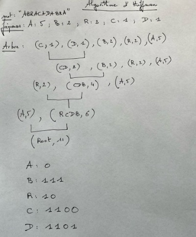

# Sujet : Comprendre et implémenter l’algorithme de Huffman

## 🎯 Objectif

Implémenter l'algorithme de Huffman, utilisé pour compresser un texte en construisant un code binaire optimal en fonction de la fréquence des lettres.

## 🗂️ Enjeu de l’algorithme

Lorsqu’on compresse des données (comme du texte, des images ou des sons), on cherche à réduire leur taille sans perdre d'information.
L'algorithme de Huffman est utilisé dans de nombreux formats de compression (ZIP, JPEG, MP3).

- Plus un caractère est fréquent, plus son code binaire doit être **court**.
- À l’inverse, les caractères rares peuvent avoir des codes plus longs.
- On construit un **arbre binaire** en fusionnant les caractères les moins fréquents petit à petit.


Étapes du Codage de Huffman 

1.	Calcul des Fréquences des Symboles : comptez la fréquence d'apparition de chaque symbole dans le texte à compresser. 
2.	Construction de l'Arbre de Huffman : 

Créez un nœud feuille pour chaque symbole avec sa fréquence associée.  

Ajoutez tous les nœuds dans une file de priorité (ou un tas), ordonnée par fréquence (les nœuds avec les fréquences les plus basses sont en tête).   

Répétez les étapes suivantes jusqu'à ce qu'il ne reste plus qu'un seul nœud dans la file.

Retirez les deux nœuds avec les plus basses fréquences de la file.

Créez un nouveau nœud interne avec ces deux nœuds comme enfants et une fréquence égale à la somme de leurs fréquences.

Ajoutez ce nouveau nœud dans la file. 

Le dernier nœud restant est la racine ou root de l'arbre de Huffman. 

3.	Génération des Codes de Huffman : 

Parcourez l'arbre de Huffman à partir de la racine pour assigner des codes binaires à chaque symbole. 

À chaque nœud interne, assignez "0" à la branche gauche et "1" à la branche droite (ou vice versa). 

Les codes binaires pour chaque symbole sont obtenus en suivant les branches de la racine aux feuilles.


4.	Exemple.




5.	Encodage des Données : 

Remplacez chaque symbole du texte par son code binaire correspondant pour obtenir la séquence compressée. 
Supposons que nous voulons compresser la chaîne "ABRACADABRA". 
Remplacez chaque symbole par son code : 
"ABRACADABRA" devient "0111101011001100011110010"

## 📦 Code Python

```python
# Définition d'une classe pour représenter chaque nœud de l'arbre de Huffman
class Noeud:
    def __init__(self, caractere, frequence):
        self.caractere = caractere
        self.frequence = frequence
        self.gauche = None
        self.droite = None

    def est_feuille(self):
        return self.gauche is None and self.droite is None

# Fonction pour construire l'arbre de Huffman à partir des fréquences
def creer_arbre_huffman(frequences):
    liste_noeuds = [Noeud(c, f) for c, f in frequences]

    while len(liste_noeuds) > 1:
        liste_noeuds.sort(key=lambda n: n.frequence)
        gauche = liste_noeuds.pop(0)
        droite = liste_noeuds.pop(0)

        nouveau_noeud = Noeud(None, gauche.frequence + droite.frequence)
        nouveau_noeud.gauche = gauche
        nouveau_noeud.droite = droite

        liste_noeuds.append(nouveau_noeud)

    return liste_noeuds[0]

# Fonction pour générer les codes de Huffman à partir de l'arbre
def generer_codes(noeud, code_actuel="", codes={}):
    if noeud is not None:
        if noeud.est_feuille():
            codes[noeud.caractere] = code_actuel
        else:
            generer_codes(noeud.gauche, code_actuel + "0", codes)
            generer_codes(noeud.droite, code_actuel + "1", codes)
    return codes

# Fonction pour encoder un message en utilisant les codes de Huffman
def encoder_message(message, codes):
    message_code = ""
    for caractere in message:
        message_code += codes[caractere]
    return message_code

# Fonction pour décoder un message binaire à l'aide de l'arbre de Huffman
def decoder_message(message_code, arbre):
    message_decode = ""
    noeud_actuel = arbre
    for bit in message_code:
        if bit == '0':
            noeud_actuel = noeud_actuel.gauche
        else:
            noeud_actuel = noeud_actuel.droite

        # Si on atteint une feuille, on ajoute le caractère et on repart de la racine
        if noeud_actuel.est_feuille():
            message_decode += noeud_actuel.caractere
            noeud_actuel = arbre
    return message_decode

# Exemple d'utilisation
# Message de base
texte = "abacabad"

# Calcul des fréquences manuellement (ou à partir du texte)
frequences = []
for caractere in set(texte):
    frequences.append((caractere, texte.count(caractere)))

# Création de l’arbre et des codes
arbre = creer_arbre_huffman(frequences)
codes = generer_codes(arbre)

# Affichage des codes
print("Codes de Huffman :")
for caractere in codes:
    print(f"{caractere} : {codes[caractere]}")

# Encodage
message_code = encoder_message(texte, codes)
print("\nMessage encodé :", message_code)

# Décodage
message_decode = decoder_message(message_code, arbre)
print("Message décodé :", message_decode)

```

Codes de Huffman :
d : 00
c : 01
b : 10
a : 11

Message encodé : 11101011001100
Message décodé : abacabad

## ✍️ Questions

1. **Compréhension du texte**
   - À quoi sert l’algorithme de Huffman ?
   - Pourquoi les caractères fréquents ont-ils des codes plus courts ?

2. **Analyse du code**
   - Que fait la fonction `build_huffman_tree` ?
   - Quel est le rôle de `heapq` ?
   - Pourquoi surcharge-t-on l’opérateur `<` dans la classe `Node` ?

3. **Expérimentation**
   - Essayez de compresser un mot comme `mississippi` avec ce code.
   - Vérifiez si le texte encodé est plus court en bits que le texte original (en supposant 8 bits par lettre).

## 🧪 Aller plus loin

- Compter le nombre de bits économisés par Huffman par rapport à l’encodage ASCII (8 bits/lettre).
- Modifier le code pour afficher l’arbre de Huffman de manière textuelle.
