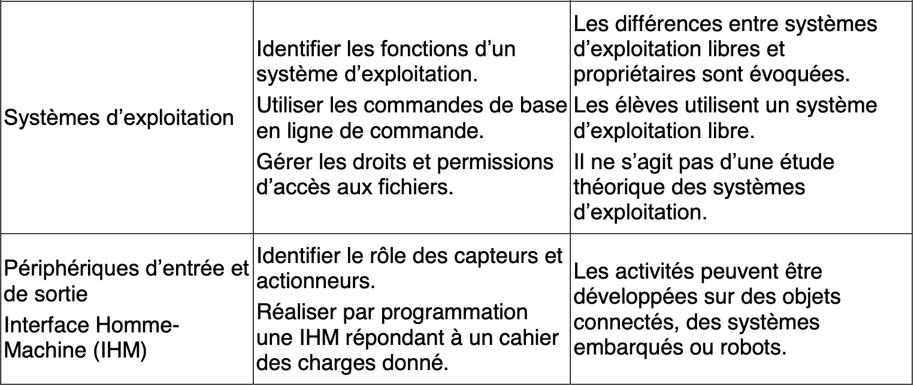

# Architectures matérielles et systèmes d'exploitation





# 1. Quelques éléments d'histoire de l'informatique

> À voir</u> : [Le modèle de la machine de Turing](https://interstices.info/le-modele-turing/)   

         
> À étudier</u> : [Comment fonctionne une machine de Turing ?](https://interstices.info/comment-fonctionne-une-machine-de-turing/)   
**on fera fonctionner la simulation sur les exemples donnés pour comprendre le fonctionnement de la machine de Turing**


Les travaux du mathématicien britannique **Alan Turing** à la fin des années 1930 sur le modèle de machine universelle, précédés par ceux du mathématicien **Alonzo Church**, ont été fondateurs de l'informatique.
Alan Turing est connu pour son rôle pendant la Seconde Guerre Mondiale au sein d'un groupe dont faisait partie la cryptologue **Joan Murray Clarke**, travaillant à déchiffrer les messages de la machine Enigma de l’armée allemande. Il travailla en particulier sur les concepts de programmation et d’intelligence artificielle. Ces travaux vont inspirer **John Von Neumann**, mathématicien et physicien américain d’origine hongroise. Avec des collaborateurs comme John Presper Eckert et John William Mauchly, il énonce en 1945 les principes d’architecture d’un ordinateur. Parallèlement, **Djon Atanasov** construit son calculateur ABC avec Clifford Berry.        
Les notions de langage et d’algorithme étaient déjà anciennes. **Claude Shannon** apporta dans la même période, les années 1940, une théorie mathématique de l’information. Il s’agit d’une théorie probabiliste destinée à quantifier un contenu en information dans un message. Shannon, ingénieur et mathématicien, travaillait particulièrement sur une théorie mathématique de la communication entre machines. Il utilisait régulièrement le mot bit pour le codage de deux états, 0 et 1. Une théorie algorithmique de l’information, plus proche des travaux de Church et de Turing, sera proposée dans les années 1960 par le mathématicien russe **Kolmogorov**.
L’informatique est née et tous les ingrédients sont présents pour la construction d’un ordinateur.     
La composition d’un ordinateur a grandement évolué avec le temps. On peut distinguer plusieurs générations d’ordinateur, chaque génération étant caractérisée par des critères de volume, de poids, de coût, de langage, liés aux progrès de la technologie.         
Dans les années 1940, les premiers ordinateurs sont lourds, volumineux et ils dégagent beaucoup de chaleur. Seuls les militaires ont les moyens d’en construire et de les utiliser. Ce sont par exemple l’E.N.I.A.C (Electronic Numeric Integrator Analyser and Computer) aux États-Unis et la série Z1, Z2, Z3 en Allemagne. Le Z3, conçu par l’ingénieur allemand Konrad Suze et achevé en 1941, est programmable et utilise des **tubes électroniques**. Les programmes à base de rubans perforés ou de câbles et commutateurs sont en **langage de bas niveau**.
Le premier **compilateur** est conçu en 1951 par **Grace Hooper**, informaticienne dans l’armée américaine, qui est aussi à l’origine du langage COBOL en 1959. C’est à cette période que les tubes électroniques sont remplacés par des **transistors**. La puissance de calcul augmente, le coût et la taille diminuent, les grandes universités commencent à s’équiper d’ordinateurs.
L’invention du **circuit intégré** est un nouveau tournant dans les années 1960. On parle de puce en français, de chip en anglais. Ces circuits beaucoup plus petits contiennent des millions de transistors gravés dans du silicium. Des ordinateurs peuvent être embarqués dans les missions Apollo de la NASA. L’AGC (Apollo Guidance Computer), qui pèse une trentaine de kilos, avec clavier, écran et interface utilisateur, gère la navigation et le pilotage de la fusée et du module lunaire. Son **processeur** contient plus de 5000 **portes logiques** NOR.
En 1971, un ensemble de circuits intégrés constituent le processeur, le cœur de l’ordinateur. En 1972, c’est la naissance du **langage C**, langage de haut niveau. La démocratisation va commencer et les premiers ordinateurs pour le grand public apparaissent vers la fin des années 1970. C’est aussi à cette période qu’apparaissent les premiers appareils photographiques numériques (APN). Mais il faut attendre 2007 pour voir arriver les premiers smartphones fonctionnant avec un **système d’exploitation** et des applications. Ils permettent de prendre des photos numériques de qualité à partir des années 2010. Grâce à des **algorithmes** de plus en plus performants, l’image reçue par les capteurs formés de photosites est transformée en une image formée de pixels, avec une résolution de l’ordre des mégapixels, enregistrée sur une carte mémoire.

### Ce qu'il faut retenir :
* Le transistor est le composant électronique, inventé vers le milieu du 20<sup>e</sup> siècle, qui a permis le développement des ordinateurs actuels.

# 2. Le modèle d'architecture matérielle : le modèle dit « de von Neumann »

> À lire</u> : [Le modèle d'architecture séquentielle de von Neumann](https://interstices.info/le-modele-darchitecture-de-von-neumann/)

L’architecture des ordinateurs actuels repose sur le **modèle de Von Neumann** qui travaillait  en 1945 comme consultant dans le projet ENIAC. L’architecture qui a gardé son nom est basée sur l’idée de **programme enregistré**, idée selon laquelle la mémoire de l’ordinateur, dans laquelle sont stockées les données, doit également servir à stocker les programmes.  

Une machine fonctionnant selon l'architecture de Von Neumann doit s’organiser en quatre parties différentes avec :    

-	Une **mémoire**. 
-	Une **unité arithmétique et logique** située dans le processeur et chargée d'effectuer les calculs et les opérations de base.  
-	Une **unité de contrôle** chargée du « séquençage » des opérations grâce à une **horloge** pour synchroniser le fonctionnement.     
-	Des **périphériques entrées/sorties**.  


Les différents éléments échangent des éléments à l’aide de **bus**.   

Physiquement, un système informatique est constitué de plusieurs éléments :  

Un boîtier contenant une **carte mère** avec un **microprocesseur**, des **barrettes de mémoire**, une **carte graphique**, une **carte réseau**, des **ports de communication** en contact direct, et des **périphériques** éloignés comme un disque dur, des **périphériques externes** parmi lesquels on distinguera les **périphériques d'entrée** comme un clavier, une souris, un scanneur et des **périphériques de sortie** comme un moniteur, des enceintes ou des écouteurs, une imprimante, qui se connectent par des ports ou par des systèmes sans fil comme le wifi ou le Bluetooth.   

La **carte mère** est un circuit imprimé, l’élément central d’un ordinateur, PC ou portable, d’une tablette ou d’un smartphone dont le rôle est de **connecter les différents éléments de l'ordinateur**. Le chipset gère le flux des données entre le processeur, la mémoire et les périphériques. Il détermine la vitesse des bus de communication permettant d’échanger des informations.  
On parle de mémoires au pluriel car elles sont plusieurs et de différents types.  
Les **« mémoires de masse »** sont des mémoires de grandes capacités, comme un disque dur ou une clé USB. Les données y sont conservées de manière persistante. L’accès à ces données en lecture et écriture n’est pas très rapide.  
La **RAM** pour Random Access Memory ou « mémoire vive » est une mémoire dite **volatile** : cela signifie que **son contenu est perdu dès que l’alimentation est coupée.** Cette mémoire est accessible **en lecture et en écriture**. Elle sert à **stocker, de façon temporaire, les données et les programmes lorsqu'ils sont exécutés par le processeur**. On peut l’imaginer comme un ensemble de cellules où chaque cellule a sa propre adresse et la capacité de stocker un octet. Ainsi, dès qu'un utilisateur lance une application, le système d'exploitation va l'ouvrir dans un espace disponible de la RAM.   
La **ROM** ou mémoire morte n’est accessible qu’**en lecture**. Elle contient juste le nécessaire permettant de faire démarrer l’ordinateur. C’est une mémoire **non volatile**.  
On trouve également des **registres** qui sont situés au niveau du processeur (CPU pour Central Processing Unit, c’est là que sont gérés les calculs et les instructions). Ce sont les éléments de mémoire les plus rapides car ils servent au stockage de nombres et de résultats intermédiaires. Proche du processeur se trouve la **mémoire cache**. De faible capacité mais rapide, elle permet de stocker les données les plus souvent utilisées.
En résumé, pour les éléments de mémoire, **plus on s’éloigne du processeur, plus leur capacité grandit mais plus leur temps d’accès s’allonge**.
Le temps d’exécution est crucial, et la vitesse de calcul des machines n’a cessé d’augmenter. Pour cela, le principal levier était la **fréquence d’horloge**. Mais il fallait en même temps refroidir le processeur dont la température augmente avec la vitesse de calcul. Depuis une quinzaine d’années, le choix a été fait par les constructeurs d’augmenter le nombre d’unités de calcul et de contrôle, et le nombre de registres. Autrement dit, on augmente le nombre de processeurs, ou de cœurs. On parle actuellement de **processeurs multi-cœurs** (ou multi-core en anglais) qui équipent la plupart des nouveaux ordinateurs et smartphones. Évidemment, cela ne résout pas toutes les questions de rapidité. En effet les différents cœurs doivent se partager les mémoires cache et la RAM. Il faut de plus que les programmes soient écrits pour ce type d’architecture.

### Ce qu'il faut retenir :

* Savoir distinguer la mémoire vive ou **RAM** (random access memory, littéralement « mémoire à accès direct ») accessible en lecture et en écriture, de la mémoire morte ou **ROM** (read only memory, littéralement « mémoire à accès uniquement en lecture ») accessible uniquement en lecture.
* Retenir que plus les élements de mémoire ont une capacité grande, plus les temps d'accès sont longs.  

Exemple : supposons qu'un ordinateur possède les caractéristiques matérielles suivantes: 

	- mémoire DDR SDRAM : 8 Go
	- antémémoire ou mémoire cache : 1 Mo 
	- disque dur SSD : 1 To. 
L'accès mémoire du plus rapide au moins rapide sera : Antémémoire (1 Mo = 10^6 o) puis DDR SRDRAM (1 Go = 10^9 o) puis SSD (1 To = 10^12 o). 

* Sur un ordinateur, le système d'exploitation ou OS (Operating System) est stocké sur le disque dur ou sur le disque SSD.

* Dans un processeur, le **compteur ordinal** ou pointeur d'instruction (en anglais : instruction pointer ou program counter) est le **registre** (souvent nommé PC) qui contient l'**adresse mémoire** de l'instruction en cours d'exécution ou de la prochaine instruction à exécuter.

* Un **capteur** est un dispositif transformant l'état d'une grandeur physique observée en une grandeur utilisable, telle qu'une tension électrique, une hauteur de mercure, une intensité ou la déviation d'une aiguille.

Exemple : Parmi les dispositifs suivants : diode, écran tactile, thermomètre, moteur pas à pas, seul le thermomètre constitue un capteur puisqu'il transforme une grandeur physique, la température, en hauteur de liquide ou en valeur numérique.


# 3. Fonctionnement logique : circuits combinatoires

Il s'agit de faire le lien entre circuits électroniques, calcul logique et calcul binaire.

> À lire et à faire avec le logiciel Logisim</u> : [Du transistor aux fonctions logiques ](Du_transistor_aux_fonctions_logiques.pdf)

N.B : Le logiciel Logisim est un logiciel gratuit permettant de comprendre les circuits combinatoires permettant de mettre en oeuvre des fonctions booléennes.

# 4. Notions de langage machine (non exigible)

Les instructions d'un programme écrit dans un langage de haut niveau sont traduites pour être comprises par la machine. Avec le module `dis`, nous pouvons avoir une idée des instructions passées à la machine lorsque nous écrivons du code en Python.

> À faire dans le Shell de Thonny</u>

```python
import dis
dis.dis('x=1;x=x+2')
>>> 
  1           0 LOAD_CONST               0 (1)
              2 STORE_NAME               0 (x)
              4 LOAD_NAME                0 (x)
              6 LOAD_CONST               1 (2)
              8 BINARY_ADD
             10 STORE_NAME               0 (x)
             12 LOAD_CONST               2 (None)
             14 RETURN_VALUE
```
Nous suivons ces instructions dans l'ordre :

- La constante 1 est copiée dans un registre : LOAD_CONST = charge en mémoire
- Le contenu du registre est copié dans la mémoire à la case adressée par x : STORE_NAME = conserve en mémoire
- La valeur de x est copiée dans un registre : LOAD_NAME
- Le nombre 2 est copié dans un registre : LOAD_CONST
- L'addition des deux est exécutée  BINARY_ADD
- Le résultat est copiée dans la mémoire à la case adressée par x
- La valeur None est copiée dans un registre
- Elle est renvoyée

Chaque instruction binaire est composée d'un nombre binaire codant l'opération à réaliser, suivi des opérandes, c'est-à-dire les données sur lesquelles l'opération est effectuée, codées également en binaire. Les instructions LOAD et STORE permettent de copier et d'**échanger des données entre le processeur et la mémoire**.
Par exemple, pour l'instruction LOAD_CONST, le code qui correspond à ce que la machine doit exécuter est le nombre 100 en décimal. Ce code s'écrit en binaire sur un octet : 01100100. Vérifions le code de cette instruction.

```python
>>> dis.opmap['LOAD_CONST']
100
>>> dis.opname[100]
'LOAD_CONST'
```

En langage assembleur, on aurait : 

```
MOV R0, #1
STR R0, x
LDR R0, x
MOV R1, #2
ADD R0, R0, R1
STR R0, x
```

Dans le code précédent, les instructions sont exécutées dans l'ordre d'écriture, l'une après l'autre. Il est possible de rompre cette séquence, par exemple dans le calcul d'une expression logique ou dans un programme avec un branchement.

Considérons l'expression logique True and False qui donne logiquement False conformément à la table de vérité de l'opération logique `and`.

```python
>>> True and False
False
>>> dis.dis('True and False')
  1           0 LOAD_CONST               0 (True)
              2 JUMP_IF_FALSE_OR_POP     6
              4 LOAD_CONST               1 (False)
        >>    6 RETURN_VALUE
```

L'opérateur `and` fait un saut à la dernier ligne `JUMP_IF_FALSE_OR_POP  6` si la valeur est False.

Autre exemple :

```python
code="""
x=3
if x<0:
    y=-x
else:
    y=x
"""
dis.dis(code)
>>> 
  2           0 LOAD_CONST               0 (3)
              2 STORE_NAME               0 (x)

  3           4 LOAD_NAME                0 (x)
              6 LOAD_CONST               1 (0)
              8 COMPARE_OP               0 (<)
             10 POP_JUMP_IF_FALSE       20

  4          12 LOAD_NAME                0 (x)
             14 UNARY_NEGATIVE
             16 STORE_NAME               1 (y)
             18 JUMP_FORWARD             4 (to 24)

  6     >>   20 LOAD_NAME                0 (x)
             22 STORE_NAME               1 (y)
        >>   24 LOAD_CONST               2 (None)
             26 RETURN_VALUE
```
L'instruction `POP_JUMP_IF_FALSE 20` signifie que si le test est faux, le programme saute à l'instruction `20 LOAD_NAME` pour charger la valeur de x et la stocker dans y. Sinon le programme se poursuit avec `12 LOAD_NAME` pour charge la valeur de x, puis avec `14 UNARY_NEGATIVE` pour prendre son opposée et la stocker dans y avec `16 STORE_NAME` et finalement sauter à la fin du programme `24 avec JUMP_FORWARD`.

Le module `dis` de Python nous propose d'autres fonctionnalités :

```python
def f():
    x=2
    x=x+3
code=f.__code__.co_code
for octet in code:
    print(octet,end="")
>>> 
100112501240100223012501000830
```

Ce qu'on lit est en fait une liste de codes d'instructions :

100 1 125 0 124 0 100 2 23 0 125 0 100 0 83 0

```python
>>>  dis.opname[100]
'LOAD_CONST'
>>>  dis.opname[1]
'POP_TOP'
>>> dis.opname[125]
'STORE_FAST'
>>> dis.opname[124]
'LOAD_FAST'
>>> dis.opname[83]
'RETURN_VALUE'
```

# 5. Système d'exploitation

Un **système d'exploitation**, OS pour Operating System, est un programme exécuté au démarrage d'une machine. Il permet de gérer les fichiers, les répertoires, les processus, les périphériques, en proposant des outils pour cela. Ces outils sont des gestionnaires de fichiers, d'applications, de périphériques. Les OS les plus répandus sont Windows, MacOs, GNU/Linux avec différentes distributions comme Ubuntu, Debian, Fedora, pour ordinateurs et Android, iOsS pour mobile.   
Un fichier avec sa gestion est un concept abstrait. Pour le mettre en œuvre physiquement, chaque OS utilise un format d’enregistrement avec un système d’adresses, comme NTFS pour Windows qui met à la disposition de l’utilisateur l’outil « Explorateur de fichiers » pour copier, déplacer, supprimer un fichier ou un répertoire.
Le système d’exploitation permet aussi de gérer l’**authentification** de chaque utilisateur ainsi que les différents droits d’accès sur les fichiers (lecture, écriture et suppression). On distingue en particulier des comptes administrateurs et différents types de comptes utilisateurs.
Les OS sont des systèmes libres ou propriétaires. Les différences sont notables : outre la gratuité, un système libre comme GNU/Linux favorise la possibilité d’installer ou de réinstaller le système avec différentes partitions et plus généralement de gérer la machine comme on l’entend. Il facilite aussi l’installation de plusieurs OS distincts sur une même machine. On parle de « dual boot ». Mais la plupart des appareils vendus sur le marché sont équipés d’un système d’exploitation propriétaire qui nous est vendu avec. 

**Organisation du disque dur** : À la sortie d'usine, le disque dur est formaté. Il s'agit d'un formatage de bas niveau qui organise le disque en différentes parties appelées pistes, cylindres, secteurs. Ces parties vont permettre de localiser les informations inscrites sur le disque. Ensuite, lorsqu'un système d'exploitation est installé sur le disque, un partitionnement de celui-ci peut être effectué afin par exemple d'installer d'autres systèmes d'exploitations ou plus simplement de séparer les programmes et les données. Un formatage de haut niveau est effectué qui consiste à regrouper les secteurs du disque en blocs appelés clusters. Le résultat est un système de fichiers particulier au système d'exploitation. La liste des clusters est inscrite dans une table, la FAT (File Allocation Table). On ne peut pas avoir deux fichiers enregistrés sur le même cluster.
Le premier secteur d'un disque dur est le secteur de démarrage appelé MBR (Master Boot Record). C'est là qu'est inscrit le code qui fait démarrer le système ainsi que des informations relatives au disque dur comme le fabricant, le numéro de série, les tailles et nombres des différentes parties (secteurs, clusters, pistes, cylindres).

**Fonctions d'un système d'exploitation** : Un système d'exploitation propose un environnement graphique convivial afin que l'utilisateur puisse sélectionner les actions qu'il souhaite faire accomplir par la machine. Les fonctions d'un système d'exploitation sont nombreuses. Elles sont accessibles à l'aide d'outils comme le panneau de configuration, le gestionnaire de périphériques, le gestionnaire de tâches, pour Windows. Elles permettent de gérer le fonctionnement de tous les éléments constituant le système informatique.
En général, nous agissons sur un ordinateur à l'aide de menus dans lesquels nous pouvons choisir nos demandes. Auparavant la seule manière était d'écrire des instructions avec un clavier et la machine répondait en affichant du texte à l'écran. Cette possibilité existe encore avec l'**invite de commandes sous Windows** ou avec un **terminal sous Linux** : [Linux - commandes fondamentales ](https://juliend.github.io/linux-cheatsheet/)

À faire sous un système d'exploitation Linux</u> : [Initiation au Shell et gestion des droits de permission ](initiation_shell.md)

### Ce qu'il faut retenir :

* La commande **`pwd`(Print Working Directory)** affiche le chemin du dossier courant et permet donc de connaître le répertoire courant.
* La commande **`man` (Manual)** permet obtenir le manuel d'une commande. Par exemple `man pwd` permet d'obtenir la documentation sur la commande `pwd` et on retrouve en anglais ce que l'on a dit précédemment.
* La commande shell **`cd` (Change Directory)**, accompagnée du nom du répertoire, permet de se placer dans un répertoire donné, par exemple :
`cd NSI` permet de se placer dans le répertoire `NSI` s'il se trouve lui-même dans le répertoire courant. `cd ~` permet de se placer à la racine. La commande shell **`cd ..`**, accompagnée de deux points, permet de **remonter dans l'arborecence** c'est-à-dire, à partir du répertoire courant, de se positionner dans le répertoire supérieur qui le contient.
* La commande shell **`ls` (LiSt)**, seule, permet d'explorer le contenu du répertoire courant en listant son contenu. La commande avec option `ls -l` permet en plus d'avoir les droits d'accès au fichier : neuf caractères indiquent les attributs des droits d'accès au fichier ou au répertoire correspondant. Ces neuf caractères sont formés de trois groupes de trois caractères, indiquant respectivement les attributs des droits d'accès du propriétaire puis du groupe du propriétaire et enfin des autres (ni le propriétaire, ni les membres de son groupe). Par ailleurs on peut lister plus spécifiquement un type de fichier par exemple  `ls -l *.jpg` permet de lister les fichiers du répertoire courant dont l'extension est jpg.
Enfin l'option `ls -a` permet d'afficher les fichiers cachés.
* La commande shell **`cat` (conCATenate)** suivie du nom du fichier permet simplement d'afficher ou de lire un fichier dans la console. 
* La commande shell **`mkdir` (Make Ddirectory)** suivie d'un nom de répertoire, permet de créer un nouveau répertoire ou dossier portant ce nom dans le répertoire courant. Par exemple, supposons que l'on se trouve dans le répertoire `/home/ubuntu/`, l'exécution de la commande `mkdir ./Documents/Holidays` crée un dossier Holidays dans le répertoire `/home/ubuntu/Documents`. On peut créer plusieurs dossiers simultanément dans le même répertoire en séparant les dossiers par des virgules, par exemple : `mkdir JAVA, PYTHON, PHP` crée les trois dossiers dans le répertoire courant.
* La commande shell **`mv` (Move)** permet non seulement de déplacer des fichiers vers un dossier mais elle permet également de renommer un fichier.
* La commande shell **`cp` (Copy)** permet de copier un fichier pour en créer un autre. Si on reste dans le même répertoire et que l'on fait par exemple la duplication du fichier `NSI1.txt` situé dans le répertoire courant en un fichier `NSI2.txt`, on écrira simplement : `cp NSI.txt NSI2.txt`.
* La commande shell **`rm`(ReMove)** supprime un/des fichier(s) ou des répertoires (avec l'option -r). 
* La commande shell **`chmod` (Change Mode)** permet de changer les **autorisations ou permissions d'accès** d'un fichier ou d'un répertoire. Un utilisateur a le droit de faire un `chmod` sur un fichier s'il est root ou s'il est le propriétaire du fichier en question.  
Pour un fichier : `chmod [u g o a] [+ - =] [r w x] nom du fichier`. Les modes sont : `u` propriétaire (user), `g` groupe (group), `o` les autres (others), `a` tous (all).  
Les permissions sont : `r` : autorisation de lecture (read), `w` : autorisation d'écriture
(write), autorisation d'exécution `x` (execute).  
Pour un dossier, il faut ajouter -R, par exemple : `chmod -R a+rx mon_dossier` donne à tous les utilisateurs les droits en écriture et en exécution à tout ce que contient le dossier `mon_dossier`.
 
<u>Exemple 1</u> : considérons la suite de commandes :  

```python
ls
entier.py flottant.py readme.md
mkdir foo
mv *.py foo
```
On commence par explorer le contenu du répertoire courant avec la commande `ls` et on trouve trois fichiers donc deux fichiers python à l'extension py et un fichier markdown à l'extension md ; on crée ensuite un dossier foo avec la commande `mkdir` et on place dans ce dossier tous les fichiers pythons de sorte que le dossier foo contient maintenant deux fichiers d'extension .py

<u>Exemple 2</u> : supposons que le dossier courant soit `~/Doc/QCM` et que l'on cherche à rejoindre le dossier `~/.Hack/Reponses`, la bonne commande est :

```python
cd ../../.Hack/Reponses
```
Cette écriture séparée de deux caractères / est en fait la suite de commandes :  `cd ..` qui permet de passer dans un premier temps dans le dossier père Doc puis `cd ..` à nouveau qui permet de remonter à nouveau au répertoire racine `~` puis `cd .Hack` qui permet d'entrer dans le dossier `.Hack` puis `cd Reponses` qui permet de se rendre enfin dans le dossier `Reponses`.

<u>Exemple 3</u> : supposons que l'on dispose dans le répertoire racine noté `~` ou `./` deux répertoires `documents` et `sauvegardes`. On se trouve dans le répertoire `documents` où figure un fichier `NSI.txt`, les commandes ci-dessous vont nous permettre de créer une copie nommée `NSI2.txt` de ce fichier dans le répertoire `sauvegardes`.

```python
cp NSI.txt ../sauvegardes/NSI2.txt
```
L'analyse de la commande permet de voir que l'on commence par copier le fichier `NSI.txt` puis, comme on se trouve dans le dossier `documents`, on doit remonter au répertoire racine grâce à `../` puis on va faire la copie dans le dossier `sauvegardes`. 
Si maintenant on suppose que l'on ait dans le répertoire `sauvegardes`, on écrit la commande `cp NSI2.txt NSI3.txt`, il y a maintenant deux fichiers présents dans ce dossier, le fichier `NSI2.txt` a en effet été copié sous le nom `NSI3.txt` et non renommé sous le nom `NSI3.txt`. Enfin, si toujours placé dans le répertoire `sauvegardes`, on écrit  la commande `ls NSI*`, on obtient `NSI2.txt`	`NSI3.txt` car la commande nous permet de lister tous les fichiers qui commencent par `NSI`. On peut également créer dans le répertoire racine un fichier texte que l'on pourra nommer `liste.txt` listant les différents fichiers textes contenus dans le répertoire `sauvegardes` en faisant : `ls sauvegardes>>liste.txt`. Enfin si, à partir du répertoire racine, on veut faire une copie de tous les fichiers textes contenus dans le dossier `sauvegardes` dans le dossier `documents`, on écrira : `cp sauvegardes/*.txt documents`.


<u>Exemple 4</u> : considérons la suite de commandes :

```python
cd
ls
Documents Images Videos help.txt tutorial.txt script.py
mv *.txt Documents
```

La dernière commande permet de déplacer tous les fichiers possédant l'extension txt, c'est-à-dire les fichiers help.txt et tutorial.txt, dans le dossier Documents.

<u>Exemple 5</u> : considérons la suite de commandes :

```python
cd ~
cd seances/tp
mv exercice.txt ./../../exercice.txt
```

Le fichier `exercice.txt` se retrouve finalement dans le répertoire racine `~`.


<u>Exemple 6</u> : Supposons que l'on ait dans un dossier `sauvegardes` un fichier  `NSI3.txt` que l'on veuille renommer en `NSI4.txt` la commande à utiliser une fois dans le dossier `sauvegardes` est : `mv NSI3.txt NSI4.txt`.

<u>Exemple 7</u> : supposons que l'on veuille supprimer tous les fichiers contenus dans le répertoire courant où l'on se trouve, on écrira : `rm *`. Le `*` signifie que l'on prend tout.

<u>Exemple 8</u> : supposons que l'on veuille donner à tout le monde le droit d'écriture sur un fichier `information.py`, la commande à écrire dans un terminal sous Linux est : 
`chmod a+w information.py`.  
Supposons maintenant que l'on veuille permettre au propriétaire (user) du fichier `a.txt` de modifier (en lecture et  écriture) le contenu de ce fichier, on écrira : `chmod u+rw a.txt`.  
Supposons enfin que l'on veuille permettre à n'importe quel utilisateur d'exécuter un fichier appelé jeu, on écrira : `chmod a+x jeu`.

<u>Exemple 9</u> : Après avoir utilisé la commande `ls -l`, on suppose qu'on lise pour une première ligne les droits d'accès suivants : `-rwxr-xr--` ; la présence de `-` permet d'attribuer cette ligne à un fichier, de plus le premier groupe de caractères indique les droits en lecture, en écriture et en exécution pour l'utilisateur mais l'absence du caractère `w` dans le deuxième groupe de caractères montre qu'il n'y a pas droit d'écriture (write) donc pas de modification possible de ce fichier pour les membres du groupe.  
Si à la suite on lit une autre ligne par exemple `drwxrwxrwx` la présence du `d` au début indique qu'il s'agit d'un répertoire (directory). 


* On retiendra qu'un **système d'exploitation libre** est un système d'exploitation composé de logiciels libres ; un logiciel libre est, selon la définition de la Free Software Foundation, un programme qui accorde 4 libertés essentielles à l'utilisateur : liberté d'exécuter le programme pour n'importe quel usage, liberté de le modifier pour y contribuer, liberté de redistribuer des copies du programme et liberté de distribuer des versions modifiées. Le contraire d'un système d'exploitation libre est un système sous **licence propriétaire** ; ainsi Windows, MacOS sont sous licence propriétaire à la différence de GNU-Linux, Ubuntu ou Android (pour mobiles).

# 6. Transmission des données dans un réseau

À lire : [Transmission des données dans un réseau ](reseau.pdf).    
  

### Ce qu'il faut retenir :

* Dans un réseau informatique, la transmission des données se fait par **paquets** ou **trames** ce qui assure une utilisation efficace des liens de connexion.

* Une commande importante dans un réseau informatique est la **commande `ping`** qui permet de tester si la connexion peut être établie avec une machine distante à travers un réseau IP ; dans le Terminal essayer par exemple `ping www.google.fr`. La commande fonctionne en envoyant un paquet à une adresse donnée et attend une réponse par exemple :  `64 bytes from 216.58.213.131: icmp_seq=3 ttl=54 time=10.366 ms `. Elle mesure ainsi la durée d'un aller-retour et rapporte les erreurs. `216.58.213.131` représente l'adresse IP locale du serveur que l'on veut atteindre.

* Une autre commande importante dans un réseau informatique est la **commande `traceroute`** (trace the route) ; dans le Terminal essayer `traceroute www.google.fr` pour afficher le chemin suivi par des paquets à travers le protocole IP. `traceroute to www.google.fr (216.58.213.131), 64 hops max, 52 byte packets` permet de suivre ansi un paquet depuis votre ordinateur jusqu'au serveur en indiquant le nombre d'étapes (hops) et le temps mis par chaque étape. Si jamais un `hop` renvoie `Request timed out` cela signifie qu'il y a une congestion du réseau ou un ralentissement du temps de chargement des pages Web. Ainsi si vous soupçonnez que des paquets se perdent entre votre ordinateur et leur destination, la commande `traceroute` permet de trouver la source du problème efficacement. 

* Un **serveur DNS (Domain Name System)** permet d'associer une adresse IP à une adresse URL ; par exemple, avec un `ping` on trouvera que l'adresse IP associée au **serveur** du site www.education.gouv.fr est 152.199.21.182 ; c'est au serveur DNS qu'il revient donc de faire cette association.
* Un **routeur** est un équipement réseau informatique assurant le routage des paquets. Son rôle est de faire transiter des paquets d'une interface réseau vers une autre, au mieux, selon un ensemble de règles, **dans le but d'interconnecter des réseaux**.

* Dans le but d'interconnecter des ordinateurs entre eux, on utilisera un **interconnecteur** qu'est un câble Ethernet.

* Le **commutateur ou switch** établit et met à jour une table; dans le cas du commutateur pour un réseau Ethernet il s'agit de la table d'adresses MAC, qui lui indique sur quels ports diriger les trames destinées à une adresse MAC donnée, en fonction des adresses MAC source des trames reçues sur chaque port. Le commutateur construit donc dynamiquement une table qui associe numéro de port et adresses MAC. 

* Un **serveur** web est un ordinateur qui héberge les pages web et qui les envoie dans la machine de l'utilisateur qui consulte ces pages. Dans **l'architecture client-serveur**, le client émet une requête vers le serveur grâce à son adresse IP et le port, qui désigne un service particulier du serveur. Le serveur reçoit la demande et répond à l'aide de l'adresse de la machine client et son port. Les services sont exploités par des programmes, appelés programmes clients, s'exécutant sur les machines clientes. On parle ainsi de client (client FTP, client de messagerie, etc.) lorsque l'on désigne un programme tournant sur une machine cliente, capable de traiter des informations qu'il récupère auprès d'un serveur (dans le cas du client FTP il s'agit de fichiers, tandis que pour le client de messagerie il s'agit de courrier électronique). On peut dire que l'architecture client-serveur est une architecture matérielle de coopération entre machines.

* Une **adresse IP** permet d'identifier un périphérique connecté au réseau. Chaque appareil connecté au réseau dispose d'une adresse IP. L'ordinateur ou le smartphone que vous utilisez dispose d'une adresse IP unique. La version 4 est actuellement la plus utilisée : elle est généralement représentée en notation décimale avec quatre nombres compris **entre 0 et 255**, séparés par des points, ce qui donne par exemple « 172.16.254.1 ». Une adresse telle que « 127.3.87.256 » serait évidemment invalide à cause de la valeur 256. La commande **`ipconfig`** (windows) ou **ifconfig** (mac) permet d'afficher l'adresse Ipv4 d'une machine. Il est alors possible de **tester le dialogue entre deux machines** en faisant un ping vers l'adresse Ipv4 d'une autre machine.

* Une **adresse Ethernet ou adresse MAC (Media Access Control)** identifie de manière unique le matériel informatique comme étant connecté au réseau. Ce type d’adresse est attribué définitivement au périphérique lors de sa fabrication, par le constructeur lui-même. La différence avec une adresse IP est que cette dernière est attribuée de façon unique à un équipement connecté à un réseau spécifique. Mais, elle est attribuée par l’administrateur réseau (ou par le serveur DHCP). L'adresse Ethernet est constituée de 48bits (soient 6 octets) et est généralement représentée sous la forme hexadécimale (0 à 9 puis A à F), en séparant les octets par le caractère `:`. Ainsi 8H:A9:D5:67:E6:F3 serait une adresse Ethernet invalide à cause de la présence du H.  

* Les **protocoles** sont l'ensemble des **règles** qui régissent les échanges sur Internet. Ainsi dans le **protocole de communication IP (Internet Protocol)**, les données sont envoyées en plusieurs parties qui suivent des itinéraires différents au sein du réseau et qui arrivent à destination en respectant l'ordre de leur envoi.  
Le **protocole de bit alterné** est implémenté au niveau de la couche de "liaison de données" du modèle OSI (couche n°2), il ne concerne donc pas les paquets, mais les trames (on parle de paquets uniquement à partir de la couche "Réseau" (couche 3) du modèle OSI). Le principe de ce protocole est simple, considérons 2 ordinateurs en réseau : un ordinateur A qui sera l'émetteur des trames et un ordinateur B qui sera le destinataire des trames. Au moment d'émettre une trame, A va ajouter à cette trame un bit (1 ou 0) appelé drapeau (flag en anglais). B va envoyer un accusé de réception (acknowledge en anglais souvent noté ACK) à destination de A dès qu'il a reçu une trame en provenance de A. À cet accusé de réception on associe aussi un bit drapeau (1 ou 0). La règle est relativement simple : la première trame envoyée par A aura pour drapeau 0, dès que cette trame est reçue par B, ce dernier va envoyer un accusé de réception avec le drapeau 1 (ce 1 signifie "la prochaine trame que A va m'envoyer devra avoir son drapeau à 1"). Dès que A reçoit l'accusé de réception avec le drapeau à 1, il envoie la 2e trame avec un drapeau à 1, et ainsi de suite... Le système de drapeau est complété avec un système d'horloge côté émetteur. Un "chronomètre" est déclenché à chaque envoi de trame, si au bout d'un certain temps, l'émetteur n'a pas reçu un acquittement correct (avec le bon drapeau), la trame précédemment envoyée par l'émetteur est considérée comme perdue et est de nouveau envoyée. En conclusion, le protocole du bit alterné permet de détecter des pertes de données lors de la transmission de données sur un réseau.   
Le **protocole DHCP (Dynamic Host Configuration Protocol)** est un protocole réseau dont le rôle est d'assurer la configuration automatique des paramètres TCP/IP d'une station, notamment en lui assignant automatiquement, de façon **dynamique**, une adresse IP et un masque de sous-réseau.

* L'**encapsulation**, pour les réseaux informatiques, est un procédé consistant **à inclure les données d'un protocole dans un autre protocole**. Ainsi un fragment de donnée est encapsulé dans un datagramme UDP qui lui-même est encapsulé dans un paquet IP, ce dernier étant alors envoyé via un protocole de la couche de liaison (par exemple Ethernet). La couche de liaison est responsable de la transmission physique des données ; IP ajoute l'adressage des ordinateurs individuels ; UDP ajoute « l'adressage des applications » (c'est-à-dire le port spécifiant le service comme un service web ou un serveur TFTP). Le modèle OSI et la suite des protocoles Internet utilisent l'encapsulation.


