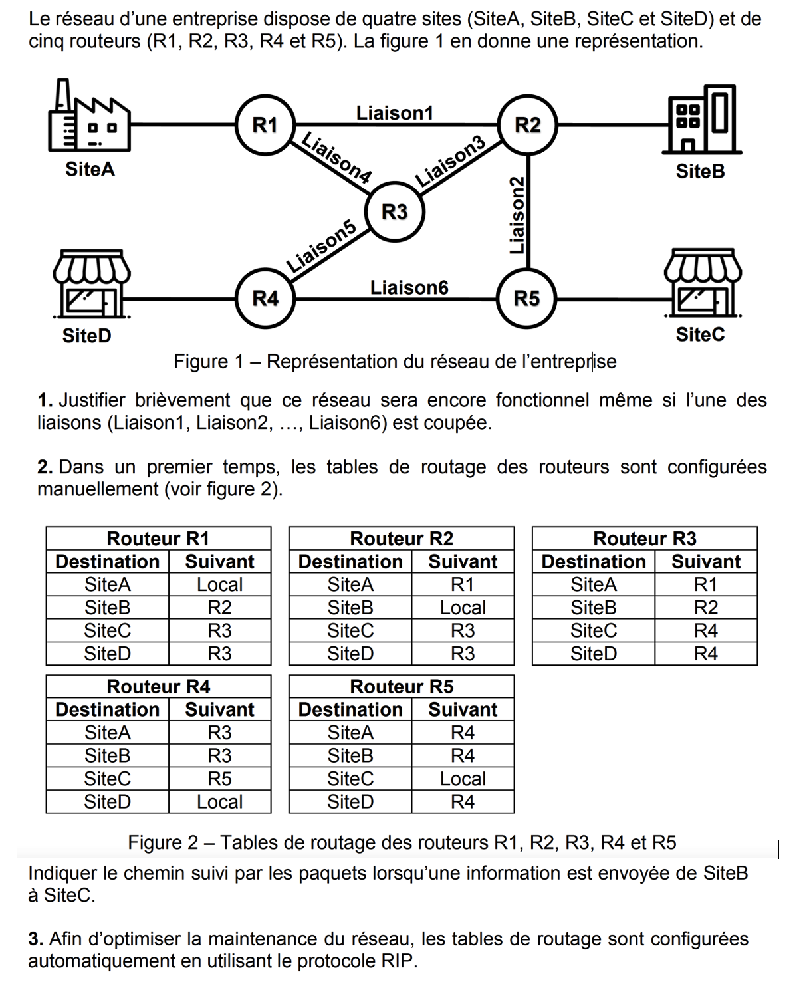
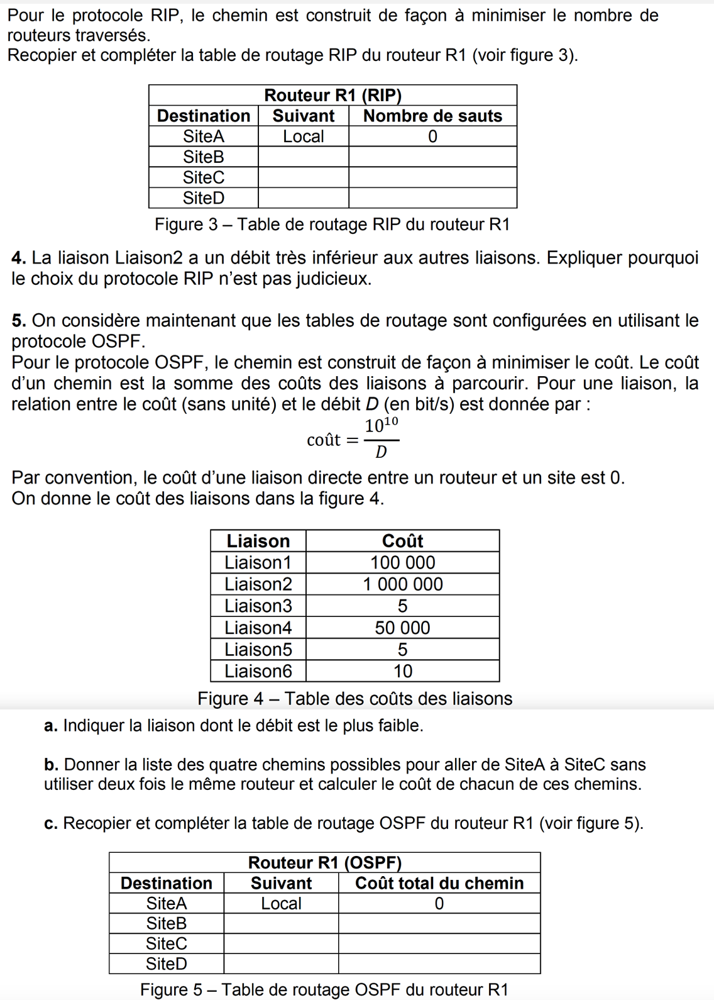
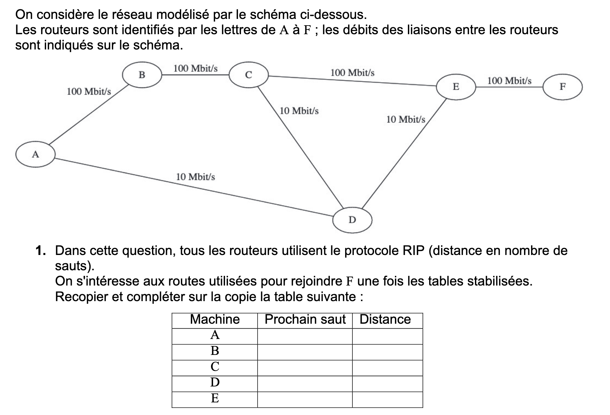
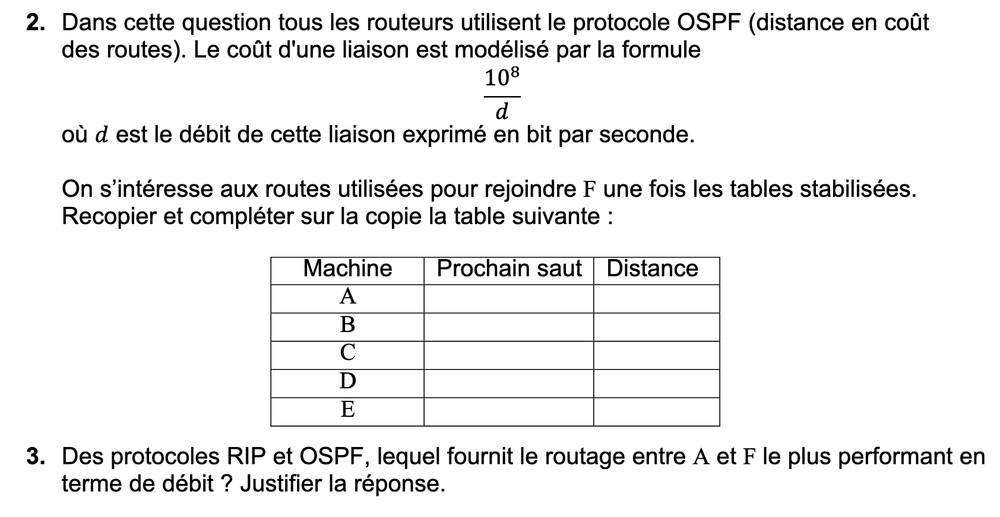

**Exercice 1** :

On définit la fonction mux qui prend en paramètres trois paramètres a, b, c de valeurs 0 ou 1. Si a vaut 0 alors mux(a,b,c) vaut b et si a vaut 1 alors mux(a,b,c) vaut c.

1. Dresser la table de vérité de la fonction mux.
2. Vérifier l'équivalence avec la fonction (not(a) and b) or (a and c).
3. Vérifier à l'aide du logiciel Logisim en mettant en œuvre les portes logiques.


**Exercice 2** : 

[Voir ici une simulation de CAN.](https://www.hatier-clic.fr/miniliens/mie/9782401059054/can/index.html)   

On dispose d'un capteur de température qui peut mesurer des températures allant de - 20°C à + 50°C. Ces températures sont converties en une tension électrique allant de 0 à 5 V.

1. Si on dispose de convertisseurs analogique-numérique avec une résolution de 6, 8 ou 10 bits. Quel(s) convertisseur(s) choisir pour avoir une précision d'au moins 1 degré ?

Indication : on étalira que pour un convertisseur analogique-numérique de N bits le pas de conversion ou pas de quantification est donné par p=(plage de conversion)/(2<sup>N</sup>).


2. On utilise un convertisseur analogique-numérique à 10 bits, pour des températures définies avec une précision de 0.1 degré, à quelle température correspond le nombre 512 ?


**Exercice 3** : 

[Numérisation d'un signal audio](assets/Sujet-ImplantCochleaire.pdf).  


**Exercice 4** :

On dispose d'un réseau d'adresse 192.168.1.0 avec le masque 255.255.255.0. Des sous-réseaux ont été constitués mais on souhaite avoir le nombre maximum de sous-réseaux et que chaque sous-réseau accueille une trentaine de postes.

1. Premier cas :

Un appareil connecté sur un sous-réseau possède une adresse sous la forme 192.168.1.12/28. Expliquer ce que signifie cette information en précisant le nombre d'appareils hôtes qui peuvent être connectés sur ce sous-réseau et combien de sous-réseaux peuvent être constitués.

2. Deuxième cas : 

Un appareil connecté sur un sous-réseau possède une adresse sous la forme 192.168.1.43/26. Expliquer ce que signifie cette information en précisant le nombre d'appareils hôtes qui peuvent être connectés sur ce sous-réseau.

3. Quelle devrait être la forme de son adresse pour que cela convienne à notre souhait ? Donner alors la solution du problème en précisant le nombre de sous-réseaux.

4. On cherche à réaliser un calculateur de masque IPv4 similaire à 
[celui-ci](https://cric.grenoble.cnrs.fr/Administrateurs/Outils/CalculMasque/)

Compléter le code suivant :

```Python

def conversion_decimal_binaire_sur_8_bit(decimal):
    """
    Renvoie le code binaire sur 8 bits d'un nombre décimal
    param : decimal : int
    return : str
    >>> conversion_decimal_binaire_sur_8_bit(12)
    '00001100'
    >>> conversion_decimal_binaire_sur_8_bit(192)
    '11000000'
    >>> conversion_decimal_binaire_sur_8_bit(168)
    '10101000'
    """


def conversion_binaire_decimal(binaire):
    """
    Renvoie la valeur décimale du code binaire
    param : binaire : str
    return : int
    >>> conversion_binaire_decimal("00000101")
    5
    """


def calculateur_masque_IPV4(adresseIP,CIDR):
    """
    Renvoie les adresses du masque, ainsi que de la première et dernière machine du sous-réseau
    param : adresseIP : str
    param : CIDR : int
    >>> calculateur_masque_IPV4("192.168.1.12",28)
    'masque : 255.255.255.240 ; première machine : 192.168.1.1, dernière machine : 192.168.1.14'
    >>> calculateur_masque_IPV4("192.168.1.43",26)
    'masque : 255.255.255.192 ; première machine : 192.168.1.1, dernière machine : 192.168.1.62'
    """


    
if __name__ == '__main__':
    import doctest
    doctest.testmod(optionflags=doctest.NORMALIZE_WHITESPACE | doctest.ELLIPSIS, verbose=True)
```


**Exercice 5** :




**Exercice 6** :




