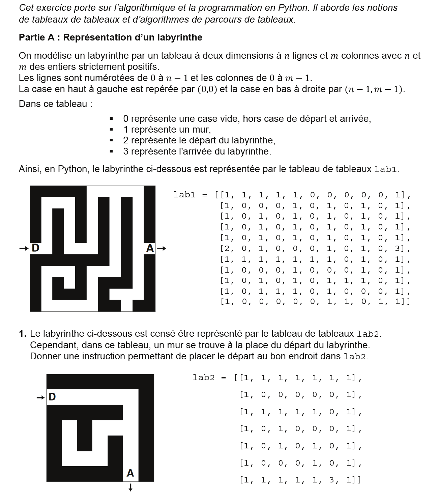
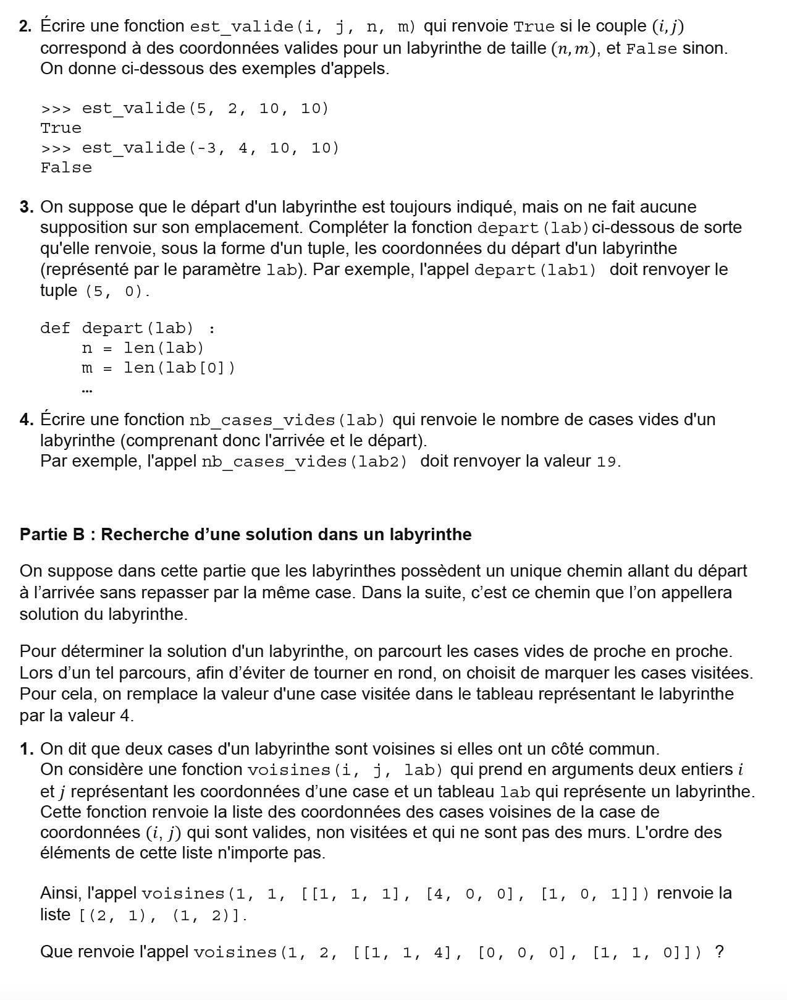
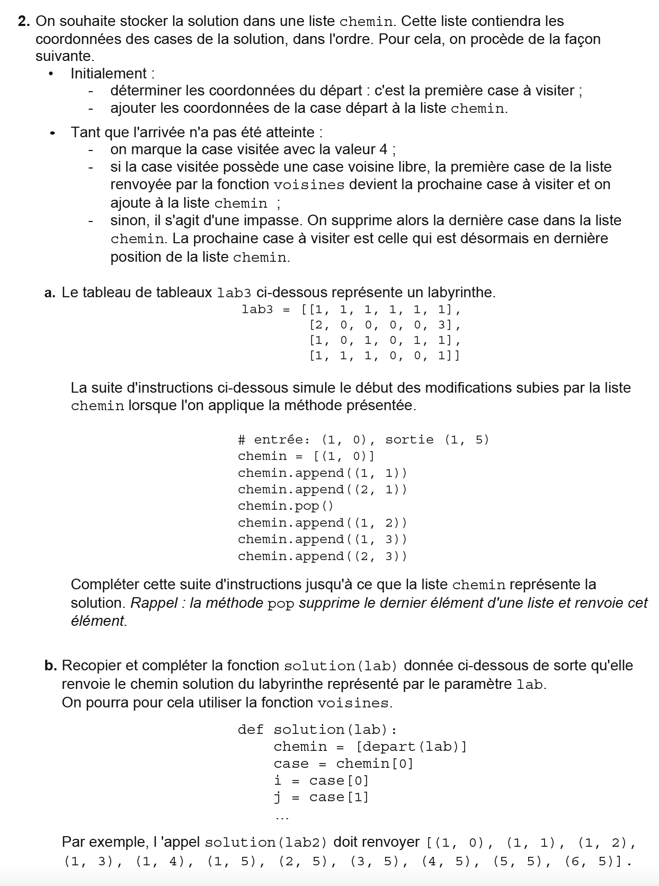

```python
lab1 = [[1, 1, 1, 1, 1, 0, 0, 0, 0, 0, 1],
[1, 0, 0, 0, 1, 0, 1, 0, 1, 0, 1],
[1, 0, 1, 0, 1, 0, 1, 0, 1, 0, 1],
[1, 0, 1, 0, 1, 0, 1, 0, 1, 0, 1],
[1, 0, 1, 0, 1, 0, 1, 0, 1, 0, 1],
[2, 0, 1, 0, 0, 0, 1, 0, 1, 0, 3],
[1, 1, 1, 1, 1, 1, 1, 0, 1, 0, 1],
[1, 0, 0, 0, 1, 0, 0, 0, 1, 0, 1],
[1, 0, 1, 0, 1, 0, 1, 1, 1, 0, 1],
[1, 0, 1, 1, 1, 0, 1, 0, 0, 0, 1],
[1, 0, 0, 0, 0, 0, 1, 1, 0, 1, 1]]

lab2 = [[1, 1, 1, 1, 1, 1, 1],
[2, 0, 0, 0, 0, 0, 1],
[1, 1, 1, 1, 1, 0, 1],
[1, 0, 1, 0, 0, 0, 1],
[1, 0, 1, 0, 1, 0, 1],
[1, 0, 0, 0, 1, 0, 1],
[1, 1, 1, 1, 1, 3, 1]]

def est_valide(i,j,n,m):
    """
    Renvoie True si le couple (i,j) correspond à des coordonnées valides pour un
    labyrinthe de taille (n,m) et False sinon
    >>> est_valide(-3, 4, 10, 10)  
	False
    """
	pass

def depart(lab):
    """
    renvoie, sous la forme d'un tuple, les coordonnées du départ d'un labyrinthe
    >>> depart(lab1)
    (5, 0)
    """
	pass

def nb_cases_vides(lab):
    """
    Renvoie le nombre de cases vides du labyrinthe y-compris le départ et l'arrivée
    >>> nb_cases_vides(lab2)
    19
    """
	pass


def voisines(i,j,lab):
    """
    Renvoie la liste des coordonnées des cases voisines de la case de coordonnées (i,j)
    qui sont valides, non visitées (différents de 4) et qui ne sont pas des murs
    >>> voisines(1, 1, [[1, 1, 1], [4, 0, 0], [1, 0, 1]])
    [(1, 2), (2, 1)]
    """
	pass


def solution(lab):
    """
    Renvoie le chemin solution du labyrinthe représenté par lab
    >>> solution(lab2)
    [(1, 0), (1, 1), (1, 2), (1, 3), (1, 4), (1, 5), (2, 5), (3, 5), (4, 5), (5, 5), (6, 5)]
    """
	pass  


if __name__ == '__main__':
    import doctest
    doctest.testmod(verbose=True)
```