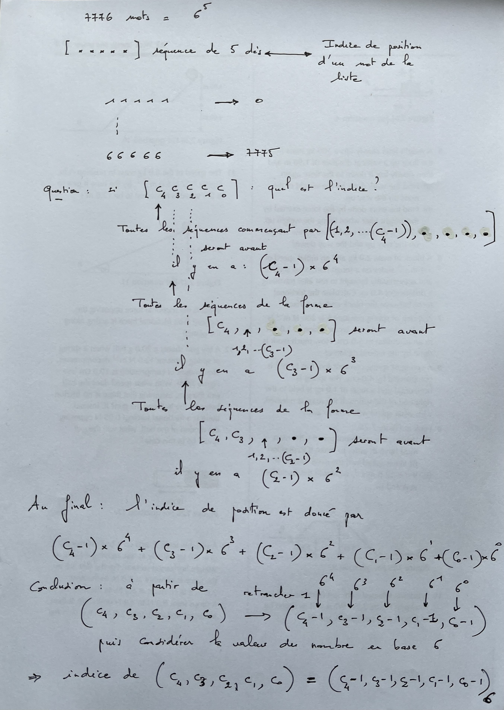

# Générateur de phrases de passe

Ce TP s'inspire de cet [article de Micah Lee sur _the Intercept_](https://firstlook.org/theintercept/2015/03/26/passphrases-can-memorize-attackers-cant-guess/).


## Le contexte

Il faut des mots de passe pour la plupart des plateformes
informatiques que nous utilisons (ordinateurs, smartphones, sites
bancaires, réseaux Wifi, protection de trousseaux de clés
cryptographiques, etc.).


Pour offrir une sécurité suffisante, il est souvent déconseillé
d'utiliser des mots significatifs que l'on peut trouver dans des
listes de mots (dictionnaires par exemple). En effet, une attaque
envisageable contre un tel mot de passe consiste à essayer les uns à
la suite des autres chacun des mots de cette liste jusqu'à trouver le
bon, ce qui est à la portée d'un programme informatique si la liste
contient quelques milliers ou dizaines de milliers de mots. On parle alors 
d'[attaque par force brute](https://fr.wikipedia.org/wiki/Attaque_par_force_brute). 

Pour un bon mot de passe, on conseille plutôt d'utiliser une chaîne de
caractères d'au moins huit caractères contenant des lettres majuscules
et minuscules, des chiffres, voire d'autres caractères encore, chacun
des caractères étant choisi au hasard. \
En considérant des mots de passe de longueur huit élaborés à partir
d'une centaine de caractères (par exemple les 96 caractères ASCII dits
imprimables (ceux de code compris entre 32 et 126)), le nombre de mots
de passe est environ égal à *100^8 = 10^{16}* (soit dix millions de
milliards), nombre qui commence à compliquer sérieusement la tâche
d'un attaquant qui envisagerait de trouver votre mot de passe en
essayant une à une toutes les chaînes de caractères de longueur
huit. \
L'inconvénient de tels mots de passe est qu'il est difficile de
les mémoriser (sauriez vous mémoriser facilement des mots de passe de
la forme `1)_N2@!A` ?


Plutôt que d'envisager des chaînes de caractères aléatoires
construites avec des caractères quelconques, il est possible de
construire des mots de passe en assemblant plusieurs mots d'une liste
fixée de mots (par exemple des mots français), qu'il sera plus facile
à mémoriser. Voici un exemple de tel assemblage de cinq mots :
`visita-housse-degorge-rinciez-effrita`. On nomme souvent de tels mots
de passe *phrases de passe* (*passphrases* en anglais).


## Construction de phrases de passe

Comment construire des phrases de passe ?

Il est possible de construire des phrases de passe « à la main » si on dispose

   1. d'une liste de mots ;
   2. et d'un dé.

C'est ce que vous allez découvrir dans ce qui suit.

## Le matériel de base : une liste de mots

Pour construire des passe-phrases, vous avez besoin d'une liste dans laquelle vous puiserez des mots choisis au hasard.

Pour cela vous utiliserez le fichier Python
[liste_7776_mots.py](assets/liste_7776_mots.py) qui définit une variable
nommée `LISTE_MOTS`. Pour utiliser cette variable il vous suffit donc
de l'importer depuis son module.

```python
from liste_7776_mots import LISTE_MOTS
```

La variable `LISTE_MOTS` contient une liste de 7776 mots.

> ### À faire n°1

Vérifiez dans le Shell que la valeur que définit cette variable est bien de type **tuple**. Justifier.   

On rappelle que pour interroger Python sur le type d'une variable, on utilise la fonction ```type()```.

Exemples:
```python
>>> variable1="bdklerlerpt"
>>> type(variable1)
<class 'str'>   

>>> variable2=5
>>> type(variable2)
<class 'int'>   

>>> variable3=5.8
>>> type(variable3)
<class 'float'>

>>> variable4=[2,"zoo",18]
>>> type(variable4)
<class 'list'>

>>> variable5=(2,"zoo")
>>> type(variable5)
<class 'tuple'>

>>> variable6={"zoo":10,"cirque":17}
>>> type(variable6)
<class 'dict'>

>>> variable7=True
>>> type(variable7)
<class 'bool'>
```


> ### À faire n°2 

Vérifiez que la longueur de cette liste de mots est bien celle annoncée. Justifier.

On rappelle que la longueur d'une chaîne de caractères, d'une liste, d'un tuple ou d'un dictionnaire, s'obtient avec la fonction ```len()```.

Exemples:

```python
>>> variable1="bdklerlerpt"
>>> len(variable1)
11  

>>> variable4=[2,"zoo",18]
>>> len(variable4)
3

>>> variable5=(2,"zoo")
>>> len(variable5)
2

>>> variable6={"zoo":10,"cirque":17}
>>> len(variable6)
2

```


> ### À faire n°3

Nous nous proposons de vérifier les trois affirmations suivantes : 

   1) tous les éléments de ce tuple sont des chaînes de caractères
   2) chacune de ces chaînes ne contient pas de lettres accentuées ; vérifier que les lettres minuscules accentuées de la liste `accents=["é","ê","à","û","ô","î","â","ù"]` ne sont pas présentes dans les mots
   3) tous les mots sont différents

Pour cela, étudiez pour commencer la documentation de la fonction prédéfinie
(*built-in*) `all()`.  Utilisez la méthode `lower()` des objets du type `str`.

Rappel : pour obtenir la documentation sur une fonction _built-in_ telle que all(), écrire dans le Shell  ```help(all)```.


Exemples : 

```python
>>> all([True,True,True])
True
>>> all([True,True,False])
False
>>> valeurs=[5,9,10]
>>> all([type(i)==int for i in valeurs])
True
# l'idée à bien comprendre ici est d'appliquer all() à une liste obtenue par compréhension
>>> valeurs=[5,9.5,10]
>>> all([type(i)==int for i in valeurs])
False
```

Indications : 

```python
>>> mot="quelconque"
>>> mot.upper()
'QUELCONQUE'
>>> mot.lower()
'quelconque'
>>> "a" in ['b','d','a','r']
True
>>> "a" not in ['b','d','r']
True
>>> "a" in ('b','d','a','r')
True
>>> "a" not in ('b','d','r')
True
>>> "a" in "bdar"
True
>>> "a" not in "bdr"
True
```

**Indications pour les 3 affirmations à vérifier** : 

1) Une seule ligne de code suffit avec all()

2) Une seule ligne de code suffit avec all() après avoir défini la liste _accents_.

On peut le montrer pour le premier élément de la liste puis on le fera pour tous les autres.

```python
>>> accents=["é","ê","à","û","ô","î","â","ù"]
>>> all(caractere.lower() not in accents for caractere in LISTE_MOTS[0])
True
```
3) Créer une fonction appelée _est_unique(mot,n_uplet)_ avec sa docstring qui renvoie True si _mot_ est présent une et une seule fois dans _n_uplet_ et False autrement, puis, dans un deuxième temps, utiliser dans la console la fonction all() pour passer en revue ce prédicat sur tous les mots.

Exemples à vérifier : 

```python
>>> est_unique("pas",("pas","pas","pois"))
False
>>> est_unique("pas",("pas","pis","pois"))
True
```

Code pour le doctest
```python
if __name__ == '__main__':
    import doctest
    doctest.testmod(optionflags=doctest.NORMALIZE_WHITESPACE | doctest.ELLIPSIS, verbose=True)
```

> ### À faire n°4

Calculez les longueurs minimales et maximales des mots de cette liste, après avoir écrit une liste par compréhension contenant les longueurs de tous les mots de la liste.

**Indications** : 

On peut utiliser les méthodes min et max propres aux listes.   

Exemples :
```python
>>> min([1,8,10])
1
>>> max([1,8,10])
10
```

> ### À faire n°5

Écrivez une instruction `description(n_uplet)`qui imprime le premier mot de cet n_uplet, le dernier et celui d'indice 2094.   

On obtiendra avec LISTE_MOTS quelque chose comme :

```pyhton
0 : montes
7775 : tour
2094 : morigener
```

Pour faire un passage à la ligne utiliser ```\n```

Exemple :
```python
>>> print("chien"+"\n"+"chat")
chien
chat
```

_Remarque._ Ces trois mots nous serviront pour élaborer nos doctests dans
certaines fonctions qui vont suivre. 


## Convertir des lancers de dés en un nombre entier

Dans cette partie nous allons répondre à deux questions :

  1. Pourquoi la liste de mots contient-elle 7776 mots ?
  2. Comment, en lançant des dés, pouvons-nous choisir un mot au hasard dans cette liste ?


Commençons par étudier la première question.

Vérifiez que *6^5 = 7776*.


Déduire que la liste contient autant de mots qu'il y a de résultats possibles dans une séquence de cinq lancers d'un dé à six faces.

Il est donc possible d'associer chaque séquence de cinq lancers de dés à un mot de la liste de sorte que

   1. deux séquences différentes soient associées à deux mots différents ;
   2. tout mot de la liste soit associé à une séquence.

(En employant un vocabulaire mathématique, cela signifie qu'on peut
établir une bijection entre l'ensemble des séquences de cinq lancers
de dés et l'ensemble des mots de la liste.)

Une application de ce constat, c'est qu'une fois une telle association
établie, il suffit de lancer cinq fois de suite un dé et de noter les
faces apparues pour obtenir un mot choisi au hasard dans la liste.

Reste à construire une association entre les séquences de cinq lancers
et les mots.

Les mots de la liste sont tous implicitement associés à un nombre :
leur indice dans le tuple. Le premier mot de la liste est donc
associé à l'indice 0, le deuxième à l'indice 1, jusqu'au dernier
qui est associé à l'indice 7775.

Associer une séquence de lancers à un mot revient donc à associer
 cette séquence à un nombre compris entre 0 et 7775.

Il suffit donc de trouver un moyen de convertir une séquence de cinq
lancers de dés en un nombre compris entre 0 et 7775, en s'assurant que
ce procédé vérifie bien

   1. que deux séquences soient associées à deux nombre différents ;
   2. et que tout nombre compris entre 0 et 7775 soit associé à une séquence.

Une solution naturelle consiste à
établir une association entre les 7776 séquences de tirages de dés possibles et les 7776 indices pour tous les mots du tuple LISTE_MOTS.

On obtient alors l'association

```
seq   : ind  : mot
11111 :    0 : montes
11112 :    1 : troue
11113 :    2 : alliais
11114 :    3 : annotes
11115 :    4 : vairon
11116 :    5 : tirer
11121 :    6 : sulkys
11122 :    7 : bornant
11123 :    8 : museaux
11124 :    9 : patrons
...
24521 : 2094 : morigener
...
66653 : 7766 : zelees
66654 : 7767 : valant
66655 : 7768 : exocet
66656 : 7769 : dejoua
66661 : 7770 : redises
66662 : 7771 : gril
66663 : 7772 : planta
66664 : 7773 : sourcil
66665 : 7774 : souda
66666 : 7775 : tour
```

- Première façon de raisonner :

En désignant par *c\_0c\_1c\_2c\_3c\_4* une séquence de cinq lancers
de dés, les *c_k* étant des chiffres de 1 à 6, comment peut-on
calculer l'indice associé selon la méthode décrite ci-dessus ?

*Le raisonnement suivant consiste à expliquer qu'il s'agit de
considérer qu'il s'agit de l'écriture en base 6 d'un nombre, avec un
décalage de +1 pour chacun des chiffres.*

Étudions le cas de la séquence *c\_0c\_1c\_2c\_3c\_4=24521* pour
laquelle la table ci-dessus nous indique que l'indice associé est
2094. Voici les différentes étapes de cette étude :

  1. Comme *c\_0=2*, cela signifie que toutes les séquences commençant par 1 se situent avant. Et il y a *6^4=1296* telles séquences.

  2. Comme *c\_1=4*, toutes les séquences débutant par  `21`, `22` et `23` sont situées avant `24521`. Or il y a *6^3=216* séquences débutant par `21`, et de même pour celles débutant par `22` et ` 23`. Il y a donc *3x6^3 = 648* séquences débutant par `21`, `22` ou `23` situées avant `24521`.
	
  3. Comme *c\_2=5*, toutes les séquences débutant par `241`, `242`,
    `243` et `244` sont situées avant `24521`. Or il y a *6^2=36*
    séquences débutant par chacun de ces triplets. Il y a donc *4x6^2 = 144* séquences débutant par `241`, `242`, `243` ou `244` situées avant `24521`.

  4. Comme *c\_3=2*, toutes les séquence débutant par `2451` sont situées avant `24521`. Il y a donc *6^1 = 6* séquences débutant par `2451` situées avant `24521`.

  5. Enfin, comme *c\_4=1*, il n'y a aucune séquence débutant par `2452` située avant `24521`.

  6. Au final, il y a *1296 + 648 + 144 + 6 + 0 = 2094* séquences situées avant la séquence `24521`. Et donc l'indice correspondant à cette séquence est bien 2094.
	

La somme donnant l'indice peut donc se mettre sous la forme :

*(c\_0 - 1)x6^4 + (c\_1 - 1)x6^3 + (c\_2 - 1)x6^2 + (c\_3 - 1)x6^1 + (c\_4 - 1)x6^0.*

_Conclusion._ L'indice associé à la séquence *c\_0c\_1c\_2c\_3c\_4* est obtenue par

*indice = (c\_0 - 1)x6^4 + (c\_1 - 1)x6^3 + (c\_2 - 1)x6^2 + (c\_3 - 1)x6^1 + (c\_4 - 1)x6^0.*

On peut généraliser ce résultat pour déterminer le nombre associé à une séquence de longueur *n* :

**N = Somme_{k=0} à {k=n-1} (c\_k - 1)x6^{n-1-k}.**


- Deuxième façon de raisonner

```
seq   : ind  : écriture en base 6 de l'indice : mot
11111 :    0 : 00000 : montes
11112 :    1 : 00001 : troue
11113 :    2 : 00002 : alliais
11114 :    3 : 00003 : annotes
11115 :    4 : 00004 : vairon
11116 :    5 : 00005 : tirer
11121 :    6 : 00010 : sulkys
11122 :    7 : 00011 : bornant
11123 :    8 : 00012 : museaux
11124 :    9 : 00013 : patrons
...
24521 : 2094 : 13410 : morigener
...
66653 : 7766 : 55542 : zelees
66654 : 7767 : 55543 : valant
66655 : 7768 : 55544 : exocet
66656 : 7769 : 55545 : dejoua
66661 : 7770 : 55550 : redises
66662 : 7771 : 55551 : gril
66663 : 7772 : 55552 : planta
66664 : 7773 : 55553 : sourcil
66665 : 7774 : 55554 : souda
66666 : 7775 : 55555 : tour
```

On passe aisément de l'écriture de la séquence de dés à l'écriture en base 6 de la valeur de l'indice du mot associé en retranchant 1 à la valeur du dé qui s'affiche.

On peut vérifier dans la console :

```python
>>> int("13410",6)
2094
```

 


### À faire n°6

Réalisez, avec sa docstring, une fonction nommée `en_nombre`, paramétrée par une séquence
de lancers de dés représentée par une chaîne de caractères, qui
renvoie un nombre entier obtenu par le procédé décrit
ci-dessus. Ainsi, avec des séquences de cinq lancers de dés, on doit
obtenir un nombre compris entre 0 et 7775 inclus.

```python
>>> en_nombre('11111')
0
>>> en_nombre('66666')
7775
>>> en_nombre('24521')
2094
```

Remarque 1 : pour convertir un nombre dans une chaîne de caractère en nombre entier faire int()
```python
>>> int("8")
8
```

Remarque 2 : mettre à la puissance s'écrit avec **

```python
>>> 6**2
36
```

### À faire n°7

Quels sont les cinq lancers de dés pour lesquels la fonction _en_nombre_ renvoie le nombre 3000 ?

Indications : 

Il s'agit comme il a été dit plus haut de **l'écriture en base 6 d'un nombre, avec un décalage de +1 pour chacun des chiffres.**  
On se référera à l'algorithme déjà étudié pour la conversion en binaire (en base 2) d'un nombre décimal (cf. la fonction `conversion_dans_base(n,b)` sur [cette page](https://github.com/VLesieux/NSI-Premiere/blob/master/Cours_2_Types_de_base/assets/Conversions_Thonny.md), puis on écrira une fonction `lancer_de_des(dec)` avec sa docstring.

Exemple:
```python
>>> lancer_de_des(7768)
'66655'							
```

### À faire n°8

Réalisez une fonction _donne_mot(sequence)_ qui donne le mot de la liste `LISTE_MOTS` correspondant à la séquence de cinq lancers de dés passée en paramètre.

Voici quelques exemples de ce que vous devez obtenir :

```python
>>> donne_mot('11111')
'montes'
>>> donne_mot('66666')
'tour'
>>> donne_mot('24521')
'morigener'
```


Vous voici armés pour construire des phrases de passe obtenues par lancers de dés.

Une phrase de passe peut contenir autant de mots que l'on veut. Bien entendu pour la produire, il faudra cinq lancers de dés pour chacun des mots. Donc si vous voulez une phrase de passe avec *n* mots, il faudra lancer *5n* fois le dé.


Le module `random` est l'un des modules prédéfinis de python. Sans
surprise ce module définit des fonctions qui permettent la manipulation de
générateurs pseudo-aléatoires.  Vous pouvez utiliser les fonctions qu'il
définit après avoir évalué l'expression

```python
import random
```

Vous pouvez par exemple étudier les documentations des fonctions
`random.randrange`, `random.randint` ou `random.choice`.

### À faire n°9

Réalisez une fonction `genere_n_sequences_alea` paramétrée par un entier
`n` qui renvoie une chaîne de caractères constituée de `n` séquences
de 5 lancers de dés.

Voici un exemple de ce que vous pouvez obtenir (non vérifiable avec la doctest mais vous devriez obtenir un résultat similaire) :
```python
>>> genere_n_sequences_alea(2)
'5311514166'
>>> genere_n_sequences_alea(3)
'111116666624521'
```

Remarque : pour convertir un nombre entier en un nombre dans une chaîne de caractère, faire str()
```python
>>> str(8)
'8'
```
### À faire n°10

Réalisez une fonction `genere_phrase_passe` avec sa docstring paramétrée par une
séquence de lancers de dés dont la longueur doit être un multiple de cinq (la condition doit être vérifiée sinon la fonction renvoie "la longueur de la chaîne doit être un multiple de 5")
qui renvoie une phrase de passe dont le nombre de mots la constituant
dépend de la longueur de la séquence, chacun de ces mots étant séparés
par un trait d'union (caractère `-`).

Voici un exemple de ce que vous devez obtenir :
```python
>>> genere_phrase_passe('111116666624521')
'montes-tour-morigener'
>>> genere_phrase_passe('1141116666624521')
'la longueur de la chaîne doit être un multiple de 5'
```

Indication : 
```python
>>> sequence='3222125521'
>>> sequence[0:5]
'32221'
#cette opération de découpe s'appelle string slicing : str_object[start_pos:end_pos:step]
```

Remarque : Distinquer le résultat d'une division de la valeur du quotient :
```python
>>> 15/3
5.0
>>> 15//3
5
>>> type(15/3)
<class 'float'>
>>> type(15//3)
<class 'int'>
```

On pourra ainsi obtenir grâce à cette fonction par exemple : 
```python
>>> genere_phrase_passe(genere_n_sequences_alea(2))
'cone-emmelee'
```


## Augmenter l'entropie
L'entropie est un mot emprunté à la physique, de la thermodynamique plus précisément qui est la science de l'énergie, qui est une mesure du désordre. Plus l'état du système est désordonné, plus son entropie est grande.
Une première manière d'augmenter l'entropie des phrases de passe
générées est de perturber la chaîne produite en y mélangeant
majuscules et minuscules. C'est ce que nous allons faire maintenant.


### À faire n°11

Réalisez le prédicat `est_lettre` paramétré par un
caractère et dont le résultat est `True` si ce caractère est l'une des 26
lettres non accentués de l'alphabet.

Voici un exemple de ce que vous devez obtenir :
```python
>>> est_lettre('a')
True
>>> est_lettre('B')
True
>>> est_lettre('1')
False
```

```python
>>> caracteres_non_accentues=["a","b","c","d","e","f","g","h","i","j","k","l","m","n","o","p","q","r","s","t","u","v","w","x","y","z"]
>>> len(caracteres_non_accentues)
26
```

### À faire n°12

Réalisez une fonction `perturbe_chaine` paramétrée par une chaîne de
caractères `chaine` qui renvoie la chaîne obtenue en changeant
aléatoirement ou pas (une chance sur deux) chacune des lettres de `chaine`
en sa majuscule ou minuscule. Les autres caractères de `chaine` restent
inchangés.

Voici un exemple de ce que vous pouvez obtenir :
```python
>>> perturbe_chaine("timoleon")
'timolEOn'
>>> perturbe_chaine("timoleon")
'tIMOlEON'
```

### À faire n°13

Réalisez la fonction `genere_phrase_passe2` qui est une 
variante de `genere_phrase_passe` pour laquelle les lettres ont été
aléatoirement mises en majuscules ou minuscules.

Voici un exemple de ce que vous pouvez obtenir :
```python
>>> genere_phrase_passe2('111116666624521')
'MoNtEs-toUr-MOrIGENER'
>>> genere_phrase_passe2(genere_n_sequences_alea(4))
'vIsiere-desaxES-CEntRer-jaUnies'
```

## Augmenter encore l'entropie

Une seconde manière d'ajouter de l'entropie consiste à remplacer
certaines lettres par des caractères particuliers. Par exemple le
`i` par un `1` et le `o` par un `0` pour que la chaîne `timoleon`
devienne `t1m0le0n`.

**Attention :** Cette partie utilise des dictionnaires. Pour faire court, un
  dictionnaire permet d'associer une valeur à une clef. On parle
  aussi de *liste associative*. Voici le dictionnaire que nous
  utiliserons dans la suite, sa définition se fait en énumérant les
  couples ` clef : valeur ` 

```python
EQUIVALENTS = {
    'a' : '@',
    'b' : '8',
    'e' : '3',
    'i' : '1',
    'o' : '0'
}

>>> 'a' in EQUIVALENTS
True
>>> 'c' in EQUIVALENTS
False
```

Dans un dictionnaire chaque clef est unique. La clef permet d'accéder
  directement à la valeur qui lui est associée. La notation est alors
  similaire à celle des accès indicés pour les chaînes ou les listes.

```python
>>> EQUIVALENTS['a']
'@'
>>> EQUIVALENTS['i']
'1'
```

Pour perturber un peu plus nos phrases de passe, nous allons continuer à
modifier aléatoirement les lettres en majuscules ou minuscules, mais
cette fois, en plus, lorsqu'une lettre n'aura pas été modifiée (mise en majuscule), s'il
s'agit de l'une des clefs de `EQUIVALENTS` alors on va aléatoirement
(une chance sur deux) la remplacer ou pas par la valeur qui lui est
associée.

### À faire n°14

Prolongez la fonction `perturbe_chaine` en réalisant une fonction
`perturbe_chaine2` paramétrée par une chaîne de caractères `s` qui
renvoie la chaîne obtenue en modifiant `s` comme indiqué ci-dessus.

Voici un exemple de ce que vous pouvez obtenir :
```python
>>> perturbe_chaine2("timoleon")
'TiMol30N'
>>> perturbe_chaine2("timoleon")
'tiMol3on'
>>> perturbe_chaine2("timoleon")
'T1m0LeON'
```


### À faire n°15

Réalisez la fonction `genere_phrase_passe3` qui applique la
perturbation précédente aux phrases de passe générées.

Voici un exemple de ce que vous pouvez obtenir :
```python
>>> genere_phrase_passe3('111116666624521')
'm0NTes-toUr-Morig3neR'
>>> genere_phrase_passe3(genere_n_sequences_alea(4))
'pap@y3-coniQUe-plainS-recrIa'
```