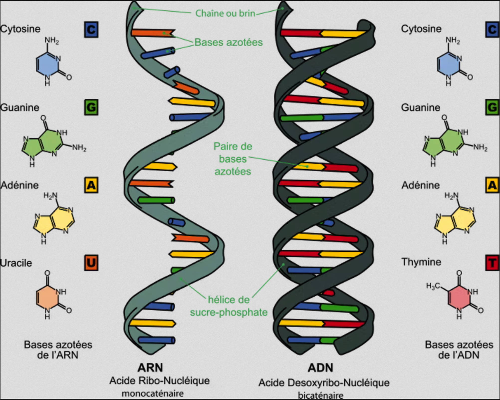

# Projet : Les séquences nucléiques de l'ADN et ARN



## Quelques connaissances en biologie moléculaire

1) **ADN** : c'est le support stable et transmissible de l'information génétique.  
Il est composé des 4 **nucléotides** suivants, appelés aussi **bases** :   

- A : Adénine 
- T : Thymine
- G : Guanine
- C : Cytosine

Dans l'ADN, les bases A et T sont **complémentaires** ainsi que les bases G et C (cf.image)

2) **ARN** : c'est le support temporaire permettant l'expression de l'information génétique. 
Il est composé des 4 **nucléotides** suivants :

- A : Adénine 
- U : Uracine
- G : Guanine
- C : Cytosine

3) Les **protéines** : outils de la cellule, elles sont composées de 20 acides aminés différents.

4) La **transcription** : certaines parties spécifiques de l'ADN sont transcrites en ARN. 

La transcription consiste en l'assemblage des nucléotides ARN en suivant le modèle ADN et en prenant les **bases complémentaires** à savoir : 

- le A de l'ADN est remplacé par U dans l'ARN  
- le T par A   
- le G par C   
- le C par G

5) La **traduction** : les ARN messagers sont traduits en protéine. Le passage d'une séquence ARN composée de 4 nucléotides à une séquence protéique composée de 20 acides aminés, se fait à l'aide du **code génétique**. Dans ce code, chaque mot de 3 bases, appelé **codon**, correspond à un acide aminé. Il est possible de construire 4^3=64 codons différents à l'aide de 4 bases. Ce code est donc dégénéré ; plusieurs codons correspondent au même acide aminé. Les codons sont lus sans chevauchement, les uns à la suite des autres.

```python
'UUU','UUC' : 'F'   
'UUA','UUG','CUU','CUC','CUA','CUG' : 'L'    
'AUU','AUC','AUA' : 'I'     
'AUG' : 'M'     
'GUU','GUC','GUA','GUG' : 'V'     
'UCU','UCC','UCA','UCG','AGU','AGC' : 'S'         
'CCU','CCC','CCA','CCG' : 'P'           
'ACU','ACC','ACA','ACG' : 'T'        
'GCU','GCC','GCA','GCG' : 'A'       
'UAU','UAC' : 'Y'      
'UAA','UAG','UGA' : '*'#ces codons stop ont pour rôle de signaler la fin du gène lors de la traduction          
'CAU','CAC' : 'H'      
'CAA','CAG' : 'O'      
'AAU','AAC' : 'N'          
'AAA','AAG' : 'K'      
'GAU','GAC' : 'D'       
'GAA','GAG' : 'E'        
'UGU','UGC' : 'C'       
'UGG' : 'W'        
'CGU','CGC','CGA','CGG','AGA','AGG' : 'R'         
'GGU','GGC','GGA','GGG' : 'G'
```

6) La **réplication** : l'ADN de chaque brin d'une double hélice est recopié de telle sorte que deux nouvelles doubles hélices sont produites, identiques à l'unique double hélice qui a servi de modèle.

***************

Code pour la vérification des docstrings des fonctions :

```python
if __name__ == '__main__':
    import doctest
    doctest.testmod(optionflags=doctest.NORMALIZE_WHITESPACE | doctest.ELLIPSIS, verbose=True)
```

## Les séquences ADN
### Question 1

Réaliser une fonction nommée `estADN` qui vérifie si la chaîne de caractères passée en paramètre ne contient aucun autre caractère que les quatre bases A, C, G et T.  
Cette fonction renvoie True si tel est le cas, False dans le cas contraire.  
De plus elle renvoie True si la chaîne est vide.

```python
def estADN(chaine):
    """
    Renvoie True si la chaine contient les bases A, C, G, et T, False sinon, True si vide
    param : chaine : str
    return : bool
    >>> estADN('ATGCGATC')
    True
    >>> estADN('ACKT')
    False
    >>> estADN('')
    True    
    """
```

**Indication** : utiliser la fonction prédéfinie `all()`

## La transcription

### Question 2 

Réaliser une fonction nommée `baseComplementaire` qui renvoie la base complémentaire de la base passée en paramètre, selon le type de séquence démandée en sortie, qui peut être soit 'ADN', soit 'ARN'.

```python
def baseComplementaire(base,chaine):
    """
    Renvoie la base complémentaire dans chaine qui est soit 'ADN', soit 'ARN'
    param : base : str
    param : chaine : str
    return : str
    >>> baseComplementaire('G','ADN')
    'C'
    >>> baseComplementaire('A','ARN')
    'U'
    """
```

**Indication** : réaliser deux dictionnaires `vers_ARN` et `vers_ADN`.


### Question 3

Réaliser une fonction nommée `transcrit` qui renvoie l'ARN construit à partir de la sous-séquence d'ADN comprise entre les deux positions passées en paramètres, incluses. La première base de la séquence étant numérotée 1. On utilisera la fonction `baseComplementaire`.

```python
def transcrit(sequence,debut,fin):
    """
    Renvoie l'ARN construit à partir de la sous-séquence d'ADN comprise entre les deux positions
    passées en paramètres incluses.
    param : sequence : str
    param : debut : int
    param : fin : int
    return : str
    >>> transcrit('TTCTTCTTCGTACTTTGTGCTGGCCTCCACACGATAATCC',4,23)
    'AAGAAGCAUGAAACACGACC'
    """
```

**Indication** : 

```python
>>> "animal"[1:4]
'nim' 
```  

## La traduction

### Question 4

Réaliser une fonction `traduit` qui donne le code génétique de la séquence ARN passée en paramètre.

```python
def traduit(sequence):
    """
    Renvoie le code génétique de la séquence ARN
    param : str
    return : str
    >>> traduit('AUGCGAAGCCGAAAGAACACCGGCUAA')
    'MRSRKNTG*'
    """
```  

## La réplication

### Question 5

Réaliser une fonction nommée `réplique` qui construit la séquence ADN complémentaire et inversée de celle passée en paramètre.

```python
def replique(sequence):
    """
    Renvoie la sequence ADN complémentaire et inversée de la séquence ADN
    param : sequence : str
    return : str
    >>> replique('ACTG')
    'CAGT'
    """
```  