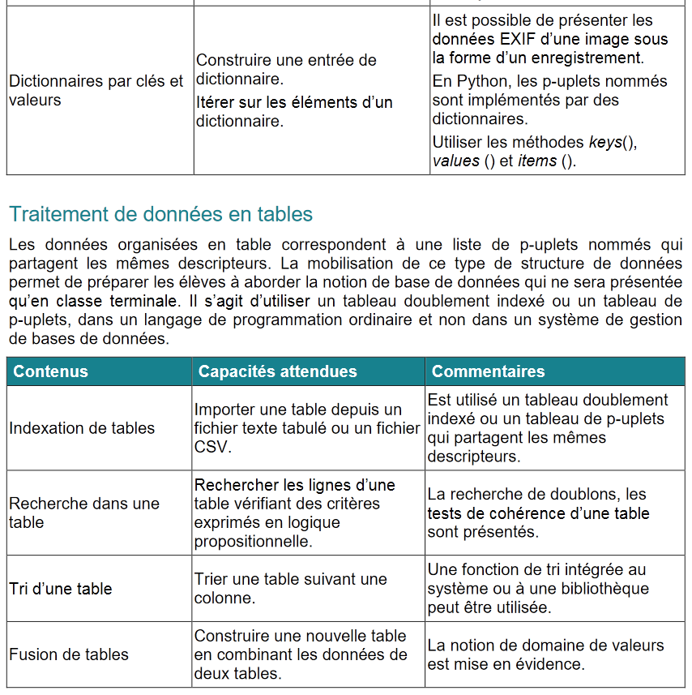
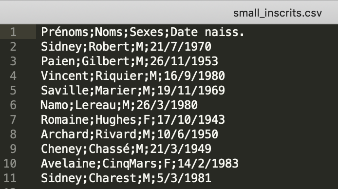
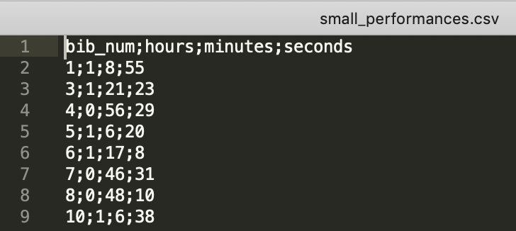

La course du chicon
===================


**Objectifs** : Mettre en œuvre
-   les dictionnaires
-   les tuples nommés
-   les modules
-   le traitement des données en tables
-   l'utilisation des tris
-   la lecture/écriture de fichiers textes et format CSV

On s'intéresse donc ici en particulier à cette partie du programme de NSI de 1ère :




Introduction
------------

Le dimanche 27 octobre 2019 a eu lieu à Baisieux, commune du Nord frontalière de la Belgique, la [course du chicon](http://courirabaisieux.fr/la-course-du-chicon/).

Cette course se décline sur plusieurs distances de 15 km à 0.5 km. Nous ne nous intéresserons dans ce TP qu'à la version de 15 km.

Vous imaginez que vous avez la responsabilité du traitement informatique des données : gestion des inscriptions, récolte des performances des concurrents, publication des résultats.

Préparation
-----------


1.  **Archive**

Récupérez le [dossier](https://github.com/VLesieux/NSI-Premiere/tree/master/Projet_3_Course_chicons/assets/mat_course_chicon.zip)

 Ce dossier contient trois sous-dossiers :

 -   [`src/`](./src) : contient le module  [Competitor.py](src/Competitor.py)
 - `doc/` : contient la documentation du module `Competitor`, accessible depuis le fichier index.html
 -  [`data/`](./data) : contient deux jeux de données dans quatre fichiers de données : un
     petit jeu  de données pour faire des tests simples
      ([data/small\_inscrits.csv](data/small_inscrits.csv) et [data/small\_performances.csv](data/small_performances.csv)), 
      et un gros jeu de données
      ([data/inscrits.csv](data/inscrits.csv) et [data/performances.csv](data/performances.csv)).



2.  **Documentation du module Competitor**

Le module `Competitor.py`  placé dans le dossier src  que l'on importera en écrivant `import src.Competitor as Competitor` permet de manipuler des valeurs représentant les compétiteurs de la course. On peut considérer qu'il permet la définition d'un type `Competitor`.
L'étude de la documentation permet de déduire les différentes informations contenues dans une telle donnée.

On dispose ainsi d'un **constructeur**  (`create`) et les différentes informations qui décrivent une donnée `Competitor` sont ainsi accessibles via les différents **accesseurs** (`get_XXX`).  
On constate de plus que le seul **modificateur** concerne la performance d'un compétiteur (`set_performance`).

Exemple : création d'un compétiteur avec `Competitor.create` puis affichage de celui-ci avec `Competitor.to_string`

```python
>>> Competitor.create("Laurie","Anderson",'F','5/6/1947',5)

{'bib_num': 5, 'first_name': 'Laurie', 'last_name': 'Anderson', 'sex': 'F', 'birth_date': '5/6/1947', 'performance': None}

# On voit que la fonction create du module Competitor renvoie un dictionnaire formé d'une série de clés et de valeurs associées.

>>> Competitor.to_string({'bib_num': 5, 'first_name': 'Laurie', 'last_name': 'Anderson', 'sex': 'F', 'birth_date': '5/6/1947', 'performance': None})

'[5]: Laurie Anderson (F - 5/6/1947) '

# On voit que la fonction to_string du module Competitor renvoie un affichage condensé du compétiteur avec son numéro de brassard et son identité.
```

3. **Documentation du module `Time`**

Nous allons créer un module `Time.py` placé dans le même dossier src que l'on importera en écrivant `import src.Time as Time`.  

Les performances des compétiteurs vont être représentées par leur temps de course exprimé en heures, minutes et secondes.

On décide de représenter ces données par un tuple nommé. Ces données étant **non mutables**, utiliser les *named tuples* de Python pour les représenter semble être un choix  pertinent.

Cette notion est définie dans le module `collections` de Python. Il convient donc de l'importer en premier lieu :

```python
from collections import namedtuple
```

Remarque : un tuple nommé est une séquence et ses éléments sont donc ordonnés, ce qui n'est pas le cas d'un dictionnaire qui est un ensemble de paires ; de plus les attributs d'un tuple nommé doivent être des chaines de caractères alors que les clés d'un dictionnaire peuvent être n'importe quelle donnée non modifiable.

**Comprendre le fonctionnement du module Time et des tuples nommés**

Créer le module `Time.py` en faisant un copier-coller du code donné ci-dessous qui définit :

 * le type `Time` qui correspond à un tuple nommé possédant trois champs `hours`, `minutes` et `seconds` ;
 * une fonction `create` à trois arguments, permettant de créer une donnée de ce type, dont le résultat est la donnée `Time` créée (on peut envisager un contrôle de validité des valeurs des paramètres pour ce constructeur) ;
 * une fonction `compare` qui définit une relation d'ordre sur les données de type `Time`. De manière classique le résultat de cette fonction, à deux paramètres de type `Time`, est négatif si son premier paramètre est inférieur au second, positif s'il lui est plus grand, et nul quand ils sont égaux.
 * une fonction `to_string` qui a pour résultat une représentation sous la forme d'une chaîne de caractères de son paramètre de type `Time`.


```python
####################
#  MODULE Time.py  #
####################
from collections import namedtuple

Time = namedtuple('Time', ['hours', 'minutes', 'seconds'])

def create (hours, minutes, seconds):
    """    
    :param hours: value of time in hours
    :type name: int
    :param minutes: value of time in minutes
    :type name: int
    :param seconds: value of time in seconds
    :type name: int
    :return: a new time for a competitor
    :rtype: Time
    :UC: hours > 0 
    """
    return Time(hours,minutes,seconds)

p=create(5,28,10)
#p est donc un tuple nommé
#on dispose de deux modes d'accès possibles aux informations du tuple nommé
#p.hours=5
#p[0]=5
q=create(5,28,12)
#q.seconds=12
#q[2]=12

#>>> p
#Time(hours=5, minutes=28, seconds=10)
#>>> q
#Time(hours=5, minutes=28, seconds=12)


def compare(time1,time2):
    """
    Renvoie 1 si time1>time 2
    0 si time1=time2
    -1 si time1<time2
    """
    
    if time1.hours==time2.hours:        
        if time1.minutes==time2.minutes:            
            return (time1.seconds>time2.seconds)-(time1.seconds<time2.seconds)        
        else:            
            return (time1.minutes>time2.minutes)-(time1.minutes<time2.minutes)        
    else:
        return (time1.hours>time2.hours)-(time1.hours<time2.hours)

#compare(q,p)=1
#compare(p,q)=-1

# cette fonction repose sur les observations suivantes réalisables rapidement dans le shell

#>>> True - False
#1
#>>> False - True
#-1
    
def to_string(time):
    return ' {hours}h {minutes}mn {seconds}s'.format(hours=time.hours,minutes=time.minutes,seconds=time.seconds)

#to_string(p)=' 5h 28mn 10s'

#On utilise la méthode appelée format qui s'applique aux objets de type string
#c'est équivalent à une concaténation mais s'écrit plus simplement
#>>> valeur=18
#>>> print("Il a {} ans".format(valeur))
#Il a 18 ans
#valeur a pris place entre les accolades
        
```
Exemple
```python
>>> p=Time.create(2,30,20)
>>> p
Time(hours=2, minutes=30, seconds=20)
>>> Time.to_string(p)
' 2h 30mn 20s'
>>> q=Time.create(1,10,30)
>>> Time.to_string(q)
' 1h 10mn 30s'
>>> Time.compare(p,q)
1
```

Gestion des inscrits
--------------------

Les fonctions suivantes sont à définir maintenant dans le fichier `course_chicon.py` que vous allez créer qui regroupera les fonctions utiles à la gestion de la course.

Il sera bien sûr nécessaire d'importer les modules `Competitor` et `Time` placés dans le dossier src.


Votre première tâche est de construire la liste des compétiteurs inscrits à la compétition.

Les données concernant ces compétiteurs se trouvent dans le fichier `data/inscrits.csv` (ou `data/small_inscrits.csv`) qui est un fichier au format [CSV](https://fr.wikipedia.org/wiki/Comma-separated_values), c'est-à-dire un fichier texte contenant des données tabulées (observer sa constitution à l'aide d'un éditeur de textes).

La première ligne de ce fichier est constituée des libellés des données ou descripteurs de champs qui suivent :

``` {.sourceCode .text}
Prénoms;Noms;Sexes;Date naiss.
```

Elle précise donc que chacune des lignes qui suivent contient dans cet ordre le prénom, le nom, le sexe et la date de naissance du compétiteur inscrit. Ces informations sont séparées par un séparateur qui est un point-virgule.

Avec ces données vous allez construire des compétiteurs à l'aide de la fonction `Competitor.create`. Il vous faudra attribuer à chacun de ces compétiteurs un numéro de dossard, obtenu par simple incrémentation d'un compteur. 

Tous les compétiteurs seront rassemblés dans un **dictionnaire** dont les **clés** seront les numéros de dossard et les **valeurs** le tuple contenant les quatre informations associées au compétiteur.

Pour vérifier les tests dans les docstrings des fonctions données ci-dessous :

```python
if __name__ == '__main__':
    import doctest
    doctest.testmod(optionflags=doctest.NORMALIZE_WHITESPACE | doctest.ELLIPSIS, verbose=True)
```

**À faire n°1**

Réalisez une fonction nommée `read_competitors` paramétrée par le nom du
fichier CSV contenant les données des inscrits, qui a pour résultat le dictionnaire des inscrits.   
On envisage de plus de gérer la situation où aucun fichier ne correspond au paramètre fourni. Cela peut être fait en capturant l'exception `FileNotFoundError` qui est alors déclenchée.

```python
def read_competitors(text):
    """
    lit un fichier csv et retourne un dictionnaire dont les clés sont les numéros de brassard
    et les valeurs les tuples contenant les informations sur les compétiteurs
    param : text : csv file
    return : dict
    >>> read_competitors("data/small_inscrits.csv")
    {1: {'bib_num': 1, 'first_name': 'Sidney', 'last_name': 'Robert', 'sex': 'M', 'birth_date': '21/7/1970', 'performance': None}, 2: {'bib_num': 2, 'first_name': 'Paien', 'last_name': 'Gilbert', 'sex': 'M', 'birth_date': '26/11/1953', 'performance': None}, 3: {'bib_num': 3, 'first_name': 'Vincent', 'last_name': 'Riquier', 'sex': 'M', 'birth_date': '16/9/1980', 'performance': None}, 4: {'bib_num': 4, 'first_name': 'Saville', 'last_name': 'Marier', 'sex': 'M', 'birth_date': '19/11/1969', 'performance': None}, 5: {'bib_num': 5, 'first_name': 'Namo', 'last_name': 'Lereau', 'sex': 'M', 'birth_date': '26/3/1980', 'performance': None}, 6: {'bib_num': 6, 'first_name': 'Romaine', 'last_name': 'Hughes', 'sex': 'F', 'birth_date': '17/10/1943', 'performance': None}, 7: {'bib_num': 7, 'first_name': 'Archard', 'last_name': 'Rivard', 'sex': 'M', 'birth_date': '10/6/1950', 'performance': None}, 8: {'bib_num': 8, 'first_name': 'Cheney', 'last_name': 'Chassé', 'sex': 'M', 'birth_date': '21/3/1949', 'performance': None}, 9: {'bib_num': 9, 'first_name': 'Avelaine', 'last_name': 'CinqMars', 'sex': 'F', 'birth_date': '14/2/1983', 'performance': None}, 10: {'bib_num': 10, 'first_name': 'Sidney', 'last_name': 'Charest', 'sex': 'M', 'birth_date': '5/3/1981', 'performance': None}}
    >>> read_competitors("no_file.csv")
    Votre fichier n'est pas un csv lisible ou il n'existe pas
    """
```

*Indications* : 

- Pensez à la méthode `split` des chaînes de caractères. 
- Utiliser la méthode `rstrip` pour supprimer les marqueurs de fin de ligne  `/n`.  
- Exemple de capture d'erreur et de levée d'exception dans le cas de `IndexError` rencontrée pour les listes :

```python
### sans levée d'exception : message d'erreur

def renvoie_valeur_indice2_liste(liste):
    return liste[2]

>>> renvoie_valeur_indice2_liste([1,5])
Traceback (most recent call last):
  File "<pyshell>", line 1, in <module>
  File "/Users/vincentlesieux/Library/Mobile Documents/com~apple~CloudDocs/DIU-EIL/course_chicon_new.py", line 30, in renvoie_valeur_indice2_liste
    return liste[2]
IndexError: list index out of range

### avec levée d'exception

def renvoie_valeur_indice2_liste(liste):
    try :
        return liste[2]
    except IndexError:
        print("votre liste ne comporte pas d'élément d'indice 2")

>>> renvoie_valeur_indice2_liste([1,2])
votre liste ne comporte pas d'élément d'indice 2

```


Manipulations du dictionnaire
-----------------------------

Indication pour la suite : comme on a affaire à un dictionnaire de dictionnaires, on accédera de la manière suivante aux données.

```python
>>> ma_bib_musicale={"Disc1":{"auteur":"Bob Dylan","album":"New Morning","date":1970},"Disc2":{"auteur":"David Bowie","album":"Loving the Alien","date":1984}}
>>> ma_bib_musicale["Disc2"]["date"]
1984
```

### Affichage des informations

**À faire n°2**

Réalisez une fonction _affichage_ qui prend en paramètre une liste de données de type `Competitor` et affiche chacune de ces données à raison d'une par ligne (utilisez la fonction `to_string` de `Competitor`).

```python
def affichage(competiteurs):
    """
    Renvoie un affichage (avec print) du fichier des competiteurs
    param : competiteurs : csv
    return : None
    >>> affichage(read_competitors("data/small_inscrits.csv"))
    [1]: Sidney Robert (M - 21/7/1970) 
    [2]: Paien Gilbert (M - 26/11/1953) 
    [3]: Vincent Riquier (M - 16/9/1980) 
    [4]: Saville Marier (M - 19/11/1969) 
    [5]: Namo Lereau (M - 26/3/1980) 
    [6]: Romaine Hughes (F - 17/10/1943) 
    [7]: Archard Rivard (M - 10/6/1950) 
    [8]: Cheney Chassé (M - 21/3/1949) 
    [9]: Avelaine CinqMars (F - 14/2/1983) 
    [10]: Sidney Charest (M - 5/3/1981) 
    """
```

### Sélections

Nous allons maintenant écrire  quelques fonctions de recherche dans un dictionnaire de valeurs qui satisfont un critère. Dans cette section, les compétiteurs sont passés en paramètre de chacune des fonctions sous la forme d'un dictionnaire tel que celui construit par la fonction `read_competitors`. Les fonctions à écrire disposent d'un autre paramètre qui correspond, d'une manière ou d'une autre, au critère de sélection des compétiteurs dans le dictionnaire.
Les fonctions ont pour résultat soit une donnée de type `Competitor`, soit une liste de telles données. Ce résultat correspond à la sélection selon le critère cherché.

**À faire n°3**   

Écrivez une fonction `select_competitor_by_bib` qui a pour résultat le compétiteur dont le numéro de dossard est passé en paramètre.

Comment proposez-vous de  gérer la situation où aucun compétiteur ne correspond au dossard fourni ? 

*Suggestion* : cela peut être l'occasion de tester à nouveau une levée d'exception.


```python
def select_competitor_by_bib(competiteurs,numero):
    """
    Renvoie le competiteur à partir de son dossard
    param : competiteurs : csv
    param : numero : int
    >>> select_competitor_by_bib(read_competitors("data/small_inscrits.csv"),8)
    {'bib_num': 8, 'first_name': 'Cheney', 'last_name': 'Chassé', 'sex': 'M', 'birth_date': '21/3/1949', 'performance': None}
    """
```

**À faire n°4**    

Écrivez une fonction `select_competitor_by_birth_year` dont le résultat est la **liste** des compétiteurs dont l'année de naissance correspond à une valeur passée en paramètre.

*Suggestion* : Étudiez la documentation de la fonction `endswith` des chaînes de caractères.

Exemple : Dans le petit jeu de données, deux compétiteurs sont nés en 1980. Aucun compétiteur n'est né en 1960.

```python
def select_competitor_by_birth_year(competiteurs,date_naissance):
    """
    Renvoie la liste des competiteurs de cet age
    param : competiteurs : csv
    param : age : int
    >>> select_competitor_by_birth_year(read_competitors("data/small_inscrits.csv"),1980)
    [{'bib_num': 3, 'first_name': 'Vincent', 'last_name': 'Riquier', 'sex': 'M', 'birth_date': '16/9/1980', 'performance': None}, {'bib_num': 5, 'first_name': 'Namo', 'last_name': 'Lereau', 'sex': 'M', 'birth_date': '26/3/1980', 'performance': None}]
    >>> select_competitor_by_birth_year(read_competitors("data/small_inscrits.csv"),1960)
    "Il n'y a pas de compétiteur ayant cette date de naissance"
    """
```

**À faire n°5**

Écrivez une fonction `select_competitor_by_name` dont le résultat est la **liste** des compétiteurs dont le nom (*last name*) contient la chaîne de caractères passée en paramètre.

*Suggestion* : Pensez à utiliser `in` pour les chaînes de caractères.

Exemple : Dans le petit jeu de données, deux compétiteurs ont leur nom de famille qui commence par "Ri".

```python
def select_competitor_by_name(competiteurs,chaine):
    """
    Sélectionne un compétiteur si la chaine est contenu dans son nom de famille
    param : competiteurs : csv
    param : chaine : str
    >>> select_competitor_by_name(read_competitors("data/small_inscrits.csv"),"Ri")
    [{'bib_num': 3, 'first_name': 'Vincent', 'last_name': 'Riquier', 'sex': 'M', 'birth_date': '16/9/1980', 'performance': None}, {'bib_num': 7, 'first_name': 'Archard', 'last_name': 'Rivard', 'sex': 'M', 'birth_date': '10/6/1950', 'performance': None}]    
    """
```


Report des performances
-----------------------

La course achevée, votre tâche consiste à reporter les performances des compétiteurs dans les fiches de la liste de ces compétiteurs.

### Lecture des performances

Les données concernant les performances se trouvent dans le fichier
`data/performances.csv` (ou `data/small_performances.csv`) qui est un fichier au format CSV.

La première ligne de ce fichier est constituée des libellés des données
qui suivent :

``` {.sourceCode .text}
bib_num;hours;minutes;seconds
```

Elle précise donc que chacune des lignes qui suivent contient dans cet ordre le numéro de dossard, le nombre d'heures, de minutes et de secondes du temps de parcours d'un compétiteur, ces informations étant séparées par un point-virgule.

Seuls les compétiteurs ayant effectivement participé et achevé la course figurent dans ce fichier.  Avec ces données, vous allez construire un dictionnaire des performances qui associe à un numéro de dossard un objet de type `Time` du module que vous avez défini.


**À faire n°6**

Réalisez une fonction nommée `read_performances` paramétrée par le nom du fichier CSV contenant les données des performances, qui renvoie le dictionnaire des performances contenues dans ce fichier.   
La clé du dictionnaire est le numéro de brassard déjà inclu dans le fichier csv.
On n'oubliera pas de transformer les données fournies en chaînes de caractères en entier à l'aide de la fonction `int()`.  
Cette fonction est très similaire à la fonction _read_competitor_.

```python
def read_performances(text):
    """
    lit un fichier csv et retourne un dictionnaire dont les clés sont les numéros de brassard
    et les valeurs les tuples contenant les performances des compétiteurs
    param : text : csv
    >>> read_performances("data/small_performances.csv")
    {1: Time(hours=1, minutes=8, seconds=55), 3: Time(hours=1, minutes=21, seconds=23), 4: Time(hours=0, minutes=56, seconds=29), 5: Time(hours=1, minutes=6, seconds=20), 6: Time(hours=1, minutes=17, seconds=8), 7: Time(hours=0, minutes=46, seconds=31), 8: Time(hours=0, minutes=48, seconds=10), 10: Time(hours=1, minutes=6, seconds=38)}
    """
```

Indication : ne pas oublier de convertir les chaines en nombre entier avec int()

### Report

Maintenant que vous disposez des données sur les compétiteurs et leurs performances sous forme de dictionnaires qui partagent les mêmes clefs, votre travail consiste à reporter les performances dans les fiches de ces compétiteurs. On réalise ainsi une **fusion** des deux tables.


**À faire n°7**

Réalisez une fonction nommée `set_performances` paramétrée par le dictionnaire des performances et le dictionnaire des compétiteurs qui renvoie le dictionnaire des compétiteurs augmenté de leurs performances sous la forme d'un Time. Il faut gérer la situation où un compétiteur n'a pas de performance s'il s'est inscrit à la course mais n'a pas concouru, c'est-à-dire la cas où la clé du dictionnaire des compétiteurs est absente du dictionnaire des performances. Il faudra ici gérer l'exception de clé manquante `KeyError`.

Testez la validité de votre fonction avec les listes produites par le petit jeu de données.

Vous devriez obtenir ceci: 

```python
def set_performances(dic1,dic2):
    """
    fusionne les dictionnaires en utilisant la clé commune = numéro de brassard
    param : dic1 : dict
    param : dic2 : dict
    return : dict
    >>> set_performances(read_competitors("data/small_inscrits.csv"),read_performances('data/small_performances.csv'))
    {1: {'bib_num': 1, 'first_name': 'Sidney', 'last_name': 'Robert', 'sex': 'M', 'birth_date': '21/7/1970', 'performance': ' 1h 8mn 55s'}, 2: {'bib_num': 2, 'first_name': 'Paien', 'last_name': 'Gilbert', 'sex': 'M', 'birth_date': '26/11/1953', 'performance': None}, 3: {'bib_num': 3, 'first_name': 'Vincent', 'last_name': 'Riquier', 'sex': 'M', 'birth_date': '16/9/1980', 'performance': ' 1h 21mn 23s'}, 4: {'bib_num': 4, 'first_name': 'Saville', 'last_name': 'Marier', 'sex': 'M', 'birth_date': '19/11/1969', 'performance': ' 0h 56mn 29s'}, 5: {'bib_num': 5, 'first_name': 'Namo', 'last_name': 'Lereau', 'sex': 'M', 'birth_date': '26/3/1980', 'performance': ' 1h 6mn 20s'}, 6: {'bib_num': 6, 'first_name': 'Romaine', 'last_name': 'Hughes', 'sex': 'F', 'birth_date': '17/10/1943', 'performance': ' 1h 17mn 8s'}, 7: {'bib_num': 7, 'first_name': 'Archard', 'last_name': 'Rivard', 'sex': 'M', 'birth_date': '10/6/1950', 'performance': ' 0h 46mn 31s'}, 8: {'bib_num': 8, 'first_name': 'Cheney', 'last_name': 'Chassé', 'sex': 'M', 'birth_date': '21/3/1949', 'performance': ' 0h 48mn 10s'}, 9: {'bib_num': 9, 'first_name': 'Avelaine', 'last_name': 'CinqMars', 'sex': 'F', 'birth_date': '14/2/1983', 'performance': None}, 10: {'bib_num': 10, 'first_name': 'Sidney', 'last_name': 'Charest', 'sex': 'M', 'birth_date': '5/3/1981', 'performance': ' 1h 6mn 38s'}}
    """
```

Indications : 
- on sera amené à utiliser `Time.to_string()`.
- un inscrit qui n'a pas de performance aura une performance égale à None

# Tris

Vous allez avoir l'occasion d'utiliser une méthode de tri appelée _tri_selection_ dont l'algorithme sera étudié plus tard.
Vous créez le module Tri.py placé dans le dossier src que vous importez dans votre fichier de la façon suivante : `import src.Tri as Tri`.

```python
####################
#  MODULE Tri.py  #
####################
def compare_entier_croissant(a, b):
    """
    :param a: (int) un entier
    :param b: (int) un entier
    :return: (int)  
             * >0  si a est supérieur à b
             * 0 si a est égal à b
             * <0 si a est inférieur à b
    :CU: aucune
    :Exemples:

    >>> compare_entier_croissant(1, 3) < 0
    True
    """
    return a-b


def compare_chaine_lexicographique(a, b):
    return (a>b)-(a<b)

    
def compare_entier_decroissant(a, b):
    """
    :param a: (int) un entier
    :param b: (int) un entier
    :return: (int) 
             * >0 si a est inférieur à b
             * 0 si a est égal à b
             * <0 si a est supérieur à b
    :CU: aucune
    :Exemples:

    >>> compare_entier_décroissant(1, 3) > 0
    True
    """
    return b-a


def tri_selection(l,comp):
    """
        paramètre l : liste
        paramètre comp : mode de comparaison
        valeur renvoyée : liste triée

    CU : liste non vide

    Exemples :

    >>> tri_selection([1,8,3,10,5],compare_entier_croissant)
    [1, 3, 5, 8, 10]
    
    """
    for i in range(len(l)):
        j=selection_min(l,i,comp)
        l[i],l[j]=l[j],l[i]
    return l
        
def selection_min(l,i,comp):
    """
        paramètre l : liste
        paramètre i : int
        comp : mode de comparaison
        valeur renvoyée : l'indice du minimum de la liste qui commence à partir de l'indice i

    CU : liste non vide

    Exemples :

    >>> selection_min([1,8,3,10,5,2,6],2,compare_entier_croissant)
    5
    
    """
    i_min=i
    for j in range(i+1,len(l)):
        if comp(l[j],l[i_min])<0:
            i_min=j
    return i_min
```

exemples : 

```python
>>> liste=["Joe","Pierre","Alfred","Victor"]
>>> Tri.tri_selection(liste,Tri.compare_chaine_lexicographique)
['Alfred', 'Joe', 'Pierre', 'Victor']

>>> valeurs=[8,0,10,4]
>>> Tri.tri_selection(valeurs,Tri.compare_entier_croissant)
[0, 4, 8, 10]

```

**À faire n°8**

Utilisez les fonctions `tri.compare_chaine_lexicographique` et `tri_selection(l,comp)` pour définir une fonction `sort_competitors_by_lastname` qui prend en paramètre un dictionnaire de compétiteurs, comme celui réalisé précédemment, et a pour résultat un nouveau dictionnaire de compétiteurs triés par ordre alphabétique de leurs noms de famille (last name).

```python
def sort_competitors_by_lastname(dic):
    """
    renvoie un dictionnaire trié dans l'ordre alphabétique croissant
    utilise la fonction de tri présente dans le module Tri
    param : dic : dict
    return : dict
    >>> sort_competitors_by_lastname(set_performances(read_competitors("data/small_inscrits.csv"),read_performances('data/small_performances.csv')))
    {10: {'bib_num': 10, 'first_name': 'Sidney', 'last_name': 'Charest', 'sex': 'M', 'birth_date': '5/3/1981', 'performance': ' 1h 6mn 38s'}, 8: {'bib_num': 8, 'first_name': 'Cheney', 'last_name': 'Chassé', 'sex': 'M', 'birth_date': '21/3/1949', 'performance': ' 0h 48mn 10s'}, 9: {'bib_num': 9, 'first_name': 'Avelaine', 'last_name': 'CinqMars', 'sex': 'F', 'birth_date': '14/2/1983', 'performance': None}, 2: {'bib_num': 2, 'first_name': 'Paien', 'last_name': 'Gilbert', 'sex': 'M', 'birth_date': '26/11/1953', 'performance': None}, 6: {'bib_num': 6, 'first_name': 'Romaine', 'last_name': 'Hughes', 'sex': 'F', 'birth_date': '17/10/1943', 'performance': ' 1h 17mn 8s'}, 5: {'bib_num': 5, 'first_name': 'Namo', 'last_name': 'Lereau', 'sex': 'M', 'birth_date': '26/3/1980', 'performance': ' 1h 6mn 20s'}, 4: {'bib_num': 4, 'first_name': 'Saville', 'last_name': 'Marier', 'sex': 'M', 'birth_date': '19/11/1969', 'performance': ' 0h 56mn 29s'}, 3: {'bib_num': 3, 'first_name': 'Vincent', 'last_name': 'Riquier', 'sex': 'M', 'birth_date': '16/9/1980', 'performance': ' 1h 21mn 23s'}, 7: {'bib_num': 7, 'first_name': 'Archard', 'last_name': 'Rivard', 'sex': 'M', 'birth_date': '10/6/1950', 'performance': ' 0h 46mn 31s'}, 1: {'bib_num': 1, 'first_name': 'Sidney', 'last_name': 'Robert', 'sex': 'M', 'birth_date': '21/7/1970', 'performance': ' 1h 8mn 55s'}}
    """
```

**À faire n°9**

De manière similaire, faites le travail nécessaire pour définir une fonction `sort_competitors_by_performance` qui produit la liste des compétiteurs triée par ordre croissant des performances réalisées. 
Attention : les compétiteurs sans résultat sont placés en fin de liste par ordre alphabétique. 

- Première méthode :

On réalisera une fonction _conversion_en_seconde_ qui convertit le temps donné en text en un nombre de secondes.
Indication : utiliser les méthodes split et strip qui agissent sur les string.

```python
def conversion_en_seconde(time):
    """
    Renvoie time converti en seconde
    param : time : str
    return : int
    >>> conversion_en_seconde(' 1h 21mn 23s')
    4883
    """
```

```python
def sort_competitors_by_performance_methode1(dic):
    """
    renvoie un dictionnaire des compétiteurs trié par performance
    utilise la méthode compare_entier_croissant du module Tri
    >>> sort_competitors_by_performance_methode1(set_performances(read_competitors("data/small_inscrits.csv"),read_performances('data/small_performances.csv')))
    {7: {'bib_num': 7, 'first_name': 'Archard', 'last_name': 'Rivard', 'sex': 'M', 'birth_date': '10/6/1950', 'performance': ' 0h 46mn 31s'}, 8: {'bib_num': 8, 'first_name': 'Cheney', 'last_name': 'Chassé', 'sex': 'M', 'birth_date': '21/3/1949', 'performance': ' 0h 48mn 10s'}, 4: {'bib_num': 4, 'first_name': 'Saville', 'last_name': 'Marier', 'sex': 'M', 'birth_date': '19/11/1969', 'performance': ' 0h 56mn 29s'}, 5: {'bib_num': 5, 'first_name': 'Namo', 'last_name': 'Lereau', 'sex': 'M', 'birth_date': '26/3/1980', 'performance': ' 1h 6mn 20s'}, 10: {'bib_num': 10, 'first_name': 'Sidney', 'last_name': 'Charest', 'sex': 'M', 'birth_date': '5/3/1981', 'performance': ' 1h 6mn 38s'}, 1: {'bib_num': 1, 'first_name': 'Sidney', 'last_name': 'Robert', 'sex': 'M', 'birth_date': '21/7/1970', 'performance': ' 1h 8mn 55s'}, 6: {'bib_num': 6, 'first_name': 'Romaine', 'last_name': 'Hughes', 'sex': 'F', 'birth_date': '17/10/1943', 'performance': ' 1h 17mn 8s'}, 3: {'bib_num': 3, 'first_name': 'Vincent', 'last_name': 'Riquier', 'sex': 'M', 'birth_date': '16/9/1980', 'performance': ' 1h 21mn 23s'}, 9: {'bib_num': 9, 'first_name': 'Avelaine', 'last_name': 'CinqMars', 'sex': 'F', 'birth_date': '14/2/1983', 'performance': None}, 2: {'bib_num': 2, 'first_name': 'Paien', 'last_name': 'Gilbert', 'sex': 'M', 'birth_date': '26/11/1953', 'performance': None}}
    """
```

- Deuxième méthode : 

On utilise la fonction de comparaison `Time.compare` du module Time, qui permet de comparer deux temps entre eux sans avoir à faire de conversion en seconde.


Au préalable, on crée la fonction `set_performances_time(dic1,dic2)` où les performances sont données sous forme de Time.

```python
def set_performances_time(dic1,dic2):
    """
    fusionne les dictionnaires en utilisant la clé commune = numéro de brassard
    param : dic1 : dict
    param : dic2 : dict
    return : dict
    >>> set_performances_time(read_competitors("data/small_inscrits.csv"),read_performances('data/small_performances.csv'))
    {1: {'bib_num': 1, 'first_name': 'Sidney', 'last_name': 'Robert', 'sex': 'M', 'birth_date': '21/7/1970', 'performance': Time(hours=1, minutes=8, seconds=55)}, 2: {'bib_num': 2, 'first_name': 'Paien', 'last_name': 'Gilbert', 'sex': 'M', 'birth_date': '26/11/1953', 'performance': None}, 3: {'bib_num': 3, 'first_name': 'Vincent', 'last_name': 'Riquier', 'sex': 'M', 'birth_date': '16/9/1980', 'performance': Time(hours=1, minutes=21, seconds=23)}, 4: {'bib_num': 4, 'first_name': 'Saville', 'last_name': 'Marier', 'sex': 'M', 'birth_date': '19/11/1969', 'performance': Time(hours=0, minutes=56, seconds=29)}, 5: {'bib_num': 5, 'first_name': 'Namo', 'last_name': 'Lereau', 'sex': 'M', 'birth_date': '26/3/1980', 'performance': Time(hours=1, minutes=6, seconds=20)}, 6: {'bib_num': 6, 'first_name': 'Romaine', 'last_name': 'Hughes', 'sex': 'F', 'birth_date': '17/10/1943', 'performance': Time(hours=1, minutes=17, seconds=8)}, 7: {'bib_num': 7, 'first_name': 'Archard', 'last_name': 'Rivard', 'sex': 'M', 'birth_date': '10/6/1950', 'performance': Time(hours=0, minutes=46, seconds=31)}, 8: {'bib_num': 8, 'first_name': 'Cheney', 'last_name': 'Chassé', 'sex': 'M', 'birth_date': '21/3/1949', 'performance': Time(hours=0, minutes=48, seconds=10)}, 9: {'bib_num': 9, 'first_name': 'Avelaine', 'last_name': 'CinqMars', 'sex': 'F', 'birth_date': '14/2/1983', 'performance': None}, 10: {'bib_num': 10, 'first_name': 'Sidney', 'last_name': 'Charest', 'sex': 'M', 'birth_date': '5/3/1981', 'performance': Time(hours=1, minutes=6, seconds=38)}}
    """
```


```python
def sort_competitors_by_performance_methode2(dic):
    """
    renvoie un dictionnaire des compétiteurs trié par performance
    utilise la méthode compare du module Time
    >>> sort_competitors_by_performance_methode2(set_performances_time(read_competitors("data/small_inscrits.csv"),read_performances('data/small_performances.csv')))
    {7: {'bib_num': 7, 'first_name': 'Archard', 'last_name': 'Rivard', 'sex': 'M', 'birth_date': '10/6/1950', 'performance': ' 0h 46mn 31s'}, 8: {'bib_num': 8, 'first_name': 'Cheney', 'last_name': 'Chassé', 'sex': 'M', 'birth_date': '21/3/1949', 'performance': ' 0h 48mn 10s'}, 4: {'bib_num': 4, 'first_name': 'Saville', 'last_name': 'Marier', 'sex': 'M', 'birth_date': '19/11/1969', 'performance': ' 0h 56mn 29s'}, 5: {'bib_num': 5, 'first_name': 'Namo', 'last_name': 'Lereau', 'sex': 'M', 'birth_date': '26/3/1980', 'performance': ' 1h 6mn 20s'}, 10: {'bib_num': 10, 'first_name': 'Sidney', 'last_name': 'Charest', 'sex': 'M', 'birth_date': '5/3/1981', 'performance': ' 1h 6mn 38s'}, 1: {'bib_num': 1, 'first_name': 'Sidney', 'last_name': 'Robert', 'sex': 'M', 'birth_date': '21/7/1970', 'performance': ' 1h 8mn 55s'}, 6: {'bib_num': 6, 'first_name': 'Romaine', 'last_name': 'Hughes', 'sex': 'F', 'birth_date': '17/10/1943', 'performance': ' 1h 17mn 8s'}, 3: {'bib_num': 3, 'first_name': 'Vincent', 'last_name': 'Riquier', 'sex': 'M', 'birth_date': '16/9/1980', 'performance': ' 1h 21mn 23s'}, 9: {'bib_num': 9, 'first_name': 'Avelaine', 'last_name': 'CinqMars', 'sex': 'F', 'birth_date': '14/2/1983', 'performance': None}, 2: {'bib_num': 2, 'first_name': 'Paien', 'last_name': 'Gilbert', 'sex': 'M', 'birth_date': '26/11/1953', 'performance': None}}
    """
```

Publication et sauvegarde des résultats
---------------------------------------

### Affichage des résultats

Il est temps de procéder à la publication des résultats.


**À faire n°10**

Réalisez une fonction nommée `print_results` paramétrée par un dictionnaire de
compétiteurs qui imprime sur la sortie standard cette liste en précisant
leur prénom, nom, sexe, numéro de dossard et performance.
Le report des performances a été effectué et la liste de compétiteurs triée par ordre de performance.

```python
def print_results(dic):
    """
    affiche les résultats
    >>> print_results(sort_competitors_by_performance_methode2(set_performances_time(read_competitors("data/small_inscrits.csv"),read_performances('data/small_performances.csv'))))
     [7]: Archard Rivard (M - 10/6/1950)=>  0h 46mn 31s
     [8]: Cheney Chassé (M - 21/3/1949)=>  0h 48mn 10s
     [4]: Saville Marier (M - 19/11/1969)=>  0h 56mn 29s
     [5]: Namo Lereau (M - 26/3/1980)=>  1h 6mn 20s
     [10]: Sidney Charest (M - 5/3/1981)=>  1h 6mn 38s
     [1]: Sidney Robert (M - 21/7/1970)=>  1h 8mn 55s
     [6]: Romaine Hughes (F - 17/10/1943)=>  1h 17mn 8s
     [3]: Vincent Riquier (M - 16/9/1980)=>  1h 21mn 23s
     [9]: Avelaine CinqMars (F - 14/2/1983)=> None
     [2]: Paien Gilbert (M - 26/11/1953)=> None
     """
```

Produisez l'affichage des résultats par ordre alphabétique, et par ordre des performances.

Indication : utiliser la méthode `format()` pour le formatage des chaînes de caractères.

### Sauvegarde des résultats

Enfin pour la pérennité de ces résultats, il est important de les sauvegarder dans un fichier.


**À faire n°11**

Réalisez une fonction nommée `save_results` paramétrée par un dictionnaire de compétiteurs et un nom de fichier de sauvegarde, qui crée un fichier au format CSV contenant

-   les libellés en première ligne

    ``` {.sourceCode .text}   
    Num_dossard;Prénom;Nom;Performance
    ```

-   les résultats sur les lignes suivantes

    ``` {.sourceCode .text}   
    7;Archard;Rivard; 0h46mn31s
    8;Cheney;Chassé; 0h48mn10s
    ...
    ```

Testez votre fonction avec le petit jeu de données puis sauvegardez les résultats complets de la course.

**L'équipe organisatrice de la course du chicon vous remercie chaleureusement pour votre contribution à son bon déroulement.**


# Compléments

## Pour les fonctions de sélection

**Allons un peu plus loin**

On peut constater que les deux fonctions de sélection réalisées sont assez similaires et on pourrait imaginer d'autres fonctions de sélection (par sexe, par tranche d'âge, etc.) qui le
seraient tout autant.  À chaque fois, il s'agit de filtrer parmi les valeurs du dictionnaire celles qui satisfont un critère de sélection. Ce critère pourrait être défini par un **prédicat**, c'est-à-dire une fonction dont le résultat est un booléen, dont le paramètre serait un compétiteur. Le résultat de cette fonction est `True` si le compétiteur doit être sélectionné (on dit qu'il vérifie le prédicat) et `False` dans le cas contraire.


**À faire n°12**    

On a vu que les fonctions de comparaison pouvaient être passées en paramètre des fonctions de tri.
En reprenant ce principe, définissez une fonction `select_competitor` dont le premier paramètre est un dictionnaire de compétiteurs et le second est une fonction prédicat.
Le résultat de `select_competitor` est la liste des compétiteurs qui vérifient le prédicat.

Définissez un prédicat qui vérifie si son paramètre de type `Competitor` est de sexe féminin, puis sans définir de nouvelle fonction produisez la liste des compétiteurs de sexe féminin. 


```python
def is_sexe_feminin(competitor):
    """
    Renvoie True si le competitor est de sexe féminin
    param : competitor : csv
    return : bool
    >>> is_sexe_feminin({'bib_num': 6, 'first_name': 'Romaine', 'last_name': 'Hughes', 'sex': 'F', 'birth_date': '17/10/1943', 'performance': None})
    True
    """
    
def select_competitor(dic,predicat):
    """
    Renvoie des compétiteurs en fonction d'un prédicat
    param : dic : dict
    param : predicat : fonction définie
    >>> select_competitor(read_competitors('data/small_inscrits.csv'),is_sexe_feminin)
    [{'bib_num': 6, 'first_name': 'Romaine', 'last_name': 'Hughes', 'sex': 'F', 'birth_date': '17/10/1943', 'performance': None}, {'bib_num': 9, 'first_name': 'Avelaine', 'last_name': 'CinqMars', 'sex': 'F', 'birth_date': '14/2/1983', 'performance': None}]
    """
```

**À faire n°13**  

On cherche à classer les compétiteurs du plus vieux au plus jeune.
On utilise le tri par selection présenté dans le module Tri.

On commence par réaliser une fonction de conversion de la date de naissance en l'exprimant en année.

```python
def conversion(date_naissance):
    """
    Convertit la date de naissance en année
    param : date_naissance
    return : float
    >>> conversion('14/2/1983')
    1983.2050228310502
    """
```

On réalise une fonction qui renvoie la différence d'âge positive ou négative entre deux compétiteurs.

```python
def is_plus_age(competitor1,competitor2):
    """
    Renvoie un nombre négatif si age(competitor1)<age(competitor2)
    >>> is_plus_age({'bib_num': 7, 'first_name': 'Archard', 'last_name': 'Rivard', 'sex': 'M', 'birth_date': '10/6/1950', 'performance': ' 0h 46mn 31s'},{'bib_num': 2, 'first_name': 'Paien', 'last_name': 'Gilbert', 'sex': 'M', 'birth_date': '26/11/1953', 'performance': None})
    -3.460502283105143
    """
```

On utilise la fonction `selection_min(dic,i,comp)` qui renvoie l'indice du minium pour les valeurs situées à partir de l'indice i.

On donne ici l'exemple avec une liste de nombres, il faudra l'appliquer à notre dictionnaire de dictionnaires dont les clés sont des nombres (numéros de brassard selon ce critère).

```python
def compare_entier_croissant(a, b):
    """
    :param a: (int) un entier
    :param b: (int) un entier
    :return: (int)  
             * >0  si a est supérieur à b
             * 0 si a est égal à b
             * <0 si a est inférieur à b
    :CU: aucune
    :Exemples:

    >>> compare_entier_croissant(1, 3) < 0
    True
    """
    return a-b

def selection_min(dic,i,comp):
    """
    Renvoie l'indice du minimum situé à partir de l'indice i
    >>> selection_min([4,9,2,7],1,compare_entier_croissant)
    2
    """
    i_min=i
    for j in range(i+1,len(dic)):
        if comp(dic[j],dic[i_min])<0:
            i_min=j
    return i_min
```

On réalisera ainsi la fonction :

```python
def new_select_competitor_by_birth_year(dic,comp):
    """
    Renvoie le dictionnaire avec un classement des compétiteurs du plus jeune au plus vieux
    >>> new_select_competitor_by_birth_year(read_competitors('data/small_inscrits.csv'),is_plus_age)
    {1: {'bib_num': 6, 'first_name': 'Romaine', 'last_name': 'Hughes', 'sex': 'F', 'birth_date': '17/10/1943', 'performance': None}, 2: {'bib_num': 8, 'first_name': 'Cheney', 'last_name': 'Chassé', 'sex': 'M', 'birth_date': '21/3/1949', 'performance': None}, 3: {'bib_num': 7, 'first_name': 'Archard', 'last_name': 'Rivard', 'sex': 'M', 'birth_date': '10/6/1950', 'performance': None}, 4: {'bib_num': 2, 'first_name': 'Paien', 'last_name': 'Gilbert', 'sex': 'M', 'birth_date': '26/11/1953', 'performance': None}, 5: {'bib_num': 4, 'first_name': 'Saville', 'last_name': 'Marier', 'sex': 'M', 'birth_date': '19/11/1969', 'performance': None}, 6: {'bib_num': 1, 'first_name': 'Sidney', 'last_name': 'Robert', 'sex': 'M', 'birth_date': '21/7/1970', 'performance': None}, 7: {'bib_num': 5, 'first_name': 'Namo', 'last_name': 'Lereau', 'sex': 'M', 'birth_date': '26/3/1980', 'performance': None}, 8: {'bib_num': 3, 'first_name': 'Vincent', 'last_name': 'Riquier', 'sex': 'M', 'birth_date': '16/9/1980', 'performance': None}, 9: {'bib_num': 10, 'first_name': 'Sidney', 'last_name': 'Charest', 'sex': 'M', 'birth_date': '5/3/1981', 'performance': None}, 10: {'bib_num': 9, 'first_name': 'Avelaine', 'last_name': 'CinqMars', 'sex': 'F', 'birth_date': '14/2/1983', 'performance': None}}    
    """
```

**À faire n°14**  

Après avoir défini le prédicat qui convient, proposez la fonction  qui renvoie les compétiteurs dans l'ordre alphabétique du nom de famille.

Au préalable, on crée la fonction `is_plus_avance_ordre_alpha` qui utilise la fonction `compare_chaine_lexicographique` du module Tri.

```python
def is_plus_avance_ordre_alpha(competitor1,competitor2):
    """
    Renvoie la comparaison des noms de famille par rapport à l'ordre alphabétique
    >>> is_plus_avance_ordre_alpha({'bib_num': 2, 'first_name': 'Paien', 'last_name': 'Gilbert', 'sex': 'M', 'birth_date': '26/11/1953', 'performance': None},{'bib_num': 3, 'first_name': 'Vincent', 'last_name': 'Riquier', 'sex': 'M', 'birth_date': '16/9/1980', 'performance': ' 1h 21mn 23s'})
    -1    
    """
```

Puis en utilisant à nouveau la fonction `selection_min(dic,i,comp)`, on réalise la fonction `select_competitor_by_name_new`.

```python

def new_select_competitor_by_name(dic,comp):
    """
    Renvoie le dictionnaire avec un classement du compétiteur le plus jeune au compétiteur le plus vieux
    >>> new_select_competitor_by_name(read_competitors('data/small_inscrits.csv'),is_plus_avance_ordre_alpha)
    {1: {'bib_num': 10, 'first_name': 'Sidney', 'last_name': 'Charest', 'sex': 'M', 'birth_date': '5/3/1981', 'performance': None}, 2: {'bib_num': 8, 'first_name': 'Cheney', 'last_name': 'Chassé', 'sex': 'M', 'birth_date': '21/3/1949', 'performance': None}, 3: {'bib_num': 9, 'first_name': 'Avelaine', 'last_name': 'CinqMars', 'sex': 'F', 'birth_date': '14/2/1983', 'performance': None}, 4: {'bib_num': 2, 'first_name': 'Paien', 'last_name': 'Gilbert', 'sex': 'M', 'birth_date': '26/11/1953', 'performance': None}, 5: {'bib_num': 6, 'first_name': 'Romaine', 'last_name': 'Hughes', 'sex': 'F', 'birth_date': '17/10/1943', 'performance': None}, 6: {'bib_num': 5, 'first_name': 'Namo', 'last_name': 'Lereau', 'sex': 'M', 'birth_date': '26/3/1980', 'performance': None}, 7: {'bib_num': 4, 'first_name': 'Saville', 'last_name': 'Marier', 'sex': 'M', 'birth_date': '19/11/1969', 'performance': None}, 8: {'bib_num': 3, 'first_name': 'Vincent', 'last_name': 'Riquier', 'sex': 'M', 'birth_date': '16/9/1980', 'performance': None}, 9: {'bib_num': 7, 'first_name': 'Archard', 'last_name': 'Rivard', 'sex': 'M', 'birth_date': '10/6/1950', 'performance': None}, 10: {'bib_num': 1, 'first_name': 'Sidney', 'last_name': 'Robert', 'sex': 'M', 'birth_date': '21/7/1970', 'performance': None}}
    """
```
