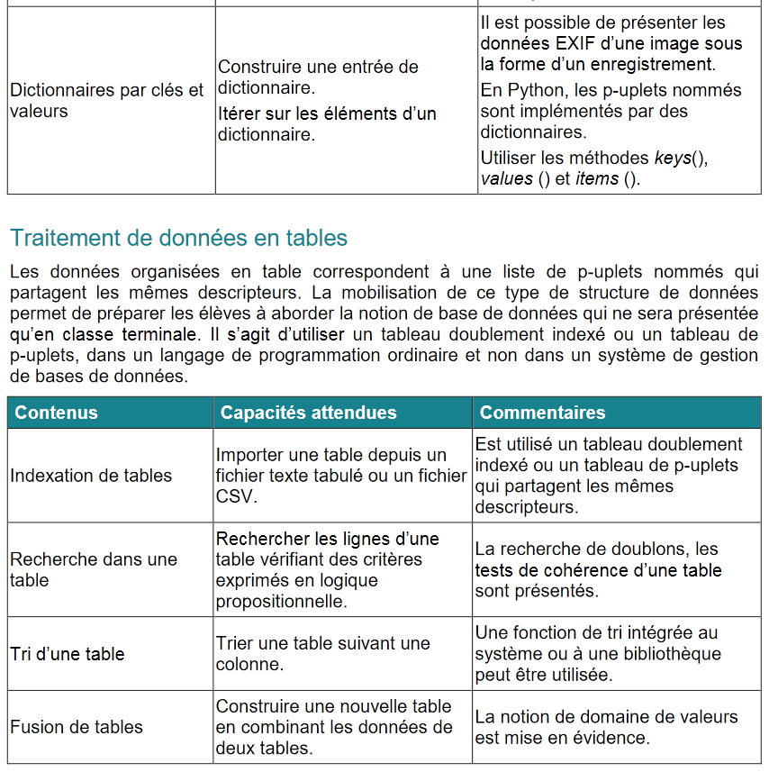
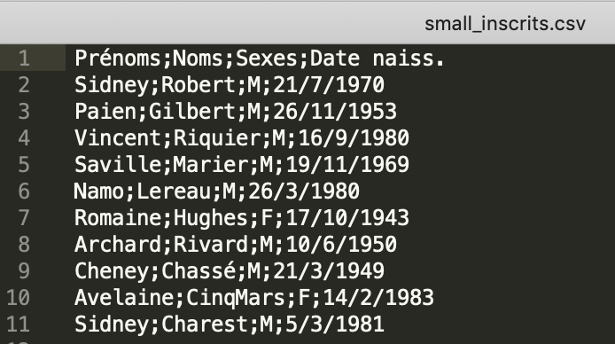

La course du chicon
===================


**Objectifs**

-   les dictionnaires
-   tuples nommés
-   modules
-   traitement des données en tables
-   utilisation des tris
-   lecture/écriture de fichiers textes et format CSV

On s'intéresse donc ici en particulier à cette partie du programme de NSI de 1ère :




Introduction
------------

Le dimanche 27 octobre 2019 a eu lieu à Baisieux, commune du Nord
frontalière de la Belgique, la [course du chicon](http://courirabaisieux.fr/la-course-du-chicon/).

Cette course se décline sur plusieurs distances de 15km à 0.5km. Nous ne nous intéresserons dans ce TP qu'à la
version 15km.

Vous avez la responsabilité du traitement informatique des données :
gestion des inscriptions, récolte des performances des concurrents,
publication des résultats.

Préparation
-----------


1.  **Archive**

Récupérez le [dossier](https://gitlab-fil.univ-lille.fr/diu-eil-lil/portail/blob/master/bloc1/course_chicon/mat_course_chicon.zip)

 Ce dossier contient trois sous-dossiers :

 -   [`src/`](./src) contient le module  [src/Competitor.py](src/Competitor.py)
 - `docs/` contient la documentation du module `Competitor`, accessible depuis le fichier index.html
 -  [`data/`](./data)  contient deux jeux de données dans quatre fichiers de données : un
     petit jeu  de données pour faire des tests simples
 ([data/small\_inscrits.csv](data/small_inscrits.csv) et
 [data/small\_performances.csv](data/small_performances.csv)), et un gros jeu de données
 ([data/inscrits.csv](data/inscrits.csv) et [data/performances.csv](data/performances.csv)).



2.  **Documentation**

Consultez la documentation du module fourni.


Le module `Competitor.py` que l'on importera en écrivant `import Competitor` permet de manipuler des valeurs représentant les compétiteurs de la course. On peut considérer qu'il permet la définition d'un type `Competitor`.
L'étude de la documentation permet de déduire les différentes informations contenues dans une telle donnée.

Vous pouvez bien sûr examiner le code (accessible depuis la
documentation), mais **se limiter à la lecture de la documentation est
un bon exercice**, car il implique de se limiter à manipuler les
données de type `Competitor` via l'interface fournie, sans se
préoccuper de l'implémentation qui en a été réalisée (c'est ce qui se
passe de fait, par exemple, dans les langages objets pour lesquels la
notion d'attribut *privé* à un sens).

On dispose ainsi d'un **constructeur**  (`create`) et les différentes informations qui décrivent une donnée `Competitor` sont ainsi accessibles via les différents **accesseurs** (`get_XXX`). On constate de plus que le seul **modificateur** concerne la performance d'un compétiteur (`set_performance`).

3. **Création du module `Time`**

Nous allons créer un module `Time.py` que l'on importera `import Time`.  
Les performances des compétiteurs vont être représentées par leur temps de course exprimé en heures, minutes et secondes.

On décide de représenter ces données par un tuple nommé. Ces données étant **non mutables**, utiliser les *named tuples* de Python pour les représenter semble être un choix  pertinent.

Pour rappel, cette notion est définie dans le module `collections` de Python. Il convient donc de l'importer en premier lieu :

```python
from collections import namedtuple
```

**À faire**

Créer un module `Time.py` qui définit :

 * le type `Time` qui correspond à un tuple nommé possédant trois champs `hours`, `minutes` et `seconds` ;
 * une fonction `create` à trois arguments, permettant de créer une donnée de ce type, dont le résultat est la donnée `Time` créée (on peut envisager un contrôle de validité des valeurs des paramètres pour ce constructeur) ;
 * une fonction `compare` qui définit une relation d'ordre sur les données de type `Time`. De manière classique le résultat de cette fonction, à deux paramètres de type `Time`, est négatif si son premier paramètre est inférieur au second, positif s'il lui est plus grand et nul quand ils sont égaux.
 * une fonction `to_string` qui a pour résultat une représentation sous la forme d'une chaîne de caractères de son paramètre de type `Time`.


```python
from collections import namedtuple

Time = namedtuple('Time', ['hours', 'minutes', 'seconds'])

def create (hours, minutes, seconds):
    """    
    :param hours: value of time in hours
    :type name: int
    :param minutes: value of time in minutes
    :type name: int
    :param seconds: value of time in seconds
    :type name: int
    :return: a new time for a competitor
    :rtype: Time
    :UC: hours > 0 
    """
    return Time(hours,minutes,seconds)

p=create(5,28,10)
#on dispose de deux modes d'accès possibles aux informations du tuple nommé
#p.hours=5
#p[0]=5
q=create(5,28,12)
#q.seconds=12
#q[2]=12

#>>> p
#Time(hours=5, minutes=28, seconds=10)
#>>> q
#Time(hours=5, minutes=28, seconds=12)


def compare(time1,time2):
    """
    Renvoie 1 si time1>time 2
    0 si time1=time2
    -1 si time1<time2
    """
    
    if time1.hours==time2.hours:        
        if time1.minutes==time2.minutes:            
            return (time1.seconds>time2.seconds)-(time1.seconds<time2.seconds)        
        else:            
            return (time1.minutes>time2.minutes)-(time1.minutes<time2.minutes)        
    else:
        return (time1.hours>time2.hours)-(time1.hours<time2.hours)

#compare(q,p)=1
#compare(p,q)=-1

# cette fonction repose sur les observations suivantes réalisables rapidement dans le shell

#>>> True - False
#1
#>>> False - True
#-1
    
def to_string(time):
    return ' {hours}h {minutes}mn {seconds}s'.format(hours=time.hours,minutes=time.minutes,seconds=time.seconds)

#to_string(p)=' 5h 28mn 10s'

#On utilise la méthode appelée format qui s'applique aux objets de type string
#c'est équivalent à une concaténation mais plus simple
#>>> valeur=18
#>>> print("Il a {} ans".format(valeur))
#Il a 18 ans
        
```


Gestion des inscrits
--------------------

Les fonctions suivantes sont à définir maintenant dans le module `course_chicon` que vous allez créer qui regroupera les fonctions utiles à la gestion de la course.

Il sera bien sûr nécessaire d'importer les modules `Competitor` et `Time`.


Votre première tâche est de construire la liste des compétiteurs inscrits à
la compétition.

Les données concernant ces compétiteurs se trouvent dans le fichier
`data/inscrits.csv` (ou `data/small_inscrits.csv`) qui
est un fichier au format
[CSV](https://fr.wikipedia.org/wiki/Comma-separated_values),
c'est-à-dire un fichier texte contenant des données tabulées (observer sa constitution à l'aide d'un éditeur de textes tel que Sublime Text).

La première ligne de ce fichier est constituée des libellés des données
qui suivent :

``` {.sourceCode .text}
Prénoms;Noms;Sexes;Date naiss.
```

Elle précise donc que chacune des lignes qui suivent contient dans cet
ordre le prénom, le nom, le sexe et la date de naissance du compétiteur
inscrit. Ces informations sont séparées par un point-virgule.

Avec ces données vous allez construire des compétiteurs à l'aide de la
fonction `Competitor.create`. Il vous faudra attribuer à chacun de ces
compétiteurs un numéro de dossard, obtenu par simple incrémentation d'un
compteur. 

Tous les compétiteurs seront rassemblés dans un **dictionnaire** dont les **clés** seront les numéros de dossard et les **valeurs** le tuple contenant les quatre informations associées au compétiteur**.


**À faire n°1**

Réalisez une fonction nommée `read_competitors` paramétrée par le nom du
fichier CSV contenant les données des inscrits, qui a pour résultat le dictionnaire de
ces inscrits. À cet effet, on relira avantageusement le **cours n°4** pour suivre une démarche similaire.

*Indication* : Pensez à la méthode `split` des chaînes de caractères. La méthode `rstrip` est également utilisée pour supprimer les marqueurs de fin de ligne.  

Testez la validité de votre fonction avec le fichier `data/small_inscrits.csv`. 
Vérifiez par exemple la taille du dictionnaire obtenu, ainsi que le contenu de quelques éléments.

Vous pouvez envisager de gérer la situation où aucun fichier ne correspond au paramètre fourni. Cela peut être fait en capturant l'exception `FileNotFoundError` qui est alors déclenchée.

Exemple de capture d'erreur et de levée d'exception dans le cas de `IndexError` rencontrée pour les listes :

```python
def renvoie_valeur_indice3_liste(liste):
    return liste[2]

>>> renvoie_valeur_indice3_liste([1,5])
Traceback (most recent call last):
  File "<pyshell>", line 1, in <module>
  File "/Users/vincentlesieux/Library/Mobile Documents/com~apple~CloudDocs/DIU-EIL/course_chicon_new.py", line 30, in renvoie_valeur_indice3_liste
    return liste[2]
IndexError: list index out of range

def renvoie_valeur_indice3_liste(liste):
    try :
        return liste[2]
    except IndexError:
        print("votre liste ne comporte pas d'élément d'indice 3")

>>> renvoie_valeur_indice3_liste([1,2])
votre liste ne comporte pas d'élément d'indice 3

```

Vous devriez obtenir ceci: 

```python
>>> read_competitors("data/small_inscrits.csv")
{1: {'bib_num': 1, 'first_name': 'Sidney', 'last_name': 'Robert', 'sex': 'M', 'birth_date': '21/7/1970', 'performance': None}, 2: {'bib_num': 2, 'first_name': 'Paien', 'last_name': 'Gilbert', 'sex': 'M', 'birth_date': '26/11/1953', 'performance': None}, 3: {'bib_num': 3, 'first_name': 'Vincent', 'last_name': 'Riquier', 'sex': 'M', 'birth_date': '16/9/1980', 'performance': None}, 4: {'bib_num': 4, 'first_name': 'Saville', 'last_name': 'Marier', 'sex': 'M', 'birth_date': '19/11/1969', 'performance': None}, 5: {'bib_num': 5, 'first_name': 'Namo', 'last_name': 'Lereau', 'sex': 'M', 'birth_date': '26/3/1980', 'performance': None}, 6: {'bib_num': 6, 'first_name': 'Romaine', 'last_name': 'Hughes', 'sex': 'F', 'birth_date': '17/10/1943', 'performance': None}, 7: {'bib_num': 7, 'first_name': 'Archard', 'last_name': 'Rivard', 'sex': 'M', 'birth_date': '10/6/1950', 'performance': None}, 8: {'bib_num': 8, 'first_name': 'Cheney', 'last_name': 'Chassé', 'sex': 'M', 'birth_date': '21/3/1949', 'performance': None}, 9: {'bib_num': 9, 'first_name': 'Avelaine', 'last_name': 'CinqMars', 'sex': 'F', 'birth_date': '14/2/1983', 'performance': None}, 10: {'bib_num': 10, 'first_name': 'Sidney', 'last_name': 'Charest', 'sex': 'M', 'birth_date': '5/3/1981', 'performance': None}}   
```

Manipulations du dictionnaire
-----------------------------

### Affichage des informations

**À faire n°2**

Réalisez une fonction _affichage_ qui prend en paramètre une liste de données de type `Competitor` et affiche sur la sortie standard chacune de ces données à raison d'une par ligne (utilisez la fonction `to_string` de `Competitor`).

Utilisez votre fonction pour afficher les compétiteurs contenus dans le dictionnaire produit par la fonction `read_competitors`.


Rappel sur le parcours des éléments d'un dictionnaire :
```python
>>> frequences={'do4': 523.25, 'la3': 440, 'mi4': 659.26}
for i in frequences:
    print(frequences[i])
523.25
440
659.26
```
Vous devriez obtenir ceci: 

```python
>>> affichage(read_competitors("data/small_inscrits.csv"))
[1]: Sidney Robert (M - 21/7/1970) 
[2]: Paien Gilbert (M - 26/11/1953) 
[3]: Vincent Riquier (M - 16/9/1980) 
[4]: Saville Marier (M - 19/11/1969) 
[5]: Namo Lereau (M - 26/3/1980) 
[6]: Romaine Hughes (F - 17/10/1943) 
[7]: Archard Rivard (M - 10/6/1950) 
[8]: Cheney Chassé (M - 21/3/1949) 
[9]: Avelaine CinqMars (F - 14/2/1983) 
[10]: Sidney Charest (M - 5/3/1981) 
```

### Sélections

Nous allons écrire maintenant quelques fonctions de recherche dans un dictionnaire de valeurs qui satisfont un critère. Dans cette section, les compétiteurs sont passés en paramètre de chacune des fonctions sous la forme d'un dictionnaire tel que celui construit par la fonction `read_competitors`. Les fonctions à écrire disposent d'un autre paramètre qui correspond, d'une manière ou d'une autre, au critère de sélection des compétiteurs dans le dictionnaire.
Les fonctions ont pour résultat soit une donnée de type `Competitor`, soit une liste de telles données. Ce résultat correspond à la sélection selon le critère cherché.

**À faire n°3**   

Écrivez une fonction `select_competitor_by_bib` qui a pour résultat le compétiteur dont le numéro de dossard est passé en paramètre.

Comment proposez-vous de  gérer la situation où aucun compétiteur ne correspond au dossard fourni ? 

*Suggestion* : cela peut être l'occasion de tester à nouveau une levée d'exception.

Exemple :

```python
>>> select_competitor_by_bib(read_competitors("data/small_inscrits.csv"),8)
{'bib_num': 8, 'first_name': 'Cheney', 'last_name': 'Chassé', 'sex': 'M', 'birth_date': '21/3/1949', 'performance': None}
```

**À faire n°4**    

Écrivez une fonction `select_competitor_by_birth_year` dont le résultat est la **liste** des compétiteurs dont l'année de naissance correspond à une valeur passée en paramètre.

*Suggestion* : Étudiez la documentation de la fonction `endswith` des chaînes de caractères.

Quel résultat renvoyer si aucun compétiteur ne correspond à l'année fournie ?

Exemple : Dans le petit jeu de données, deux compétiteurs sont nés en 1980.

```python
>>> select_competitor_by_birth_year(read_competitors("data/small_inscrits.csv"),1980)
[{'bib_num': 3, 'first_name': 'Vincent', 'last_name': 'Riquier', 'sex': 'M', 'birth_date': '16/9/1980', 'performance': None}, {'bib_num': 5, 'first_name': 'Namo', 'last_name': 'Lereau', 'sex': 'M', 'birth_date': '26/3/1980', 'performance': None}]
```

**À faire n°5**

Écrivez une fonction `select_competitor_by_name` dont le résultat est la **liste** des compétiteurs dont le nom (*last name*) contient la chaîne de caractères passée en paramètre.

*Suggestion* : Pensez à utiliser `in` pour les chaînes de caractères.

Exemple : Dans le petit jeu de données, deux compétiteurs ont leur nom de famille qui commence par "Ri".

```python
>>> select_competitor_by_name(read_competitors("data/small_inscrits.csv"),"Ri")
[{'bib_num': 3, 'first_name': 'Vincent', 'last_name': 'Riquier', 'sex': 'M', 'birth_date': '16/9/1980', 'performance': None}, {'bib_num': 7, 'first_name': 'Archard', 'last_name': 'Rivard', 'sex': 'M', 'birth_date': '10/6/1950', 'performance': None}]
```


Report des performances
-----------------------

La course achevée, votre tâche consiste à reporter les
performances des compétiteurs dans les fiches de la liste de ces compétiteurs.

### Lecture des performances

Les données concernant les performances se trouvent dans le fichier
`data/performances.csv` (ou
`data/small_performances.csv`) qui est un fichier au format
CSV.

La première ligne de ce fichier est constituée des libellés des données
qui suivent :

``` {.sourceCode .text}
bib_num;hours;minutes;seconds
```

Elle précise donc que chacune des lignes qui suivent contient dans cet
ordre le numéro de dossard, le nombre d'heures, de minutes et de
secondes du temps de parcours d'un compétiteur, ces informations étant
séparées par un point-virgule.

Seuls les compétiteurs ayant effectivement participé et achevé la
course figurent dans ce fichier.  Avec ces données vous allez
construire un dictionnaire des performances qui associe à un numéro de
dossard un objet de type `Time` du module que vous avez défini.


**À faire n°6**

Réalisez une fonction nommée `read_performances` paramétrée par le nom
du fichier CSV contenant les données des performances, qui renvoie le dictionnaire
des performances contenues dans ce fichier.   
La clé du dictionnaire est le numéro de brassard déjà inclu dans le fichier csv.
On n'oubliera pas de transformer les données fournies en chaînes de caractères en entier à l'aide de la fonction `int()`.  
Cette fonction est très similaire à la fonction _read_competitor_.

Testez la validité de votre fonction avec le fichier
`data/small_performances.csv`.
Vérifiez en particulier la taille du dictionnaire obtenu, ainsi que le
contenu de quelques éléments.

Vous devriez obtenir ceci: 

```python
>>> read_performances("data/small_performances.csv")
{1: Time(hours=1, minutes=8, seconds=55), 3: Time(hours=1, minutes=21, seconds=23), 4: Time(hours=0, minutes=56, seconds=29), 5: Time(hours=1, minutes=6, seconds=20), 6: Time(hours=1, minutes=17, seconds=8), 7: Time(hours=0, minutes=46, seconds=31), 8: Time(hours=0, minutes=48, seconds=10), 10: Time(hours=1, minutes=6, seconds=38)}
```

### Report

Maintenant que vous disposez des données sur les compétiteurs et leurs
performances sous forme de dictionnaires qui partagent les mêmes
clefs, votre travail consiste à reporter les performances dans les
fiches de ces compétiteurs. On réalise ainsi une fusion des deux tables.


**À faire n°7**

Réalisez une fonction nommée `set_performances` paramétrée par le dictionnaire des performances et le dictionnaire des compétiteurs qui renvoie le dictionnaire des compétiteurs augmenté de leurs performances sous la forme d'un Time. Il faut gérer la situation où un compétiteur n'a pas de performance s'il s'est inscrit à la course mais n'a pas concouru, c'est-à-dire la cas où la clé du dictionnaire des compétiteurs est absente du dictionnaire des performances. Il faudra gérer l'exception de clé manquante `KeyError`.

Testez la validité de votre fonction avec les listes produites par le
petit jeu de données.

Vous devriez obtenir ceci: 

```python
>>> set_performances(read_performances('data/small_performances.csv'),read_competitors("data/small_inscrits.csv"))
{1: {'bib_num': 1, 'first_name': 'Sidney', 'last_name': 'Robert', 'sex': 'M', 'birth_date': '21/7/1970', 'performance': ' 1h 8mn 55s'}, 2: {'bib_num': 2, 'first_name': 'Paien', 'last_name': 'Gilbert', 'sex': 'M', 'birth_date': '26/11/1953', 'performance': None}, 3: {'bib_num': 3, 'first_name': 'Vincent', 'last_name': 'Riquier', 'sex': 'M', 'birth_date': '16/9/1980', 'performance': ' 1h 21mn 23s'}, 4: {'bib_num': 4, 'first_name': 'Saville', 'last_name': 'Marier', 'sex': 'M', 'birth_date': '19/11/1969', 'performance': ' 0h 56mn 29s'}, 5: {'bib_num': 5, 'first_name': 'Namo', 'last_name': 'Lereau', 'sex': 'M', 'birth_date': '26/3/1980', 'performance': ' 1h 6mn 20s'}, 6: {'bib_num': 6, 'first_name': 'Romaine', 'last_name': 'Hughes', 'sex': 'F', 'birth_date': '17/10/1943', 'performance': ' 1h 17mn 8s'}, 7: {'bib_num': 7, 'first_name': 'Archard', 'last_name': 'Rivard', 'sex': 'M', 'birth_date': '10/6/1950', 'performance': ' 0h 46mn 31s'}, 8: {'bib_num': 8, 'first_name': 'Cheney', 'last_name': 'Chassé', 'sex': 'M', 'birth_date': '21/3/1949', 'performance': ' 0h 48mn 10s'}, 9: {'bib_num': 9, 'first_name': 'Avelaine', 'last_name': 'CinqMars', 'sex': 'F', 'birth_date': '14/2/1983', 'performance': None}, 10: {'bib_num': 10, 'first_name': 'Sidney', 'last_name': 'Charest', 'sex': 'M', 'birth_date': '5/3/1981', 'performance': ' 1h 6mn 38s'}}
```

# Tris

Vous allez avoir l'occasion d'utiliser une méthode de tri appelée _tri_selection_ dont l'algorithme sera étudié plus tard. Vous créez le module Tri.py dans le dossier src que vous importez dans votre fichier : `import src.Tri as Tri`.

```python

def compare_entier_croissant(a, b):
    """
    :param a: (int) un entier
    :param b: (int) un entier
    :return: (int)  
             * >0  si a est supérieur à b
             * 0 si a est égal à b
             * <0 si a est inférieur à b
    :CU: aucune
    :Exemples:

    >>> compare_entier_croissant(1, 3) < 0
    True
    """
    return a-b


def compare_chaine_lexicographique(a, b):
    return (a>b)-(a<b)

    
def compare_entier_decroissant(a, b):
    """
    :param a: (int) un entier
    :param b: (int) un entier
    :return: (int) 
             * >0 si a est inférieur à b
             * 0 si a est égal à b
             * <0 si a est supérieur à b
    :CU: aucune
    :Exemples:

    >>> compare_entier_décroissant(1, 3) > 0
    True
    """
    return b-a


def tri_selection(l,comp):
    """
        paramètre l : liste
        paramètre comp : mode de comparaison
        valeur renvoyée : liste triée

    CU : liste non vide

    Exemples :

    >>> tri_selection([1,8,3,10,5],compare_entier_croissant)
    [1, 3, 5, 8, 10]
    
    """
    for i in range(len(l)):
        j=selection_min(l,i,comp)
        l[i],l[j]=l[j],l[i]
    return l
        
def selection_min(l,i,comp):
    """
        paramètre l : liste
        paramètre i : int
        comp : mode de comparaison
        valeur renvoyée : l'indice du minimum à partir de l'indice i

    CU : liste non vide

    Exemples :

    >>> selection_min([1,8,3,10,5,2,6],2,compare_entier_croissant)
    5
    
    """
    i_min=i
    for j in range(i+1,len(l)):
        if comp(l[j],l[i_min])<0:
            i_min=j
    return i_min

```


**À faire n°8**

Utilisez la fonction `tri.compare_chaine_lexicographique` pour définir une fonction `sort_competitors_by_lastname` qui prend en paramètre un dictionnaire de compétiteurs, comme défini précédemment, et a pour résultat un nouveau dictionnaire de compétiteurs triés par ordre alphabétique de leurs noms.

```python
Vous devriez obtenir ceci : 

>>> sort_competitors_by_lastname(set_performances(read_performances('data/small_performances.csv'),read_competitors('data/small_inscrits.csv')))
{10: {'bib_num': 10, 'first_name': 'Sidney', 'last_name': 'Charest', 'sex': 'M', 'birth_date': '5/3/1981', 'performance': ' 1h 6mn 38s'}, 8: {'bib_num': 8, 'first_name': 'Cheney', 'last_name': 'Chassé', 'sex': 'M', 'birth_date': '21/3/1949', 'performance': ' 0h 48mn 10s'}, 9: {'bib_num': 9, 'first_name': 'Avelaine', 'last_name': 'CinqMars', 'sex': 'F', 'birth_date': '14/2/1983', 'performance': None}, 2: {'bib_num': 2, 'first_name': 'Paien', 'last_name': 'Gilbert', 'sex': 'M', 'birth_date': '26/11/1953', 'performance': None}, 6: {'bib_num': 6, 'first_name': 'Romaine', 'last_name': 'Hughes', 'sex': 'F', 'birth_date': '17/10/1943', 'performance': ' 1h 17mn 8s'}, 5: {'bib_num': 5, 'first_name': 'Namo', 'last_name': 'Lereau', 'sex': 'M', 'birth_date': '26/3/1980', 'performance': ' 1h 6mn 20s'}, 4: {'bib_num': 4, 'first_name': 'Saville', 'last_name': 'Marier', 'sex': 'M', 'birth_date': '19/11/1969', 'performance': ' 0h 56mn 29s'}, 3: {'bib_num': 3, 'first_name': 'Vincent', 'last_name': 'Riquier', 'sex': 'M', 'birth_date': '16/9/1980', 'performance': ' 1h 21mn 23s'}, 7: {'bib_num': 7, 'first_name': 'Archard', 'last_name': 'Rivard', 'sex': 'M', 'birth_date': '10/6/1950', 'performance': ' 0h 46mn 31s'}, 1: {'bib_num': 1, 'first_name': 'Sidney', 'last_name': 'Robert', 'sex': 'M', 'birth_date': '21/7/1970', 'performance': ' 1h 8mn 55s'}}
```

**À faire n°9**

De manière similaire, faites le travail nécessaire pour définir une
fonction `sort_competitors_by_performance` qui produit la liste des
compétiteurs triée par ordre croissant des performances réalisées. Les
compétiteurs sans résultat sont placés en fin de liste par ordre
alphabétique. 

Première méthode :

On réalisera une fonction _conversion_en_seconde_ qui convertit le temps donné en text en un nombre de secondes.

```python
>>> conversion_en_seconde(' 1h 21mn 23s')
4883
```

Vous devriez obtenir ceci :

```python
>>> sort_competitors_by_performance_methode1(set_performances(read_performances('data/small_performances.csv'),read_competitors('data/small_inscrits.csv')))

{7: {'bib_num': 7, 'first_name': 'Archard', 'last_name': 'Rivard', 'sex': 'M', 'birth_date': '10/6/1950', 'performance': ' 0h 46mn 31s'}, 8: {'bib_num': 8, 'first_name': 'Cheney', 'last_name': 'Chassé', 'sex': 'M', 'birth_date': '21/3/1949', 'performance': ' 0h 48mn 10s'}, 4: {'bib_num': 4, 'first_name': 'Saville', 'last_name': 'Marier', 'sex': 'M', 'birth_date': '19/11/1969', 'performance': ' 0h 56mn 29s'}, 5: {'bib_num': 5, 'first_name': 'Namo', 'last_name': 'Lereau', 'sex': 'M', 'birth_date': '26/3/1980', 'performance': ' 1h 6mn 20s'}, 10: {'bib_num': 10, 'first_name': 'Sidney', 'last_name': 'Charest', 'sex': 'M', 'birth_date': '5/3/1981', 'performance': ' 1h 6mn 38s'}, 1: {'bib_num': 1, 'first_name': 'Sidney', 'last_name': 'Robert', 'sex': 'M', 'birth_date': '21/7/1970', 'performance': ' 1h 8mn 55s'}, 6: {'bib_num': 6, 'first_name': 'Romaine', 'last_name': 'Hughes', 'sex': 'F', 'birth_date': '17/10/1943', 'performance': ' 1h 17mn 8s'}, 3: {'bib_num': 3, 'first_name': 'Vincent', 'last_name': 'Riquier', 'sex': 'M', 'birth_date': '16/9/1980', 'performance': ' 1h 21mn 23s'}, 9: {'bib_num': 9, 'first_name': 'Avelaine', 'last_name': 'CinqMars', 'sex': 'F', 'birth_date': '14/2/1983', 'performance': None}, 2: {'bib_num': 2, 'first_name': 'Paien', 'last_name': 'Gilbert', 'sex': 'M', 'birth_date': '26/11/1953', 'performance': None}}
```

Deuxième méthode : 

On utilise la fonction de comparaison du module Time, ce qui est mieux.

Vous devriez obtenir ceci (la même chose que précédemment) :

```python
>>> sort_competitors_by_performance_methode2(set_performances(read_performances('data/small_performances.csv'),read_competitors('data/small_inscrits.csv')),read_performances("data/small_performances.csv"))
{7: {'bib_num': 7, 'first_name': 'Archard', 'last_name': 'Rivard', 'sex': 'M', 'birth_date': '10/6/1950', 'performance': ' 0h 46mn 31s'}, 8: {'bib_num': 8, 'first_name': 'Cheney', 'last_name': 'Chassé', 'sex': 'M', 'birth_date': '21/3/1949', 'performance': ' 0h 48mn 10s'}, 4: {'bib_num': 4, 'first_name': 'Saville', 'last_name': 'Marier', 'sex': 'M', 'birth_date': '19/11/1969', 'performance': ' 0h 56mn 29s'}, 5: {'bib_num': 5, 'first_name': 'Namo', 'last_name': 'Lereau', 'sex': 'M', 'birth_date': '26/3/1980', 'performance': ' 1h 6mn 20s'}, 10: {'bib_num': 10, 'first_name': 'Sidney', 'last_name': 'Charest', 'sex': 'M', 'birth_date': '5/3/1981', 'performance': ' 1h 6mn 38s'}, 1: {'bib_num': 1, 'first_name': 'Sidney', 'last_name': 'Robert', 'sex': 'M', 'birth_date': '21/7/1970', 'performance': ' 1h 8mn 55s'}, 6: {'bib_num': 6, 'first_name': 'Romaine', 'last_name': 'Hughes', 'sex': 'F', 'birth_date': '17/10/1943', 'performance': ' 1h 17mn 8s'}, 3: {'bib_num': 3, 'first_name': 'Vincent', 'last_name': 'Riquier', 'sex': 'M', 'birth_date': '16/9/1980', 'performance': ' 1h 21mn 23s'}, 9: {'bib_num': 9, 'first_name': 'Avelaine', 'last_name': 'CinqMars', 'sex': 'F', 'birth_date': '14/2/1983', 'performance': None}, 2: {'bib_num': 2, 'first_name': 'Paien', 'last_name': 'Gilbert', 'sex': 'M', 'birth_date': '26/11/1953', 'performance': None}}
```

Publication et sauvegarde des résultats
---------------------------------------

### Affichage des résultats

Il est temps de procéder à la publication des résultats.


**À faire n°10**

Réalisez une fonction nommée `print_results` paramétrée par un dictionnaire de
compétiteurs qui imprime sur la sortie standard cette liste en précisant
leur prénom, nom, sexe, numéro de dossard et performance.

Par exemple, avec le petit jeu de données, et en supposant que le report
des performances a été effectué et la liste de compétiteurs triée par
ordre de performance, on otient l'affichage :

``` {.sourceCode .bash}
[7]: Archard Rivard (M - 10/6/1950)      =>  0h46mn31s
[8]: Cheney Chassé (M - 21/3/1949)       =>  0h48mn10s
[4]: Saville Marier (M - 19/11/1969)     =>  0h56mn29s
[5]: Namo Lereau (M - 26/3/1980)         =>  1h 6mn20s
[10]: Sidney Charest (M - 5/3/1981)      =>  1h 6mn38s
[1]: Sidney Robert (M - 21/7/1970)       =>  1h 8mn55s
[6]: Romaine Hughes (F - 17/10/1943)     =>  1h17mn 8s
[3]: Vincent Riquier (M - 16/9/1980)     =>  1h21mn23s
[9]: Avelaine CinqMars (F - 14/2/1983)   => 
[2]: Paien Gilbert (M - 26/11/1953)      => 
```

Produisez l'affichage des résultats par ordre alphabétique, et par
ordre des performances.


### Sauvegarde des résultats

Enfin pour la pérennité de ces résultats, il est important de les
sauvegarder dans un fichier.


**À faire n°11**

Réalisez une fonction nommée `save_results` paramétrée par un dictionnaire de
compétiteurs et un nom de fichier de sauvegarde, qui crée un fichier au
format CSV contenant

-   les libellés en première ligne

    ``` {.sourceCode .text}   
    Num_dossard;Prénom;Nom;Performance
    ```

-   les résultats sur les lignes suivantes

    ``` {.sourceCode .text}   
    7;Archard;Rivard; 0h46mn31s
    8;Cheney;Chassé; 0h48mn10s
    ...
    ```

Testez votre fonction avec le petit jeu de données puis sauvegardez les résultats complets de la course.

**L'équipe organisatrice de la course du chicon vous remercie
chaleureusement pour votre contribution à son bon déroulement.**


# Compléments

## Pour les fonctions de sélection

**Allons un peu plus loin**

On peut constater que les deux fonctions de sélection réalisées sont
assez similaires et on pourrait imaginer d'autres fonctions de
sélection (par sexe, par tranche d'âge, etc.) qui le
seraient tout autant.  À chaque fois, il s'agit de filtrer parmi les
valeurs du dictionnaire, celles qui satisfont un critère de
sélection. Ce critère pourrait être défini par un **prédicat**, c'est-à-dire
une fonction dont le résultat est un booléen, dont le paramètre serait
un compétiteur. Le résultat de cette fonction est `True` si le
compétiteur doit être sélectionné (on dit qu'il vérifie le prédicat)
et `False` dans le cas contraire.


**À faire n°12**    

On a vu que les fonctions de comparaison pouvaient être passées en paramètre des fonctions de tri.
En reprenant ce principe, définissez une fonction `select_competitor` dont le premier paramètre est un dictionnaire de compétiteurs et le second est une fonction prédicat.
Le résultat de `select_competitor` est la liste des compétiteurs qui vérifient le prédicat.

Définissez une prédicat qui vérifie si son paramètre de type `Competitor` est de sexe féminin, puis sans définir de nouvelle fonction produisez la liste des compétiteurs de sexe féminin. 

Vous devriez obtenir ceci :

```python
>>> select_competitor(read_competitors('data/small_inscrits.csv'),is_sexe_feminin)
[{'bib_num': 6, 'first_name': 'Romaine', 'last_name': 'Hughes', 'sex': 'F', 'birth_date': '17/10/1943', 'performance': None}, {'bib_num': 9, 'first_name': 'Avelaine', 'last_name': 'CinqMars', 'sex': 'F', 'birth_date': '14/2/1983', 'performance': None}]
```

**À faire n°13**  

Après avoir défini le prédicat qui convient, proposez une seconde version de la fonction  `select_competitor_by_birth_year`.

Vous devriez obtenir ceci :

```python
new_select_competitor_by_birth_year(read_competitors('data/small_inscrits.csv'),is_plus_age)
{1: {'bib_num': 9, 'first_name': 'Avelaine', 'last_name': 'CinqMars', 'sex': 'F', 'birth_date': '14/2/1983', 'performance': None}, 2: {'bib_num': 3, 'first_name': 'Vincent', 'last_name': 'Riquier', 'sex': 'M', 'birth_date': '16/9/1980', 'performance': None}, 3: {'bib_num': 5, 'first_name': 'Namo', 'last_name': 'Lereau', 'sex': 'M', 'birth_date': '26/3/1980', 'performance': None}, 4: {'bib_num': 1, 'first_name': 'Sidney', 'last_name': 'Robert', 'sex': 'M', 'birth_date': '21/7/1970', 'performance': None}, 5: {'bib_num': 4, 'first_name': 'Saville', 'last_name': 'Marier', 'sex': 'M', 'birth_date': '19/11/1969', 'performance': None}, 6: {'bib_num': 2, 'first_name': 'Paien', 'last_name': 'Gilbert', 'sex': 'M', 'birth_date': '26/11/1953', 'performance': None}, 7: {'bib_num': 7, 'first_name': 'Archard', 'last_name': 'Rivard', 'sex': 'M', 'birth_date': '10/6/1950', 'performance': None}, 8: {'bib_num': 8, 'first_name': 'Cheney', 'last_name': 'Chassé', 'sex': 'M', 'birth_date': '21/3/1949', 'performance': None}, 9: {'bib_num': 6, 'first_name': 'Romaine', 'last_name': 'Hughes', 'sex': 'F', 'birth_date': '17/10/1943', 'performance': None}, 10: {'bib_num': 10, 'first_name': 'Sidney', 'last_name': 'Charest', 'sex': 'M', 'birth_date': '5/3/1981', 'performance': None}}
```

**À faire n°14**  

Après avoir défini le prédicat qui convient, proposez une seconde version de la fonction  `select_competitor_by_name`.

Vous devriez obtenir ceci :

```python
>>> new_select_competitor_by_birth_year(read_competitors('data/small_inscrits.csv'),is_plus_avance_ordre_alpha)
{1: {'bib_num': 1, 'first_name': 'Sidney', 'last_name': 'Robert', 'sex': 'M', 'birth_date': '21/7/1970', 'performance': None}, 2: {'bib_num': 7, 'first_name': 'Archard', 'last_name': 'Rivard', 'sex': 'M', 'birth_date': '10/6/1950', 'performance': None}, 3: {'bib_num': 3, 'first_name': 'Vincent', 'last_name': 'Riquier', 'sex': 'M', 'birth_date': '16/9/1980', 'performance': None}, 4: {'bib_num': 4, 'first_name': 'Saville', 'last_name': 'Marier', 'sex': 'M', 'birth_date': '19/11/1969', 'performance': None}, 5: {'bib_num': 5, 'first_name': 'Namo', 'last_name': 'Lereau', 'sex': 'M', 'birth_date': '26/3/1980', 'performance': None}, 6: {'bib_num': 6, 'first_name': 'Romaine', 'last_name': 'Hughes', 'sex': 'F', 'birth_date': '17/10/1943', 'performance': None}, 7: {'bib_num': 2, 'first_name': 'Paien', 'last_name': 'Gilbert', 'sex': 'M', 'birth_date': '26/11/1953', 'performance': None}, 8: {'bib_num': 9, 'first_name': 'Avelaine', 'last_name': 'CinqMars', 'sex': 'F', 'birth_date': '14/2/1983', 'performance': None}, 9: {'bib_num': 8, 'first_name': 'Cheney', 'last_name': 'Chassé', 'sex': 'M', 'birth_date': '21/3/1949', 'performance': None}, 10: {'bib_num': 10, 'first_name': 'Sidney', 'last_name': 'Charest', 'sex': 'M', 'birth_date': '5/3/1981', 'performance': None}}
```
