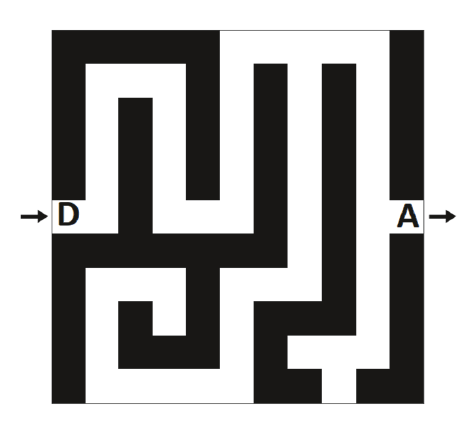
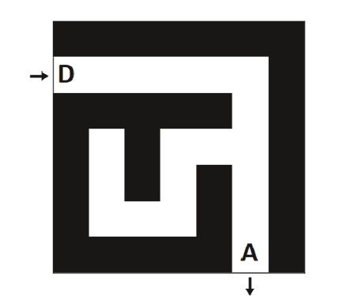

```Python
labyrinthe=[
[1,1,1,1,1,0,0,0,0,0,1],
[1,0,0,0,1,0,1,0,1,0,1],
[1,0,1,0,1,0,1,0,1,0,1],
[1,0,1,0,1,0,1,0,1,0,1],
[1,0,1,0,1,0,1,0,1,0,1],
[2,0,1,0,0,0,1,0,1,0,3],
[1,1,1,1,1,1,1,0,1,0,1],
[1,0,0,0,1,0,0,0,1,0,1],
[1,0,1,0,1,0,1,1,1,0,1],
[1,0,1,1,1,0,1,0,0,0,1],
[1,0,0,0,0,0,1,1,0,1,1]
      ]
```


```Python
lab1=[
[1,1,1,1,1,1,1],
[2,0,0,0,0,0,1],
[1,1,1,1,1,0,1],
[1,0,1,0,0,0,1],
[1,0,1,0,1,0,1],
[1,0,0,0,1,0,1],
[1,1,1,1,1,3,1]
    ]

```
 

```Python
def nombre_colonnes(graphe):
    """
    Renvoie le nombre de colonnes du graphe
    param : graphe : list
    return : int
    >>> nombre_colonnes(lab1)
    7
    """
    pass

```

```Python
def nombre_lignes(graphe):
    """
    Renvoie le nombre de lignes du graphe
    param : graphe : list
    return : int
    >>> nombre_lignes(lab1)
    7
    """
    pass

```

```Python
def representation(graphe):
    """
    Affiche une représentation du graphe
    param : graphe : list
    return : None
    >>> representation(lab1)
    ⬛⬛⬛⬛⬛⬛⬛
    ⬜⬜⬜⬜⬜⬜⬛
    ⬛⬛⬛⬛⬛⬜⬛
    ⬛⬜⬛⬜⬜⬜⬛
    ⬛⬜⬛⬜⬛⬜⬛
    ⬛⬜⬜⬜⬛⬜⬛
    ⬛⬛⬛⬛⬛⬜⬛
    <BLANKLINE>
    """
	pass

```
    
```Python    
def est_valide(i,j,graphe):
    """
    Renvoie True si le couple (i,j) correspond à des coordonnées valides
    param : i : int
    param : j : int
    param : graphe : list
    return : bool
    >>> est_valide(5,2,lab1)
    True
    >>> est_valide(-3,4,lab1)
    False
    """
    pass

```
    
```Python
def entree(graphe):
    """
    Renvoie les coordonnées du point de départ
    param : graphe : list
    return : tuple
    >>> entree(lab1)
    (1, 0)
    """
	pass
```

```Python            
def arrivee(graphe):
    """
    Renvoie les coordonnées du point de départ
    param : graphe : list
    return : tuple
    >>> arrivee(lab1)
    (6, 5)
    """
	pass
```

```Python            
def nombre_cases_vides(graphe):
    """
    Renvoie le nombre de cases vides(0) du graphe, entrée(2), sortie(3), visités (4) comprises.
    param : graphe : list
    return : int
    >>> nombre_cases_vides(lab1)
    19
    """
	pass
```
    
```Python
def voisines_valides(x,y,graphe):
    """
    Renvoie la liste des cases valides qui ne sont pas des murs autour de la case (x,y)
    On tourne dans le sens des aiguilles d'une montre à partir du haut à gauche
    param : i : int
    param : j : int
    param : graphe : list
    return : list
    >>> voisines_valides(1,5,lab1)
    [(1, 4), (2, 5)]
    """
	pass
```

```Python
def marquer_case(i,j,graphe):
    """
    Place 4 dans la case (i,j) pour indiquer que celle-ci est visitée
    param : i : int
    param : j : int
    param : graphe : list
    return : list
    >>> marquer_case(1,4,lab1)
    [[1, 1, 1, 1, 1, 1, 1], [2, 0, 0, 0, 4, 0, 1], [1, 1, 1, 1, 1, 0, 1], [1, 0, 1, 0, 0, 0, 1], [1, 0, 1, 0, 1, 0, 1], [1, 0, 0, 0, 1, 0, 1], [1, 1, 1, 1, 1, 3, 1]]
    """
	pass
```

import copy

```Python
def solution(graphe):
    """
    Renvoie la solution du labyrinthe
    param : lab :list
    return : list
    >>> solution(lab1)
    [(1, 0), (1, 1), (1, 2), (1, 3), (1, 4), (1, 5), (2, 5), (3, 5), (4, 5), (5, 5), (6, 5)]
    """
	pass
```
       
```Python
def representation_solution(graphe):
    """
    Affiche une représentation du graphe
    param : graphe : list
    return : None
    >>> representation_solution(lab1)
    ⬛⬛⬛⬛⬛⬛⬛
    🔴🔴🔴🔴🔴🔴⬛
    ⬛⬛⬛⬛⬛🔴⬛
    ⬛⬜⬛⬜⬜🔴⬛
    ⬛⬜⬛⬜⬛🔴⬛
    ⬛⬜⬜⬜⬛🔴⬛
    ⬛⬛⬛⬛⬛🔴⬛
    <BLANKLINE>
    """
	pass
```

if __name__ == '__main__':
  import doctest
  doctest.testmod(verbose=True)
```