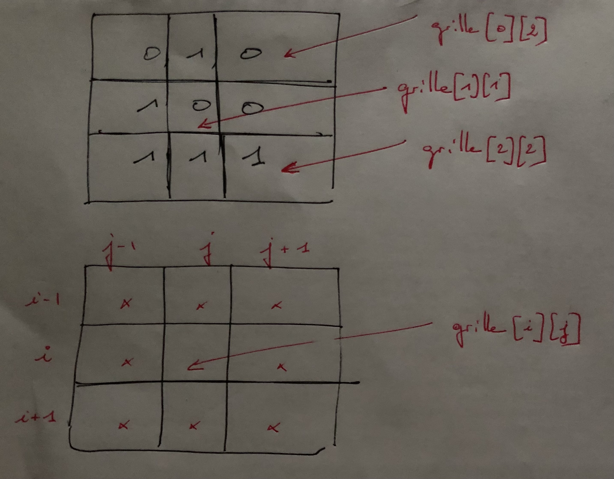

# Jeu de la vie

On commencera par regarder cette [vidéo didactique](https://www.youtube.com/watch?v=S-W0NX97DB0) de David Louapre qui présente le jeu de la vie et ses structures complexes.

Le jeu de la vie est une modélisation simpliste de la vie de cellules dans
l'espace. Dans le cadre de cet exercice, l'espace sera une grille rectangulaire
dont chaque case peut contenir au plus une cellule. Chaque case contiendra
donc soit 0 soit 1 cellule. Les cellules peuvent émerger ou mourir selon trois
critères précis qui sont réévalués à chaque nouvelle génération :

1. Une cellule émergera dans une case qui possède exactement trois voisines
   possédant une cellule.
2. Une cellule disparaît de sa case si elle est entourée par strictement moins
   de deux cellules vivantes ou strictement plus de trois cellules vivantes.
3. Les autres cases restent dans leur état.

Les voisines prises en compte sont toutes les cases situées immédiatement à
gauche, à droite, en haut, en bas ou sur les quatre diagonales, si elles existent.
Une case a par conséquent au plus 8 voisines, moins si elle se situe sur un bord de la grille.

On utilisera les **docstrings** fournies en plaçant le code ci-dessous pour réaliser les doctests:

```
if __name__ == '__main__':
    import doctest
    doctest.testmod(verbose=True)
```


## Représentation d'une grille

Du point de vue technique une grille du jeu de la vie sera représentée par une liste de listes de nombre entiers. Chaque nombre entier représente le nombre de cellules vivantes dans une case de la grille (0 ou 1).

Par exemple la liste :

```
[ [0, 1, 0], [1, 0, 0] ]
```
représente une grille de jeu de 6 cases, 3 cases en largeur et 2 cases en hauteur. Sur la première ligne, seule la deuxième case possède une cellule, tandis que sur la deuxième ligne, seule la première case en possède une.


### Construction d'une grille vide

Réalisez une fonction `creer_grille` qui prend en paramètre le nombre de cases horizontalement ou nombre de colonnes, puis le nombre de cases verticalement ou nombre de lignes, et qui renvoie une liste de listes (ou matrice) correspondant à la grille du jeu de la vie aux dimensions souhaitées, ne contenant initialement aucune cellule.

```
def creer_grille(nb_colonnes,nb_lignes):
    """
    renvoie une grille vide comportant nb_lignes et nb_colonnes
    >>> creer_grille(3, 2)
    [[0, 0, 0], [0, 0, 0]]
    """
```

**Indication** : essayer `[[0]*2]*3` dans la console, puis `[[0 for i in range(2) ] for i in range(3)]`, cela devrait vous éclairer.


### Dimensions d'une grille

Réalisez une fonction `hauteur_grille` qui prend en paramètre une grille de jeu de la vie et qui renvoie le nombre de cases verticalement ou nombre de lignes.

```
def hauteur_grille(grille):
    """
    renvoie le nombre de lignes d'une grille
    >>> hauteur_grille(creer_grille(3, 2))
    2
    """  
```

Réalisez de même une fonction `largeur_grille` qui prend en paramètre une grille de jeu de la vie et qui renvoie le nombre de cases horizontalement ou nombre de colonnes.

``` 
def largeur_grille(grille):
    """
    renvoie le nombre de colonnes d'une grille
    >>> largeur_grille(creer_grille(3, 2))
    3
    """
```

### Initialisation d'une grille

La grille créée par la fonction `creer_grille` ne contient aucune cellule.  

Réalisez une fonction `creer_grille_aleatoire` qui prend en paramètre les dimensions horizontales et verticales de la grille et une probabilité *p*, qui est la probabilité pour une case de la grille d'avoir une cellule. 

On ne propose pas de docstring dans le cas présent puisque le résultat est aléatoire, néanmoins voici quelques exemples de résultat que l'on peut obtenir.

```
>>> creer_grille_aleatoire(3, 2, 1)
[[1, 1, 1], [1, 1, 1]
>>> creer_grille_aleatoire(3, 2, 0)
[[0, 0, 0], [0, 0, 0]]
>>> creer_grille_aleatoire(3, 2, 0.5)
[[1, 0, 1], [0, 0, 1]]
```

**Indication 1** : on pourra utiliser la fonction suivante, qui utilise la fonction random() du module random et qui renvoie un réel aléatoire dans [0,1[, et qui prend ainsi en compte la probabilité de présence d'une cellule.

```
from random import *
#importation de toutes les fonctions du module random
#et en particulier la fonction random() 
def aleatoire(probabilite):
    valeur=0
    if random()<probabilite:
        valeur=1
    return valeur
```

**Indication 2** : on utilisera le même principe que pour la fonction creer_grille, c'est-à-dire que l'on réalisera une liste par compréhension.

### Voisins d'une case

Réalisez une fonction `voisins_case` qui prend en paramètre une grille de jeu de la vie ainsi que les coordonnées en abscisse et en ordonnée de la case (on choisit la coordonnée (0,0) pour la case située en haut à gauche).  
La fonction doit renvoyer une liste contenant la valeur des cases voisines de la case donnée en paramètre. Le nombre de valeurs retournées dans la liste correspond donc au nombre de voisines de la case (au plus huit, moins quand elle se trouve sur un bord de la grille). L'ordre dans lequel les valeurs sont renvoyées n'est pas spécifié.  Cependant, dans l'exemple ci-dessous, les valeurs des cases voisines sont renvoyées ligne par ligne, de gauche à droite.

Pour les exemples qui suivent (jusqu'à la fin de l'énoncé), nous considérons définie une variable globale `grille`, ce qui nous permettra de réaliser avec elle des docstrings fonctionnelles :

```
grille = [[0, 1, 0], [1, 0, 0], [1, 1, 1]]
```

```
def voisins_case(grille,abscisse,ordonnee):
    """
    renvoie la liste des voisins d'une case
    >>> voisins_case(grille, 1, 1)
    [0, 1, 0, 1, 0, 1, 1, 1]
    >>> voisins_case(grille, 2, 2)
    [0, 0, 1]
    >>> voisins_case(grille, 0, 2)
    [1, 0, 0]
    """
```

**Indications** : 

- on peut utiliser l'instruction try_except qui permet de passer au-dessus d'éventuelles erreurs de dépassement d'index :

```
liste=[1,2,3,4]
print(liste[4])
>>> IndexError: list index out of range
try:
    print(liste[4])
except IndexError:
        pass
#passe sur l'erreur de dépassement d'index
```

- on peut utiliser deux boucles dont la première vous est donnée ci-dessous:

```
>>> for j in range(-1,2):
    print(j) 
-1
0
1
```

- il faut penser à écarter la possibilité d'avoir des indices négatifs, en effet on aurait des résultats inattendus comme on peut le voir à travers l'exemple ci-dessous :cellules_voisines

```
>>> liste=[1,2,3,4]
>>> liste[-2]
3
```

- Dans une boucle, pour passer le cas d'une situation problématique, on peut insérer par exemple :

  ```
              if i==0 and j==0:
                  continue
  ```

- On peut s'aider d'un schéma tel que celui-ci :




### Nombre de cellules dans le voisinage

Réalisez une fonction `nb_cellules_voisines` qui prend en paramètre une grille ainsi que les coordonnées d'une case et qui renvoie le nombre de cellules effectivement présentes parmi les cases voisines de la case passée en paramètre.

```
def nb_cellules_voisines(grille,abscisse,ordonnee):
    """
    renvoie le nombre de cases voisines de la case passée en paramètre
    >>> nb_cellules_voisines(grille, 1, 1)
    5
    >>> nb_cellules_voisines(grille, 2, 2)
    1
    """
```

## Afficher une grille

Visualiser une grille sous forme de listes de listes n'est pas aisé.   
Nous allons donc réaliser une procédure `afficher_grille` dont le rôle sera d'afficher de manière plus claire une grille du jeu de la vie qui lui est passée en paramètre.  
Pour cela, les cases vides seront affichées avec un tiret bas (`_`) et les cases contenant une cellule seront affichées avec un o majuscule (`O`). Le contenu des cases sera séparé par une espace. Chaque ligne de la grille sera affichée sur une ligne distincte.

C'est la **seule** fonction ou procédure qui pourra utiliser un `print`.

```
def afficher_grille(grille):
    """
    affiche la grille
    >>> afficher_grille(grille)
     _  O  _ 
     O  _  _ 
     O  O  O 
    >>> afficher_grille(creer_grille(3, 2))
     _  _  _ 
     _  _  _ 
    
    """
```

**Indication** : on peut réaliser la concanténation d'une chaîne de caractères ; le passage à la ligne se fait avec `\n`. L'ajout d'un espace " " se fait entre deux caractères d'une même ligne mais ni au début ni à la fin d'une ligne ; le passage à la ligne ne se fait pas à la dernière ligne.

## Évolution d'un jeu de la vie
### Génération suivante

Nous allons maintenant réaliser une fonction qui, à partir d'une grille passée
en paramètre, calcule la grille de la génération suivante et la retourne.   
La nouvelle génération est ainsi calculée à partir de la précédente en respectant les critères d'émergence ou de mort des cellules, indiqués au début de l'énoncé.
Dans le jeu de la vie, on considère que la nouvelle génération apparaît spontanément dans toutes les cellules au même moment.

```
def generation_suivante(grille):
    """
    Calcule la grille après la génération suivante
    >>> generation_suivante(grille)
    [[0, 0, 0], [1, 0, 1], [1, 1, 0]]
    >>> generation_suivante([[0, 0, 0], [1, 0, 1], [1, 1, 0]])
    [[0, 0, 0], [1, 0, 0], [1, 1, 0]]
    >>> generation_suivante([[0, 0, 0], [1, 0, 0], [1, 1, 0]])
    [[0, 0, 0], [1, 1, 0], [1, 1, 0]]
    """
```

Pour que les évolutions aient lieu spontanément dans toutes les cellules au même moment, on fera une copie profonde de la grille dans la fonction, on effectuera les modifications sur cette copie et on retournera celle-ci.

```
import copy
copie = copy.deepcopy(grille)
```

**Indication** : on utilisera la fonction  précédente : `nb_cellules_voisines(grille,ligne,colonne)`

### Évolution au fil de n générations

Nous allons maintenant réaliser une procédure `evolution_n_generations` qui prend en paramètre une grille de départ et un entier naturel `n` et qui va afficher l'évolution de la grille au fil de `n` générations.  Afin de mieux visualiser l'évolution nous ferons une pause d'une seconde entre chaque génération.  
La fonction `sleep` du module `time` vous permet de faire une telle pause.

```
import time
time.sleep(1.0)
```
### Motifs récurrents

Quelques motifs récurrents peuvent être obtenus à partir de grilles
particulières.

Par exemple, un oscillateur à deux états peut être obtenu avec la grille de départ :

 [[0, 0, 1, 0], [1, 0, 0, 1], [1, 0, 0, 1], [0, 1, 0, 0]] :

```
>>> evolution_n_generations([[0, 0, 1, 0], [1, 0, 0, 1], [1, 0, 0, 1], [0, 1, 0, 0]],4)
 _  _  O  _ 
 O  _  _  O 
 O  _  _  O 
 _  O  _  _ 

 _  _  _  _ 
 _  O  O  O 
 O  O  O  _ 
 _  _  _  _ 

 _  _  O  _ 
 O  _  _  O 
 O  _  _  O 
 _  O  _  _ 

 _  _  _  _ 
 _  O  O  O 
 O  O  O  _ 
 _  _  _  _ 

```

Le planeur est un motif qui se déplace jusqu'à disparaître de la grille. 

Voici une grille de départ : [[0, 1, 0, 0, 0], [0, 0, 1, 0, 0], [1, 1, 1, 0, 0], [0, 0, 0, 0, 0], [0, 0, 0, 0, 0]] 

permettant d'obtenir un planeur qui se répète toutes les quatre générations en se déplaçant d'une case vers le bas et d'une case vers la droite :

```
>>> evolution_n_generations([[0, 1, 0, 0, 0], [0, 0, 1, 0, 0], [1, 1, 1, 0, 0], [0, 0, 0, 0, 0], [0, 0, 0, 0, 0]],8)
 _  O  _  _  _ 
 _  _  O  _  _ 
 O  O  O  _  _ 
 _  _  _  _  _ 
 _  _  _  _  _ 

 _  _  _  _  _ 
 O  _  O  _  _ 
 _  O  O  _  _ 
 _  O  _  _  _ 
 _  _  _  _  _ 

 _  _  _  _  _ 
 _  _  O  _  _ 
 O  _  O  _  _ 
 _  O  O  _  _ 
 _  _  _  _  _ 

 _  _  _  _  _ 
 _  O  _  _  _ 
 _  _  O  O  _ 
 _  O  O  _  _ 
 _  _  _  _  _ 

 _  _  _  _  _ 
 _  _  O  _  _ 
 _  _  _  O  _ 
 _  O  O  O  _ 
 _  _  _  _  _ 

 _  _  _  _  _ 
 _  _  _  _  _ 
 _  O  _  O  _ 
 _  _  O  O  _ 
 _  _  O  _  _ 

 _  _  _  _  _ 
 _  _  _  _  _ 
 _  _  _  O  _ 
 _  O  _  O  _ 
 _  _  O  O  _ 

 _  _  _  _  _ 
 _  _  _  _  _ 
 _  _  O  _  _ 
 _  _  _  O  O 
 _  _  O  O  _ 

```

# Ressources additionnelles

Vous trouverez des motifs plus complexes sur la [page Wikipedia du jeu de la
vie](https://fr.wikipedia.org/wiki/Jeu_de_la_vie#Structures), en particulier dans sa [version anglophone](https://en.wikipedia.org/wiki/Conway%27s_Game_of_Life#Examples_of_patterns).

