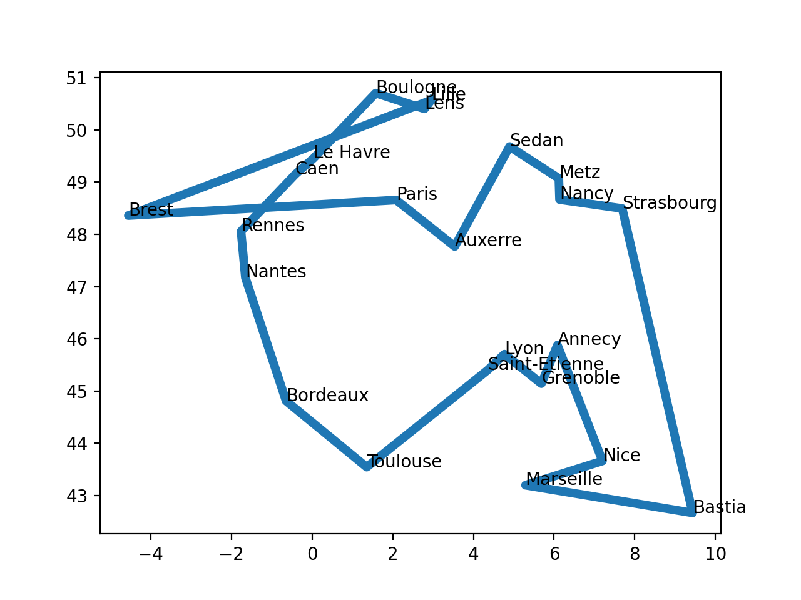

# TSP - Le voyageur de commerce 

Le problème du voyageur de commerce - _Traveling Salesman Problem_
TSP -, étudié depuis le 19e siècle, est l’un des plus connus dans le domaine de la recherche opérationnelle. William Rowan Hamilton a posé pour la première fois ce problème sous forme de jeu dès 1859.

## Problème

Le problème du TSP sous sa forme la plus classique est le suivant : « Un voyageur de commerce doit visiter une et une seule fois un nombre fini de villes et revenir à son point d’origine. Trouvez l’ordre de visite des villes qui minimise la distance totale parcourue par le voyageur ». Ce problème d’optimisation combinatoire appartient à la classe des problèmes NP-Complets.

Les domaines d’application sont nombreux : problèmes de logistique, de transport aussi bien de marchandises que de personnes, et plus largement toutes sortes de problèmes d’ordonnancement. Certains problèmes rencontrés dans l’industrie se modélisent sous la forme d’un problème de voyageur de commerce, comme l’optimisation de trajectoires de machines outils : comment percer plusieurs points sur une carte électronique le plus vite possible ?

Pour un ensemble de `n` points, il existe au total `n!` (la factorielle de l'entier naturel n ) chemins c'est-à-dire : `1×2×3....×(n-1)×n` chemins possibles. Le point de départ ne changeant pas la longueur du chemin,
on peut choisir celui-ci de façon arbitraire, on a ainsi `(n-1)!`
chemins différents. Enfin, chaque chemin pouvant être parcouru dans
deux sens et les deux possibilités ayant la même longueur, on peut
diviser ce nombre par deux. Par exemple, si on nomme les points, `a, b, c, d`, les chemins `abcd, bcda, cdab, dabc, adcb, dcba, cbad, badc` ont tous la même longueur, seul le point de départ et le sens
de parcours change. On a donc `(n-1)!/2` chemins candidats à considérer. \
Par exemple, pour `71` villes, le nombre de chemins candidats est 70!/2, supérieur à `5 × 10^{80}` qui est environ le nombre d'atomes dans l'univers connu. \
([Page wikipedia _Problème du voyageur de commerce_](https://fr.wikipedia.org/wiki/Problème_du_voyageur_de_commerce)).


## Heuristique gloutone

L'objectif de ce TP est de réaliser un algorithme glouton pour résoudre le TSP. 

Pour cela vous avez à votre disposition deux fichiers, à placer dans le même dossier que votre programme python  :

- un jeu de données [exemple.txt](assets/exemple.txt)  contenant les
  coordonnées de différentes villes à raison d'une par ligne sous la
  forme `nom_de_la_ville latitude longitude`, vous pouvez bien sûr
  l'étendre ou en générer un nouveau avec vos propres villes. 

```txt
Annecy	6,082499981	45,8782196
Auxerre	3,537309885	 47,76720047
Bastia	9,434300423	42,66175842
...................................
```

- un fichier [TSP_biblio.py](assets/TSP_biblio.py) que l'on importera en écrivant `import TSP_biblio` contenant un ensemble de fonctions permettant la lecture des données et la visualisation d'un tour réalisé par le voyageur (ici pour le moment dans l'ordre d'apparition). Voici les principales fonctions et ce qu'elles donnent en sortie (à voir dans la console de Thonny).

    ```python
    def get_tour_fichier(f):
        """
        Lit le fichier de villes format ville, latitude, longitude
        Renvoie un tour contenant les villes dans l'ordre du fichier
        : param f: nom de fichier
        : return : (list)
        """

    >>> TSP_biblio.get_tour_fichier('exemple.txt')
        [['Annecy', 6.082499981, 45.8782196], ['Auxerre', 3.537309885, 47.76720047], ['Bastia', 9.434300423, 42.66175842], ['Bordeaux', -0.643329978, 44.80820084], ['Boulogne', 1.579570055, 50.70875168], ['Brest', -4.552110195, 48.36014938], ['Caen', -0.418989986, 49.14748001], ['Grenoble', 5.684440136, 45.13940048], ['Le Havre', 0.037500001, 49.45898819], ['Lens', 2.786649942, 50.40549088], ['Lille', 2.957109928, 50.57350159], ['Lyon', 4.768929958, 45.70447922], ['Paris', 2.086790085, 48.65829086], ['Lyon', 4.768929958, 45.70447922], ['Marseille', 5.290060043, 43.1927681], ['Metz', 6.11729002, 49.0734787], ['Nantes', -1.650889993, 47.16867065], ['Nancy', 6.134119987, 48.66695023], ['Nice', 7.19904995, 43.6578598], ['Rennes', -1.759150028, 48.05683136], ['Strasbourg', 7.687339783, 48.49562836], ['Saint-Etienne', 4.355700016, 45.39992905], ['Sedan', 4.896070004, 49.68407059], ['Toulouse', 1.356109977, 43.5388298]]

    ```

    ```python
    def distance (tour, i, j) :
        """
        Distance euclidienne entre deux villes i et j
        : param tour: sequence de ville
        : param i: numero de la ville de départ
        : param j: numero de la ville d arrivee
        : return: float
        CU: i et j dans le tour
        """
    >>> TSP_biblio.distance(TSP_biblio.get_tour_fichier('exemple.txt'),0,1)
        3.1695806271496605
    ```

    ```python
    def longueur_tour (tour) :
        """
        Longueur totale d pour une tournée de la ville de départ avec retour à la ville de départ
        : param tour: tournee de ville n villes = n segments
        : return: float distance totale
        """
    >>> TSP_biblio.longueur_tour(TSP_biblio.get_tour_fichier('exemple.txt'))
        139.30461439466833
    ```

    ```python
    def trace (tour) :
        """
        Trace la tournée réalisée
        : param tour: liste de ville
        """
	>>> TSP_biblio.trace(TSP_biblio.get_tour_fichier('exemple.txt'))
    ```
    
Avec cela on doit obtenir par exemple le résultat suivant pour la tournée Lille-Annecy


Afin de créer l'algorithme glouton et de résoudre le problème du TSP, nous allons réaliser certaines étapes.

###### 1. Préalable
Définir l'heuristique choisie pour la solution optimale locale. En théorie de la complexité des algorithmes, une heuristique est une méthode de calcul qui fournit rapidement une solution réalisable, mais qui n'est pas nécessairement optimale, pour un problème d'optimisation ; on utilise ici l'heuristique gloutonne.
###### 2. Indications

Réaliser un programme Python utilisant les fonctions définies plus haut pour la lecture et l'affichage permettant de mettre en œuvre cette heuristique. Utiliser les **résultats** donnés pour réaliser les docstrings de vos fonctions.

On rappelle le code pour faire les doctests.

```Python
if __name__ == '__main__':
  import doctest
  doctest.testmod(verbose=True)
```

   1. Réaliser une fonction `matrice_distances(fichier)` qui génère, à partir du fichier txt, une matrice (ou liste de listes, ou liste à deux dimensions) qui stocke les distances 2 à 2 entre toutes les villes afin de ne faire le calcul des distances qu'une seule fois ; on affectera : distances[i][i] = 99999 pour qu'une ville ne soit pas la plus proche d'elle-même.

```Python
 >>> matrice_distances('exemple.txt')
[[99999, 3.1695806271496605, 4.6454481727211645, 6.81041326089202, 6.60381844801744, 10.920389600574405, 7.277185954707701, 0.8392290106276126, 7.025946801202709, 5.599893992058166, 5.640366650228484, 1.3250101603258606, 4.867699023529528, 1.3250101603258606, 2.7999305016713696, 3.1954484916747505, 7.840317876362528, 2.789208337811935, 2.4852930359879015, 8.138662301905638, 3.070234422158692, 1.7918147140101586, 3.986491922531409, 5.27366164123706], [3.1695806271496605, 99999, 7.800002303279771, 5.121857912363911, 3.533478281102191, 8.111122341610772, 4.190164707719404, 3.3934497347394617, 3.887263164964123, 2.7430032150040855, 2.86565140347113, 2.4024377118706055, 1.70236593402899, 2.4024377118706055, 4.898730919745727, 2.891826466295404, 5.222610067725566, 2.748267151582849, 5.504091300636488, 5.304373069690532, 4.21347307398822, 2.504742777705332, 2.3495999910482004, 4.757809533974162], [4.6454481727211645, 7.800002303279771, 99999, 10.303681359666305, 11.245038447264948, 15.10269318725349, 11.796267054754379, 4.494459071957467, 11.597507952878225, 10.205716502509622, 10.224953628088493, 5.5699040783883325, 9.48389737771288, 5.5699040783883325, 4.178121540534244, 7.218913696850348, 11.966357190385963, 6.852263829206244, 2.4471539870397665, 12.425785489332752, 6.089820190657916, 5.769727939251135, 8.361124538533499, 8.12566397825192], [6.81041326089202, 5.121857912363911, 10.303681359666305, 99999, 6.3053774488238306, 5.2815623839559755, 4.345074469696289, 6.336431789040872, 4.7003566285150296, 6.564633884954016, 6.7971950284413545, 5.485970520271336, 4.719825073082555, 5.485970520271336, 6.149369079732186, 7.993658610446392, 2.566514154986927, 7.798959859039144, 7.926298470497157, 3.434916977083648, 9.11027883119354, 5.033929196504599, 7.37963806561993, 2.368346041194376], [6.60381844801744, 3.533478281102191, 11.245038447264948, 6.3053774488238306, 99999, 6.56608219959249, 2.536101627503618, 6.91864373781671, 1.9849153212115982, 1.2445918874942783, 1.3841635338896425, 5.934202511271298, 2.112264598289775, 5.934202511271298, 8.381989329859458, 4.823382651197982, 4.792498911913283, 4.991280220975709, 9.016298053733538, 4.263769831528953, 6.496365590066573, 5.990867656455282, 3.4711875846632942, 7.1734032489302075], [10.920389600574405, 8.111122341610772, 15.10269318725349, 5.2815623839559755, 6.56608219959249, 99999, 4.207442475302592, 10.731271413767683, 4.719318645905292, 7.618452743178401, 7.828621517303031, 9.691974697271588, 6.645591416110432, 9.691974697271588, 11.116210878112534, 10.69321933126847, 3.1363514191709028, 10.690633389292163, 12.65706490651024, 2.809382194665829, 12.240199766261416, 9.386798557407165, 9.540486174355243, 7.625758197931474], [7.277185954707701, 4.190164707719404, 11.796267054754379, 4.345074469696289, 2.536101627503618, 4.207442475302592, 99999, 7.301819004394862, 0.5526485813228608, 3.443649038015634, 3.6649131198346976, 6.226457081301819, 2.5530843677204422, 6.226457081301819, 8.249354287744026, 6.536698900111362, 2.3309363162622456, 6.57070461881364, 9.389912806652221, 1.7278725114777065, 8.132496104971912, 6.069744872150371, 5.342077512339514, 5.882851099320435], [0.8392290106276126, 3.3934497347394617, 4.494459071957467, 6.336431789040872, 6.91864373781671, 10.731271413767683, 7.301819004394862, 99999, 7.109625227299739, 6.01073174492214, 6.080113891792863, 1.075859130379802, 5.032462160405864, 1.075859130379802, 1.9861805760351048, 3.9578189022689263, 7.610847884714751, 3.5560960626957807, 2.1187273715983337, 7.9949007166552795, 3.90843607833645, 1.3540404138296087, 4.6125431026449055, 4.614788019723617], [7.025946801202709, 3.887263164964123, 11.597507952878225, 4.7003566285150296, 1.9849153212115982, 4.719318645905292, 0.5526485813228608, 7.109625227299739, 99999, 2.907523472008015, 3.125101957475388, 6.040096608814089, 2.200160462932159, 6.040096608814089, 8.176484648743285, 6.092000019863106, 2.845384895909683, 6.147853233753683, 9.216338116046195, 2.2790338090123536, 7.710260102767444, 5.926450242055826, 4.863780891532963, 6.065229396444464], [5.599893992058166, 2.7430032150040855, 10.205716502509622, 6.564633884954016, 1.2445918874942783, 7.618452743178401, 3.443649038015634, 6.01073174492214, 2.907523472008015, 99999, 0.23934119056657038, 5.101856984401749, 1.8821561384029926, 5.101856984401749, 7.63481709243383, 3.587118589738594, 5.492610115059784, 3.772012631722585, 8.062245284186066, 5.11668827545109, 5.259689702157473, 5.245718956317847, 2.2293721611233455, 7.014091457847479], [5.640366650228484, 2.86565140347113, 10.224953628088493, 6.7971950284413545, 1.3841635338896425, 7.828621517303031, 3.6649131198346976, 6.080113891792863, 3.125101957475388, 0.23934119056657038, 99999, 5.195196883725349, 2.1036845698504023, 5.195196883725349, 7.740664253763113, 3.498114761467536, 5.729444737661519, 3.705176244567192, 8.112962252952974, 5.345721375000514, 5.166491231104913, 5.359282327037262, 2.1332261202420457, 7.214555290253431], [1.3250101603258606, 2.4024377118…
``` 
 
   2. réaliser une fonction `liste_ville(fichier)` qui retourne la liste des indices des villes
   3. réaliser une fonction `indice_plus_proche(ville, liste_ville, mat_dist)` qui retourne l'indice de la ville la plus proche étant donnée l'indice d'une ville, une liste de ville sous forme d'indice et une matrice de distances. On pourra utiliser l'algorithme de recherche du minimum d'une liste ou la fonction `min(liste)` qui retourne le minimum d'une liste de valeurs et `liste.index(valeur)` qui retourne l'indice d'une `valeur` présente dans `liste`.
   4. réaliser la fonction `glouton(ind_ville,liste_ville,mat_dist)` qui répond à l'heuristique gloutonne donnant le tour parcouru par le voyageur de commerce à partir de l'indice d'une ville donné en paramètre, la liste des villes et la matrice des distances ville à ville. On utilisera la méthode remove des listes qui permet de supprimer une valeur d'une liste en écrivant : `liste.remove(valeur)`.
   5. réaliser une fonction `indice_ville(ville,fichier)` qui renvoie l'indice de la ville dans le fichier.
   6. réaliser la fonction `tournee(ville,fichier)` qui trace la tournée complète du voyageur de commerce à partir de la donnée du nom de la ville de départ.

**Résultats** :

```python
>>> matrice_distances('exemple.txt')
[[99999, 3.1695806271496605, 4.6454481727211645, 6.81041326089202, 6.60381844801744, 10.920389600574405, 7.277185954707701, 0.8392290106276126, 7.025946801202709, 5.599893992058166, 5.640366650228484, 1.3250101603258606, 4.867699023529528, 1.3250101603258606, 2.7999305016713696, 3.1954484916747505, 7.840317876362528, 2.789208337811935, 2.4852930359879015, 8.138662301905638, 3.070234422158692, 1.7918147140101586, 3.986491922531409, 5.27366164123706], [3.1695806271496605, 99999, 7.800002303279771, 5.121857912363911, 3.533478281102191, 8.111122341610772, 4.190164707719404, 3.3934497347394617, 3.887263164964123, 2.7430032150040855, 2.86565140347113, 2.4024377118706055, 1.70236593402899, 2.4024377118706055, 4.898730919745727, 2.891826466295404, 5.222610067725566, 2.748267151582849, 5.504091300636488, 5.304373069690532, 4.21347307398822, 2.504742777705332, 2.3495999910482004, 4.757809533974162], [4.6454481727211645, 7.800002303279771, 99999, 10.303681359666305, 11.245038447264948, 15.10269318725349, 11.796267054754379, 4.494459071957467, 11.597507952878225, 10.205716502509622, 10.224953628088493, 5.5699040783883325, 9.48389737771288, 5.5699040783883325, 4.178121540534244, 7.218913696850348, 11.966357190385963, 6.852263829206244, 2.4471539870397665, 12.425785489332752, 6.089820190657916, 5.769727939251135, 8.361124538533499, 8.12566397825192], [6.81041326089202, 5.121857912363911, 10.303681359666305, 99999, 6.3053774488238306, 5.2815623839559755, 4.345074469696289, 6.336431789040872, 4.7003566285150296, 6.564633884954016, 6.7971950284413545, 5.485970520271336, 4.719825073082555, 5.485970520271336, 6.149369079732186, 7.993658610446392, 2.566514154986927, 7.798959859039144, 7.926298470497157, 3.434916977083648, 9.11027883119354, 5.033929196504599, 7.37963806561993, 2.368346041194376], [6.60381844801744, 3.533478281102191, 11.245038447264948, 6.3053774488238306, 99999, 6.56608219959249, 2.536101627503618, 6.91864373781671, 1.9849153212115982, 1.2445918874942783, 1.3841635338896425, 5.934202511271298, 2.112264598289775, 5.934202511271298, 8.381989329859458, 4.823382651197982, 4.792498911913283, 4.991280220975709, 9.016298053733538, 4.263769831528953, 6.496365590066573, 5.990867656455282, 3.4711875846632942, 7.1734032489302075], [10.920389600574405, 8.111122341610772, 15.10269318725349, 5.2815623839559755, 6.56608219959249, 99999, 4.207442475302592, 10.731271413767683, 4.719318645905292, 7.618452743178401, 7.828621517303031, 9.691974697271588, 6.645591416110432, 9.691974697271588, 11.116210878112534, 10.69321933126847, 3.1363514191709028, 10.690633389292163, 12.65706490651024, 2.809382194665829, 12.240199766261416, 9.386798557407165, 9.540486174355243, 7.625758197931474], [7.277185954707701, 4.190164707719404, 11.796267054754379, 4.345074469696289, 2.536101627503618, 4.207442475302592, 99999, 7.301819004394862, 0.5526485813228608, 3.443649038015634, 3.6649131198346976, 6.226457081301819, 2.5530843677204422, 6.226457081301819, 8.249354287744026, 6.536698900111362, 2.3309363162622456, 6.57070461881364, 9.389912806652221, 1.7278725114777065, 8.132496104971912, 6.069744872150371, 5.342077512339514, 5.882851099320435], [0.8392290106276126, 3.3934497347394617, 4.494459071957467, 6.336431789040872, 6.91864373781671, 10.731271413767683, 7.301819004394862, 99999, 7.109625227299739, 6.01073174492214, 6.080113891792863, 1.075859130379802, 5.032462160405864, 1.075859130379802, 1.9861805760351048, 3.9578189022689263, 7.610847884714751, 3.5560960626957807, 2.1187273715983337, 7.9949007166552795, 3.90843607833645, 1.3540404138296087, 4.6125431026449055, 4.614788019723617], [7.025946801202709, 3.887263164964123, 11.597507952878225, 4.7003566285150296, 1.9849153212115982, 4.719318645905292, 0.5526485813228608, 7.109625227299739, 99999, 2.907523472008015, 3.125101957475388, 6.040096608814089, 2.200160462932159, 6.040096608814089, 8.176484648743285, 6.092000019863106, 2.845384895909683, 6.147853233753683, 9.216338116046195, 2.2790338090123536, 7.710260102767444, 5.926450242055826, 4.863780891532963, 6.065229396444464], [5.599893992058166, 2.7430032150040855, 10.205716502509622, 6.564633884954016, 1.2445918874942783, 7.618452743178401, 3.443649038015634, 6.01073174492214, 2.907523472008015, 99999, 0.23934119056657038, 5.101856984401749, 1.8821561384029926, 5.101856984401749, 7.63481709243383, 3.587118589738594, 5.492610115059784, 3.772012631722585, 8.062245284186066, 5.11668827545109, 5.259689702157473, 5.245718956317847, 2.2293721611233455, 7.014091457847479], [5.640366650228484, 2.86565140347113, 10.224953628088493, 6.7971950284413545, 1.3841635338896425, 7.828621517303031, 3.6649131198346976, 6.080113891792863, 3.125101957475388, 0.23934119056657038, 99999, 5.195196883725349, 2.1036845698504023, 5.195196883725349, 7.740664253763113, 3.498114761467536, 5.729444737661519, 3.705176244567192, 8.112962252952974, 5.345721375000514, 5.166491231104913, 5.359282327037262, 2.1332261202420457, 7.214555290253431], [1.3250101603258606, 2.4024377118…

>>> liste_ville("exemple.txt")
[0, 1, 2, 3, 4, 5, 6, 7, 8, 9, 10, 11, 12, 13, 14, 15, 16, 17, 18, 19, 20, 21, 22]

>>> indice_plus_proche(10,liste_ville("exemple.txt"),matrice_distances('exemple.txt'))
9

>>> glouton(10,liste_ville("exemple.txt"),matrice_distances('exemple.txt'))
[10, 9, 4, 8, 6, 18, 15, 3, 22, 20, 11, 7, 0, 17, 13, 2, 19, 16, 14, 21, 1, 12, 5, 10]

>>> indice_ville('Lille',"exemple.txt")
10

>>> tournee('Lille',"exemple.txt")
[['Lille', 2.957109928, 50.57350159], ['Lens', 2.786649942, 50.40549088], ['Boulogne', 1.579570055, 50.70875168], ['Le Havre', 0.037500001, 49.45898819], ['Caen', -0.418989986, 49.14748001], ['Rennes', -1.759150028, 48.05683136], ['Nantes', -1.650889993, 47.16867065], ['Bordeaux', -0.643329978, 44.80820084], ['Toulouse', 1.356109977, 43.5388298], ['Saint-Etienne', 4.355700016, 45.39992905], ['Lyon', 4.768929958, 45.70447922], ['Lyon', 4.768929958, 45.70447922], ['Grenoble', 5.684440136, 45.13940048], ['Annecy', 6.082499981, 45.8782196], ['Nice', 7.19904995, 43.6578598], ['Marseille', 5.290060043, 43.1927681], ['Bastia', 9.434300423, 42.66175842], ['Strasbourg', 7.687339783, 48.49562836], ['Nancy', 6.134119987, 48.66695023], ['Metz', 6.11729002, 49.0734787], ['Sedan', 4.896070004, 49.68407059], ['Auxerre', 3.537309885, 47.76720047], ['Paris', 2.086790085, 48.65829086], ['Brest', -4.552110195, 48.36014938], ['Lille', 2.957109928, 50.57350159]]
```

