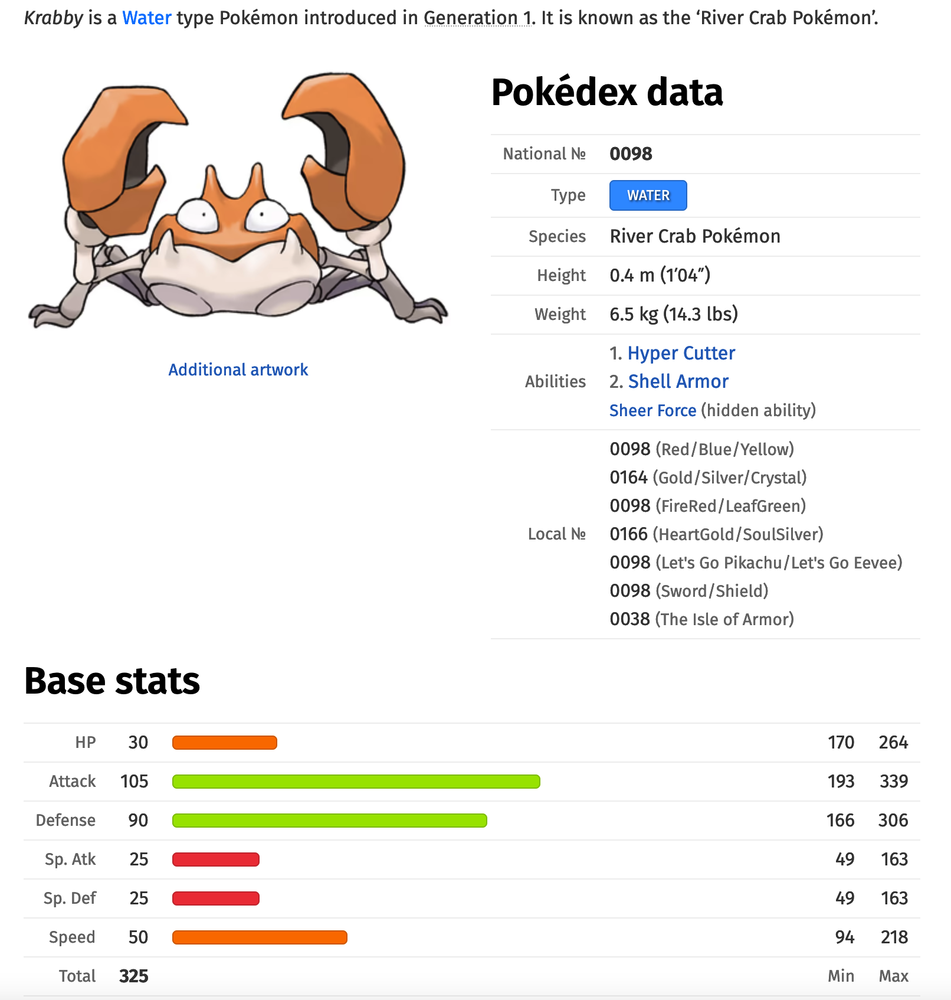

Les Pokemons sont des animaux imaginaires inventés par Nintendo.   
Ils possèdent tous des caractéristiques différentes : [nom ; points de vie ; attaque; défense; vitesse; type].  
En fonction de ces caractéristiques, ils appartiennent à des types définis.   
Sur la carte à jouer ci-dessus, on voit que le pokemon Krabby possède la configuration résumée par la liste : ['Krabby','30','105','90','50','Eau'] et appartient au type 'Eau'.
   
Les différents types sont :

['Acier','Combat','Dragon','Eau','Electrik','Fée','Feu','Glace','Insecte','Normal','Plante','Poison','Psy','Roche','Sol','Spectre','Ténèbres','Vol']

L'objectif de ce projet est de produire une fonction qui sera capable de prédire pour un Pokemon donné le type auquel il appartient.

En l'occurence, on se propose de trouver le type de 'Krabby' à partir de ses caractéristiques.
  
L'algorithme utilisé pour cela sera celui des k plus proches voisins. On recherche les K plus proches voisins d'un individu donné, on détermine ensuite le type majoritaire parmi ces k voisins, et on affecte ce type à notre inconnu. 
 
La notion de distance entre deux pokemons se calculera de façon euclidienne, c'est-à-dire en calculant la racine-carré de la somme des carrés des différences entre les pouvoirs, en considérant que tous les pouvoirs ont le même poids.


1) Il nous faudra dans un premier temps lire un fichier c.s.v et le transformer en table.

2) Il nous faudra ensuite définir le calcul de la distance entre deux pokemons.

3) Il nous faudra rechercher les k plus proches voisins d'un pokemon donné.

4) Il nous faudra enfin créer la fonction qui pour un pokemon donné de type inconnu lui attribuera le type majoritaire parmi ses k plus proches voisins.


```Python
import csv

def lecture(text):
    '''
    renvoie une table de données à partir du fichier csv
    param : fichier : csv file
    return : list
    remarque : la ligne des descripteurs sera à éliminer
    >>> lecture('pokemon.csv')[0]
    ['Clic', '60', '80', '95', '50', 'Acier']
    '''
	pass


def creation_dictionnaire(text):
    """
    renvoie un dictionnaire dont les clés sont les noms des pokemon, les valeurs leurs caracteristiques dans un tuple
    param: text : fichier
    return : dict
    >>> creation_dictionnaire('pokemon.csv')['Clic']
    ('60', '80', '95', '50', 'Acier')    
    """
    pass


def distance(p1,p2):
    '''
    renvoie la distance entre deux pokemons p1 et p2
    param : pokemon1 : list
    param : pokemon2 : list
    return : float
    >>> distance(['Clic', '60', '80', '95', '50', 'Acier'],['Tic', '40', '55', '70', '30', 'Acier'])
    45.27692569068709
    '''
	pass

def critere(donnee):
    """
    renvoie la deuxième valeur de la donnée
    param : donnee : tuple
    return : int
    >>> critere((42,15))
    15
    """
    pass


def k_plus_proches_voisins(text,p,k):
    '''
    renvoie la liste des k plus proches voisins de pokemon
    param : text : file
    param : p : list
    param : k : int
    return : list, liste formée des tuples (indice dans le tableau des données extrait de text,distance)
    >>> k_plus_proches_voisins('pokemon.csv',['Tic', '40', '55', '70', '30', 'Acier'],3)
    [(42, 16.09347693943108), (274, 17.635192088548397), (44, 18.303005217723125)]
    '''
	pass


def renvoie_type(text,p,k):
    '''
    renvoie le type correspondant à p
    param : text : file
    param : p : list
    param : k : int
    return : str
    >>> renvoie_type('pokemon.csv',['Krabby','30','105','90','50','?'],20)
    'Eau'
    '''
    pass

if __name__ == '__main__':
    import doctest
    doctest.testmod(optionflags=doctest.NORMALIZE_WHITESPACE | doctest.ELLIPSIS, verbose=True)


```
