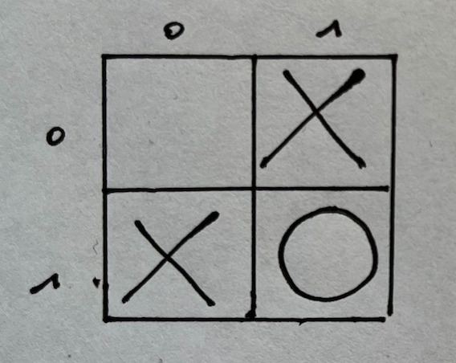
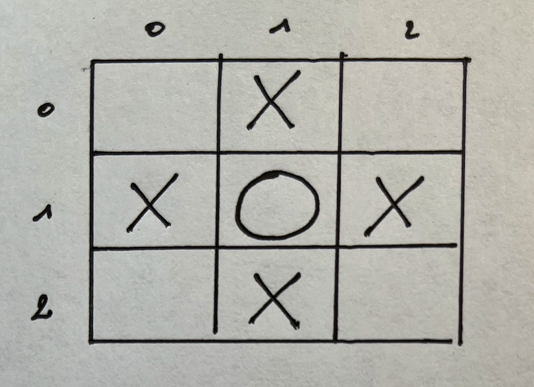
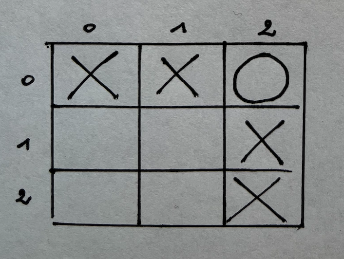
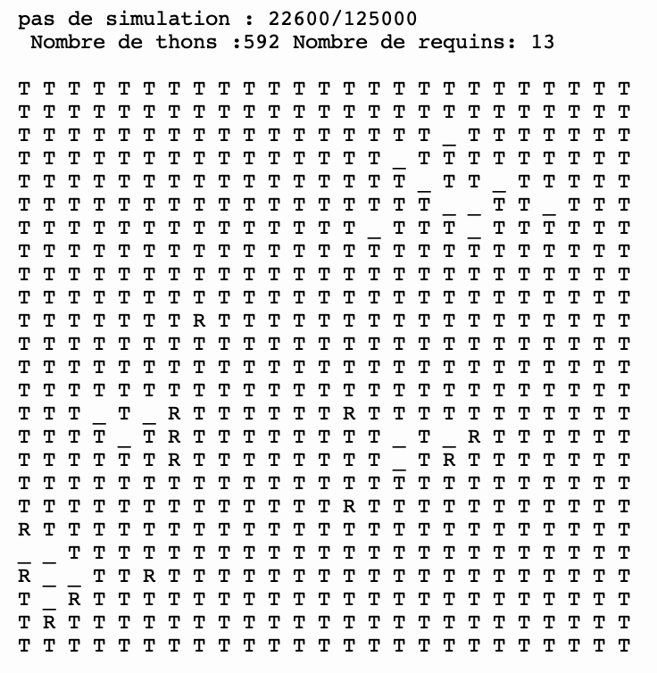
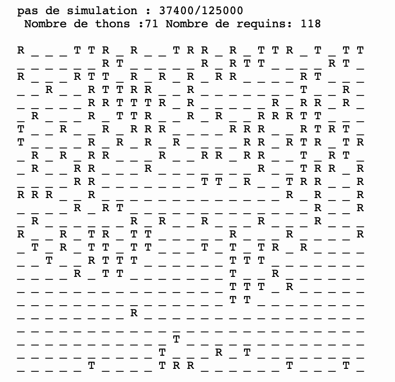
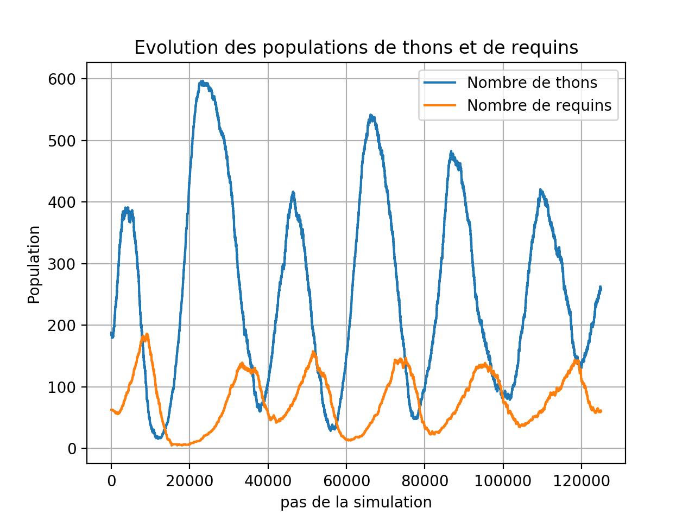

# WA-TOR : Mise en place du projet

Code à ajouter pour le tests des docstrings

```python
if __name__ == '__main__':
    import doctest
    doctest.testmod(optionflags=doctest.NORMALIZE_WHITESPACE | doctest.ELLIPSIS, verbose=True)
```

Règle du jeu : **[à consulter ici](assets/Wator_regles_du_jeu.md)**

## Première partie : représentation et affichage de la grille 

### Introduction : choix de la structure de données

La grille du jeu sera représentée par une _**liste de listes**_, chaque liste contenant elle-même une structure de données liée à la nature de la case : mer, thon ou requin.

La représentation choisie pour une case sera un _**tuple**_ de forme _(n,g,e)_ où 
- **n** désigne la nature de la case : 0 pour la mer, 1 pour un thon, 2 pour un requin
- **g** désigne le temps de gestation de l'espèce : 0 si n vaut 0
- **e** désigne l'énergie de l'espèce : 0 si n vaut 0    

Les tuples représentant les cases seront ainsi placés dans un tableau à deux dimensions ou liste de listes.    
Par exemple, la grille de jeu suivante :   ```[[(0,0,0),(0,0,0),(0,0,0)],[(1,2,0),(2,5,3),(1,2,0)]]  ``` est constituée de deux lignes (deux cases en hauteur) et de trois colonnes (trois cases en largeur) : la première ligne est vide et ne contient que la mer, la deuxième contient dans l'ordre un thon de temps de gestation 2, d'énergie 0 ; un requin de temps de gestation 5 et d'énergie 3 ; un thon de temps de gestation 2 et d'énergie 0.

On rappelle que les tuples (type _tuple_) et les listes (type _list_) sont des structures toutes les deux _**indicées**_ et **_itérables_**. Les opérations que l'on peut effectuer sur ces deux types sont similaires si ce n'est que les tuples ne sont pas modifiables : on dit que les listes sont **_mutables_** tandis que les tuples sont _**non mutables**_.

```python
>>> tuple=("a",3,8)
>>> tuple[1]
3
>>> tuple[1]=4# tentative d'affectaction de la valeur 4 à l'élément d'indice 1
Traceback (most recent call last):
  File "<pyshell>", line 1, in <module>
TypeError: 'tuple' object does not support item assignment#on obtient une erreur qui signifie que l'assignation d'une valeur à un tuple n'est pas autorisée
>>> liste=["a",3,8]
>>> liste[1]
3
>>> liste[1]=4 #affectaction de la valeur 4 à l'élément d'indice 1
>>> liste
['a', 4, 8] #affectaction réussie
```

Les tuples et listes sont tous les deux des _**itérables**_, c'est-à-dire que l'on peut parcourir les éléments qui les composent à l'aide d'une boucle ```for```.

```python
>>> tuple=("a",3,8)
>>> for i in tuple:
    print(i)
a
3
8
>>> liste=["a",3,8]
>>> for i in liste:
    print(i)    
a
3
8
```
Ce qui s'avère souvent plus pratique et plus efficace que de faire un parcours par indice croissant des éléments de la liste :

```python
>>> for i in range(len(tuple)):
    print(tuple[i])    
a
3
8
>>> for i in range(len(liste)):
    print(liste[i])   
a
3
8
```

Ici la liste notée `l` étant à deux dimensions ou liste de liste, on utilise la _**notation ```l[i][j] ```**_ pour accéder à l'élément ou case repérée par sa position dans la ième ligne et la jième colonne de la grille.

Exemple :

```python
>>>liste=[[(0,0,0),(0,0,0),(0,0,0)],[(1,2,0),(2,5,3),(1,2,0)]]
>>> liste[1][1]
(2, 5, 3)
```

Puisqu'on trouve un tuple dans cette case, on utilise la _**notation ```l[i][j][k] ```**_ pour accéder à la kième information contenue dans ce tuple.

Exemple :

```python
>>>liste=[[(0,0,0),(0,0,0),(0,0,0)],[(1,2,0),(2,5,3),(1,2,0)]]
>>> liste[1][1][2]
3
```

### Première étape : représentation de la grille

Réaliser une fonction ```creer_grille(nb_lignes,nb_colonnes)``` qui prend en _**paramètres**_ :

- le nombre de cases verticalement ou hauteur noté _nb_lignes_
- le nombre de cases horizontalement ou largeur noté _nb_colonnes_

qui **_renvoie_** une liste de listes correspondant à une grille aux dimensions souhaitées, ne contenant dans un premier temps que de la mer.

Exemple : création d'une grille comportant 2 lignes et 4 colonnes

```python
>>> creer_grille(2,4)
[[(0, 0, 0), (0, 0, 0), (0, 0, 0), (0, 0, 0)], [(0, 0, 0), (0, 0, 0), (0, 0, 0), (0, 0, 0)]]
```

On proposera deux approches :   
	- la première utilisant la **méthode** ```append``` associée aux listes et utilisant deux boucles successives   
	- la deuxième, la plus efficace, utilisant un **tableau donné en compréhension**    

##### Première méthode : utilisation de listes et de boucles, rappels

1. Utilisation de la méthode ```append``` des listes (une **méthode** est une fonction associée à un **objet**, ici l'objet liste, qui s'écrit sous la forme ```objet.methode```)
```python
>>> liste=[]
>>> liste.append((0,0,0))
>>> liste
[(0, 0, 0)]
```
2. Utilisation de la _**boucle bornée**_ ```for```:

```python
def fonction_boucle(nombre_de_tours):
    liste=[]
    for i in range(nombre_de_tours):
        liste.append("a")
    return liste
```
```python
>>> fonction_boucle(5)
['a', 'a', 'a', 'a', 'a']
```

> **À vous de jouer n°1** : _écrire la fonction ```creer_grille_methode1``` utilisant la première méthode avec son docstring_.


##### Deuxième méthode : utilisation des listes par compréhension

On veut créer une nouvelle liste appelée _new_list_ à partir d'une première liste appelée _list_ en faisant subir à chaque item de la première une fonction appelée function.

La syntaxe d'une _**liste obtenue par compréhension**_ est ainsi :    
 ```new_list = [function(item) for item in list if condition(item)]```

Exemple : 

```python
>>> liste1=["a","b","a"]
>>> liste2=[x*2 for x in liste1 if x!="b"]
>>> liste2
['aa', 'aa']
```

Ici nous allons créer de manière analogue notre grille de façon rapide et efficace (une seule ligne de code !) grâce à une liste obtenue par compréhension.   
Par exemple, pour créer une grille de largeur 2 et de hauteur 3, on peut écrire:

```python
>>> print([[(0, 0, 0) for i in range(2)] for i in range(3)])
[[(0, 0, 0), (0, 0, 0)], [(0, 0, 0), (0, 0, 0)], [(0, 0, 0), (0, 0, 0)]]
```

Remarque : la variable i peut être remplacée par une variable dite non nommée et notée _ (underscore).

```python
>>> print([[(0, 0, 0) for _ in range(2)] for _ in range(3)])
[[(0, 0, 0), (0, 0, 0)], [(0, 0, 0), (0, 0, 0)], [(0, 0, 0), (0, 0, 0)]]
```

> **À vous de jouer n°2** : _écrire la fonction ```creer_grille_methode2``` utilisant la deuxième méthode avec sa docstring_. Par la suite on appelera cette dernière fonction plus simplement ```creer_grille```.


### Deuxième étape : sélection des cases de la grille  


Afin de remplir la grille aléatoirement nous aurons besoin de sélectionner une case de la grille de façon aléatoire.  
Réaliser une fonction appelée ```selection_case``` prenant en paramètres le nombre total de cases horizontales noté nb_cases_h et le nombre total de cases verticales noté nb_cases_v de la grille et qui renvoie un tuple de la forme (x,y) où x désigne le numéro de ligne et y le numéro de colonne choisie de façon **aléatoire**.
La case de coordonnées (0,0) sera donc la première de la grille.  


Par exemple :
```python
>>> selection_case(3,3)
(0, 2)
>>> selection_case(4,4)
(2, 2)
```
Exceptionnellement, ces exemples aux résultats aléatoires ne seront pas placés dans la docstring pour éviter les erreurs.
Déclarer également, valables pour tout le code, deux _**variables globales**_ notées H et V représentant respectivement le nombre de cases horizontales et verticales. Vous initialiserez pour l'instant ces valeurs à 4. Elles nous seront utiles pour la suite.  

Remarque importante : une variable dite _**globale**_ par exemple v_globale déclarée dans le code en dehors des fonctions est connue dans la totalité du code même dans les fonctions. Une variable dite _**locale**_ n'a quant à elle plus aucune valeur en dehors de la fonction.  

Exemple :
```python
b=5#variable globale définie en dehors des fonctions

def fonction(x):
    b=0#variable locale définie dans la fonction
    return b

print("Appel à une variable locale : ", fonction(5))
print("Appel à une variable globale : ", b)

>>>Appel à une variable locale :  0
Appel à une variable globale :  5
```

Indication : on importe le module ```random``` et la méthode ```randrange``` de ce module en écrivant : ```from random import randrange```. Comme l'aide l'indique dans le shell en écrivant `help(randrange)`, `randrange(n)` renvoie une valeur entière aléatoire comprise entre 0 et n **exclu**.

Ce qui donne par exemple :
```python
>>> randrange(8)
6
```

> **À vous de jouer n°3** : _écrire la fonction ```selection_case``` avec sa docstring_ sans exemple.

### Troisième étape : initialisation des cases 

Le jeu nécessite très régulièrement de permettre la naissance ou la mort d'un poisson, on se propose donc de réaliser une fonction ```init_case``` qui prend en paramètre la _nature_ de l'élément dans la case (mer : 0, thon : 1 ou requin : 2) et qui retourne le tuple correspondant aux valeurs initiales des paramètres de gestation G et d'énergie E correspondant à la _nature_ de cet élément.
Déclarer préalablement dans votre code quatre variables globales notées G_THON, G_REQUIN, E_THON et E_REQUIN  en leur affectant les valeurs initiales respectives 2, 5, 0, 3 conformément à la règle du jeu.   
Puis réaliser la fonction ```init_case``` qui utilisera ces variables globales.
Par ailleurs, dans l'écriture du code, il est toujours préférable de n'écrire qu'un seul ```return``` final.

```python
>>> init_case(0)
(0, 0, 0)
>>> init_case(1)
(1, 2, 0)
>>> init_case(2)
(2, 5, 3)
```

> **À vous de jouer n°4** : _écrire la fonction ```init_case``` avec sa docstring_.

### Quatrième étape : placement aléatoire des poissons dans la grille   

Réaliser maintenant une fonction appelée ```placement_espece``` prenant en paramètres une _grille_ (en pratique, une liste à deux dimensions comme définie plus haut), la _nature_ de l'espèce (thon ou requin) à placer aléatoirement et le nombre de poissons _nb_poissons_ de cette nature. Cette fonction retournera la grille correspondante. Dans cette fonction, vous utiliserez les fonctions précédentes ```selection_case``` et ```init_case```.   
Remarque : comme la fonction ```selection_case``` admet comme paramètres la largeur et la hauteur de la grille, on se demandera comment relier, en utilisant la fonction ```len()```, ces deux paramètres au seul paramètre grille.

Par exemple : on place 4 requins aléatoirement sur une grille comportant 2 lignes et 3 colonnes.
```python
>>> placement_espece(creer_grille(3,2),2,4)
[[(2, 5, 3), (0, 0, 0), (2, 5, 3)], [(2, 5, 3), (2, 5, 3), (0, 0, 0)]]
```

Indications : 

1) L'idée est de placer des poissons aléatoirement **uniquement dans des cases qui contiennent de la mer**.   
2) Au vu de la structure de la grille, s'interroger sur la façon d'atteindre la _nature_ de la case (mer, thon ou requin) située à l'abscisse x et à l'ordonnée y de la grille. Ce point est important pour la suite.
3) On pourra créer une variable locale intermédiaire nommée case telle que x=case[0] et y=case[1].
4) On utilisera une boucle ```while``` pour faire le décompte du nombre d'espèces ajoutées.

> **À vous de jouer n°5** : _écrire la fonction ```placement_espece``` avec sa docstring_.

### Cinquième étape : initialisation de la grille   

Réaliser une fonction ```denombre_espece``` qui admet comme paramètre la grille et la nature de l'espèce, et qui retourne le nombre d'espèces dans la grille.

Par exemple : 

```python
>>> denombre_espece(placement_espece(creer_grille(3,2),2,4),2)
4
```

Indication :   
Utiliser le caractère _**itérable**_ des listes.

> **À vous de jouer n°6** : _écrire la fonction ```denombre_espece``` avec sa docstring_.


Il s'agit maintenant de placer des poissons dans la grille en respectant un pourcentage donné des espèces. Réaliser une fonction ```init_grille``` qui admet comme paramètres les pourcentages initiaux de chacune des espèces _p_thons_ puis _p_requins_ ainsi que le nombre de cases horizontales _nb_lignes_ et le nombre de cases verticales _nb_colonnes_ de la grille. La fonction retournera une grille aléatoire répondant à la contrainte.

Par exemple (à placer dans la doctest):
```python
>>> denombre_espece(init_grille(0.5,0.5,2,2), 1)
2
>>> denombre_espece(init_grille(0.5,0.5,2,2), 2)
2
```

Par la suite, on choisira des pourcentages initiaux adaptés pour ces deux espèces : par exemple 30 % pour les thons et 10 % pour les requins.
On déclarera donc deux nouvelles variables globales notées P_THON et P_REQUIN en leur affectant les valeurs adaptées.

### Sixième étape : affichage de la grille  

La visualisation d'une grille sous la forme d'un affichage en 2 dimensions nous permettra d'appréhender plus facilement le déplacement des différentes espèces.
Réaliser une _**procédure**_ appelée ```afficher_grille``` dont le rôle sera de visualiser la grille passée en paramètre. On utilisera la fonction ```print(chaîne de caractères)```.
Les cases de la mer seront affichées avec un tiret bas _ , les cases occupées par les thons seront affichées avec un T majuscule et celles des requins par un R majuscule. Le contenu des cases sera séparé par un espace. Chaque ligne sera affichée sur une ligne distincte.

Exemple :

```python
def afficher_grille(grille):
    """
    >>> grille1 = [[(1, 2, 0), (1, 2, 0), (0, 0, 0)],[(0, 0, 0), (2, 5, 3), (0, 0, 0)]]
    >>> afficher_grille(grille1)
     T  T  _ 
     _  R  _ 
     
    """
```

Indications :  

- Passer une ligne en ajoutant `"\n"` à la chaîne de caractères

- Utiliser le processus dit de _**concaténation**_ des chaînes de caractères. Par exemple :
```python
>>> "Py"+"thon"
'Python'
```

> **À vous de jouer n°7** : _écrire la fonction ```afficher_grille``` avec sa docstring_.


## Deuxième partie : gestion de l'environnement   

L'interaction entre les proies et les prédateurs ainsi que les déplacements dans la mer nécessitent lorsqu'une case a été choisie aléatoirement au début d'un tour du jeu de connaître l'environnement proche de celle-ci.

### Première étape : trouver les cases voisines  

Réaliser une fonction ```cases_voisines``` prenant comme paramètres :
- les coordonnées de la case sous la forme du tuple (x,y)
- le nombre de cases présentes dans la grille verticalement ou nb_lignes
- le nombre de cases présentes dans la grille horizontalement ou nb_colonnes

Cette fonction doit retourner une liste de 4 coordonnées sous la forme de 4 tuples (x,y) des cases voisines selon les 4 directions cardinales : OUEST, NORD, SUD et EST.
Il sera de plus nécessaire de réfléchir aux coordonnées des voisines d'une case située sur le bord de la grille dans la mesure où l'environnement est torique (retournement sur lui-même).

- Exemple1



```python
>>> cases_voisines((1,1),2,2)
[(1, 0), (0, 1), (0, 1), (1, 0)]
```

- Exemple2



```python
>>> cases_voisines((1,1),3,3)
[(1, 0), (0, 1), (2, 1), (1, 2)]

```

- Exemple3



```python
>>> cases_voisines((0,2),3,3)
[(0, 1), (2, 2), (1, 2), (0, 0)]

```

> **À vous de jouer n°8** : _écrire la fonction ```cases_voisines``` avec sa docstring_.

### Deuxième étape : rechercher un type de case parmi les voisines

Lors de leurs déplacements respectifs, les thons et les requins cherchent aléatoirement des cases mer ou thon parmi leurs voisins. Réaliser une fonction ```recherche_case``` acceptant 3 paramètres : 
- une liste de coordonnées de 4 cases
- une grille
- la nature de la case recherchée   

Cette fonction retournera les coordonnées sous la forme de tuple (x,y) d'une case tirée au sort parmi celles répondant au critère de recherche, sinon, si cette case n'existe pas, la fonction retourne **False**.

Exemple : 

```python
>>> grille_exemple=[
    [(1, 2, 0), (0, 0, 0), (0, 0, 0)],
    [(1, 2, 0), (2, 5, 3), (0, 0, 0)],
    [(0, 0, 0), (1, 2, 0), (0, 0, 0)]
    ]
>>> afficher_grille(grille_exemple)
 T  _  _ 
 T  R  _ 
 _  T  _ 
>>> recherche_case(cases_voisines((1,1),3,3),grille_exemple,1)
(1, 0)
>>> recherche_case(cases_voisines((1,1),3,3),grille_exemple,1)
(2, 1)
```

> **À vous de jouer n°9** : _écrire la fonction ```recherche_case``` avec sa docstring_

### Troisième étape : actions liées aux espèces

#### Action commune : gérer la durée de gestation

Réaliser une fonction ```evol_gestation``` acceptant deux paramètres : les coordonnées d'une case et une grille.  
La fonction retournera la durée de gestation de l'espèce diminuée d'une unité.

Par exemple avec la même grille que précedemment :

```python
    """
Renvoie le niveau de gestation diminué d'une unité
>>> evol_gestation((0,0),grille_exemple)
1
>>> evol_gestation((1,1),grille_exemple)
4    
    """
```

> **À vous de jouer n°10** : _écrire la fonction ```evol_gestation``` avec sa docstring_


#### Action commune : se déplacer vers la mer   

Lorsque c'est le tour d'un thon il cherche à se déplacer vers une mer voisine, c'est aussi vrai pour un requin s'il n'y a pas de thon à proximité. On cherche donc à écrire une fonction qui traduit un comportement commun aux deux espèces. L'énergie et le temps de gestation évoluent avant le déplacement.

Réaliser une fonction ```deplace_vers_mer``` acceptant comme paramètres :
- la nature de l'espèce
- la case initiale sur laquelle se trouve l'espèce
- la case de mer vers laquelle se déplace l'espèce
- la grille
- la durée de gestation de l'espèce
- l'énergie de l'espèce : on pourra utiliser une valeur 0 par défaut pour ce paramètre.    

Cette fonction devra gérer la reproduction éventuelle de l'espèce, la réinitialisation du temps de gestation dans ce cas (utiliser la fonction ```init_case```), et le fait que les cases abandonnées redeviennent des mers s'il n'y a pas eu de reproduction.
La fonction retourne la grille ayant évolué en conséquence.   
La fonction ne s'occupe pas de la mise à jour du temps de gestation ou de l'énergie et on suppose que cette mise à jour est faite préalablement au déplacement.


Exemples :
```python
>>> grille1 = [
[(1, 2, 0), (1, 2, 0), (0, 0, 0)],
[(0, 0, 0), (2, 5, 3), (0, 0, 0)]
]
>>> afficher_grille(grille1)

 T  T  _ 
 _  R  _ 

>>> deplace_vers_mer(1, (0, 0), (0, 1),grille1, 1)
[
[(0, 0, 0), (1, 2, 0), (0, 0, 0)],
[(1, 1, 0), (2, 5, 3), (0, 0, 0)]
]
>>> afficher_grille(grille1)

 _  T  _ 

 T  R  _ 


# le thon passe de la case (0,0) à la case (0,1) avec un temps de gestation de 1
# sans enfanter, il laisse une mer sur la case qu'il quitte
___________________________________________________________________________

>>> grille2 = [
[(0, 0, 0), (0, 0, 0), (0, 0, 0)],
[(0, 0, 0), (2, 5, 3), (0, 0, 0)]
]
>>> afficher_grille(grille2)

 _  _  _ 

 _  R  _ 

>>> deplace_vers_mer(2, (1, 1), (2, 1), grille2, 4, 2)
[
[(0, 0, 0), (0, 0, 0), (0, 0, 0)],
[(0, 0, 0), (0, 0, 0), (2, 4, 2)]
]
>>> afficher_grille(grille2)

 _  _  _ 

 _  _  R 


# le requin passe de la case (1,1) à la case (2,1) avec un temps de gestation de 4 et une énergie de 2
# il laisse une mer sur la case qu'il quitte
___________________________________________________________________________

>>> grille3 = [
[(0, 0, 0), (0, 0, 0), (0, 0, 0)],
[(0, 0, 0), (2, 1, 3), (0, 0, 0)]
]
>>> afficher_grille(grille3)
 _  _  _ 

 _  R  _ 

>>> deplace_vers_mer(2,(1, 1), (2, 1), grille3, 0, 2)
[
[(0, 0, 0), (0, 0, 0),
(0, 0, 0)], [(0, 0, 0),
(2, 5, 3), (2, 5, 2)]
]
>>> afficher_grille(grille3)
 _  _  _ 

 _  R  R 


# le requin passe de la case (1,1) à la case (2,1) avec un temps de gestation de 0 et une énergie de 2
# il a donc enfanté un requin sur la case qu'il a quitté dont le temps de gestation est 5 et l'énergie 3
# le requin qui s'est déplacé a un temps de gestation réinitialisé parce qu'il a enfanté et garde son énergie de 2

```

Rappels : lorsqu'un thon a un temps de gestation nul, il engendre un nouveau thon là où il était et son temps de gestation est réinitialisé. Lorsqu'un requin a un temps de gestation nul, il engendre un nouveau requin là où il était, son temps de gestation est réinitialisé mais pas son niveau d'énergie. Il faudra donc en tenir compte.

Remarque : donner à un argument une valeur par défaut peut se comprendre sur un exemple : 
```python
def calcul(x,a,b=2):
    return a*x+b
>>> calcul(5,2,4)
14
>>> calcul(5,2)#il n'est pas la peine de donner une valeur au paramètre b, sa valeur sera celle par défaut si elle n'est pas indiquée
12
```

> **À vous de jouer n°11** : _écrire la fonction ```deplace_vers_mer``` avec sa docstring_


#### Actions propres aux thons   

Réaliser une fonction ```tour_thon``` qui traduira parfaitement les actions d'un thon situé sur un case de la grille en retournant une nouvelle grille donnant l'état de celle-ci à la fin de ce tour.  
Il faut envisager le cas où il n'y a pas de case mer disponible pour le déplacement du thon, auquel cas il reste sur place. Son niveau de gestation se réinitialise s'il passe à zéro.

Cette fonction mettra en œuvre les quatre fonctions ```recherche_case```, ```cases_voisines```, ```evol_gestation```, ```deplace_vers_mer```.   
Elle prendra comme argument une case et une grille.

Exemple :
```python
>>> grille=[
[(0, 0, 0), (1, 2, 0), (0, 0, 0)],
[(1, 1, 0), (2, 5, 3), (0, 0, 0)]
]
>>> afficher_grille(grille)
 _  T  _ 

 T  R  _ 

>>> evol_gestation((0,1),grille)
0#le thon (0,1) va pouvoir se reproduire
>>> tour_thon((0,1),grille)
[
[(1, 2, 0), (1, 2, 0), (0, 0, 0)],
[(1, 2, 0), (2, 5, 3), (0, 0, 0)]
]
>>> afficher_grille(grille)
 T  T  _ 

 T  R  _ 
# il s'est déplacé en (0,0) et a engendré un nouveau thon à la place quittée
#les temps de gestation sont réinitialisés
>>> tour_thon((0,1),grille)
[
[(1, 2, 0), (1, 2, 0), (0, 0, 0)],
[(0, 0, 0), (2, 5, 3), (1, 1, 0)]
]
#le thon (0,1) s'est déplacé en (2,2) en utilisant le caractère torique de la mer
>>> afficher_grille(grille)
 T  T  _ 

 _  R  T 
```

> **À vous de jouer n°12** : écrire la fonction ```tour_thon``` avec sa docstring


#### Actions propres aux requins

##### Gestion de l'énergie

Réaliser une fonction  ```evol_energie``` acceptant deux paramètres : les coordonnées d'une case et une grille. La fonction retournera l'énergie de l'espèce diminuée d'une unité.

Exemple :
```python
>>> evol_energie((1, 1),[[(1, 2, 0), (1, 2, 0), (0, 0, 0)], [(0, 0, 0),(2, 5, 3), (0, 0, 0)]])
2
```
> **À vous de jouer n°13** : écrire la fonction ```evol_energie``` avec sa docstring

##### Chasse au thon  

Lors de son tour, le requin, après avoir perdu un temps de gestation et trouvé un thon parmi les cases voisines, mange le thon en se déplaçant sur cette case. Réaliser une fonction ```chasse_au_thon``` traduisant cette dernière action. Elle acceptera plusieurs paramètres :
- les coordonnées de la case de départ du requin
- les coordonnées de la case occupée par le thon
- la grille
- la durée de gestation

La fonction retournera la grille ayant évolué en conséquence ; penser aux éventuelles naissances mais on ne fait pas encore intervenir `evol_gestation` pour l'instant.

Exemples : 

```python
>>> grille=[
[(1, 2, 0), (1, 2, 0), (0, 0, 0)],
[(0, 0, 0),(2, 5, 3), (0, 0, 0)]
]
>>> afficher_grille(grille)
 T  T  _ 

 _  R  _ 

>>> chasse_au_thon((1,1),(1,0),grille,5)
[
[(1, 2, 0), (2, 5, 3), (0, 0, 0)],
[(0, 0, 0), (0, 0, 0), (0, 0, 0)]
]
>>> afficher_grille(chasse_au_thon((1,1),(1,0),grille,5))
 T  R  _ 

 _  _  _ 

#le requin situé en (1,1) mange le thon situé en (1,0) en laissant la mer derrière lui.
___________________________________________________________________________

>>> grille=[
[(1, 2, 0), (1, 2, 0), (0, 0, 0)],
[(0, 0, 0),(2, 0, 3), (0, 0, 0)]
]
>>> afficher_grille(grille)
 T  T  _ 

 _  R  _ 

>>> chasse_au_thon((1,1),(1,0),grille,0)
[
[(1, 2, 0), (2, 5, 3), (0, 0, 0)],
[(0, 0, 0), (2, 5, 3), (0, 0, 0)]
]
>>> afficher_grille(chasse_au_thon((1,1),(1,0),grille,0))
 T  R  _ 

 _  R  _ 


#le requin situé en (1,1) mange le thon situé en (0,1) en laissant derrière lui un bébé requin.

```

> **À vous de jouer n°14** : écrire la fonction ```chasse_au_thon``` avec sa docstring


##### Tour du requin  

Réaliser une fonction ```tour_requin``` qui traduira parfaitement les actions d'un requin en retournant une grille donnant un état à la fin du tour.

La fonction met en oeuvre les fonctions  ```evol_gestation```, ```evol_energie```, ```recherche_case```, ```cases_voisines```. Elle accepte les paramètres case et grille et renvoie une grille mise à jour.


Exemples : 

```python

>>> grille=[[(1, 2, 0), (1, 2, 0), (0, 0, 0)],[(0, 0, 0),(2, 2, 4), (0, 0, 0)]]
>>> afficher_grille(grille)
 T  T  _ 
 _  R  _ 
>>> tour_requin((1,1),grille)
[[(1, 2, 0), (2, 1, 3), (0, 0, 0)], [(0, 0, 0), (0, 0, 0), (0, 0, 0)]]
>>> afficher_grille(grille)
 T  R  _ 
 _  _  _ 
#le requin situé en (1,1) mange le thon en (1,0) et laisse la mer derrière lui


___________________________________________________________________________

>>> grille=[[(1, 2, 0), (1, 2, 0), (0, 0, 0)],[(0, 0, 0),(2, 2, 1), (0, 0, 0)]]
>>> afficher_grille(grille)
 T  T  _ 
 _  R  _ 
>>> tour_requin((1,1),grille)
[[(1, 2, 0), (1, 2, 0), (0, 0, 0)], [(0, 0, 0), (0, 0, 0), (0, 0, 0)]]
>>> afficher_grille(grille)
 T  T  _ 
 _  _  _ 
#le requin situé en (1,1) meurt car son niveau d'énergie passe de 1 à 0 au moment de l'appel de la fonction et il laisse la mer derrière lui


___________________________________________________________________________


>>> grille=[[(1, 2, 0), (1, 2, 0), (0, 0, 0)],[(0, 0, 0),(2, 1, 2), (0, 0, 0)]]
>>> afficher_grille(grille)
 T  T  _ 
 _  R  _ 
>>> tour_requin((1,1),grille)
[[(1, 2, 0), (2, 5, 3), (0, 0, 0)], [(0, 0, 0), (2, 5, 3), (0, 0, 0)]]
>>> afficher_grille(grille)
 T  R  _ 
 _  R  _ 
#le requin situé en (1,1) au niveau de gestation 1 (au moment de l'appel de la fonction) mange le thon en (1,0) et enfante un requin
#ses niveaux de gestation et d'énergie sont réinitialisés

```

> **À vous de jouer n°15** : écrire la fonction ```tour_requin``` avec sa docstring

## Troisième partie : évolution des populations

### Évolution de la grille

Réaliser une fonction ```evol_population``` acceptant une grille comme paramètre. Cette fonction devra simuler le comportement du jeu en choissant tout d'abord une case aléatoirement de la grille puis en appelant éventuellement la fonction liée aux actions en fonction de la nature de la case sélectionnée. Elle retournera la grille ayant évolué après ce pas de simulation.

> **À vous de jouer n°16** : écrire la fonction ```evol_population``` avec sa docstring


### Simulation pas à pas

Réaliser une fonction ```simulation``` qui accepte comme paramètres :
- une grille
- un nombre de pas de simulations
- un nombre de pas au bout duquel un affichage de la grille est réalisé

Cette fonction utilisera la fonction ```evol_population```.  
Si on veut avoir un affichage de l'évolution de la mer, il peut être pertinent de ne pas afficher toutes les étapes mais une étape tous les 10 par exemple et de faire une pause après chaque affichage grâce au module time et sa fonction sleep:
```python
import time
time.sleep(0.1) # pause de 0,1 seconde
```

> **À vous de jouer n°17** : écrire la fonction ```simulation``` avec sa docstring

### Construction de la courbe

On ajoute à la simulation des listes qui comptabilisent à chaque pas les nombres de requins et de thons. Utilisez pour cela la fonction ```denombre_espece```.   
Ces listes peuvent être utilisées pour dessiner les courbes des évolutions de population.
On utilise pour cela le module ```pylab```.

Exemple : 
```python
import pylab
data_x=[0,1,2,3]
data_y=[0,3,6,9]
pylab.plot(data_x,data_y)
pylab.title('courbe des points de coordonnées (x,y)')
pylab.xlabel('Axe des abscisses')
pylab.ylabel('Axe des ordonnées')
pylab.grid()
```

   



