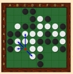

# Jeux à deux joueurs : Othello et Puissance 4

## Les jeux à deux joueurs

Jeux bien connus, Othello, les échecs, les dames, Tic-tac-toe , le puissance 4,  le jeu de Nim et  bien d'autres, ont pour point commun d'être des "**jeux à deux joueurs au tour par tour**". Ils ont aussi en commun d'être des jeux  *à connaissance parfaite*, car, à tout moment, les deux joueurs possèdent exactement la même connaissance de l'état du jeu. De plus ils ne font pas intervenir le hasard. Ce sont ces jeux que nous allons étudier.

Ces jeux ont des points communs. Ainsi pour chacun, une partie est à tout moment caractérisée par le  *joueur courant* (le prochain qui doit jouer) et par un état du jeu, que nous appellerons  *situation courante*. Il s'agit par exemple

- de la configuration des pièces sur l'échiquier aux échecs,
- du nombre de cailloux restant à prendre dans le jeu de Nim
- etc ...

De plus, ces jeux partagent un mécanisme commun de déroulement des parties. Ce sont uniquement les  *règles du jeu* qui différent d'un jeu à l'autre, pas le mécanisme du jeu. Celui-ci se base principalement sur le fait que les joueurs jouent alternativement des "coups de jeu" en fonction de ce qui est autorisé par les règles du jeu. Ces différents coups font évoluer le jeu de situation en situation, jusqu'à ce que l'on atteigne une situation de fin de partie. Le déroulement d'une partie peut donc être décrit de la façon suivante :

**Déroulement des jeux à deux joueurs**

1. installer le jeu, c'est-à-dire créer la  *situation courante* initiale
2. déterminer le premier  *joueur courant*
3. si le jeu n'est pas fini
   - si le  *joueur courant* peut jouer dans la  *situation courante*
     - le  *joueur courant* joue, c'est-à-dire qu'il choisit un coup possible parmi les coups autorisés dans la  *situation courante* du jeu. Chaque coup de jeu amène le jeu dans une nouvelle situation. Donc choisir un coup de jeu (= jouer) revient à choisir la prochaine  *situation courante* parmi toutes celles qui sont possibles.  
       
      	 - mettre à jour la  *situation courante* suite au choix du joueur
   - sinon
     - ne rien faire (la  *situation courante* ne change pas)
   - l'autre joueur devient le  *joueur courant*
   - recommencer en 3.
4. sinon le jeu est fini  :  afficher le résultat : le joueur vainqueur ou partie nulle.
   

Ce mécanisme de jeu nous fournit un algorithme permettant de jouer aux jeux à deux joueurs qui nous concernent. Cet algorithme est le même pour tous ces jeux. Les variations sont dues uniquement aux règles du jeu. Une analyse de cet algorithme nous permet d'identifier les fonctions qu'il est nécessaire de définir pour n'importe quel jeu à deux joueurs de ce type.

Une des premières tâches que vous devez réaliser est donc cette analyse afin de produire  **l'interface** commune à tous les jeux à deux joueurs.

**Programme de l'interface commune  `main.py` des jeux à deux joueurs**:

```python
def jouer():
    config = jeu.creer_config_init()
    joueur_courant = jeu.choisir_premier_joueur()
    jeu.afficher_config(config)

    while not jeu.est_jeu_fini(config):
        if jeu.est_coup_possible(config, joueur_courant) :
            coup = jeu.coup_joueur(config, joueur_courant)
            config = jeu.incrementer_config(config,coup,joueur_courant)
            jeu.afficher_config(config)
        joueur_courant = jeu.incrementer_joueur(joueur_courant)
    jeu.afficher_fin(config,joueur_courant)


if __name__ == "__main__":
    jouer()    
```

## Travail à réaliser

Il s'agit de réaliser le module Othello.py qui permette:

* de jouer aux jeux à deux joueurs avec le jeu d'Othello en utilisant un import du programme `main.py`
* Il faudra réaliser dans le module `Othello.py` la mise en œuvre du jeu Othello en utilisant les ressources fournies ci-dessous.
* À l'issue de cette phase on doit pouvoir jouer au jeu dans une version  *humain contre humain* par des saisies au clavier du coup joué.
* On peut aussi envisager de faire des parties  *humain contre aléatoire*, le deuxième joueur étant géré par le programme qui joue aléatoirement.
* On peut enfin utiliser un algorithme appelé `min-max` permettant à l'ordinateur de jouer le meilleur coup selon des critères imposés.

## Présentation du jeu

#### Objectif:

Othello se joue à 2 joueurs, sur un plateau unicolore de 64 cases (8 sur 8), avec des pions bicolores, noirs d'un côté et blancs de l'autre. Le but du jeu est d'avoir plus de pions de sa couleur que l'adversaire à la fin de la partie, celle-ci s'achevant lorsque aucun des deux joueurs ne peut plus jouer de coup légal, généralement lorsque les 64 cases sont occupées. Au début de la partie, la ***situation de départ*** est indiquée ci-dessous et les noirs commencent  :


#### Règles:

Chacun son tour, les joueurs vont poser un pion de leur couleur sur une case vide adjacente à un pion adverse. Chaque pion posé doit obligatoirement encadrer un ou plusieurs pions adverses avec un autre pion de sa couleur déjà placé.  Il retourne alors le ou les pions adverse(s) qu'il vient d'encadrer. Les pions ne sont ni retirés de l'othellier, ni déplacés d'une case à l'autre.  

On peut encadrer des pions adverses dans les huit directions et plusieurs pions peuvent être encadrés dans chaque direction.


Par exemple, sur l'image ci-dessous, le joueur Noir joue et place un pion noir en c6. Il retourne alors les pions b6, b5, d7, c5 et c4. Il n'y a pas de réaction en chaîne : les pions retournés ne peuvent pas servir à en retourner d'autres lors du même tour de jeu. 

Si un joueur ne possède aucun coup permettant le retournement de pions adverses, celui-ci passe son tour et c'est à l'adversaire de jouer.



Vous pouvez visiter le lien suivant [http://www.lecomptoirdesjeux.com/regle-reversi.htm](http://www.lecomptoirdesjeux.com/regle-reversi.htm) pour plus d'informations sur les règles du jeu

## Première Partie

Bien valider les doctests donnés pour chaque fonction, étapes après étapes, pour pouvoir aller jusqu'au bout du projet.

```python
if __name__ == '__main__':
    import doctest
    doctest.testmod(verbose=True)
```

#### 1) Représentation du plateau de jeu

Le plateau sera représenté par une grille qui sera techniquement une liste de liste de nombres entiers. Les nombres entiers réprésentent:

* 0 : une case vide du plateau

* 1 : une case avec un pion NOIR

* 2 : une case avec un pion BLANC

Exemple de liste :

```python
[[0, 0, 0, 0, 0, 0, 0, 0, 0, 0],
[0, 0, 0, 0, 0, 0, 0, 0, 0, 0],
[0, 0, 0, 0, 0, 0, 0, 0, 0, 0],
[0, 0, 0, 0, 0, 0, 0, 0, 0, 0],
[0, 0, 0, 0, 2, 1, 0, 0, 0, 0],
[0, 0, 0, 0, 1, 2, 0, 0, 0, 0],
[0, 0, 0, 0, 0, 0, 0, 0, 0, 0],
[0, 0, 0, 0, 0, 0, 0, 0, 0, 0],
[0, 0, 0, 0, 0, 0, 0, 0, 0, 0],
[0, 0, 0, 0, 0, 0, 0, 0, 0, 0]]
```

Cette liste de 8 sur 8 représente le plateau de début de partie avec uniquement deux pions blancs et deux pions noirs placés en diagonal au centre (situation de départ).

***Travail à faire***

* Réaliser une fonction `creer_config_init` qui ne prend pas de paramètres et qui renvoie une liste de liste correspondant à la configuration initiale du jeu.

```python
def creer_config_init():
    """
    : créer la configuration initiale du jeu
    : param : rien
    : return : None
    >>> creer_config_init()
    [[0, 0, 0, 0, 0, 0, 0, 0], [0, 0, 0, 0, 0, 0, 0, 0], [0, 0, 0, 0, 0, 0, 0, 0], [0, 0, 0, 2, 1, 0, 0, 0], [0, 0, 0, 1, 2, 0, 0, 0], [0, 0, 0, 0, 0, 0, 0, 0], [0, 0, 0, 0, 0, 0, 0, 0], [0, 0, 0, 0, 0, 0, 0, 0]]
    """
```

* Réaliser une fonction `afficher_config` qui prend en paramètre la liste de liste représentant la configuration courante du jeu.  Cette fonction affiche le plateau dans le shell:

```python
def afficher_config(configuration):
    """
    : Affiche la situation courante du jeu
    : param : list
    : return : None
    >>> afficher_config(creer_config_init())
      1 2 3 4 5 6 7 8
    1 · · · · · · · · 
    2 · · · · · · · · 
    3 · · · · · · · · 
    4 · · · □ ■ · · · 
    5 · · · ■ □ · · · 
    6 · · · · · · · · 
    7 · · · · · · · · 
    8 · · · · · · · · 
    """
```

Un point sera représenté par le caractère : '\u00B7'.
Un pion blanc sera représenté par le caractère : '□'.  
Un pion noir sera représenté par le caractère : '■'.

Pour afficher un caractère sans passer à la ligne, utiliser par exemple : print('\u00B7',end=' ').

#### 2) Gestion des joueurs

* On déclare au début du programme des variables globales (valables dans tout le programme y compris dans les fonctions)

```python
JOUEUR_NOIR=1
JOUEUR_BLANC=2
```

* Réaliser une fonction `choisir_premier_joueur` qui retourne simplement le nom du joueur qui débute ; on choisira JOUEUR_NOIR.


```python
def choisir_premier_joueur():
    """
    renvoie le nom du joueur qui débute
    param : rien
    return : joueur_courant
    >>> choisir_premier_joueur()
    1
    """
```

* Réaliser une fonction `incrementer_joueur` qui prend en paramètre une variable joueur qui représente le joureur courant. La fonction retourne cette même variable joueur après avoir switcher:

```python
def incrementer_joueur(joueur):
    """
    retourne le joueur après avoir switché
    param : int
    return : int
    >>> incrementer_joueur(JOUEUR_NOIR)
    2
    >>> incrementer_joueur(JOUEUR_BLANC)
    1
    """
```

Dans cet exemple `JOUEUR_NOIR=1` et `JOUEUR_BLANC=2`. La fonction bascule de JOUEUR_NOIR à JOUEUR_BLANC sur la première ligne, puis l'inverse sur la deuxième ligne. On pourra observer astucieusement que 3-1=2 et que 3-2=1.

#### 3) Gestion et validité des coups

Pour pouvoir jouer il faut savoir, dans un premier temps, si le joueur courant peut placer un pion de sa couleur sur le plateau. 

***Travail à faire***

* Réaliser une fonction `test_dir_valide` qui prend en paramètre la configuration du jeu, les coordonnées de la "case à tester", une  direction possible sous la forme d'un tuple, et le joueur courant. Cette fonction renvoie `True` si le joueur courant peut effectivement jouer sur la "case à tester"  et `False` dans le cas contraire:

```python
def test_dir_valide(jeu,case,direction,joueur):
    """
    renvoie `True` si le joueur courant peut effectivement jouer sur la "case à tester"
    et `False` dans le cas contraire
    param : jeu : liste
    param : case : tuple
    param : direction : tuple
    param : joueur : int
    >>> config = [[0, 0, 0, 0, 0, 0, 0, 0], [0, 0, 0, 0, 0, 0, 0, 0], [0, 0, 0, 0, 0, 0, 0, 0], [0, 0, 0, 2, 1, 0, 0, 0], [0, 0, 0, 1, 2, 0, 0, 0], [0, 0, 2, 0, 0, 1, 0, 0], [0, 0, 0, 0, 0, 0, 0, 0], [0, 0, 0, 0, 0, 0, 0, 0]]
    >>> afficher_config(config)
      1 2 3 4 5 6 7 8
    1 · · · · · · · · 
    2 · · · · · · · · 
    3 · · · · · · · · 
    4 · · · □ ■ · · · 
    5 · · · ■ □ · · · 
    6 · · □ · · ■ · · 
    7 · · · · · · · · 
    8 · · · · · · · · 
    >>> test_dir_valide(config,(3,4),(1,0),JOUEUR_NOIR)
    True
    >>> test_dir_valide(config,(3,3),(1,1),JOUEUR_BLANC)
    False
    >>> test_dir_valide(config,(3,3),(1,1),JOUEUR_NOIR)
    True
    >>> test_dir_valide(config,(6,3),(-1,1),JOUEUR_BLANC)
    True
    >>> test_dir_valide(config,(6,4),(-1,0),JOUEUR_BLANC)
    True
    >>> test_dir_valide(config,(8,8),(0,1),JOUEUR_BLANC)
    False
    """
```
Remarque : faire attention aux positions affichées sur le tableau de jeu et aux indices dans la liste qui diffèrent de une unité.

On rappelle que le pion qui se trouve en (x,y) : x axe horizontal, y axe vertical, est donné par `jeu[y][x]`.

**Indication** : une idée peut consister à construire une liste que l'on agrandit aussi longtemps que l'on rencontre la couleur du camp opposé à joueur quand on se dirige dans la direction donnée ; le voisin du dernier élément de cette liste dans cette direction devra être de la même couleur que joueur.

* Réaliser une fonction `est_coup_possible` qui, prend en paramètre la configuration du jeu et le joueur courant. Cette fonction renvoie vrai si le joueur courant peut jouer et faux dans le cas contraire:

```python
def est_coup_possible(configuration,joueur):
    """
   	 renvoie si le joueur dispose d'un coup possible
    param : configuration (list)
    param : joueur (int)    
    return : bool
    >>> config = creer_config_init()
    >>> est_coup_possible(config,JOUEUR_NOIR)
    True
    >>> config = [[1 for _ in range(8)] for _ in range(8)]
    >>> est_coup_possible(config,JOUEUR_BLANC)
    False
    """ 
```

Le premier test renvoie `True` car la configuration est le plateau de début de partie. 

Le deuxième test renvoie `False` car la configuration du jeux est un plateau complètement rempli de pions noir.

**Indication** : l'utilisation de la fonction précédente `test_dir_valide` est requise. Tester cette fonction dans toutes les directions possibles (créer à cette fin une liste `directions`) au niveau des positions non occupées du jeu.

Afin de pouvoir stopper le jeu, il nous faut savoir si les joueurs peuvent encore jouer.

* Réaliser une fonction `est_jeu_fini` qui prend en paramètre la configuration du jeu. Cette fonction renvoie `False` si un des deux joueurs peut jouer et `True` dans le cas contraire.

```python
def est_jeu_fini(configuration):
    """
    renvoie si le jeu est fini ou non
    param : configuration : list
    return : bool
    >>> config = creer_config_init()
    >>> est_jeu_fini(config)
    False
    >>> config = [[1 for _ in range(8)] for _ in range(8)]
    >>> est_jeu_fini(config)
    True
    """  
```

Il faut à présent que les deux joueurs puissent saisir les coordonnées des coups qu'ils souhaitent jouer.

Le format choisi est une saisie de coordonnées x,y sous la forme `2,3` pour ` x=2` et `y=3`.

***Travail à faire***

* Réaliser une fonction `verif_coup_valide` qui prend en paramètre la configuration du jeu, les coordonnées de la case à tester et le joueur courant. Cette fonction renvoie True si le coup est valide et False dans le cas contraire:

```python
def verif_coup_valide(configuration,case,joueur):
    """
    renvoie True si le coup est valide et False dans le cas contraire
    param : configuration (list) 
    return : bool
    >>> s = creer_config_init()
    >>> verif_coup_valide(s,(3,4),JOUEUR_NOIR)
    True
    >>> s = creer_config_init()
    >>> verif_coup_valide(s,(3,4),JOUEUR_BLANC)
    False
    """ 
```

Le premier test donne True car il est possible de placer un pion noir sur le plateau de départ à la case (3,4) ==> le pion blanc en (4,4) sera retourné.

Le deuxième test donne False car il n'est pas possible de placer un pion blanc en (3,4) car il n'y a pas de possibilité de retournement.

Indication : on sera évidemment amené à utiliser la fonction `test_dir_valide(jeu,case,direction,joueur)` réalisée précédemment.

* Réaliser une fonction `coup_joueur` qui prend en paramètre la configuration du jeu et le joueur courant. Elle renvoie une variable `coup ` qui contient les coordonnées de la case où le joueur désire placer son pion. Une vérification de la validité du coup sera faite, si le coup n'est pas valable, le joueur est invité à saisir de nouvelles valeurs au clavier ; il faut aboutir à ce qui est illustré ci-dessous :

```python
>>> config = creer_config_init()
>>> coup_joueur(config,JOUEUR_NOIR)
Au JOUEUR_NOIR de jouer, donner la case choisie au format x,y : 3,4
(3, 4)
>>> coup_joueur(config,JOUEUR_BLANC)
Au JOUEUR_BLANC de jouer, donner la case choisie au format x,y : 3,4
Au JOUEUR_BLANC de jouer, donner la case choisie au format x,y : 6,4
(6, 4)
```

La fonction attend la saisie des valeurs au clavier.

Indications : quelques difficultés techniques peuvent apparaître ; on rappelle que le résultat d'un input est du type str ; on peut transformer un string en valeur numérique avec la fonction int().

Il faut pour terminer actualiser la configuration du jeu suite au coup du joueur courant.

* Réaliser une fonction `incrementer_config` qui prend en paramètre la configuration du jeu, les coordonnées de la case à jouer et le joueur courant. Cette fonction modifie la configuration du jeu en ajoutant le nouveau pion et en retournant le ou les pions de couleur opposée :

```python
def incrementer_config(configuration,case,joueur):
    """
    : modifie la configuration du jeu en ajoutant le nouveau pion et en retournant le ou les pions de couleur opposée
    : param : configuration (list)
    : param : joueur (str) 
    : return : liste
    >>> s = creer_config_init()
    >>> afficher_config(s)
      1 2 3 4 5 6 7 8
    1 · · · · · · · · 
    2 · · · · · · · · 
    3 · · · · · · · · 
    4 · · · □ ■ · · · 
    5 · · · ■ □ · · · 
    6 · · · · · · · · 
    7 · · · · · · · · 
    8 · · · · · · · · 
    >>> s1=incrementer_config(s,(3,4),JOUEUR_NOIR)
    >>> afficher_config(s1)
      1 2 3 4 5 6 7 8
    1 · · · · · · · · 
    2 · · · · · · · · 
    3 · · · · · · · · 
    4 · · ■ ■ ■ · · · 
    5 · · · ■ □ · · · 
    6 · · · · · · · · 
    7 · · · · · · · · 
    8 · · · · · · · · 
    >>> afficher_config(incrementer_config(s1,(3,3),JOUEUR_BLANC))
      1 2 3 4 5 6 7 8
    1 · · · · · · · · 
    2 · · · · · · · · 
    3 · · □ · · · · · 
    4 · · ■ □ ■ · · · 
    5 · · · ■ □ · · · 
    6 · · · · · · · · 
    7 · · · · · · · · 
    8 · · · · · · · · 
    >>> afficher_config(incrementer_config(s1,(6,3),JOUEUR_BLANC))
      1 2 3 4 5 6 7 8
    1 · · · · · · · · 
    2 · · · · · · · · 
    3 · · □ · · · · · 
    4 · · ■ □ ■ · · · 
    5 · · · ■ □ · · · 
    6 · · · · · · · · 
    7 · · · · · · · · 
    8 · · · · · · · · 
    >>> afficher_config(incrementer_config(s1,(3,5),JOUEUR_BLANC))
      1 2 3 4 5 6 7 8
    1 · · · · · · · · 
    2 · · · · · · · · 
    3 · · □ · · · · · 
    4 · · □ □ ■ · · · 
    5 · · □ □ □ · · · 
    6 · · · · · · · · 
    7 · · · · · · · · 
    8 · · · · · · · · 
    >>> config_new = [[0, 0, 0, 0, 0, 0, 0, 0], [0, 1, 0, 0, 1, 0, 0, 0], [0, 0, 1, 1, 1, 1, 0, 0], [0, 0, 1, 2, 1, 1, 0, 0], [2, 1, 2, 2, 1, 1, 1, 0], [1, 0, 1, 2, 1, 1, 1, 1], [0, 0, 2, 2, 0, 0, 1, 0], [0, 0, 0, 0, 0, 0, 0, 0]]
    >>> afficher_config(config_new)
      1 2 3 4 5 6 7 8
    1 · · · · · · · · 
    2 · ■ · · ■ · · · 
    3 · · ■ ■ ■ ■ · · 
    4 · · ■ □ ■ ■ · · 
    5 □ ■ □ □ ■ ■ ■ · 
    6 ■ · ■ □ ■ ■ ■ ■ 
    7 · · □ □ · · ■ · 
    8 · · · · · · · · 
    >>> afficher_config(incrementer_config(config_new,(2,6),JOUEUR_BLANC))
      1 2 3 4 5 6 7 8
    1 · · · · · · · · 
    2 · ■ · · ■ · · · 
    3 · · ■ ■ ■ ■ · · 
    4 · · ■ □ ■ ■ · · 
    5 □ ■ □ □ ■ ■ ■ · 
    6 ■ □ □ □ ■ ■ ■ ■ 
    7 · · □ □ · · ■ · 
    8 · · · · · · · · 
    """
```
Le premier test montre le nouveau pion noir en (3,4) ainsi que le retournement du pion initialement blanc en (4,4).

Le deuxième test montre le nouveau pion blanc en (3,3) ainsi que le retournement du pion initialement noir en (4,4).

Le troisième test montre que placer un pion blanc en (6,3) ne permet pas de modifier la configuration.

Le quatrième test permet au pion blanc placé en (3,5) de retourner deux pions noirs, l'un verticalement, l'autre horizontalement.

Un cinquième test peut s'avérer nécessaire.

**Indication** : Envisager toutes les directions possibles et créer pour chacune d'elle une liste de cases à retourner comme dans la fonction `test_dir_valide`, puis placer la valeur de joueur dans les cases de cette liste.

#### 4) Test du jeu dans le module main.py

Afin de tester le bon fonctionnement de votre jeu d'Othello, il faut au préalable configurer correctement le module `main`.

* Compléter le fichier `main.py` ci-dessous en important toutes les fonctions de votre module `othello` sous le nom jeu:

```python
### À modifier

import Othello as jeu

JOUEUR_NOIR=1
JOUEUR_BLANC=2

def jouer():
    config = jeu.creer_config_init()
    joueur_courant = jeu.choisir_premier_joueur()
    jeu.afficher_config(config)

    while not jeu.est_jeu_fini(config):
        if jeu.est_coup_possible(config, joueur_courant) :
            coup = jeu.coup_joueur(config, joueur_courant)
            config = jeu.incrementer_config(config,coup,joueur_courant)
            jeu.afficher_config(config)
        joueur_courant = jeu.incrementer_joueur(joueur_courant)
    jeu.afficher_fin(config,joueur_courant)


if __name__ == "__main__":
    jouer()
```

* Tester le bon fonctionnement.
* Que se passe t-il en fin de partie?
* Quelle fonction manque t-il dans le module Othello.py ?
* Réaliser cette fonction `afficher_fin` qui prend en paramètres la configuration du jeu et le joueur courant, et tester de nouveau votre jeu. La règle du jeu stipule que le vainqueur d'une partie d'Othello est le joueur qui possède le plus de pions de sa couleur à la fin de la partie.

On aura donc besoin d'une fonction qui comptabilise les pions:
```python
def compte_pions(config, joueur):
    '''
    Fonction INTERNE qui prend en paramètre la configuration du jeu et
    le joueur courant. Elle retourne le nombre de pion du joueur
    param : config (liste) configuration du jeu
    param : joueur (int) donne le nom du joueur courant 1 NOIR ou 2 BLANC
    return: nb_pion (int) nombre du pions du joueur.
    >>> s = jeu.creer_config_init()
    >>> compte_pions(s, JOUEUR_NOIR)
    2
    '''
```
Enfin, il faudra afficher le résultat de la partie.

```python
def afficher_fin(config, joueur):
    '''
    Fonction qui prend en paramètre la configuration du jeu et
    le joueur courant et qui affiche les résultats du jeu.
    -   paramètres: config (liste) configuration du jeu
                    joueur (int) donne le nom du joueur courant 1 NOIR ou 2 BLANC
    -   return: None
    >>> s = creer_config_init()
    >>> afficher_fin(s,JOUEUR_NOIR)
    ====================
      Egalité 
    ====================
    >>> s1=incrementer_config(s,(3,4),JOUEUR_NOIR)
    >>> afficher_fin(s1,JOUEUR_NOIR)
    ====================
    Le gagnant est JOUEUR_NOIR
    ====================
    '''
```

## Deuxième Partie

#### 5) Amélioration du jeu : l'algorithme du min-max

Nous allons à présent modifier notre module `othello` afin de pourvoir jouer contre l'ordinateur.

a) Proposer une modification de la fonction `coup_joueur`  en utilisant le module `random`. L'ordinateur devient JOUEUR_NOIR et joue aléatoirement un coup parmi les coups possibles.
On rappelle que `random.randint(a,b)` tire aléatoirement un nombre entier entre a compris et b compris.

**Indication** :  réaliser une liste de coups_possibles et choisir aléatoirement dans cette liste.

Exemple de partie jouée contre l'ordinateur :

```python
Au JOUEUR_NOIR de jouer, donner la case choisie au format x,y : 2,1
  1 2 3 4 5 6 7 8
1 ■ ■ □ □ ■ □ · □ 
2 □ ■ □ □ □ ■ □ · 
3 □ ■ □ □ ■ □ ■ · 
4 □ □ ■ □ □ ■ □ □ 
5 □ □ □ □ □ □ □ □ 
6 · □ · ■ ■ □ · · 
7 · ■ □ □ □ □ · · 
8 · ■ ■ ■ ■ ■ ■ ■ 
Coup choisi par l'ordinateur :  (3, 6)
  1 2 3 4 5 6 7 8
1 ■ ■ □ □ ■ □ · □ 
2 □ ■ □ □ □ ■ □ · 
3 □ ■ □ □ ■ □ ■ · 
4 □ □ ■ □ □ ■ □ □ 
5 □ □ □ □ □ □ □ □ 
6 · □ □ □ □ □ · · 
7 · ■ □ □ □ □ · · 
8 · ■ ■ ■ ■ ■ ■ ■ 
Au JOUEUR_NOIR de jouer, donner la case choisie au format x,y : 1,6
  1 2 3 4 5 6 7 8
1 ■ ■ □ □ ■ □ · □ 
2 □ ■ □ □ □ ■ □ · 
3 □ ■ □ □ ■ □ ■ · 
4 □ □ ■ □ □ ■ □ □ 
5 □ ■ □ □ □ □ □ □ 
6 ■ □ □ □ □ □ · · 
7 · ■ □ □ □ □ · · 
8 · ■ ■ ■ ■ ■ ■ ■ 
```

b) L'algorithme du min-max permet d'améliorer considérablement la qualité du jeu contre l'ordinateur qui va être capable d'évaluer les coups pour choisir le meilleur coup à jouer selon des critères d'évaluation que l'on va spécifier ; son principe est explicité ici :  [algorithme du min_max](algo_minmax.md)


```python
def min_max(config, profondeur, joueur):
    '''
    Renvoie la valeur de la configuration passée en paramètre
    :param config: configuration du jeu
    :param profondeur: (int) profondeur restante pour l'évaluation de la configuration
    :param joueur: (int) numero du joueur courant
    
    '''
    if jeu.est_jeu_fini(config) or profondeur == 0:
        return jeu.evaluation(config,joueur)*jeu.coef_joueur(joueur)
    else:
        if joueur == JOUEUR_NOIR:
            liste_configs_suivantes = jeu.creer_liste_configs_suivantes(config, JOUEUR_NOIR)
            return min([min_max(suivante, profondeur-1, JOUEUR_BLANC) for suivante in liste_configs_suivantes])
        else:
            liste_configs_suivantes = jeu.creer_liste_configs_suivantes(config, JOUEUR_BLANC)
```

Cette fonction sera placée dans main.py car elle est utilisable pour n'importe quel jeu à deux joueurs, elle utilise trois fonctions qui seront elles importées de Othello.py.

Les trois fonctions sont  :

- `creer_liste_configs_suivantes(config, joueur)` 

- `evaluation(config,joueur)`
- `coef_joueur(joueur)`

Il nous faut au préalable créer une fonction `creer_liste_coups_possibles` qui prend en paramètres la configuration et le joueur, et qui renvoie la liste des coups possibles pour ce joueur dans la configuration présente.

```python
def creer_liste_coups_possibles(config, joueur):
    '''
    Fonction INTERNE qui prend en paramètre la configuration du jeu et
    le joueur courant. Elle retourne une liste de coups possibles.
    param : config (liste) configuration du jeu
    param : joueur (int) donne le nom du joueur courant 1 NOIR ou 2 BLANC
    return: liste_coups_suivantes (liste) liste de coups possibles.
    >>> s = creer_config_init()
    >>> afficher_config(s)
      1 2 3 4 5 6 7 8
    1 · · · · · · · · 
    2 · · · · · · · · 
    3 · · · · · · · · 
    4 · · · □ ■ · · · 
    5 · · · ■ □ · · · 
    6 · · · · · · · · 
    7 · · · · · · · · 
    8 · · · · · · · · 
    >>> creer_liste_coups_possibles(s, JOUEUR_NOIR)
    [(4, 3), (3, 4), (6, 5), (5, 6)]
    '''
```

Nous allons maintenant créer la fonction `creer_liste_configs_suivantes(config, joueur)` qui renvoie une liste de configurations à partir de la liste des coups possibles obtenus par la fonction précédente.

**Attention** : Pour éviter la modification de la configuration courante, il nous faudra faire au préalable une copie de la configuration. Pour cela, on importe le module copy : `import copy`. En écrivant `copie=copy.deepcopy(config)`, on réalise une copie profonde de `config`.

```python
def creer_liste_configs_suivantes(config, joueur):
    '''
    Fonction INTERNE qui prend en paramètre la configuration du jeu et
    le joueur courant. Elle retourne les configurations possibles futures.
    param : config (liste) configuration du jeu
    param : joueur (int) donne le nom du joueur courant 1 NOIR ou 2 BLANC
    return: liste_configs_suivantes (liste) liste de configurations futures
    '''
```

On peut expérimenter cette fonction :


```python
>>> s = creer_config_init()    
>>> for i in creer_liste_configs_suivantes(s, JOUEUR_NOIR):
>>> afficher_config(i)

  1 2 3 4 5 6 7 8
1 · · · · · · · · 
2 · · · · · · · · 
3 · · · ■ · · · · 
4 · · · ■ ■ · · · 
5 · · · ■ □ · · · 
6 · · · · · · · · 
7 · · · · · · · · 
8 · · · · · · · · 
  1 2 3 4 5 6 7 8
1 · · · · · · · · 
2 · · · · · · · · 
3 · · · · · · · · 
4 · · ■ ■ ■ · · · 
5 · · · ■ □ · · · 
6 · · · · · · · · 
7 · · · · · · · · 
8 · · · · · · · · 
  1 2 3 4 5 6 7 8
1 · · · · · · · · 
2 · · · · · · · · 
3 · · · · · · · · 
4 · · · □ ■ · · · 
5 · · · ■ ■ ■ · · 
6 · · · · · · · · 
7 · · · · · · · · 
8 · · · · · · · · 
  1 2 3 4 5 6 7 8
1 · · · · · · · · 
2 · · · · · · · · 
3 · · · · · · · · 
4 · · · □ ■ · · · 
5 · · · ■ ■ · · · 
6 · · · · ■ · · · 
7 · · · · · · · · 
8 · · · · · · · · 

```

Pour la fonction d'évaluation ci-dessous, on attribuera + 300 points aux cases situées sur la première et dernière ligne, ainsi que celles sur la première et dernière colonne. En effet ces positions se révèlent stratégiques car un pion placé dans ces positions ne peut être retourné.

On attribuera -500 points aux cases situées dans les coins : par exemple pour le coin haut gauche : les cases (1,2) ; (2,2); (2,1). En effet, les pions dans ces positions peuvent être aisément retournés.

On attribuera +1000 points aux cases situées aux extrémités : (1,1) ; (1,8) ; (8,1) et (8,8) ; positions qu'il est utile d'acquérir.

**Attention** : les gains ne sont pas cumulatifs.

```python
def evaluation(config,joueur):
    '''
    Fonction INTERNE qui prend en paramètre la configuration du
    jeu et le joueur courant. Elle retourne une valeur image
    de la qualité du coup proposé.
    param : config (liste) configuration du jeu
    param: joueur (int) donne le nom du joueur courant 1 NOIR ou 2 BLANC
    return: Val (int) representatif de la qualité du coup proposé
    >>> config = [[1, 1, 2, 1, 0, 0, 0, 0], [0, 0, 2, 0, 0, 0, 0, 0], [0, 0, 2, 2, 0, 0, 0, 0], [0, 0, 0, 2, 1, 0, 0, 0], [0, 0, 0, 1, 2, 0, 0, 0], [0, 0, 2, 0, 0, 1, 0, 0], [0, 0, 0, 0, 0, 0, 0, 0], [0, 0, 0, 0, 0, 0, 0, 0]]
    >>> afficher_config(config)
      1 2 3 4 5 6 7 8
    1 ■ ■ □ ■ · · · · 
    2 · · □ · · · · · 
    3 · · □ □ · · · · 
    4 · · · □ ■ · · · 
    5 · · · ■ □ · · · 
    6 · · □ · · ■ · · 
    7 · · · · · · · · 
    8 · · · · · · · · 
    >>> evaluation(config,JOUEUR_NOIR)
    800
    '''
```

Il faut ajouter également la fonction coef_joueur :

```python
def coef_joueur(joueur):
    '''
    fonction INTERNE
    '''
    return 1 if joueur == JOUEUR_NOIR else -1
```

Il reste à changer la fonction coup_joueur.

Le principe est de créer la liste des coups possiles pour le joueur 2 qui est l'ordinateur. Pour chacun de ces coups possibles, on va incrémenter la configuration du jeu résultant du coup joué et évaluer la situation du jeu à une profondeur donnée. On retient le coup qui obtient l'évaluation maximale selon les critères d'évaluation choisis.

Remarque : on observe que la fonction min_max présente la particularité de s'appeller elle-même ; une telle fonction est dite **récursive** et elle a une portée généralement puissante.  Elles seront étudiées en spécialité Terminale.

Voici deux exemples classiques de fonctions récurcives.


```python
def fact(n):
    '''
    Renvoie la valeur de factorielle n
    : param n : int
    : return : 1*2*3*.....(n-1)*n
    >>> fact(5)
    120
    '''
    if n <= 1:
        return 1
    else:
        return n * fact(n-1)
        
def puissance(a,b):
    '''
    Renvoie la valeur de a^b
    : param a : int
    : param b : int
    : return : a*a.....*a b fois
    >>> puissance(2,3)
    8
    '''    
    if b==1:
        return a
    if b>1:
        return a*puissance(a,b-1)
```

## Troisième Partie

Sur le même modèle, réaliser un jeu de Puissance 4.

Exemple de partie contre l'ordinateur :

```python

1. Jeu contre un humain 2. Jeu contre l'ordinateur : 2
  1 2 3 4 5 6 7
  · · · · · · · 
  · · · · · · · 
  · · · · · · · 
  · · · · · · · 
  · · · · · · · 
  · · · · · · · 
A vous de jouer, donnez la colonne choisie : 2
  1 2 3 4 5 6 7
  · · · · · · · 
  · · · · · · · 
  · · · · · · · 
  · · · · · · · 
  · · · · · · · 
  · ■ · · · · · 
  1 2 3 4 5 6 7
  · · · · · · · 
  · · · · · · · 
  · · · · · · · 
  · · · · · · · 
  · · · · · · · 
  □ ■ · · · · · 
A vous de jouer, donnez la colonne choisie : 3
  1 2 3 4 5 6 7
  · · · · · · · 
  · · · · · · · 
  · · · · · · · 
  · · · · · · · 
  · · · · · · · 
  □ ■ ■ · · · · 
  1 2 3 4 5 6 7
  · · · · · · · 
  · · · · · · · 
  · · · · · · · 
  · · · · · · · 
  □ · · · · · · 
  □ ■ ■ · · · · 
A vous de jouer, donnez la colonne choisie : 3
  1 2 3 4 5 6 7
  · · · · · · · 
  · · · · · · · 
  · · · · · · · 
  · · · · · · · 
  □ · ■ · · · · 
  □ ■ ■ · · · · 
  1 2 3 4 5 6 7
  · · · · · · · 
  · · · · · · · 
  · · · · · · · 
  □ · · · · · · 
  □ · ■ · · · · 
  □ ■ ■ · · · · 
A vous de jouer, donnez la colonne choisie : 4
  1 2 3 4 5 6 7
  · · · · · · · 
  · · · · · · · 
  · · · · · · · 
  □ · · · · · · 
  □ · ■ · · · · 
  □ ■ ■ ■ · · · 
  1 2 3 4 5 6 7
  · · · · · · · 
  · · · · · · · 
  □ · · · · · · 
  □ · · · · · · 
  □ · ■ · · · · 
  □ ■ ■ ■ · · · 
====================
Le gagnant est JOUEUR_BLANC
====================
```