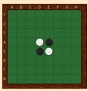
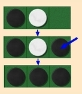
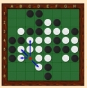

# Jeux à deux joueurs : jeu d'Othello

## Les jeux à deux joueurs

Jeux bien connus, Othello, les échecs, les dames, Tic-tac-toe , le puissance 4,  le jeu de Nim et  bien d'autres, ont pour point commun d'être des "**jeux à deux joueurs au tour par tour**". Ils ont aussi en commun d'être des jeux  *à connaissance parfaite*, car, à tout moment, les deux joueurs possèdent exactement la même connaissance de l'état du jeu. De plus ils ne font pas intervenir le hasard. Ce sont ces jeux que nous allons étudier.

Ces jeux ont des points communs. Ainsi pour chacun, une partie est à tout moment caractérisée par le  *joueur courant* (le prochain qui doit jouer) et par un état du jeu, que nous appellerons  *situation courante*. Il s'agit par exemple

- de la configuration des pièces sur l'échiquier aux échecs,
- du nombre de cailloux restant à prendre dans le jeu de Nim
- etc ...

De plus, ces jeux partagent un mécanisme commun de déroulement des parties. Ce sont uniquement les  *règles du jeu* qui différent d'un jeu à l'autre, pas le mécanisme du jeu. Celui-ci se base principalement sur le fait que les joueurs jouent alternativement des "coups de jeu" en fonction de ce qui est autorisé par les règles du jeu. Ces différents coups font évoluer le jeu de situation en situation, jusqu'à ce que l'on atteigne une situation de fin de partie. Le déroulement d'une partie peut donc être décrit de la façon suivante :

**Déroulement des jeux à deux joueurs**

1. installer le jeu, c'est-à-dire créer la  *situation courante* initiale
2. déterminer le premier  *joueur courant*
3. si le jeu n'est pas fini
   - si le  *joueur courant* peut jouer dans la  *situation courante*
     - le  *joueur courant* joue, c'est-à-dire qu'il choisit un coup possible parmi les coups autorisés dans la  *situation courante* du jeu. Chaque coup de jeu amène le jeu dans une nouvelle situation. Donc choisir un coup de jeu (= jouer) revient à choisir la prochaine  *situation courante* parmi toutes celles qui sont possibles.  
       
      	 - mettre à jour la  *situation courante* suite au choix du joueur
   - sinon
     - ne rien faire (la  *situation courante* ne change pas)
   - l'autre joueur devient le  *joueur courant*
   - recommencer en 3.
4. sinon le jeu est fini  :  afficher le résultat : le joueur vainqueur ou partie nulle.
   

Ce mécanisme de jeu nous fournit un algorithme permettant de jouer aux jeux à deux joueurs qui nous concernent. Cet algorithme est le même pour tous ces jeux. Les variations sont dues uniquement aux règles du jeu. Une analyse de cet algorithme doit permettre d'identifier les fonctions qu'il est nécessaire de définir pour n'importe quel jeu à deux joueurs afin de pouvoir y jouer grâce à cet algorithme.

Une des premières tâches que vous devez réaliser est donc cette analyse afin de produire  **l'interface** commune à tous les jeux à deux joueurs.

**Programme `main.py` des jeux à deux joueurs**:

```python
def jouer():
    config = jeu.creer_config_init()
    joueur_courant = jeu.choisir_premier_joueur()
    jeu.afficher_config(config)

    while not jeu.est_jeu_fini(config):
        if jeu.est_coup_possible(config, joueur_courant) :
            coup = jeu.coup_joueur(config, joueur_courant)
            config = jeu.incrementer_config(config,coup,joueur_courant)
            jeu.afficher_config(config)
        joueur_courant = jeu.incrementer_joueur(joueur_courant)
    jeu.afficher_fin(config,joueur_courant)


if __name__ == "__main__":
    jouer()    
```

## Travail à réaliser

Par binôme il faut mettre en œuvre un module qui permette:

* de jouer aux jeux à deux joueurs avec le jeu d'Othello en utilisant un import dans le programme `main.py.`

* Il faudra définir dans le module la mise en œuvre du jeu Othello en utilisant la ressource ci-dessous.

* À l'issue de cette phase on doit pouvoir jouer au jeu dans une version  *humain contre humain* par des saisies au clavier du coup joué.

* On peut aussi envisager de faire des parties  *humain contre aléatoire*, le deuxième joueur étant géré par le programme qui joue aléatoirement.

## Présentation du jeu

#### Objectif:

Othello se joue à 2 joueurs, sur un plateau unicolore de 64 cases (8 sur 8), avec des pions bicolores, noirs d'un côté et blancs de l'autre. Le but du jeu est d'avoir plus de pions de sa couleur que l'adversaire à la fin de la partie, celle-ci s'achevant lorsque aucun des deux joueurs ne peut plus jouer de coup légal, généralement lorsque les 64 cases sont occupées. Au début de la partie, la ***situation de départ*** est indiquée ci-dessous et les noirs commencent.  :



#### Règles:

Chacun son tour, les joueurs vont poser un pion de leur couleur sur une case vide, adjacente à un pion adverse. Chaque pion posé doit obligatoirement encadrer un ou plusieurs pions adverses avec un autre pion de sa couleur, déjà placé.  Il retourne alors le ou les pions adverse(s) qu'il vient d'encadrer. Les pions ne sont ni retirés de l'othellier, ni déplacés d'une case à l'autre.  

On peut encadrer des pions adverses dans les huit directions et plusieurs pions peuvent être encadrés dans chaque direction.



Par exemple, le joueur Noir a joué en c6. Il retourne alors les pions b6, b5, d7, c5 et c4. Il n'y a pas de réaction en chaîne : les pions retournés ne peuvent pas servir à en retourner d'autres lors du même tour de jeu. 

Si un joueur ne possède aucun coup permettant le retournement de pions adverses, celui-ci passe son tour et c'est à l'adversaire de jouer.



Vous pouvez visiter le lien suivant [http://www.lecomptoirdesjeux.com/regle-reversi.htm](http://www.lecomptoirdesjeux.com/regle-reversi.htm) pour plus d'informations sur les règles du jeu

## Programmation du jeu

#### 1) Représentation du plateau de jeu

Le plateau sera représenté par une grille qui sera techniquement une liste de liste de nombres entiers. Les nombres entiers réprésentent:

* 0 : une case vide du plateau

* 1 : une case avec un pion NOIR

* 2 : une case avec un pion BLANC

Exemple de liste:

```python
[[0, 0, 0, 0, 0, 0, 0, 0, 0, 0],
[0, 0, 0, 0, 0, 0, 0, 0, 0, 0],
[0, 0, 0, 0, 0, 0, 0, 0, 0, 0],
[0, 0, 0, 0, 0, 0, 0, 0, 0, 0],
[0, 0, 0, 0, 2, 1, 0, 0, 0, 0],
[0, 0, 0, 0, 1, 2, 0, 0, 0, 0],
[0, 0, 0, 0, 0, 0, 0, 0, 0, 0],
[0, 0, 0, 0, 0, 0, 0, 0, 0, 0],
[0, 0, 0, 0, 0, 0, 0, 0, 0, 0],
[0, 0, 0, 0, 0, 0, 0, 0, 0, 0]]
```

Cette liste représente le plateau de début de partie avec uniquement deux pions blancs et deux pions noirs en diagonal au centre (situation de départ).

***Travail à faire***

* Réaliser une fonction `creer_config_init` qui ne prend pas de paramètres et qui renvoie une liste de liste correspondant à la configuration de départ du jeu.

```python
>>> creer_config_init()
[[0, 0, 0, 0, 0, 0, 0, 0], [0, 0, 0, 0, 0, 0, 0, 0], [0, 0, 0, 0, 0, 0, 0, 0], [0, 0, 0, 2, 1, 0, 0, 0], [0, 0, 0, 1, 2, 0, 0, 0], [0, 0, 0, 0, 0, 0, 0, 0], [0, 0, 0, 0, 0, 0, 0, 0], [0, 0, 0, 0, 0, 0, 0, 0]]
```

* Réaliser une fonction `afficher_config` qui prend en paramètre la liste de liste représentant la configuration courante du jeu.  Cette fonction affiche le plateau dans le shell:

```python
>>> afficher_config(creer_config_init())
  1 2 3 4 5 6 7 8
1 · · · · · · · · 
2 · · · · · · · · 
3 · · · · · · · · 
4 · · · □ ■ · · · 
5 · · · ■ □ · · · 
6 · · · · · · · · 
7 · · · · · · · · 
8 · · · · · · · · 
```

Un point sera représenté par le caractère : '\u00B7'.
Un pion blanc sera représenté par le caractère : '□'.  
Un pion noir sera représenté par le caractère : '■'.

Pour afficher un caractère sans passer à la ligne, utiliser par exemple : print('\u00B7',end=' ').

#### 2) Gestion des joueurs

* On déclare des variables globales

```python
JOUEUR_NOIR=1
JOUEUR_BLANC=2
```

* Réaliser une fonction `choisir_premier_joueur` qui retourne simplement le nom du joueur qui débute ; on choisira JOUEUR_NOIR.
* Réaliser une fonction `incrementer_joueur` qui prend en paramètre une variable joueur qui représente le joureur courant. La fonction retourne cette même variable joueur après avoir switcher:

```python
>>> incrementer_joueur(JOUEUR_NOIR)
2
>>> incrementer_joueur(JOUEUR_BLANC)
1
```

Dans cet exemple `JOUEUR_NOIR=1` et `JOUEUR_BLANC=2`. La fonction bascule de JOUEUR_NOIR à JOUEUR_BLANC sur la première ligne. Puis l'inverse sur la deuxième ligne. On pourra observer astucieusement que 3-1=2 et que 3-2=1.

#### 3) Gestion et validité des coups

Pour pouvoir jouer il faut savoir, dans un premier temps, si le joueur courant peut placer un pion de sa couleur sur le plateau. 

---

***Travail à faire***

* Réaliser une fonction `test_dir_valide` qui prend en paramètre la configuration du jeu, les coordonnées de la "case à tester", une liste de directions possibles et le joueur courant. Cette fonction renvoie `True` si le joueur courant peut jouer sur la "case à tester"  et `False` dans le cas contraire:

```python
    >>> config = [[0, 0, 0, 0, 0, 0, 0, 0], [0, 0, 0, 0, 0, 0, 0, 0], [0, 0, 0, 0, 0, 0, 0, 0], [0, 0, 0, 2, 1, 0, 0, 0], [0, 0, 0, 1, 2, 0, 0, 0], [0, 0, 2, 0, 0, 1, 0, 0], [0, 0, 0, 0, 0, 0, 0, 0], [0, 0, 0, 0, 0, 0, 0, 0]]
    >>> afficher_config(config)
      1 2 3 4 5 6 7 8
    1 · · · · · · · · 
    2 · · · · · · · · 
    3 · · · · · · · · 
    4 · · · □ ■ · · · 
    5 · · · ■ □ · · · 
    6 · · □ · · ■ · · 
    7 · · · · · · · · 
    8 · · · · · · · · 
    >>> test_dir_valide(config,(3,4),(1,0),JOUEUR_NOIR)
    True
    >>> test_dir_valide(config,(3,3),(1,1),JOUEUR_BLANC)
    False
    >>> test_dir_valide(config,(3,3),(1,1),JOUEUR_NOIR)
    True
    >>> test_dir_valide(config,(6,3),(-1,1),JOUEUR_BLANC)
    True
    >>> test_dir_valide(config,(6,4),(-1,0),JOUEUR_BLANC)
    True
    >>> test_dir_valide(config,(8,8),(0,1),JOUEUR_BLANC)
    False
```
---

* Réaliser une fonction `est_coup_possible` qui, prend en paramètre la configuration du jeu et le joueur courant. Cette fonction renvoie vrai si le joueur courant peut jouer et faux dans le cas contraire:

```python
>>> config = creer_config_init()
>>> est_coup_possible(config,JOUEUR_NOIR)
True
>>> config = [[1 for _ in range(8)] for _ in range(8)]
>>> est_coup_possible(config,JOUEUR_BLANC)
False
```

Le premier test renvoie `True` car la configuration est le plateau de début de partie. Le deuxième test renvoie `False` car la configuration du jeux est un plateau complètement rempli de pions noir.

*Remarque : l'utilisation de la fonction précédente `test_dir_valide` est requise.*

Afin de pouvoir stopper le jeu, il nous faut savoir si les joueurs peuvent encore jouer.

* Réaliser une fonction `est_jeu_fini` qui prend en paramètre la configuration du jeu. Cette fonction renvoie `False` si un des deux joueurs peut jouer et `True` dans le cas contraire.

```python
>>> config = creer_config_init()
>>> est_jeu_fini(config)
False
>>> config = [[1 for _ in range(8)] for _ in range(8)]
>>> est_jeu_fini(config)
True
```

---

Il faut à présent que les deux joueurs puissent saisir les coordonnées des coups qu'ils souhaitent jouer. Le format choisi est une saisie de coordonnées x,y sous la forme `2,3` pour ` x=2` et `y=3`.

---

***Travail à faire***

* Réaliser une fonction `verif_coup_valide` qui prend en paramètre la configuration du jeu, les coordonnées de la case à tester et le joueur courant. Cette fonction renvoie True si le coup est valide et False dans le cas contraire:

```python
>>> s = creer_config_init()
>>> verif_coup_valide(s,(3,4),JOUEUR_NOIR)
True

>>> s = creer_config_init()
>>> verif_coup_valide(s,(3,4),JOUEUR_BLANC)
False
```

Le premier test donne True car il est possible de placer un pion noir sur le plateau de départ à la case (3,4) ==> le pion blanc en (4,4) sera retourné.

Le deuxime test donne False car il n'est pas possible de placer un pion blanc en (3,4) car il n'y a pas de possibilité de retournement.

* Réaliser une fonction `coup_joueur` qui prend en paramètre la configuration du jeu et le joueur courant. Elle renvoie une variable `coup ` qui contient les coordonnées de la case où le joueur désire placer son pion. Une vérification de la validité du coup sera faite, si le coup n'est pas valable le joueur est invité a saisir de nouvelles valeurs au clavier:

```python
>>> config = creer_config_init()
>>> coup_joueur(config,JOUEUR_NOIR)
Au JOUEUR_NOIR de jouer, donner la case choisie au format x,y : 3,4
(3, 4)
>>> coup_joueur(config,JOUEUR_BLANC)
Au JOUEUR_BLANC de jouer, donner la case choisie au format x,y : 3,4
Au JOUEUR_BLANC de jouer, donner la case choisie au format x,y : 6,4
(6, 4)
```

La fonction attend la saisie des valeurs au clavier.

Il faut pour terminer actualiser la configuration du jeu suite au coup du joueur courant.

* Réaliser une fonction `incrementer_config` qui prend en paramètre la configuration du jeu, les coordonnées de la case à jouer et le joueur courant. Cette fonction modifie la configuration du jeu en ajoutant le nouveau pion et en retournant le ou les pions de couleur opposée :

```python
>>> s = creer_config_init()
>>> afficher_config(s)
  1 2 3 4 5 6 7 8
1 · · · · · · · · 
2 · · · · · · · · 
3 · · · · · · · · 
4 · · · □ ■ · · · 
5 · · · ■ □ · · · 
6 · · · · · · · · 
7 · · · · · · · · 
8 · · · · · · · · 
>>> afficher_config(incrementer_config(s,(3,4),JOUEUR_NOIR))
  1 2 3 4 5 6 7 8
1 · · · · · · · · 
2 · · · · · · · · 
3 · · · · · · · · 
4 · · ■ ■ ■ · · · 
5 · · · ■ □ · · · 
6 · · · · · · · · 
7 · · · · · · · · 
8 · · · · · · · · 
```
Ce test montre le nouveau pion noir en (3,4) ainsi que le retournement du pion initialement blanc en (4,4).

```python
>>> s1=incrementer_config(s,(3,4),JOUEUR_NOIR)
>>> afficher_config(incrementer_config(s1,(3,3),JOUEUR_BLANC))
  1 2 3 4 5 6 7 8
1 · · · · · · · · 
2 · · · · · · · · 
3 · · □ · · · · · 
4 · · ■ □ ■ · · · 
5 · · · ■ □ · · · 
6 · · · · · · · · 
7 · · · · · · · · 
8 · · · · · · · · 
```
Ce test montre le nouveau pion blanc en (3,3) ainsi que le retournement du pion initialement noir en (4,4).
```python
    >>> afficher_config(incrementer_config(s1,(6,3),JOUEUR_BLANC))
  1 2 3 4 5 6 7 8
1 · · · · · · · · 
2 · · · · · · · · 
3 · · □ · · · · · 
4 · · ■ □ ■ · · · 
5 · · · ■ □ · · · 
6 · · · · · · · · 
7 · · · · · · · · 
8 · · · · · · · · 
```
Ce test montre que placer un pion blanc en (6,3) ne permet pas de modifier la configuration.


#### 4) Test du jeu dans le module main.py

Afin de tester le bon fonctionnement de votre jeu d'Othello, il faut au préalable configurer correctement le module `main`.

* Compléter le fichier `main.py` ci-dessous en important toutes les fonctions de votre module `othello` sous le nom jeu:

```python
### À compléter

def jouer():
    config = jeu.creer_config_init()
    joueur_courant = jeu.choisir_premier_joueur()
    jeu.afficher_config(config)

    while not jeu.est_jeu_fini(config):
        if jeu.est_coup_possible(config, joueur_courant) :
            coup = jeu.coup_joueur(config, joueur_courant)
            config = jeu.incrementer_config(config,coup,joueur_courant)
            jeu.afficher_config(config)
        joueur_courant = jeu.incrementer_joueur(joueur_courant)
    jeu.afficher_fin(config,joueur_courant)


if __name__ == "__main__":
    jouer()
```

* Tester le bon fonctionnement.

* Que se passe t-il en fin de partie?

* Quelle fonction manque t-il dans votre module?

* Réaliser cette fonction `afficher_fin` qui prend en paramètres la configuration du jeu et le joueur courant, et tester de nouveau votre jeu. La règle du jeu stipule que le vainqueur d'une partie d'Othello est le joueur qui possède le plus de pions de sa couleur à la fin de la partie.

```python
>>> s = creer_config_init()
>>> afficher_fin(s,JOUEUR_NOIR)
====================
  Egalité 
====================
>>> s1=incrementer_config(s,(3,4),JOUEUR_NOIR)
>>> afficher_fin(s1,JOUEUR_NOIR)
====================
Le gagnant est JOUEUR_NOIR
====================
```

#### 5) Amélioration du jeu : l'algorithme du min-max

Nous allons à présent modifier notre module `othello` afin de pourvoir jouer contre l'ordinateur.

a) Proposer une modification de la fonction `coup_joueur`  en utilisant le module `random`.

b) L'algorithme du min-max permet d'améliorer la qualité du jeu contre l'ordinateur qui va être capable d'évaluer les coups pour choisir le meilleur selon des critères d'évaluation ; son principe est explicité ici :  [algorithme du min_max](algo_minmax.md)


```python
def min_max(config, profondeur, joueur):
    '''
    Renvoie la valeur de la configuration passée en paramètre
    :param config: configuration du jeu
    :param profondeur: (int) profondeur restante pour l'évaluation de la configuration
    :param joueur: (int) numero du joueur courant
    
    '''
    if jeu.est_jeu_fini(config) or profondeur == 0:
        return jeu.evaluation(config,joueur)*jeu.coef_joueur(joueur)
    else:
        if joueur == JOUEUR1:
            liste_configs_suivantes = jeu.creer_liste_configs_suivantes(config, JOUEUR1)
            return min([min_max(suivante, profondeur-1, JOUEUR2) for suivante in liste_configs_suivantes])
        else:
            liste_configs_suivantes = jeu.creer_liste_configs_suivantes(config, JOUEUR2)
            return max([min_max(suivante, profondeur-1, JOUEUR1) for suivante in liste_configs_suivantes])
```

Cette fonction sera placée dans main.py car elle est utilisable pour n'importe quel jeu à deux joueurs, elle sera importée dans Othello.py.

Elle fait appel à trois fonctions  :

- `creer_liste_configs_suivantes(config, joueur)` 

- `evaluation(config,joueur)` .
- coef_joueur(joueur)

Il nous faut d'abord créer une fonction creer_liste_coups_possibles qui prend en paramètres la configuration et le joueur, et qui renvoie la liste des coups possibles suivants.

```python
    >>> s = creer_config_init()
    >>> afficher_config(s)
      1 2 3 4 5 6 7 8
    1 · · · · · · · · 
    2 · · · · · · · · 
    3 · · · · · · · · 
    4 · · · □ ■ · · · 
    5 · · · ■ □ · · · 
    6 · · · · · · · · 
    7 · · · · · · · · 
    8 · · · · · · · · 
    >>> creer_liste_coups_possibles(s, JOUEUR_NOIR)
    [(4, 3), (3, 4), (6, 5), (5, 6)]
```

Nous allons maintenant créer la fonction `creer_liste_configs_suivantes(config, joueur)` qui renvoie une liste de configurations à partir de la liste des coups possibles obtenus par la fonction précédente.

Pour éviter la modification de la configuration courante, il nous faudra faire une copie de la configuration. Pour cela, on importe le module copy : `import copy`.

```python
>>> s = creer_config_init()
>>> afficher_config(s)
  1 2 3 4 5 6 7 8
1 · · · · · · · · 
2 · · · · · · · · 
3 · · · · · · · · 
4 · · · □ ■ · · · 
5 · · · ■ □ · · · 
6 · · · · · · · · 
7 · · · · · · · · 
8 · · · · · · · · 
>>> for i in creer_liste_configs_suivantes(s, JOUEUR_NOIR):
    afficher_config(i)
    
  1 2 3 4 5 6 7 8
1 · · · · · · · · 
2 · · · · · · · · 
3 · · · ■ · · · · 
4 · · · ■ ■ · · · 
5 · · · ■ □ · · · 
6 · · · · · · · · 
7 · · · · · · · · 
8 · · · · · · · · 
  1 2 3 4 5 6 7 8
1 · · · · · · · · 
2 · · · · · · · · 
3 · · · · · · · · 
4 · · ■ ■ ■ · · · 
5 · · · ■ □ · · · 
6 · · · · · · · · 
7 · · · · · · · · 
8 · · · · · · · · 
  1 2 3 4 5 6 7 8
1 · · · · · · · · 
2 · · · · · · · · 
3 · · · · · · · · 
4 · · · □ ■ · · · 
5 · · · ■ ■ ■ · · 
6 · · · · · · · · 
7 · · · · · · · · 
8 · · · · · · · · 
  1 2 3 4 5 6 7 8
1 · · · · · · · · 
2 · · · · · · · · 
3 · · · · · · · · 
4 · · · □ ■ · · · 
5 · · · ■ ■ · · · 
6 · · · · ■ · · · 
7 · · · · · · · · 
8 · · · · · · · · ```
```

Pour la fonction d'évaluation, on attribuera + 300 points aux cases situées sur la première et dernière ligne, ainsi que celles sur la première et dernière colonne.

On attribuera -500 points aux cases situées dans les coins : par exemple pour le coin haut gauche : les cases (1,2) ; (2,2); (2,1).

On attribuera +1000 points aux cases situées aux extrémités : (1,1) ; (1,8) ; (8,1) et (8,8)

```python
>>> config = [[1, 1, 2, 1, 0, 0, 0, 0], [0, 0, 2, 0, 0, 0, 0, 0], [0, 0, 2, 2, 0, 0, 0, 0], [0, 0, 0, 2, 1, 0, 0, 0], [0, 0, 0, 1, 2, 0, 0, 0], [0, 0, 2, 0, 0, 1, 0, 0], [0, 0, 0, 0, 0, 0, 0, 0], [0, 0, 0, 0, 0, 0, 0, 0]]
>>> afficher_config(config)
  1 2 3 4 5 6 7 8
1 ■ ■ □ ■ · · · · 
2 · · □ · · · · · 
3 · · □ □ · · · · 
4 · · · □ ■ · · · 
5 · · · ■ □ · · · 
6 · · □ · · ■ · · 
7 · · · · · · · · 
8 · · · · · · · · 
>>> evaluation(config,JOUEUR_NOIR)
800
```

Il faut également la fonction coef_joueur :

```python
def coef_joueur(joueur):
    '''
    fonction INTERNE
    '''
    return 1 if joueur == JOUEUR_NOIR else -1
```

Il reste à changer la fonction coup_joueur.

Le principe est de créer la liste des coups possiles pour le joueur 2 qui est l'ordinateur. Pour chacun de ces coups possibles, on va incrémenter la configuration du jeu résultant du coup joué et évaluer la situation du jeu à une profondeur donné. On retient le coup qui donne une évaluation maximale selon les critères d'évaluation choisis.

Remarque : on observe que la fonction min_max présente la particularité de s'appeller elle-même ; une telle fonction est dite **récursive** et elle a une portée généralement puissante.

Voici deux exemples classiques de fonctions récurcives.


```python
def fact(n):
    '''
    Renvoie la valeur de factorielle n
    : param n : int
    : return : 1*2*3*.....(n-1)*n
    >>> fact(5)
    120
    '''
    if n <= 1:
        return 1
    else:
        return n * fact(n-1)
        
def puissance(a,b):
    '''
    Renvoie la valeur de a^b
    : param a : int
    : param b : int
    : return : a*a.....*a b fois
    >>> puissance(2,3)
    8
    '''    
    if b==1:
        return a
    if b>1:
        return a*puissance(a,b-1)
```


