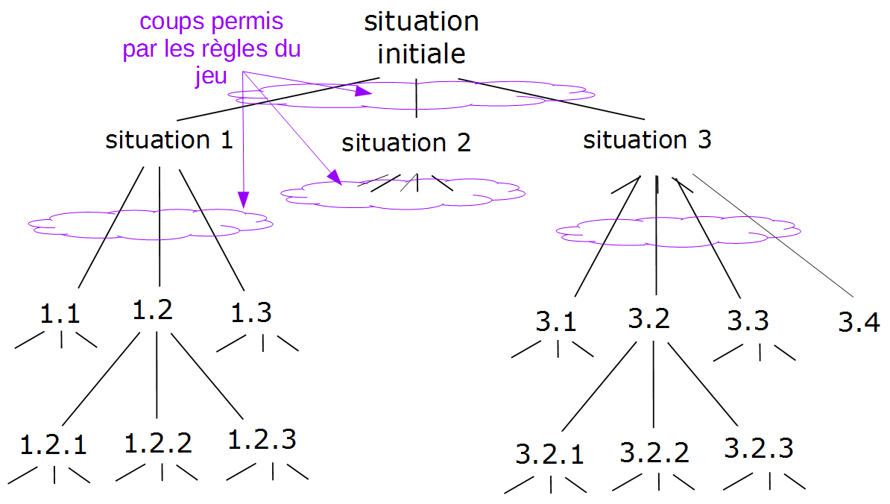
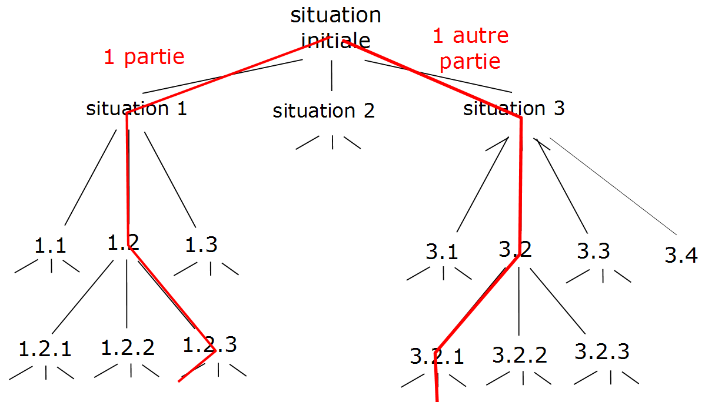
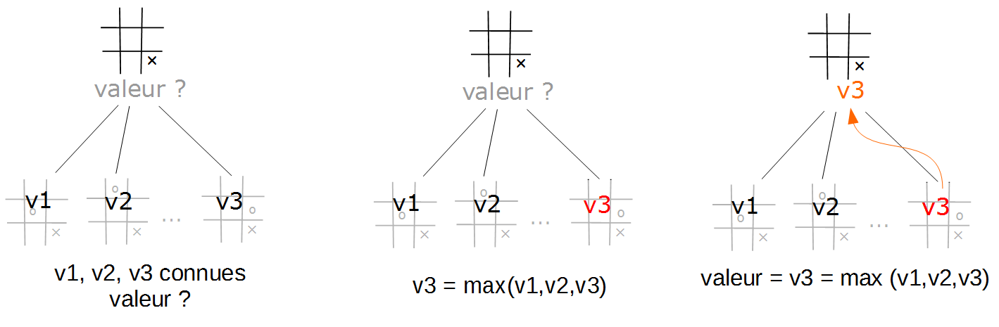

L'algorithme du min-MAX
========================

Les jeux à deux joueurs que nous avons évoqués précédemment ont
d'autres points communs que ceux déjà mentionnés. Ce sont tous des
*jeux à information complète et à somme nulle*. 

Cela signifie que :

- *jeu à information complète*  
    les deux joueurs ont à tout moment toute l'information sur l'état du jeu. Il n'y a par exemple pas de carte dans la main d'un joueur que l'autre ne connaît pas. Il en résulte que chaque joueur connaît toutes les informations à disposition de son
    adversaire au moment où celui-ci doit jouer.
    
- *jeu à somme nulle*  
  les gains réalisés par un joueur sont des pertes pour l'autre
    joueur. Il y a donc forcément un gagnant et un perdant (ou un
    match nul). Mais il n'y a pas un joueur qui gagne beaucoup et
    l'autre moins. Il en résulte que les intérêts des deux joueurs
    sont opposés. Les meilleurs coups de jeu pour l'un sont les pires
    pour l'autre.

Il existe un algorithme qui permet de faire jouer un programme à de tels
jeux. Il s'agit de [l'algorithme du min-max](https://fr.wikipedia.org/wiki/Algorithme_minimax) que nous allons tenter de présenter brièvement.

Arbre de jeu
------------

Nous avons vu que pour les jeux qui nous concernent, on part d'une
*situation courante* et les règles du jeu déterminent la liste des
nouvelles situations de jeu atteignables à partir de celle-ci. 

Chacune de ces situations, si elle est choisie par le joueur, devient la
prochaine *situation courante* à partir de laquelle l'autre joueur
devra à son tour choisir la prochaine situation, parmi les situations
permises, celle-ci devenant la *situation courante* du prochain tour de
jeu et ainsi de suite jusqu'à la fin de la partie.

Chaque *situation courante* propose donc un ensemble d'embranchements
que peut choisir le joueur, et cette situation se reproduit à chaque
tour de jeu. On peut donc représenter l'ensemble de toutes les parties
possibles à partir d'une *situation courante* initiale sous la forme
d'un arbre dont les noeuds sont les différentes situations de jeu
possibles. Cet arbre est appelé **arbre de jeu**.





La suite des choix des joueurs parmi les embranchements constitue la partie qu'ils jouent. Ce qui s'identifie par une branche de l'arbre de jeu. Chaque branche correspond à une partie différente.




Principes de l'algorithme
--------------------------

Puisque le jeu est *à information complète*, chaque joueur a la possibilité (théorique) de calculer cet arbre de jeu. Le problème qui se pose au joueur qui doit jouer, c'est-à-dire celui qui doit choisir à
partir de la *situation courante initiale*, est donc de choisir une branche de l'arbre qui l'amène vers la meilleure situation finale possible, c'est-à-dire, si possible une victoire. La question qui se
pose à lui est donc :

*Quel coup jouer maintenant pour gagner plus tard ?*

L'objectif est donc la qualité de la situation visée "*dans le futur*" et non pas celle atteinte immédiatement, et cette qualité doit être la meilleure possible.

Comment faire ?

Et bien, comme tout joueur humain le fait, l'algorithme va "*calculer des coups à l'avance*" et prendre sa décision en fonction de ces calculs.

1.  Le *premier principe* de l'algorithme min-max est donc de **déployer l'arbre de jeu et d'attribuer une note aux situations atteintes à la fin de l'arbre** : les feuilles de l'arbre.  
Cette note doit refléter la qualité de la situation. Elle doit donc être **croissante avec la qualité de la situation** : meilleure est la situation, plus haute est la note. On appelle **fonction
d'évaluation** la fonction d'attribution de la note à une situation. La note attribuée correspond au gain espéré si l'on atteint cette situation.   
Puisque seul le gain final nous intéresse, ce sont bien uniquement aux situations positionnées en feuille de l'arbre qu'est appliquée la fonction d'évaluation.  
Le problème qui se pose maintenant est de déterminer comment utiliser ces valeurs positionnées sur les situations feuilles de l'arbre de jeu.


2.  Le *second principe* de l'algorithme min-max est de **propager vers
le haut de l'arbre les valeurs** qui ont été attribuées aux
situations feuilles afin d'attribuer, par propagation, une note aux
autres situations présentes au sein de l'arbre de jeu jusqu'à la
situation initiale située à la racine de l'arbre. L'objectif du
joueur est donc maintenant d'attribuer une note aux situations.
Etudions un peu cette propagation.

Quand il doit choisir entre plusieurs situations l'objectif du joueur est d'atteindre la situation avec la meilleure note. Donc supposons qu'il soit parvenu à attribuer une note à toutes les
situations immmédiatement atteignables à partir de la situation courante (cf. figure à gauche), alors puisqu'il doit choisir l'une de ces situations il prend celle avec la plus grande note (= meilleure qualité) (cf. figure au milieu). Cette note devient donc celle de la situation courante, elle a pour valeur le *max* des valeurs suivantes (cf. figure à droite).
En effet : s'il arrive dans cette situation, il cherche à jouer au mieux donc il choisit la meilleure situation possible pour lui et obtiendra donc le gain de cette situation. Ce gain devient donc le gain de la situation courante.


​    
**Conclusion** : *Quand c'est au joueur de jouer, la note de la situation courante est donc* **le max des notes des situations suivantes**.


    
Cependant les choses se compliquent un peu dans la propagation, il faut en effet prendre en compte que l'adversaire joue une fois sur deux.
Il va donc falloir "simuler" ce que joue l'adversaire. Pour ne pas prendre de risque dans notre stratégie on va supposer que **l'adversaire joue le mieux possible** et donc le moins en notre faveur possible. C'est là qu'intervient la seconde propriété de nos jeux : ils sont "*à somme nulle*". Donc les intérêts des joueurs sont opposés : ce qui est bon pour l'un est mauvais pour l'autre et réciproquement. Donc les meilleures situations pour l'adversaire sont les pires pour le joueur, c'est-à-dire celles avec les plus mauvaises notes. Donc symétriquement avec l'analyse précédente, dans une situation où c'est à l'adversaire de jouer, si l'on est parvenu à attribuer une note à toutes les situations immmédiatement atteignables à partir de cette situation, l'adversaire va chercher à atteindre la meilleure situation pour lui, donc la plus mauvaise pour le joueur, il va donc choisir la situation avec la plus basse note. Cette note devient donc celle de la situation courante, elle a pour valeur le *min* des valeurs suivantes.

**Conclusion** *Quand c'est à l'adversaire de jouer, la note de la situation courante est donc* **le min des notes des situations suivantes**.

L'algorithme
-------------

Nous sommes maintenant en mesure de proposer un algorithme qui, en tenant compte de l'intérêt opposé de l'adversaire, attribue la meilleure note possible à toutes les situations de l'arbre de jeu.

Appelons *min_max* la fonction que nous cherchons à calculer par cet algorithme. Cette fonction prend en paramètre la situation à évaluer ainsi que l'information sur qui doit jouer dans cette situation. Nous supposons ainsi définie deux constantes:

 -  `PROGRAMME` :   identifie le joueur (le programme), il doit maximiser la valeur atteinte
 -  `ADVERSAIRE` :   identifie son adversaire, il cherche à minimiser la valeur atteinte

Il est également nécessaire que nous disposions de la fonction d'évaluation qui s'applique sur les feuilles de l'arbre de jeu, appelons *eval* cette fonction qui prend en paramètre la situation
feuille et le joueur dont c'est le tour. Elle a pour résultat la valeur estimée de la situation pour ce joueur.

Rappelons que ce sont les règles du jeu qui déterminent si une situation est finale.

Nous cherchons donc à calculer *min_max(situation, joueur)*.

1.  Lorsque *situation* est une situation de fin de jeu, la situation est simple, il faut utiliser la fonction d'évaluation. Simplement, celle-ci mesurant la qualité de la situation du joueur actif.
    Quand c'est au joueur `ADVERSAIRE` de jouer (c'est lui le joueur actif), une situation bien (resp. mal) évaluée pour lui est mauvaise (resp. bonne) pour le programme.
    Toujours car les intérêts des joueurs sont opposés.
    Donc dans le cas de l'`ADVERSAIRE`, il faut prendre l'opposée de la valeur calculée par la fonction *eval*. On a donc :
	
	*min_max(situation, joueur) = eval(situation, joueur) x coeff(joueur)*
	
    avec       
 - *coeff(joueur) = +1* si *joueur* = `PROGRAMME` 
     - *coeff(joueur) = -1* si *joueur* = `ADVERSAIRE`

2.  Dans les autres cas, il faut prendre selon le joueur, le *max* ou le *min* des valeurs des situations suivantes de la situation courante. Il faut donc pouvoir calculer les valeurs de chaque situation suivante. Il faut donc pour cela que nous disposions d'une fonction
    qui soit capable d'attribuer une valeur à une situation. Nous en avons une ! C'est la fonction *min_max* qu'il s'agit donc d'appeler récursivement. Rappelons que les situations suivantes
    sont déterminées par les règles du jeu.
    
    Il en résulte donc que si l'on appelle *situSuivantes* la liste des situations suivantes de la situation courante, alors si *joueur* = `PROGRAMME`
    
    *min_max(situation, joueur) = max( [ min_max(suivante,* `ADVERSAIRE`*)* pour *suivante* dans *situSuivantes ])*
    

On peut noter dans l'appel récursif l'évolution du second paramètre qui permet de gérer l'alternance des joueurs :
    `ADVERSAIRE` jouant les coups après `PROGRAMME`.
    
    Et donc, de manière symétrique, si *joueur* = `ADVERSAIRE`
    
    *min_max(situation, joueur) = min( [ min_max(suivante,*`PROGRAMME`*)* pour *suivante* dans *situSuivantes ] )*

L'algorithme se synthétise donc ainsi :


**algorithme du min-max (version 1)**

 appel : *min_max(situation_courante,* `PROGRAMME`*)*

```
min_max(situation, joueur) =
   si situation est finale
      retourner eval(situation, joueur) x coeff(joueur)
   sinon
      situSuivantes = les situations suivantes (légales) de situation
      si joueur = PROGRAMME
        valeur = max( [ min_max(suivante,ADVERSAIRE)  pour suivante dans situSuivantes ] )
      sinon # joueur = ADVERSAIRE
        valeur = min( [ min_max(suivante, PROGRAMME) pour suivante dans situSuivantes ] )
      fin si
      retourner valeur
   fin si
```

Vous pouvez vérifier que la cascade des appels récursifs construite par cet algorithme correspond à la construction de l'arbre de jeu qui est déployé jusqu'aux situations finales correspondant au cas d'arrêt.

Notons que si cet agorithme est correct, sa terminaison n'est pas garantie pour les jeux dans lesquels des parties infinies sont possibles. La version suivante remédiera à ce problème. Car un autre problème survient : même sans être infini l'arbre de jeu peut devenir très grand. Exécuter l'ensemble des appels récursifs peut être à la fois très long et très couteux en espace mémoire. Il est donc nécessaire de limiter ce nombre d'appels récursifs. On va pour cela ajouter à la
fonction *min_max* un paramètre qui déterminera la profondeur maximale explorée dans l'arbre de jeu, et donc le nombre d'appels récursifs exécutés. Dans ce cas les situations du cas d'arrêt ne sont plus uniquement les situations finales, mais aussi toutes celles situées à la profondeur de l'arbre choisie, auxquelles il faudra donc appliquer la fonction d'évaluation. Ce paramètre de profondeur correspond en fait au nombre maximal de coups calculés à l'avance par l'algorithme.

L'algorithme devient ainsi :


**algorithme du min-max (version 2)**


appel par *min_max(situation_courante,profondeur,*`PROGRAMME`*)*

avec :
```
 min_max(situation, profondeur, joueur) =
   si situation est finale ou profondeur = 0
       retourner eval(situation, joueur) x coeff(joueur)
   sinon
       situSuivantes = les situations suivantes (légales) de situation
       si joueur = `PROGRAMME`
          valeur = max( [ min_max(suivante, profondeur-1, `ADVERSAIRE`) pour suivante in situSuivantes ] )
       sinon # joueur = `ADVERSAIRE`
          valeur = min( [ min_max(suivante, profondeur -1, `PROGRAMME`) pour suivante in situSuivantes ] )
       fin si
       retourner valeur
   fin si
```

On remarque que dans les appels récursifs, le second paramètre, *profondeur*, est diminué de 1 à chaque appel, jusqu'à atteindre 0, à moins que l'on ait atteint une situation finale avant. La terminaison de l'algorithme est maintenant garantie.

Remarques

1.  Notons que pour un programme de jeu, ce qui nous intéresse ce n'est pas tant la valeur de la meilleure prochaine situation que cette situation elle-même. Il convient donc d'adapter légèrement l'algorithme pour que son résultat soit un couple *(valeur, situation)*. La seconde composante correspond à la *situation* à laquelle correspond la *valeur* retenue. S'il faut
    continuer à appliquer les *min* et *max* sur *valeur*, il faudra à la fin retenir la seconde composante du couple pour disposer effectivement de la prochaine situation de jeu choisie.
2.  Le paramètre de profondeur exprime le nombre de coups calculés à l'avance par l'algorithme. A priori, plus il est élevé, mieux l'algorithme est informé pour faire son choix et donc meilleur est ce choix. Ce paramètre peut donc être utilisé pour faire facilement
    varier le niveau de difficulté de l'adversaire modélisé par le programme. Un niveau *débutant* pourrait correspondre à une profondeur de 3, un niveau *intermédiaire* à une profondeur de 7 et un niveau *expert* à un niveau de 10 (NB : ces valeurs sont données de manière totalement arbitraire).

Fonctions d'évaluation
-----------------------

Cet algorithme permet donc de déterminer la valeur de la meilleure prochaine situation à jouer pour peu que l'on dispose des fonctions, propres à chaque jeu, suivantes :

 -   déterminer si une situation est finale ou non
 -   calculer les situations suivantes d'une situation donnée
 -   évaluer la valeur d'une situation (la fonction *eval*)

Les deux premières fonctions résultent des règles du jeu et doivent de toute façon être mises en oeuvre pour programmer le jeu, même sans utiliser l'algorithme min-max. Il reste donc une difficulté, sans doute la principale en fin de compte : déterminer la fonction d'évaluation
*eval*.

Celle-ci nécessite en effet de pouvoir étudier une situation et de lui attribuer une valeur de qualité intrinsèque. Pour un même jeu, il peut y avoir plusieurs manières d'attribuer une note à une situation. Il peut donc exister plusieurs fonctions d'évaluation possibles. Certaines
seront plus performantes que d'autres et donc feront jouer le programme plus ou moins bien. Faire varier la fonction d'évaluation est donc un autre moyen de faire varier la qualité du programme adversaire.

Il y a cependant des cas où la fonction d'évaluation est simple à établir : lorsqu'il est possible de calculer l'arbre de jeu dans son entier, c'est-à-dire jusqu'aux situations finales. C'est le cas pour
les "petits jeux", tels que le tic-tac-toe ou le jeu de Nim. Dans ce cas puisque l'on applique l'évaluation que sur des situations de fin de jeu, il n'y a que trois cas possibles : le joueur a gagné, le joueur a perdu ou il y a match nul. Dans la mesure où la fonction d'évaluation doit être croissante avec la qualité et que gagner est mieux que faire match nul qui est mieux que perdre. Il suffit de fixer 3 valeurs numériques distinctes, d'attribuer la plus grande aux situations
gagnantes, la plus petite aux situations perdantes et la troisième aux situations d'égalité. Peu importe ces valeurs : (100, 0, 50) ou (+1, 0,-1) font tout aussi bien l'affaire.

Dans les autres cas, il est nécessaire de trouver une manière d'évaluer une situation. Il faut pour cela étudier la mécanique du jeu et essayer d'en déduire des critères qui font qu'une situation est plus favorable qu'une autre et donner une meilleure note quand les critères sont satisfaits. C'est en fait la fonction *eval* qui va a posteriori déterminer la qualité d'une situation et donc déterminer quelles sont les situations favorisées par le programme. Le programme jouera donc plus ou moins bien selon la pertinence de la fonction d'évaluation. Il ne faut donc pas forcément chercher à établir une fonction d'évaluation parfaite, c'est de toute façon impossible pour bien des jeux, mais plutôt une fonction d'évaluation qui est capable de valoriser de bonnes situations par rapport aux moins bonnes selon les critères que l'on a choisis.


Ce travail d'analyse permettant de construire une (ou plusieurs) fonctions d'évaluation, ce qui doit être fait pour chaque jeu pour lequel on veut faire jouer l'algorithme min-max. Mais notons que dans la mesure où l'algorithme est générique, et donc existe indépendamment du jeu,
c'est le seul travail qu'il reste à faire. Et il dépend très fortement du jeu choisi.  Il est donc normal qu'il ne puisse être généralisé.


## Exemple du jeu Othello

Nous vous proposons de réfléchir à des fonctions d'évaluation qui pourraient être pertinentes pour le jeu d'othello.

 - Le but du jeu est d'avoir à la fin plus de pions de sa couleur que de pions de l'adversaire. Il peut donc sembler naturel de favoriser les situations dans lesquelles le notre nombre de pions est supérieur à celui de l'adversaire, et même de les favoriser d'autant plus que l'écart est en notre faveur. Une première fonction d'évaluation consiste donc simplement, pour une situation donnée, à calculer la différence entre le nombre de pions de sa couleur et le nombre de pions de l'adversaire et d'attribuer cette valeur à la situation :

    *eval(situation, joueur) = nombre_pions(situation, joueur) - nombre_pions(situation, adversaire)*

   Bien que rudimentaire, cette fonction d'évaluation permet déjà d'avoir un programme capable de joueur contre des débutants.

 - La fonction précédente reste cependant très basique. On peut l'améliorer par l'analyse du jeu. Ceux qui ont déjà joué, même très peu, à Othello savent que certaines positions du plateau de jeu sont meilleures que d'autres. C'est par exemple le cas des coins qui sont imprenables, ou des positions sur les bordures qui sont plus faciles à défendre que les positions du centre. Or la fonction d'évaluation précédente ne fait pas la distinction entre
   un pion au centre et un pion dans un coin. Pour contrer ce défaut, une solution est de ne pas se contenter de compter le nombre de pions de chaque couleur, mais d'attribuer en plus un *poids* à chaque case du plateau. Plus la case est intéressante, plus ce poids est important. Par exemple, les cases des coins pourraient avoir un poids de 20, celles des bordures de 5 et celles du centre de 1 (ces valeurs sont arbitraires, à vous de proposer les valeurs qui vous semblent pertinentes, sur plus de types de cases éventuellement). La fonction d'évaluation calcule cette fois la différence entre la somme des poids des cases occupées par les
   pions du joueur et la somme des poids des cases occupées par les pions adverses.

    *valeur_joueur = somme des poids des cases occupées par le joueur*   
    *valeur_adversaire = somme des poids des cases occupées par l'adversaire*   
    *eval(situation, joueur) = valeur_joueur - valeur_adversaire*   


   Avec une telle fonction l'algorithme aura tendance à favoriser les situations où les pions du joueur occupent des cases fortes, les coins en particulier.

   NB : la fonction précédente est une variante de cette fonction avec les poids de toutes les cases fixées à 1.

La seconde fonction étant plus performante, pour une même profondeur de calcul, un algorithme *min-max* utilisant la seconde fonction jouera mieux qu'un algorithme utilisant la première. Cette fonction reste cependant encore très rudimentaire, d'autres fonctions d'évaluation plus évoluées sont évidemment possibles pour le jeu d'Othello.


