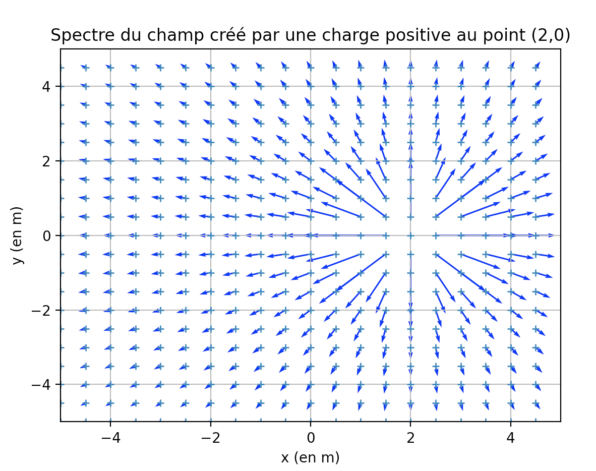
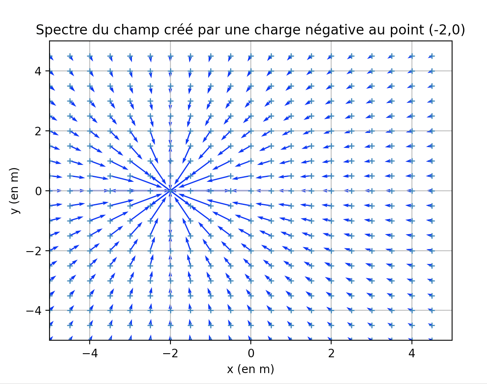
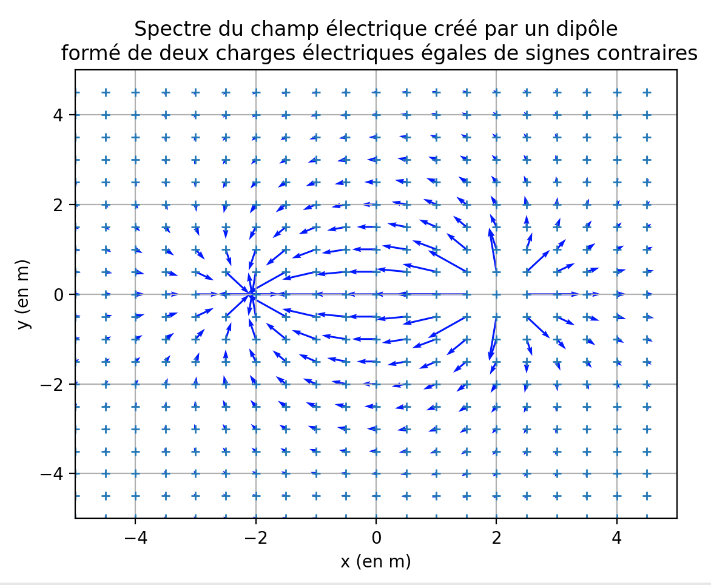

Cartographie du champ électrique
===================

**1) Champ électrique créé par une charge positive**

```python
import matplotlib.pyplot as plt
points=[(i*0.5,j*0.5) for i in range(-10,10) for j in range(-10,10)]
x=[points[i][0] for i in range(len(points))]
y=[points[i][1] for i in range(len(points))]
plt.axis([ -5, 5, -5, 5 ])
plt.plot(x,y,'+',markersize=5)

def signe(x):
    if x>0:
        return 1
    else:
        return -1

def calcul_norme_champ(a,b,c,d,q):
    return (abs(q)/((a-c)**2+(b-d)**2))

c=2#abscisse de la charge
d=0#ordonnée de la charge
q=1#valeur de la charge

for point in points:
    if point != (c,d):
        norme=calcul_norme_champ(point[0],point[1],c,d,q)
        plt.quiver(point[0],point[1],(point[0]-c)*norme*signe(q),(point[1]-d)*norme*signe(q),angles="xy",scale_units="xy",scale=1,color='blue',width=0.003)

plt.xlabel("x (en m)")
plt.ylabel("y (en m)")
plt.title ("Spectre du champ créé par une charge positive au point (2,0)")
plt.grid()
plt.show()
plt.close()

```



**2) Champ électrique créé par une charge négative**

```python
import matplotlib.pyplot as plt
points=[(i*0.5,j*0.5) for i in range(-10,10) for j in range(-10,10)]
x=[points[i][0] for i in range(len(points))]
y=[points[i][1] for i in range(len(points))]
plt.axis([ -5, 5, -5, 5 ])
plt.plot(x,y,'+',markersize=5)

def signe(x):
    if x>0:
        return 1
    else:
        return -1

def calcul_norme_champ(a,b,c,d,q):
    return (abs(q)/((a-c)**2+(b-d)**2))

c=-2#abscisse de la charge
d=0#ordonnée de la charge
q=-1#valeur de la charge

for point in points:
    if point != (c,d):
        norme=calcul_norme_champ(point[0],point[1],c,d,q)
        plt.quiver(point[0],point[1],(point[0]-c)*norme*signe(q),(point[1]-d)*norme*signe(q),angles="xy",scale_units="xy",scale=1,color='blue',width=0.003)

plt.xlabel("x (en m)")
plt.ylabel("y (en m)")
plt.title ("Spectre du champ créé par une charge négative au point (-2,0)")
plt.grid()
plt.show()
plt.close()

```



**3) Champ électrique créé par dipôle électrique**

```python
import matplotlib.pyplot as plt
points=[(i*0.5,j*0.5) for i in range(-10,10) for j in range(-10,10)]
x=[points[i][0] for i in range(len(points))]
y=[points[i][1] for i in range(len(points))]
plt.axis([ -5, 5, -5, 5 ])
plt.plot(x,y,'+',markersize=5)

def signe(x):
    if x>0:
        return 1
    else:
        return -1
    
def calcul_norme_champ(a,b,c,d,q):
    """
    calcul l'intensité du champ créé par la charge q située en (a,b) au point (c,d)
    """
    return (abs(q)/((a-c)**2+(b-d)**2))

charges=[(2,0,1),(-2,0,-1)]
coordonnees_charges=[(charge[0],charge[1]) for charge in charges]

def calcul_champ_total(a,b,charges):
    composante_x=0
    composante_y=0
    for charge in charges:
            composante_x+=calcul_norme_champ(a,b,charge[0],charge[1],charge[2])*(a-charge[0])*signe(charge[2])
            composante_y+=calcul_norme_champ(a,b,charge[0],charge[1],charge[2])*(b-charge[1])*signe(charge[2])
    return (composante_x,composante_y)
        

for point in points:
    if point not in coordonnees_charges:
        plt.quiver(point[0],point[1],calcul_champ_total(point[0],point[1],charges)[0],calcul_champ_total(point[0],point[1],charges)[1],angles="xy",scale_units="xy",scale=2,color='blue',width=0.003)

plt.xlabel("x (en m)")
plt.ylabel("y (en m)")
plt.title ("Spectre du champ créé par un dipôle\n formé de deux charges de signes contraires")
plt.grid()
plt.show()
plt.close()

```

